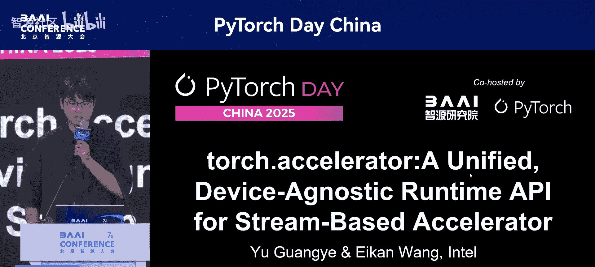
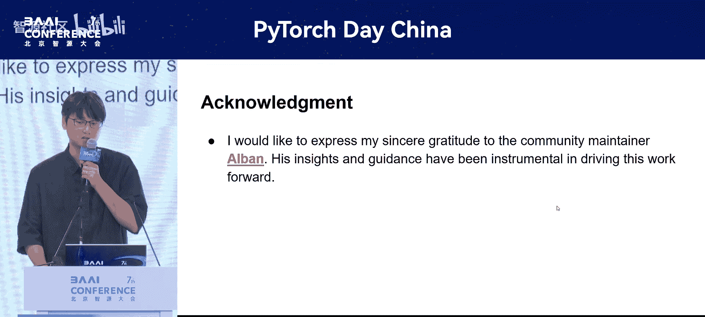

# PyTorch-Day-China-p07-torch.accelerator--A-Unified,-Device-Agnostic-Runtime-API-for-Stream-Based-Accel

在本节课中，我们将要学习 PyTorch 2.6 版本中引入的一个新特性：`torch.accelerator`。这是一个旨在简化跨不同硬件后端（如 CUDA、XPU、MPS 等）编程的统一运行时 API。我们将了解它解决的问题、核心设计理念以及如何使用它来编写设备无关的代码。



## 概述与背景

PyTorch 作为最广泛使用的机器学习框架，已经支持了 CPU 之外的多种加速硬件，例如 CUDA、MPS、XPU、HPU 和 NPU。其精心设计的架构通过两条关键路径实现了无缝的后端集成：对于 Eager 模式，它基于 ATen 算子和设备运行时系统；对于 Graph 模式，则由 TorchDynamo 和 TorchInductor 驱动。

每个后端都有自己的运行时，例如 CUDA Runtime、MPS Runtime 和 XPU Runtime。在算子层面，ATen 算子本质上是设备无关的，大多数算子接受一个可以设置为 `cpu` 或其他后端的 `device` 参数。在 Graph 模式中，Inductor 通过设备接口抽象提供了一个灵活的注册机制。这个基类定义了一个 API 集合，每个后端都应该实现它，Inductor 使用这个接口来支持各种设备后端。

然而，运行时与设备特定模块的耦合度仍然较高。例如，如果在代码中调用 `torch.cuda.current_device()`，它只会在 CUDA 设备上工作，在其他后端上会失败。这种设备特定的逻辑限制了代码的可移植性，并阻碍了用户编写设备无关的代码。

## 现有方案的挑战

以下是一个展示如何使用设备特定运行时 API 来支持多后端的例子。它需要使用大量的 `if-else` 语句来处理每种后端类型。

```python
if torch.cuda.is_available():
    device = torch.device("cuda")
    torch.cuda.set_device(device)
    current_device = torch.cuda.current_device()
    stream = torch.cuda.current_stream()
elif torch.xpu.is_available():
    device = torch.device("xpu")
    torch.xpu.set_device(device)
    current_device = torch.xpu.current_device()
    stream = torch.xpu.current_stream()
# ... 其他后端
```

这种方法对于试图将新后端支持集成到 PyTorch 及其生态系统中的硬件供应商来说，带来了巨大的挑战。在这些代码库中使用 `if-else` 条件判断是不可扩展且难以维护的。

如果 PyTorch 能够提供一个统一的、设备无关的运行时 API，将极大地简化添加新后端支持的过程，并减轻硬件供应商和生态系统开发者的集成负担。随着 PyTorch 持续扩展以支持越来越多的硬件加速器，对设备无关编程接口的需求变得日益关键。

## 核心概念：Accelerator

我们的愿景是：通过一个统一的设备无关运行时 API，让你的代码能够在任何设备上运行。

一个重要的进展发生在 PyTorch 2.5，它引入了 **Accelerator** 的概念。一个 Accelerator 被明确定义为与 CPU 一起使用以加速计算的 `torch.device`。它采用异步执行模型，通过流和事件来处理同步。目前，一个主机上同时只能有一种 Accelerator 类型可用。支持的 Accelerator 包括 CUDA、XPU、MPS、MTIA、HPU 和 PrivateUse1。值得注意的是，CPU 在此定义下不被归类为 Accelerator。

基于 Accelerator 概念，我们在 PyTorch 2.6 中提出了一个统一的设备无关运行时 API。这个 API 的设计旨在紧密映射现有的设备特定 API，提供几乎 1:1 的功能映射。它们接受相同的输入参数，确保从设备特定 API 代码迁移时所需的代码改动最小。

## torch.accelerator API 介绍

我们引入了一个新的实用工具：`torch.accelerator.current_accelerator()`。它返回当前活跃的 Accelerator 类型，该类型在调用时确定。这意味着，如果 PyTorch 构建时支持 CUDA，则返回 `cuda`；如果支持 XPU，则返回 `xpu`；如果 PyTorch 仅构建了 CPU 支持，它将返回 `None`。

同时，我们也提供了相应的 C++ API，以便开发者更容易地用 C++ 编写代码。它们与 `torch.accelerator` Python API 提供 1:1 的功能映射。

作为统一的运行时，`torch.accelerator` 与一些设备特定 API 有重叠。为了保持向后兼容性，两者将继续共存。在功能上，它们被设计为无缝协作。这意味着，如果你使用设备特定 API 将当前设备设置为索引 1，这个变化将通过 `torch.accelerator.current_device()` 接口反映出来，反之亦然。

## 流与事件的统一

上一节我们介绍了统一的设备 API，本节中我们来看看如何处理其他运行时组件，例如流和事件。这个问题在 PyTorch 2.5 中得到了解决，PyTorch 将 `torch.cuda.Stream` 和 `torch.cuda.Event` 重构为支持一些通用方法的基类。

这些通用方法在不同的后端上都可用，而设备特定的流或事件继承了这个基类，并可以根据需要重写方法。现在，`torch.Stream` 可以代表 CUDA 设备上的 CUDA 流，或 XPU 设备上的 XPU 流。

这种设计的好处是，由于 `torch.Stream` 和 `torch.Event` 是基类，我们可以将任何设备特定的对应物捕获为基类，即使是对于树外后端或其他组件。

## 设计哲学与命名空间

在讨论 `torch.accelerator` 的设计哲学时，有一个小故事。我们最初的想法是将统一的运行时 API 直接放在 `torch` 命名空间下，例如 `torch.foo()`。这个想法受到了 `torch.xpu.Stream` 被泛化为 `torch.Stream` 的启发。按照这个模型，`torch.xpu.foo()` 将被泛化为 `torch.foo()`。

但在与 Alban 和其他社区贡献者讨论后，我们决定将这些 API 放在 `torch.accelerator` 命名空间下。这是 PyTorch 2.6 引入的一个新命名空间。我们制定了清晰的设计规则：
*   如果一个 API 在 CPU 和 Accelerator 上都工作，它应该放在 `torch` 命名空间下，并接受一个 `device_type` 参数。
*   如果一个 API 特定于 Accelerator，它将被放置在 `torch.accelerator` 命名空间下，并且不接收 `device_type` 参数。

## 与现有模式的对比

在 `torch.accelerator` 之前，PyTorch 使用不同的方法来支持各种设备后端。例如，Fused SDP 使用 `torch._get_device_module`，它委托给设备特定的模块。而 Inductor 使用继承模式，每个后端都应该从一个基类继承并实现其子类。

这种委托和继承模式在其他流行的代码库（如 transformers）中也普遍使用。与之前的方法相比，`torch.accelerator` 提供了一个统一的内置 API，在 TorchDynamo 中使用起来更容易，并为设备无关编程提供了更优雅和一致的接口。

但主要的限制是，`torch.accelerator` 目前只支持通过另外两种方法提供的 API 的一个子集。例如，对于一些内存相关的函数，如 `torch.cuda.empty_cache()`，目前在 `torch.accelerator` 命名空间中还不可用。

## 如何支持新后端

为一个新后端支持 `torch.accelerator` 是直接的。只需要实现设备卡实现接口并注册其实例。这利用了通过 C++ 中的流防护和设备卡实现的现有机制。

在 PyTorch 中，我们可以将运行时分为六个组件：设备、流、事件、流防护、设备卡和分配器。目前我们已经泛化了设备、流和事件。下一个挑战是如何处理流防护和设备卡。

以前，PyTorch 提供 `torch.{device_type}.stream` 作为一个上下文管理器，以确保操作在预期的流上运行。但从 PyTorch 2.7 开始，可以直接通过 `with` 语句使用设备流，这更容易使用，并且可以泛化到不同的后端。

类似地，PyTorch 提供 `torch.{device_type}.device` 作为一个上下文管理器，以确保操作在预期的设备上运行。它是一个前端人性化的 API。现在，`torch.accelerator` 提供了一个新的 API `torch.accelerator.device_index()` 来做同样的事情。它可以在不同的设备后端上使用。

## 未来展望

在分析了流行代码库中的使用情况后，我们发现一些内存相关的 API 被普遍使用。根据 RFC #134078，我们提议引入一组设备内存 API，并将它们放在 `torch.accelerator` 命名空间下，以更好地支持常见的用例。

作为另一个后续工作，我们计划泛化 PyTorch 单元测试，以提高跨不同后端的可重用性。

## 代码示例

现在，让我们回顾一下之前提到的例子。使用 `torch.accelerator`，实现变得更加清晰和简单。

```python
import torch

# 检查是否有可用的加速器
if torch.accelerator.current_accelerator() is not None:
    # 设置当前设备（例如，索引为 0 的 GPU/XPU 等）
    torch.accelerator.set_device(0)
    # 获取当前设备索引
    current_idx = torch.accelerator.current_device()
    # 获取当前流
    stream = torch.accelerator.current_stream()
    # 在特定流上运行操作
    with torch.accelerator.stream(stream):
        # 你的计算代码
        pass
```

这使得重构后的代码无需任何适配就能在任何设备上运行。

## 总结



本节课中我们一起学习了 PyTorch 2.6 引入的 `torch.accelerator` API。我们了解了它旨在解决设备特定代码带来的可移植性问题，其核心是提供了一个统一的、设备无关的接口来管理加速器设备、流和事件。通过采用清晰的命名空间规则和向后兼容的设计，`torch.accelerator` 简化了为 PyTorch 添加新硬件后端支持的过程，并让开发者能够更轻松地编写一次代码，即可在多种加速硬件上运行。这是 PyTorch 迈向更通用、更易用的异构计算支持的重要一步。