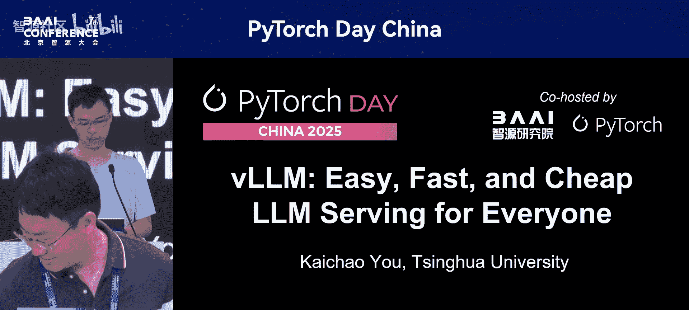
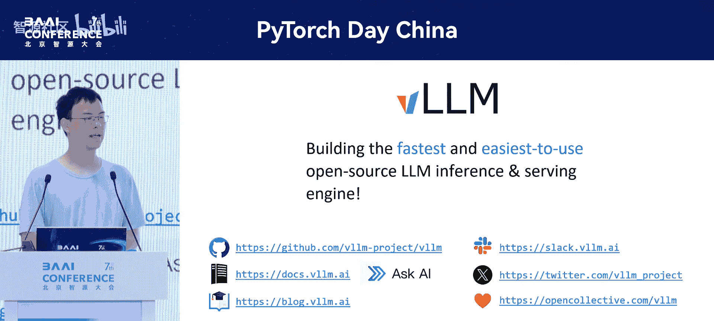

# PyTorch-Day-China-p08-vLLM--Easy,-Fast,-and-Cheap-LLM-Serving-for-Everyone：KaiChao-You

在本教程中，我们将学习vLLM项目。vLLM是一个开源的大语言模型推理和服务引擎，旨在为每个人提供简单、快速且经济的LLM推理体验。我们将了解其核心特性、工作原理、优化技术以及生态系统。



---

## 🎼 vLLM项目简介

vLLM项目致力于将简单、快速、经济的LLM推理带给每个人。

我们正处于大语言模型的时代，每天都在谈论搜索、聊天和代码生成等应用。毫无疑问，服务LLM通常非常缓慢且昂贵。在vLLM出现之前，即使是单个A100这样的高端GPU，也只能以每秒一个请求的速度服务一个中等规模的LLM，成本极高。即使是微软这样的公司，也需要购买大量GPU，并抱怨GPU资源不足。

由于大语言模型的自回归特性，关键的优化点在于优化中间激活的内存使用。我们需要缓存并重用KV缓存。为了实现KV缓存的灵活重用，vLLM首先引入了**PagedAttention**技术。该技术将KV缓存以块的形式存储和组织，显著提高了GPU内存利用率。

当时，与Hugging Face和TGI的实现相比，vLLM实现了超过十倍的加速。即使与TGI相比，速度也快了两到三倍。

2023年6月，vLLM项目开源，并获得了社区的极大关注。目前，它在GitHub上已拥有超过49，000颗星。在访问加州大学伯克利分校期间，我加入了该项目的开发，至今已参与超过一年。

该项目的目标是：为每个人提供最快、最易用的开源LLM推理和服务引擎。

---

## 🚀 核心特性与使用方式

vLLM提供了简单易用的API。首先是用于离线批量推理的`LLM`类。

**代码示例：离线推理**
```python
from vllm import LLM

# 创建LLM对象
llm = LLM(model="meta-llama/Llama-2-7b-hf")
# 调用生成方法
outputs = llm.generate(["Hello, my name is", "The capital of France is"])
print(outputs)
```

你可以像调用普通函数一样调用`generate`方法，它将返回整个批次的完整结果。

此外，你还可以通过一条简单的命令启动一个与OpenAI API兼容的服务器。

**代码示例：启动API服务器**
```bash
python -m vllm.entrypoints.openai.api_server --model meta-llama/Llama-2-7b-hf
```

之后，你可以运行标准的OpenAI客户端，或将其用于你自己的聊天服务。

---

## 🤝 广泛的模型与硬件支持

vLLM支持广泛的模型，不仅包括像Llama和DeepSeek这样的文本生成模型，还包括像LLaVA这样的多模态模型，以及嵌入模型和奖励模型等，覆盖了你会使用的主流模型类型。

vLLM是许多主要LLM公司的官方启动合作伙伴。在他们的模型正式发布之前，通常会与我们合作以确保更好的兼容性和集成。因此，使用vLLM，你可以在模型发布的第一时间就部署和运行推理。一些模型由模型供应商直接贡献，因此你可以信任其实现。

vLLM支持广泛的硬件，从GPU和TPU到CPU和专用加速器，以及大多数平台，如NVIDIA、AMD、Intel、AWS、Google等。我们也在探索基于插件的集成，从华为昇腾和IBM开始。这是一个与硬件供应商共同构建生态系统的激动人心的方向。这些基于插件的加速器提供了与原生支持硬件相同的用户体验，同时硬件团队能更好地控制项目。

vLLM在Google Cloud（如TPU）和NVIDIA的GTC发布会上都被重点提及。

---

## 🌍 vLLM在现实中的应用

vLLM已经融入我们的日常生活。当你打开亚马逊并与聊天机器人Rufus交谈时，你实际上正在与运行在vLLM上的模型对话。在去年的Prime Day，亚马逊使用了超过80，000个Trn1芯片，通过vLLM每分钟服务了300万个token。

我们要感谢PyTorch的支持。本次是PyTorch Day China会议，vLLM对多样化硬件的支持离不开PyTorch的窄范围架构。这些硬件平台通常先与PyTorch合作，然后适配到vLLM。

---

## 🧩 分布式推理支持

随着模型变得越来越大，运行单个模型需要多GPU甚至多机多GPU。这些场景容易出现各种问题。vLLM提供了一些简单易懂的调试手册，帮助你理解问题所在，识别是硬件问题、网络问题还是软件问题，以便快速定位。

我们支持多种并行策略：
*   **张量并行**：可以划分权重和缓存。如果你有像NVLink这样的良好互连，它还可以降低延迟。
*   **流水线并行**：将模型的不同层分布到不同的GPU上进行流水线执行。这有助于提高吞吐量，但由于需要通信，会增加延迟。
*   **专家并行**：随着混合专家模型越来越流行，我们也支持专家并行。它将专家的子集放置在不同的GPU上，在运行时，token需要被路由、分发和合并。这样做的好处是每个实例只加载模型的一部分，从而为KV缓存腾出更多空间。

对于大规模部署，我们也在积极研究**预解码聚合**。它允许我们将生成第一个token的时间和后续输出token的时间分离开来。由于预填充和解码阶段具有非常不同的计算特征，这也能实现许多优化。

---

## ⚡ 推理优化技术

vLLM包含许多推理优化技术。

例如，vLLM实现了**基于哈希的自动前缀缓存**，可以加速具有共同前缀（如长的系统提示）的请求。

vLLM也支持**推测解码**。这是一种使用较小模型生成草稿，然后一起验证的想法。目前，使用一个额外层来提出新token的趋势也在增长，例如Eagle系列或Grok的MTP，vLLM都支持。

随着硬件支持越来越多的原生量化指令，越来越多的模型以量化方式原生训练。LLM可以在三个维度上进行量化：权重、KV缓存和激活。
*   **权重量化**主要节省存储空间。
*   **KV缓存量化**有助于注意力计算，并支持更大的KV缓存。
*   **激活量化**加速矩阵乘法，从而获得更快的计算。

vLLM有一个生态系统项目**LM Compressor**。这个项目可以生成量化模型，然后vLLM可以运行量化后的模型。你可以查看文档了解最新的支持状态。vLLM拥有对量化方法最广泛的支持。

---

## 🔄 vLLM的持续演进

vLLM在不断演进，并成功推动了主要架构更新（v1架构），将常用模型的性能提升了两倍甚至更多。你可以查看公告博客了解更多细节。

在迁移到v1架构时，我们学到的一个深刻教训是关于**CPU开销**。为了充分利用GPU，我们需要密切关注CPU上发生的一切。这是由于当今加速计算的架构决定的：我们需要使用Python或Rust等编程语言控制CPU，然后由CPU向加速器启动内核。如果CPU启动内核的速度不够快，加速器就会等待CPU，从而浪费GPU时间。

在旧版vLLM的分析示例中，API服务器实际上占总时间的33%，另外有29%的时间花在准备输入和处理输出上，只有38%的时间用于实际的模型执行。这显然不理想。

为了减少CPU开销，我们提出优化整个引擎循环和API服务器。预处理（如将JPEG图像转换为输入张量、分词）和后处理（如将token反分词为字符串、进行各种检查）以及HTTP请求处理（如向多个用户流式输出）都可能成为瓶颈。

我们采用了Python中的**多进程方法**，将不同组件分离到不同的进程中，使它们可以并行运行，而模型本身可以在一个繁忙的循环中运行。

对于输入准备部分，我们借鉴了MLC-LLM的灵感，采用了**持久批处理**。我们不再每一步都从头开始重新创建批次，而是缓存输入张量，并且只应用增量更新，因为我们假设每个解码步骤只有少数请求发生最小变化。

---

## 💻 性能与代码简洁性的平衡

vLLM不仅关注性能，也关注代码简洁性。例如，CUDA Graph是加速模型推理的强大工具。但在v0中，我们为整个模型捕获了一个单一的图。这增加了开发负担，并且不允许在模型前向传播期间进行任何CPU操作。

在v1方法中，我们采用了另一种方案：使用Torch Compile作为编译器，将图分割成多个部分。我们以即时模式运行注意力操作，而仅以图模式运行其他操作。这为注意力操作提供了最大的自由度，同时高效地运行其他操作。当然，这种方法也有局限性。如果模型非常小，CPU开销就变得重要。我们的测量显示，对于H100上的8B模型，这种开销可以忽略不计。当然，对于更小的模型，这就很重要了。我们正在积极研究如何为整个模型开启完整的调用图，但这确实需要一些注意力后端的修改，目前只有FlashAttention-2等支持。

---

## 📦 用户体验与社区

除了性能，我们也非常关注用户体验。我们提供软件包、Docker镜像以及vLLM最新版本的nightly构建版本。我们知道编译vLLM需要大量资源，因此我们提供了一些预编译的wheel包。你只需设置一个环境变量，就可以下载预览版wheel，而无需编译所有内容，因为我们假设大多数开发者只接触Python代码。

我们还有一个强大的持续集成系统，每次代码变更都需要经过大量测试。当然，代价是我们每月在测试上花费超过30，000美元。但考虑到vLLM的流行程度和广泛使用，这个成本是值得的。

现在，vLLM是一个由社区拥有和驱动的项目。随着PyTorch扩展到伞式基金会，vLLM也作为托管项目加入了PyTorch基金会。我们每两个月举办一次线下聚会，每两周举办一次线上办公时间。

vLLM被用于许多地方，包括开源项目、基础模型实验室、私有部署以及云服务提供商。vLLM已成为许多云服务上默认的LLM服务引擎，你可以找到许多基于vLLM的产品。DeepSeek也公开承认其推理引擎基于vLLM。如果你想运行LLM推理，vLLM是一个受欢迎的选择。

vLLM现在拥有超过1000名贡献者，其中数十名是专职的全职开发者。他们主要来自加州大学伯克利分校，以及积极使用vLLM的大公司，如IBM、Red Hat、Meta和Google。我们非常感谢这个庞大的社区对vLLM开发的支持。

---

## 🌐 构建推理生态系统

vLLM不仅是一个独立项目，也在构建推理生态系统。我们与Hugging Face、OpenAI、Replicate和Anyscale等公司有密切合作。你可以访问我们的博客（blog.vllm.ai）获取最新更新。

我们非常感谢所有的赞助商，他们为项目的部署提供了大量的计算资源。

---

## 🎯 总结与资源

总而言之，vLLM致力于构建最快、最易用的LLM推理和服务引擎。你可以在本幻灯片上找到相关的资源和链接。

我想特别提到的一点是，vLLM发展非常迅速，每周都有许多新功能。即使是开发者也可能不完全了解当前的全貌。因此，我们研究了如何利用AI来帮助开发者和社区。在我们的文档中，你可以找到一个“询问AI”按钮，你可以提问关于某项功能支持的当前状态，它会从PR、链接、议题中收集所有讨论，给你最新、最准确的答案。这样可以在不给开发者增加额外负担的情况下，更好地帮助社区成长。



感谢参加PyTorch大会并聆听本次关于vLLM的演讲。