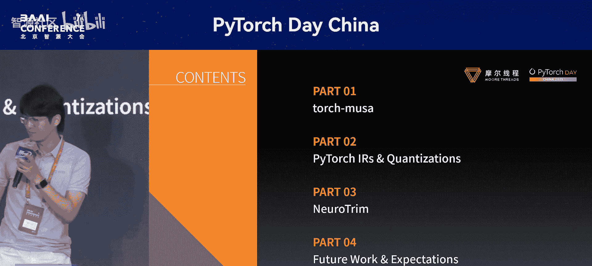
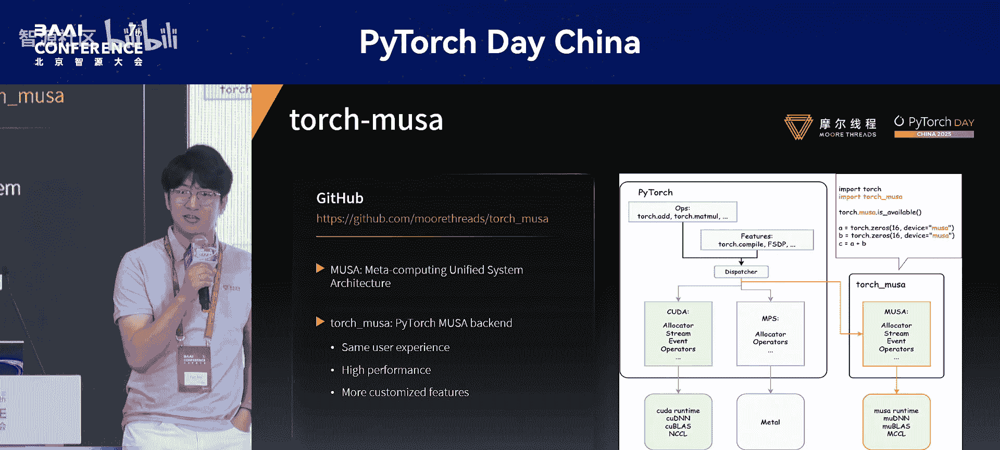
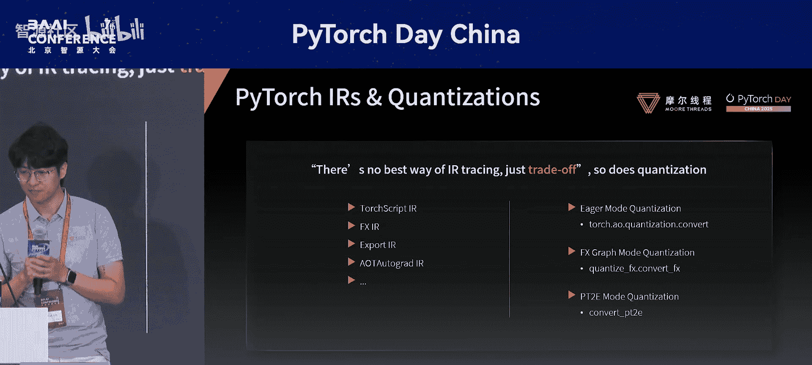
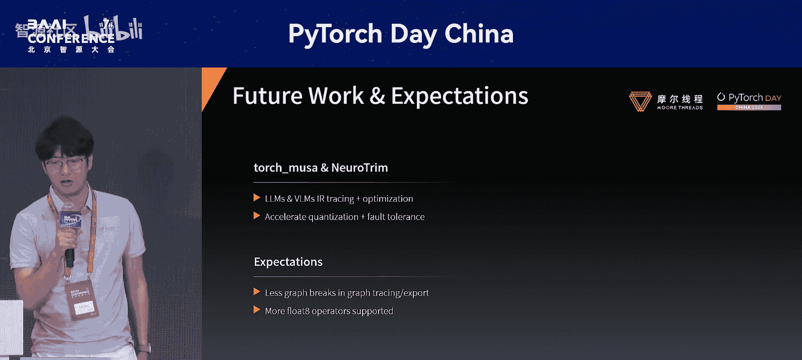

# PyTorch-Day-China-p09-A-torch.fx-Based-Compression-Toolkit-Empowered-by-torch_musa：Fan-Mo

在本节课中，我们将学习一个基于PyTorch FX和torch_musa的模型压缩工具包。我们将了解其设计原理、核心组件以及未来的发展方向。

## 概述

本次分享将介绍一个名为“New Trim”的模型压缩工具包。该工具包利用PyTorch FX作为中间表示，并借助torch_musa平台进行加速，旨在高效地对模型进行量化与优化。



---

## 1️⃣ 第一部分：工具包与平台介绍



首先，我们来了解一下支撑该工具包的核心平台——MUSA。

MUSA是一个类似CUDA的元计算统一系统架构。它提供了一系列与CUDA对等的库，例如Mo运行时、MU DNN、MU+以及用于通信的ML库。如果你熟悉CUDA编程，可以轻松地将技能迁移到MUSA平台。

另一方面，**torch_musa** 是一个PyTorch插件，它使得PyTorch能够原生运行在MUSA平台上。使用方式非常简单，只需将后端字符串从 `cuda` 改为 `musa` 即可。

```python
# 示例：切换后端到MUSA
device = torch.device("musa")
```

此外，torch_musa还包含一些高度优化的特性和算子，特别是针对大语言模型的GMM和注意力内核，能够带来高性能表现。同时，它在转换领域也提供了一些定制化功能。

---

## 2️⃣ 第二部分：yTorch IR与量化方法



在深入探讨压缩工具包和New Trim之前，我们需要先了解PyTorch提供的多种中间表示。

多年来，PyTorch提供了多种IR，例如早期的TorchScript，以及从PyTorch 1.8/1.9开始广泛使用的**FX IR**。从PyTorch 2.4/2.5开始，又引入了导出程序的**Export IR**和用于训练的**LT Autograd IR**。

基于这些IR，PyTorch提供了三种图捕获模式：Eager模式、FX模式和PT2E导出模式。

那么，哪种追踪方式最好呢？正如在PyTorch论坛中曾讨论过的：**没有最好的图追踪方式，只有权衡**。我们不必拘泥于某一种方式，而是可以兼收并蓄。

接下来，我们将进入New Trim部分，看看它做出了哪些权衡。

---

## 3️⃣ 第三部分：深入New Trim

众所周知，要对模型进行量化，获得完整的模型计算图至关重要。像OpenVINO和NCNN等框架有自己的IR定义，但我们的工具包选择在PyTorch内部完成这项工作。

我们选择**FX IR**作为基础，原因有三：
1.  **可调试性强**：可以轻松添加Python钩子或使用PDB检查每个节点的输入输出值。
2.  **易于修改**：在进行量化或优化时，可以方便地修改图或子图。
3.  **易于集成**：可以轻松地与其它框架甚至PyTorch自身集成，例如在执行PTQ或转换期间更新权重。

从架构图可以看出，New Trim接收一个PyTorch模型和一个配置，最终输出一个可以交付给推理引擎的PyTorch IR。

在New Trim内部，第一阶段称为**IR追踪阶段**。这是我们做出权衡的地方：我们采用了多种图追踪方式，包括符号追踪、nano追踪和导出追踪。这就像一种回退机制，如果一种方式失败，就尝试下一种。在此阶段之后，我们就能获得完整的模型计算图。

随后进入**优化与后端特定 lowering** 阶段。

以下是我们在优化方面做的一些定制化工作：
*   **定制化融合**：例如，将卷积、批归一化和SiLU激活函数融合为单个内核执行，这在YOLO等模型中很常见，能显著提升性能。
*   **动态权重更新**：这不是PTQ或微调，而是在线更新权重，例如进行偏置校正或GPTQ（针对大语言模型）。
*   **多数据类型支持**：除了支持INT8、UINT8、INT4外，我们还支持**浮点8位（FP8）**。这不仅适用于大模型，也可应用于一些CV模型，在保证精度的同时获得高性能。

---

## 4️⃣ 第四部分：未来工作与期望

最后，分享一些我们计划开展的未来工作。

首先，我们正致力于使大语言模型和视觉语言模型**更易于追踪**。目前，要获取像DeepSeek-V3这类模型的完整计算图非常困难，这阻碍了进一步的优化。

其次，我们正在构建一个**容错系统**以加速量化过程。在量化一个拥有671亿参数的模型时，过程可能耗时且容易出错。新系统将能够从检查点重启量化过程。

最后，分享一些对PyTorch生态的期望：
1.  由于我们使用了符号追踪、nano追踪和导出追踪，我们希望未来能**减少图断裂**，因为每一次图断裂都会增加优化的工作量。
2.  希望PyTorch能够**支持更多的FP8算子**。目前FP8仅能用于GMM操作，但我们认为FP8应该像FP16或BF16一样得到更广泛的支持，以便我们能在其中加入更多优化。

---



## 总结


本节课我们一起学习了基于torch.fx和torch_musa的模型压缩工具包New Trim。我们了解了其利用MUSA平台进行加速的背景，探讨了其以FX IR为核心、采用多种图捕获策略的架构设计，并介绍了其在算子融合、动态量化及FP8支持等方面的优化工作。最后，我们也展望了其在模型可追踪性、量化流程容错性以及对PyTorch生态的未来期望。