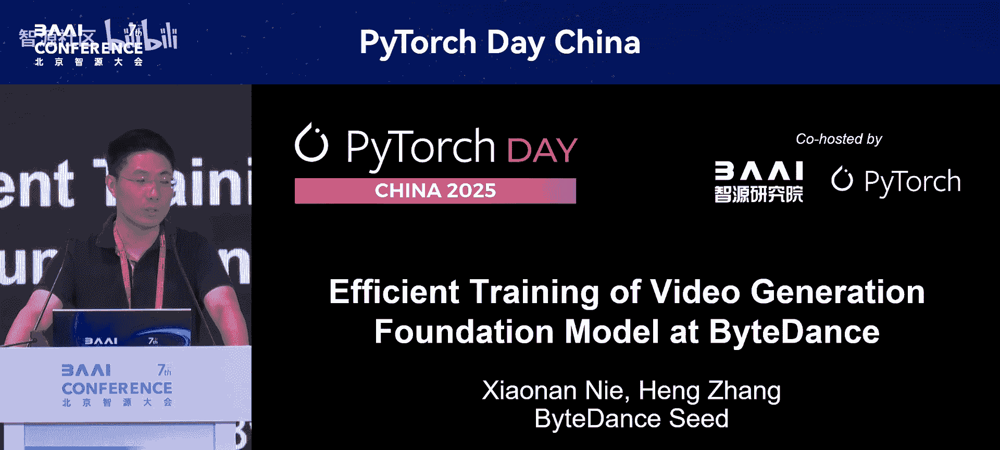
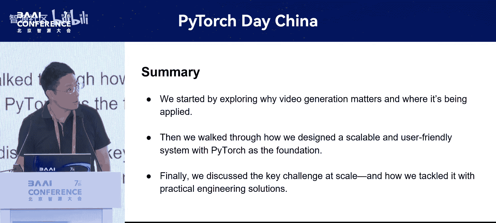

# PyTorch-Day-China-p10-Efficient-Training-of-Video-Generation-Foundation-Model-at-ByteDance：Heng-Zhang

在本节课中，我们将学习字节跳动在视频生成基础模型大规模、高性能训练方面的实践经验。我们将从背景介绍开始，逐步深入到模型架构、训练流程优化以及大规模训练系统中的关键技术挑战与解决方案。

## 背景介绍

视频生成技术在广告、电影、动画等多个场景已得到大规模应用。视频生成模型不仅能释放创造力，还能显著降低实际生成过程中的成本与时间。



以下是两个生成效果示例：
*   第一个例子在3D运动、镜头控制、人物细节及背景控制方面表现优异。
*   第二个动画例子在细节、美感和整体完成度上都非常出色。

此外，字节跳动最新的视频生成模型 C Dance 1.0 即将发布，欢迎大家试用。

## 模型架构与训练流程

上一节我们介绍了视频生成的应用背景，本节中我们来看看其核心的模型结构与训练流程。

视频生成模型的关键组件是 **VE** 和 **MMDIT**。整个生成流程可简化为三步：
1.  **VE编码**：将输入视频编码为潜在表示。
2.  **MMDIT扩散**：在潜在空间进行去噪扩散过程。
3.  **VE解码**：将处理后的潜在表示解码回视频。

对应的训练流程通常分为两步：
1.  **第一阶段**：单独训练 **VE**。计算输入视频经过编码再解码后的重建损失 `loss = L_reconstruction`。
2.  **第二阶段**：固定 **VE**，仅训练 **MMDIT**。

这里存在一个明显的优化点：我们可以将 **VE** 的编码过程离线执行。这样做不仅能减少训练时的存储需求，还能避免数据处理瓶颈和I/O访问问题。

因此，优化后的训练分为三个阶段：
1.  正常训练 **VE**。
2.  使用训练好的 **VE** 对数据集进行离线编码，得到潜在表示 `latents`。
3.  使用 `latents` 直接训练 **MMDIT**。

## 大规模训练系统设计

了解了模型的基本流程后，我们进入核心部分：如何构建一个高效的大规模训练系统。我们的设计原则是：**易用、高效、可扩展**，并在 PyTorch 生态下进行了即插即用的优化。

以下是我们在几个关键模块的实践。

### 内核融合优化

在大规模训练中，内核融合是解决访存瓶颈的必要手段。传统方法需要手动编写复杂的 CUDA 或 Triton 内核，人力投入高且验证周期长。

我们的解决方案是紧跟生态，使用 **Torch Compile** 来自动化解决绝大部分融合问题。这大幅减少了人力投入，并为算法团队提供了良好体验。

然而，使用 Torch Compile 也面临挑战，例如编译错误、异常的重新编译等。在大规模训练中，数千张卡因算子变化或输入形状改变而触发编译，可能导致编译持续数小时。

经过优化，我们实现了接近**零编译开销**，每次编译约在一分钟内完成，一个编译策略即可覆盖绝大部分情况。同时，我们也解决了 Torch Compile 与其他优化技术（如下文将提到的显存优化）的兼容性问题。

### 显存优化技术

随着模型规模增长，GPU显存（通常几十GB）成为瓶颈，因此需要强大的显存优化技术。

我们主要采用两种技术：**选择性重算** 和 **激活值 Offload**。

**选择性重算** 的原理是在前向传播时不保存某些中间激活值，在反向传播需要时重新计算。我们使用 `torch.utils.checkpoint` 接口，只需实现重算策略 `policy`，无需大量修改用户代码，实现即插即用。

```python
# 示例：使用 checkpoint 进行重算
output = torch.utils.checkpoint.checkpoint(
    custom_forward, 
    input, 
    use_reentrant=False, 
    policy=my_checkpoint_policy
)
```

重算策略通常是通用的，一套策略可用于多个模型或场景。

**激活值 Offload** 技术是将暂时不用的激活值从 GPU 显存转移到 CPU 内存。我们采用 PyTorch 的 `register_save_hook` 机制。关键细节在于需要制定策略，避免在激活值后续仍被使用时过早 Offload，导致系统错误。

### 分布式与扩展性

在分布式扩展方面，我们首选 **FSDP** 策略。它易用性好，且对于视频数据（序列长、数据量大）的场景，计算量足以掩盖 `FSDP` 所需的 `Reduce` 通信开销。

当扩展到256卡以上规模时，通信环延迟增大。我们采用**分层通信**来避免效率下降。对于生成长视频的需求，我们会引入**序列并行**。

### 容错与快速恢复

大规模训练必须考虑容错和快速恢复。我们使用 **Checkpointing** 进行模型状态保存。

在实现中有两个关键点：
1.  **快速保存/加载**：即使模型很大，我们也需将保存和加载时间控制在几分钟内。
2.  **跳过随机初始化**：使用 PyTorch 的 `torch.nn.utils.skip_init` 在恢复时跳过耗时的模型随机初始化过程，实现分钟级快速重启。

除了框架层，在硬件层我们也进行优化：
*   **训练前探测**：提前探测坏机器或网络问题。
*   **运行时监控**：监控训练速度下降、单卡故障等异常，快速定位问题节点。

## 视频生成的特殊挑战：负载均衡

视频生成模型在大规模训练中面临一个特殊挑战：**负载不均衡**。视频时长差异巨大（从几秒到几小时），而模型计算复杂度（如 `Attention` 是 `O(n^2)`，`MLP` 是 `O(n)`）会加剧这种不均衡。

考虑一个例子：`GPU1` 处理两个短序列，`GPU2` 处理一个长序列。`GPU1` 会先完成计算，产生空闲时间。

简单的解决方案是**均匀划分**所有样本，但这会引入冗余通信。更优的方案是**动态策略**：对短序列进行数据并行，仅对长序列进行序列并行划分。这样既能均衡负载，又将通信开销降至最低。我们团队在此有一篇相关论文，可供参考。

## 总结

本节课中我们一起学习了字节跳动训练视频生成基础模型的系统经验。我们从模型架构与流程优化入手，详细探讨了大规模训练系统中的关键技术：包括使用 Torch Compile 进行内核融合、通过重算和 Offload 优化显存、采用 FSDP 与分层通信进行分布式扩展、实现快速容错恢复机制，并特别针对视频数据的特点，解决了负载不均衡的挑战。这些实践为高效训练大规模生成模型提供了可行的路径。

---




**（注：文末招聘二维码图片已省略）**