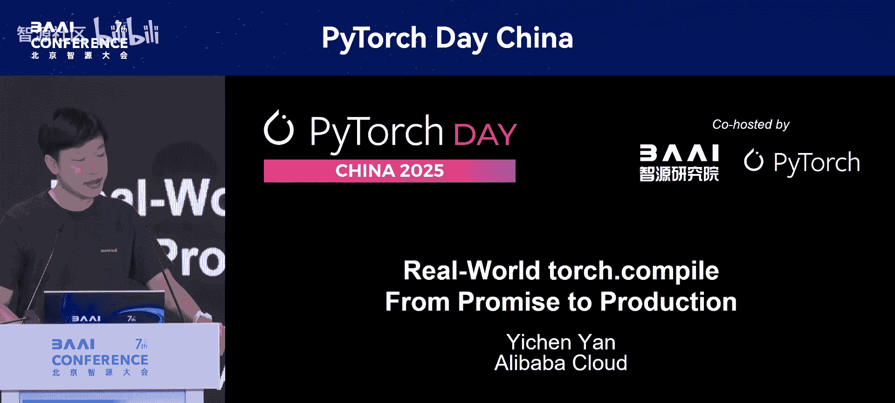
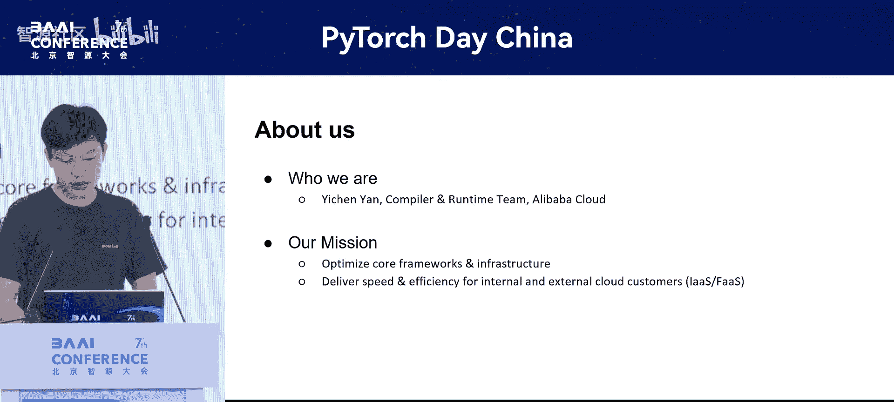
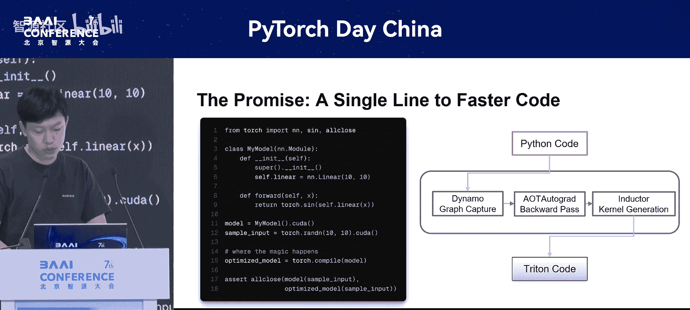
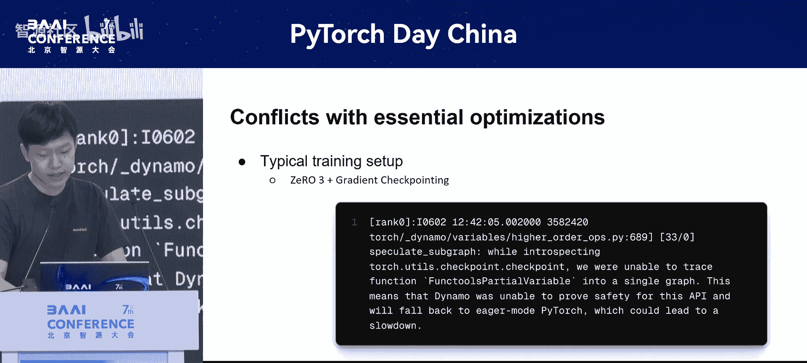
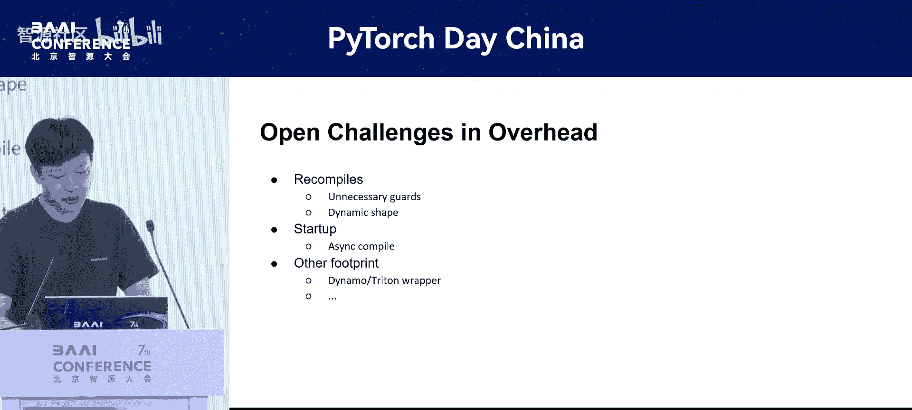

# PyTorch-Day-China-p11-torch.compile-Practice-and-Optimization-in-Different-Scenarios：Yichen-Yan

在本节课中，我们将学习如何在实际生产环境中应用和优化PyTorch的`torch.compile`功能。我们将探讨从理想环境到复杂生产系统所面临的挑战，并提供具体的解决方案和优化策略。

---

## 团队与使命介绍 👥

首先，介绍一下我们的团队。我们是阿里云的编译器运行时团队。我们的使命是优化支撑从内部服务到外部客户所依赖的AI和云产品的核心框架与基础设施。简而言之，我们的工作是让一切在云上运行得更快、更高效。正是这种对性能的追求，促使我们探索并推动`torch.compile`的边界。

## 理解torch.compile 🧠

上一节我们介绍了团队背景，本节中我们来看看`torch.compile`的核心概念。它的理念很简单：你有一个标准的PyTorch模型，然后对其应用`torch.compile`。`torch.compile`会为你编译并生成一个优化的模型，其输出与原始模型相同。虽然图中未展示，但反向传播过程同样可以被优化。

那么，背后的魔法是什么？基本上，`torch.compile`包含三个组件：
1.  **Dynamo**：用于捕获计算图。
2.  **AOT Autograd**：处理反向传播。
3.  **Inductor**：从捕获的图中生成优化的内核。

其承诺是美好的：只需一行代码，就能获得有保证的正确性加速。然而，当这个简洁的理想图景遇到生产模型和训练框架的混乱现实时，会发生什么？这正是我们实际工作的起点。

## 生产环境中的三大挑战 ⚔️

当我们从理想环境转向生产环境时，挑战主要归结为以下三个领域：

1.  **生态系统冲突**：我们立即遇到了与团队所依赖的关键优化工具的冲突。让`torch.compile`与像DeepSpeed这样的分布式训练工具或用于节省内存的梯度检查点技术协同工作，是一个重大的初始挑战。
2.  **通往最优内核的“最后一公里”**：即使`torch.compile`成功运行并带来了显著的加速，我们仍然发现性能有提升空间。这是因为用户代码中一些未被识别的小模式会阻止编译器创建最高效的融合内核。
3.  **运行时开销管理**：编译的好处并非免费。当输入形状改变时，我们看到了显著的重新编译性能损失，以及明显的启动延迟，在某些情况下甚至使得编译后的模型比Eager模式更慢。

接下来，让我们更详细地探讨每一个挑战。

### 挑战一：生态系统冲突

我们的用户在其训练任务中使用了多样化的技术栈。为了使生态系统挑战更具体，我将聚焦于一个具有代表性且非常常见的例子：**DeepSpeed ZeRO-3与梯度检查点**的结合使用。

最初的问题如下：代码没有崩溃，运行也没有错误，但我们**完全没有看到加速**。编译后的模型和Eager模式一样慢，这完全违背了使用`torch.compile`的初衷。

这起初很神秘，因此我们必须深入`torch.compile`的日志来诊断问题。我们发现，日志中出现了由DeepSpeed算子引起的图中断，更关键的是，日志显示Dynamo不支持梯度检查点。这意味着Dynamo持续放弃追踪检查点模块，并回退到常规的Python执行。

所以，虽然程序在运行，但我们实际上并没有编译模型中最重要的部分。挑战不在于修复崩溃，而在于重新设计集成，以便编译器能够真正看到计算图并完成其工作。

我们的解决方案是一个两阶段过程：**先让它工作，再让它变快**。

以下是第一阶段“让它工作”的具体步骤：
*   我们修补了Dynamo，使其能正确理解并处理`torch.checkpoint`。
*   同时，我们教会它识别并跳过那些会导致图中断的DeepSpeed通信算子。
*   为了使此解决方案更广泛可用，我们将其提交到了Hugging Face Transformers和Accelerate库的DeepSpeed集成中。

至此，模块运行不再因图中断或高阶算子而中断，这是一个巨大的里程碑。

第二阶段“让它变快”则专注于性能：
*   我们发现在编译器上下文中可以跳过更多冗余的DeepSpeed算子。
*   我们开发了一种启发式方法来自动识别最佳的编译单元，这允许`torch.compile`在图中创建更大的融合区域。
*   最后，我们更新了默认的ZeRO参数，确保我们的数据流水线能够高效地启动，并将通信与现在快得多的计算重叠起来。

通过在这些基础修复之上进行有针对性的优化，我们最终实现了一个两全其美的系统：既拥有训练生态系统的内存效率，又获得了`torch.compile`的速度。

### 挑战二：通往最优内核的“最后一公里”

虽然`torch.compile`通常能生成不错的内核，但我们发现了一些常见情况，其性能仍有提升空间。今天，我将通过两个与缩放点积注意力函数相关的案例来讲解。

第一个案例涉及一个使用Alibi偏置的自定义注意力版本，默认编译器不知道如何将其优化为单个内核。第二个案例处理一个简单但常见的场景：一个空的注意力掩码被预先给定，从而阻止了使用更快的硬件后端。

让我们先深入Alibi案例，看看它是如何被处理的。

如图所示，用户的代码在softmax之前，通过将缩放后的Alibi偏置和标准掩码相加来计算注意力。这是一种完全有效的编写注意力的方式。

然而，`torch.compile`的模式匹配非常具体。它目前还没有规则能将这种“Alibi加掩码”的组合结构识别为可融合的注意力块的一部分。由于模式不匹配，它放弃了高级融合，回退到默认的掩码实现，`torch.compile`会分别编译每个操作。

我们的洞见是：从逻辑角度看，Alibi与掩码的组合只是一个最终的偏置掩码。我们意识到可以教会Dynamo以这种方式看待它。因此，我们实现了一个自定义的模式匹配Pass。这个Pass在图中识别出这些确切的结构，并将其重写为使用规范的内存高效注意力实现，将整个“Alibi加掩码”表达式视为一个有效的注意力掩码。

这为我们带来了**30%** 的速度提升（与默认掩码实现相比），并且总计比原始Eager模式执行**快260%**。

第二个“最后一公里”案例研究则不同。它不是关于识别复杂模式，而是关于**简化一个简单模式以解锁绝对更好的性能**。

我们从一个好的起点开始：我们的许多模型已经使用标准的SDPA内核进行了编译，这已经是内存高效的。但我们知道还有另一个级别的加速空间。

问题在于注意力掩码。SDPA函数是一个分发器，其最快后端Flash Attention有非常严格的要求。其中之一就是它不能与任意的掩码一起使用。即使掩码全是零也不行。

我们的关键洞察是：在许多重要用例中，例如在未标记数据上进行推理，这个掩码总是真实的，因此是冗余的。我们实现了一个有针对性的常量折叠Pass。这个Pass在主编译器之前运行，检查掩码张量。如果它能证明该张量常量只包含零，它就会重写计算图，用简单的`None`值替换张量输入。

这个简单的改变——将零张量换成`None`——满足了Flash Attention的前提条件，允许SDPA分发器选择最快的路径。这个优化为我们带来了额外的加速，并且**无需更改用户的代码**。

### 挑战三：运行时开销

这是一个非常广泛的话题，但我想分享一个具体的例子，说明我们是如何处理不必要的重新编译的。

根本原因非常微妙：为了确保正确性，`torch.compile`会根据输入属性创建守卫（guards），其中之一就是**内存对齐**。在我们的动态形状用例中，有时输入会对齐到8的倍数，有时则不会。这种对齐属性的持续变化会触发守卫，并强制进行重新编译，即使SDPA内核本身可以完美地处理这两种情况。

我们的解决方案是使这个对齐属性变得一致。我们实现了一个改变：在将输入传递给编译函数之前，将所有输入填充到8的倍数。因为`torch.compile`分析的输入现在总是对齐的，它就没有理由再为该属性创建守卫了。我们通过消除变化的根源，有效地消除了重新编译。

这个补丁在我们的基准测试中将重新编译次数从7次减少到了3次。这是一个很好的例子，展示了理解`torch.compile`内部守卫机制如何允许我们做出小的改变，从而带来显著的实际性能提升。

当然，还有其他与开销相关的修复。Dynamo的修复是一个巨大的胜利，但它只是冰山一角。

## 开放问题与未来方向 🔮

在我的最后部分，我想简要谈谈一些开放性问题以及我们和社区未来的方向。

1.  **动态形状**：重新编译的明显解决方案是编译一个单一的动态内核。然而，这引入了一个困难的权衡：为动态形状编译的内核不够专门化，这意味着Triton编译器无法做出那么多假设，最终性能可能比专门化的内核慢。因此，开放的问题是：**何时接受一个较慢的通用内核，何时支付成本重新编译几个更快的专门化内核？** 我们认为未来的解决方案不是一个简单的开关，而是一个更智能的、基于成本的策略。
2.  **启动延迟**：第一次编译调用是阻塞的。上游PyTorch社区正在积极研究异步编译功能。其思想是：在模型于后台编译的同时，让前几次迭代在Eager模式下运行，从而隐藏延迟。我们认为这非常棒，并且潜力不仅限于启动，或许还可以用于在后台热交换新的编译函数，甚至不会阻塞主进程。
3.  **包装器开销**：当一个内核并不比Eager模式快很多时（比如只有10%的加速），Dynamo、Inductor和Triton内核启动器本身的开销就可能成为瓶颈。我们见过这种情况实际上导致新的减速。未来的工作是关于**尽可能减少这种开销**。
4.  **内核缓存机制**：当前的磁盘或Redis缓存是功能性的，但比较初级。我们认为这里存在一个重大的机会，可以为PyTorch缓存系统带来这种智能，可能创建一个共享缓存，动态减少常见模型和GPU的编译时间。

解决这些挑战是使`torch.compile`真正对任何工作负载都变得无缝且零成本的关键。这也是我们未来探索的重点。

## 总结 📝

本节课中我们一起学习了如何在实际生产环境中应用和优化`torch.compile`。

将一切总结起来，我们工作的主要内容是：
*   `torch.compile`绝对是PyTorch性能的游戏规则改变者。但正如我们所看到的，它不是一个能在每个生产场景中都完美工作的“银弹”或神奇黑盒。
*   我们的经验表明，释放其全部潜力需要一个多层次的方法：
    1.  **作为编译器进行优化**：这意味着编写有针对性的Pass来帮助它生成更好的内核，或更有效地使用现有内核。我们在模式匹配和其他Pass上的工作就是完美的例子。
    2.  **专注于框架集成**：编译器并非存在于真空中。使其与整个训练和推理生态系统兼容（就像我们为DeepSpeed所做的那样）至关重要。
    3.  **解决运行时优化**：以减少开销。我们在消除不必要重新编译方面的工作表明，管理这一成本对于确保获得真正的净性能收益至关重要。

通过在这三个层次上开展工作，我们得以在我们复杂的环境中成功地驾驭`torch.compile`的力量。