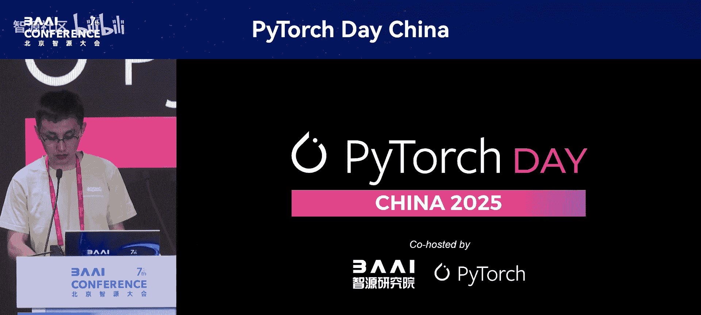
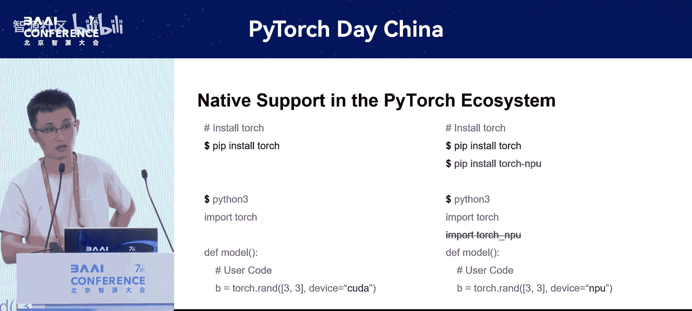

# PyTorch-Day-China-p12-PyTorch-in-Production-Boosting-LLM-Training-and-Inferencing-on-Ascend-NPU：Jiawei

在本节课中，我们将学习华为工程师分享的关于PyTorch生态与昇腾NPU集成的核心内容。第一部分将重点介绍PyTorch上游社区为支持硬件多样性所做的关键工作，特别是三方设备接入机制。

## 概述

本次分享分为两个部分。第一部分围绕PyTorch上游社区对硬件多样性的支持工作展开。第二部分将介绍昇腾NPU如何集成到PyTorch中及其性能与生态支持情况。本节由我来介绍第一部分内容。

## 三方设备接入机制介绍



上一节我们介绍了课程的整体结构，本节中我们来看看PyTorch中三方设备接入的基本机制。

用户在使用PyTorch时，可以通过PyTorch的工厂函数指定设备来创建张量（Tensor），后续操作会在对应的设备上执行。

例如，左上角的图片展示了两个GPU张量进行加法运算，该运算会在GPU上执行。其背后的原理是，每个张量都有一个标识符，即左下角所示的“cuda”标识。任何带有此标识的张量在进行运算时，都会被路由到cuda对应的算法实现上。

因此，从这一角度看，每个设备在PyTorch内部都需要一个唯一的设备标识符。在PyTorch内部，这个标识符被称为 `dispatch key`。如右上角图所示，GPU内部的key是“cuda”，CPU对应的key是“CPU”。

## 设备标识符（Key）的挑战与解决方案

上一节我们了解了设备标识符的作用，本节中我们来看看引入新设备时面临的挑战及其解决方案。

对于希望接入PyTorch的新设备，其 `dispatch key` 是什么？这里存在一些限制，如左下角所列：
1.  社区中 `key` 的数量极其有限。
2.  每个 `key` 加入社区后，需要进行硬编码相关的开发工作，这会影响PyTorch核心代码仓的可维护性。

然而，对于硬件厂商来说，这个 `key` 又是必需的。那么，是否存在一种能同时解决这两个问题的方法？答案是肯定的。

我们可以参考右上角的图。在PyTorch核心代码仓中，有一个被称为“公共Key”的东西，其名称是 `PrivateUse1`。这样做的好处是：
*   解决了 `key` 数量稀缺的问题。
*   无需将大量与特定 `key` 相关的硬编码放入PyTorch社区，有助于维护核心代码仓的可维护性。

新的硬件后端可以通过这个公共Key接入PyTorch社区，其代码可以放在厂商自己控制的独立代码仓中。后续的代码审查与合入均可由厂商自行决定，这对厂商来说非常灵活。

## 三方设备接入机制的完善与昇腾NPU的集成

上一节我们介绍了公共Key的解决方案，本节中我们来看看这套机制是如何完善并实际应用的。

在PyTorch 2.0时期，这套机制已具雏形，但其能力不足以完全支撑三方设备集成，因为 `key` 只是集成中的一小部分，许多其他模块尚未提供相应能力。为此，我们在社区提交了一份RFC提案，并在社区的帮助下共同完善了三方设备接入机制。该工作总共涉及超过10个模块和200多个PR。

在完善上游机制的同时，我们也将华为的昇腾NPU基于这套机制集成到了PyTorch社区中。在集成过程中发现的问题，也在上游社区进行了闭环和优化。因此，在PyTorch 2.1版本发布时，昇腾NPU成功基于此机制接入，并作为官方参考实现出现在PyTorch 2.1的发布说明中。同时，社区也提供了一个教程，用于帮助其他硬件厂商通过此机制接入。

## 质量保障：模拟后端与门禁测试

上一节我们完成了基础设施的构建，本节中我们来看看如何保障集成后的代码质量。

故事并未结束。三方设备接入机制主要提供了接口层的能力，但缺乏对后端功能的相关测试。以英伟达的CUDA为例，PyTorch社区的每位贡献者在提交代码时，都需要通过所有CUDA相关的测试用例才能合入。但对于新的接入机制，缺少相应的检查和门禁。

右上角的图展示了我们将昇腾NPU接入社区后，在下游进行的每日构建任务结果。对2-3个月的数据分析显示，已出现至少10次上下游功能中断的情况。

针对此问题，我们采用了一个基于CPU的模拟后端，通过三方设备接入机制将其接入PyTorch社区，作为该机制的测试后端，用于守护整套接口的功能性。如右上角图所示，当社区提交PR后，除了运行原有的CPU、CUDA等后端测试，还会运行 `PrivateUse1` 的测试用例。只有这些测试都通过后，相关PR才能合入PyTorch社区。

## 理想的质量协作流程

上一节我们介绍了通过模拟后端进行基础测试，本节中我们探讨对硬件厂商更理想的质量保障协作模式。

刚刚提到的 `PrivateUse1` 测试更多是守护三方设备接入机制的中间层。但对于硬件厂商来说，这还不够。我们希望做到的是昇腾NPU插件（或其他硬件插件）与PyTorch在功能上完全兼容。

最理想的场景是，在上游社区开发者提交PR后、合入代码前，就能提前识别出潜在风险。理想的工作流程应该是：社区开发者提交PR后，向下游代码仓推送一个事件（如PR创建事件）。下游代码仓收到事件后，会拉取当前PR对应的PyTorch代码进行编译，同时编译最新的昇腾NPU代码，然后运行本地的单元测试、集成测试等。无论测试有无问题，都会在当前PR下以评论的方式进行标注，如右下角图片所示。

需要明确的是，这仅是一种提醒机制，而非强制性关卡。即使此处报错，社区的PR仍然可能合入。但这种方式可以帮助厂商或提醒上游开发者进行必要的适配更改。

## 易用性提升：自动加载（Autoloading）特性

上一节我们讨论了质量保障，本节中我们来看看如何提升三方设备对用户和生态的易用性。

接下来要谈及的是易用性。在向PyTorch的北向生态适配昇腾NPU时，经常遇到如上面两张图片所述的情况：许多场景下，用户需要额外 `import torch_npu`；用户在使用时，也需要先 `import torch` 再 `import torch_npu` 才能正常使用。上游社区的一些训练框架开发者也发现了这种情况。

针对这个场景，我们与英特尔的同事共同开发了一个名为 `autoloading` 的特性。该特性主要借助Python的包管理能力，实现在 `import torch` 时，自动将注册到torch中的插件包也一并导入。

以下是插件包开发者需要做的工作，如右下角所示：
```python
# 在插件包的 __init__.py 中
import torch
torch.backends.__dict__[“your_backend_name”] = your_backend_module
```

最终实现的效果如对比图所示：
*   **左侧（CUDA）**：安装 `torch`（通常已包含CUDA支持）。使用时直接 `import torch`。
*   **右侧（昇腾NPU）**：安装 `torch` 和 `torch_npu`。但使用时也只需要 `import torch`，即可使用相关的API。

从用户的使用角度来说，两者没有任何区别。

## 总结

本节课中我们一起学习了PyTorch三方设备接入机制的核心内容。我们介绍了：
1.  通过 `PrivateUse1` 公共Key解决设备标识符稀缺和代码维护问题的基础设施。
2.  利用基于CPU的模拟后端进行门禁测试，以及理想的上游下游质量协作流程，以保障集成质量。
3.  通过 `autoloading` 特性提升三方硬件对最终用户和北向生态的易用性，使插件设备的使用体验与原生设备保持一致。



以上都是围绕三方设备接入机制，在PyTorch上游社区所取得的一些进展。接下来，关于昇腾NPU的性能及其他细节，将由李晶同学为大家分享。