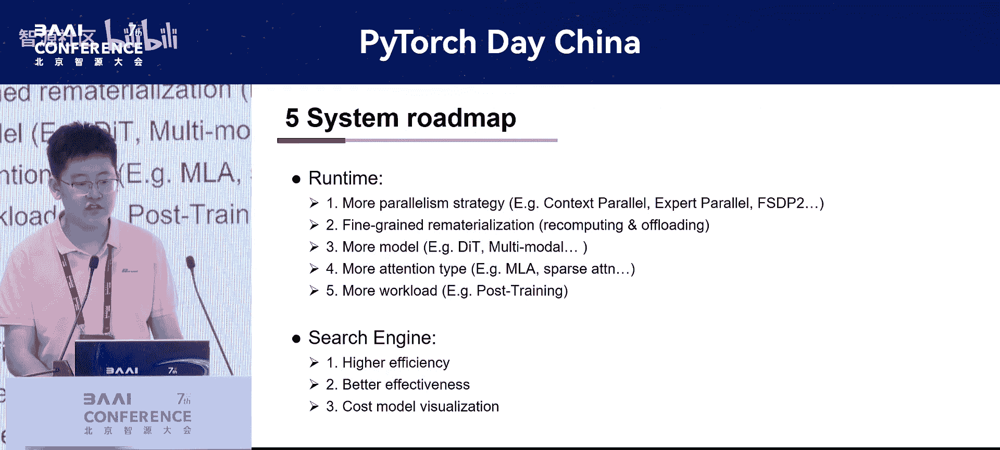
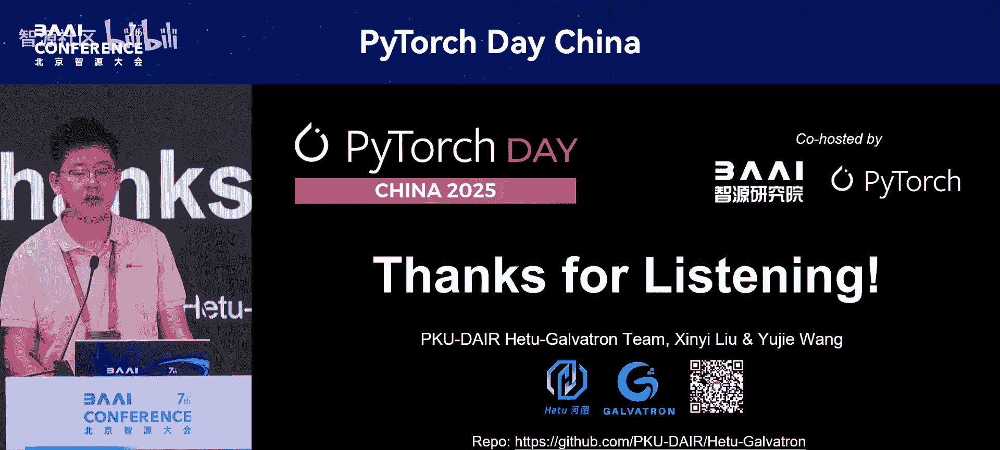

# PyTorch-Day-China-p13-Galvatron--An-Automatic-Distributed-Training-System-for-Efficient-Large-Scale-Tr

在本节课中，我们将深入探讨Galvatron系统，这是一个基于PyTorch原生构建的自动分布式训练系统，旨在高效处理大规模模型。我们将了解其核心特性、工作原理以及如何简化分布式训练流程。

## 概述

Galvatron是一个创新的分布式训练系统，其核心目标是让用户能够轻松地将标准的单GPU PyTorch训练模型，自动、高效地扩展到大规模分布式环境中。它通过紧密集成编译时优化和运行时策略，实现了真正的细粒度混合并行。

## 核心特性详解

Galvatron系统主要具备三大核心特性：**PyTorch原生性**、**自动优化**以及**多功能与用户友好**。

### 1. PyTorch原生性 🏗️

Galvatron的核心是其**细粒度混合并行**能力，这一特性完全构建在原生PyTorch之上。

用户只需提供一个标准的单GPU PyTorch训练模型，Galvatron将通过几个关键步骤自动将其转换。以下是转换流程：

*   **层替换**：首先，系统会将模型中的层替换为支持张量和流水线并行的特殊版本，同时融合内核以提升效率。
*   **模型组织**：接着，这些修改后的层被组织成一个顺序模型，并被分割到不同的流水线阶段中。
*   **应用优化**：最后，像Fp16混合精度训练和梯度检查点这样的原生PyTorch优化技术会被应用到每个流水线阶段。

这种灵活的架构允许不同的模型层采用多样化的并行策略，从而实现真正的细粒度混合并行。重要的是，这种并行粒度具有高度适应性，范围可以从几个Transformer层调整到单个注意力层或MLP层。

### 2. 自动优化引擎 ⚙️

上一节我们介绍了系统的原生架构，本节中我们来看看其智能的自动优化引擎。如前所述，Galvatron配备了一个基于**成本模型**和**搜索算法**的高效自动优化引擎。

我们通过平衡性能分析开销和模拟精度，开发了一个精确的成本模型。在性能分析阶段，Galvatron会收集关键的离散数据点，例如不同通信量下的带宽、不同序列长度和批次大小下的计算时间与内存使用情况。这一点至关重要，因为运行时信息（例如是否使用了融合内核）会显著影响计算时间和内存效率，使得使用标准公式进行模拟变得不准确。

在模拟阶段，Galvatron将这些数据点拟合成连续的模型曲线。然后，它模拟不同并行策略的执行时间，并提供准确的时间和内存估算。值得注意的是，我们的模型还考虑了通信与计算重叠导致的减速，因为通信同样会占用SM资源。

为了让成本模型更易于理解，我们开发了一个可视化演示工具。如下图所示，该工具为用户提供了一种直观的方式来比较不同并行策略下的内存消耗。

Galvatron还提供了一个自动高效的搜索引擎。该引擎使用决策树构建搜索空间，并基于多项观察和启发式方法剪枝无效策略。当成本模型与并行搜索链集成后，会被送入调度算法。该算法基于枚举和动态规划。

具体来说，动态规划方法类似于一个背包问题算法，我们需要为每一层找到一个并行策略。不同并行策略的内存和时间消耗可以被视为物品的容量和价值。此外，枚举部分可以通过多线程加速，确保快速求解。

### 3. 多功能与用户友好 🤝

除了强大的自动化能力，Galvatron还注重实用性和易用性。

在多功能性方面，Galvatron支持广泛的模型架构，并能适配多种硬件后端，包括NVIDIA GPU、Ascend NPU和华为昇腾。对于昇腾硬件，我们通过`torch_npu`确保了无缝集成。

在用户友好性方面，用户只需使用两个接口，就能将标准的单GPU训练模型转换为细粒度混合并行模型：一个用于获取并行策略，另一个用于模型修改。对现有训练代码的改动极小，并且我们提供了全面的文档和示例，帮助用户快速上手。

为了进一步提升易用性，Galvatron还能适配其他框架的数据加载器，允许直接使用准备好的数据集。此外，我们在检查点管理方面进行了创新，以**层粒度**存储检查点。这种方法确保了检查点与任何并行策略的兼容性。我们还提供了便捷的脚本，用于在高效并行模型和标准模型之间转换检查点。

## 实验与性能

我们在真实集群上进行了实验，测试了不同的大语言模型、GPU类型和集群规模。我们将其性能与手动调优的Megatron和DeepSpeed进行了比较。虽然Megatron和DeepSpeed在不同的集群和模型上各有优势和劣势，但Galvatron始终能适应不同集群和模型的特点，实现卓越的效率。

例如，在Eastern Cluster 2上的256块昇腾910集群中，Galvatron相比Megatron实现了**1.8倍**的加速，这证明了细粒度并行策略在优化有限内存以获得更好性能方面的优势。我们还进行了精度测试，以确认Galvatron训练结果的正确性。

## 总结与展望

本节课中我们一起学习了Galvatron系统。总而言之，Galvatron是一个创新的、基于PyTorch的系统，它通过紧密集成编译时和运行时优化，提供了一个全面、自动化的并行训练解决方案，实现了高效率和高易用性。

我们已经与学术界和工业界的合作伙伴建立了广泛的合作。未来，我们将继续开发Galvatron。我们的路线图包括：集成更先进的并行搜索策略（如上下文并行）、支持最新的`torch.distributed`特性、探索量化、支持更多模型和注意力机制，以及自动化训练后工作流程。对于搜索引擎，我们的目标是提升搜索效率、可靠性和可视化功能。

以上就是本次分享的全部内容。感谢您的关注。您可以通过屏幕上显示的地址访问我们的代码库，或扫描二维码。我们诚挚欢迎您探索、试用并分享宝贵的反馈。

