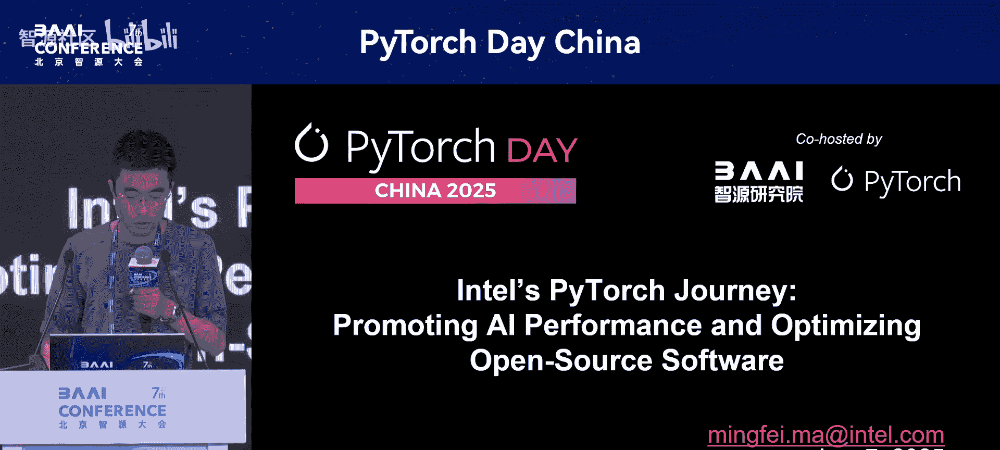
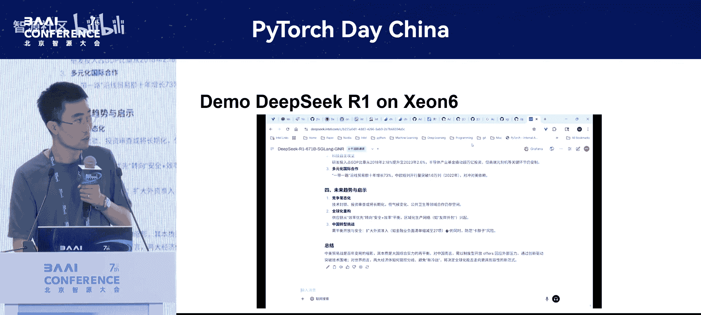

# PyTorch-Day-China-p14-Intel's-PyTorch-Journey--Intel's-PyTorch-Journey--Promoting-AI-Performance-and-O


在本节课中，我们将学习英特尔团队在PyTorch生态系统中，为提升AI性能与优化开源软件所做的核心贡献。课程将涵盖其在英特尔GPU上的支持、CPU端Torch Compile的深度优化，以及针对大模型（如DeepSeek）在CPU平台上的极致性能调优。



## PyTorch优化教程：2：英特尔硬件生态与优化层级

上一节我们介绍了课程的整体内容，本节中我们来看看英特尔多样化的硬件生态以及对应的软件优化栈。

英特尔拥有种类繁多的硬件，包括CPU、GPU和NPU。为了适配这些硬件并最大化性能，英特尔构建了多层级的优化软件栈。

以下是其核心组成部分：
*   **底层加速库**：如oneDNN（深度神经网络库）和oneCCL（集合通信库，对标NVIDIA的NCCL）。
*   **核心优化层**：对PyTorch框架本身进行深度优化。
*   **产品层**：提供“英特尔PyTorch扩展”（Intel Extension for PyTorch, IPEX）插件，用户无需修改代码即可在原生PyTorch上获得更好性能。
*   **生态应用层**：围绕PyTorch，优化流行的上层项目，如LLaMA、Stable Diffusion、Hugging Face Transformers和DeepSeek等。

## PyTorch优化教程：3：英特尔GPU上的PyTorch优化

了解了英特尔的整体优化策略后，本节我们聚焦于他们在英特尔GPU上为PyTorch所做的具体工作。

英特尔GPU产品线丰富，包括集成显卡（iGPU）、独立显卡和面向数据中心的计算卡。团队致力于为所有这些产品在Linux和Windows系统上提供开箱即用的PyTorch支持，其中Windows支持对AIPC等iGPU场景尤为重要。

优化工作主要围绕四个关键部分展开：

以下是具体实现方式：
1.  **运行时（Runtime）**：集成在PyTorch主仓库中，负责设备抽象、内存分配和流管理等基础功能。
2.  **Eager模式内核**：使用英特尔GPU的编程语言SYCL（类比CUDA）编写了所有算子内核，作为一个第三方库在编译时集成进PyTorch。
3.  **Torch Compile支持**：通过英特尔的开源项目`intel/torch-ccl`，为Torch Compile（`torch.compile`）提供了完整的功能支持。
4.  **分布式训练**：通过oneCCL库实现了PyTorch支持的所有分布式训练功能。

性能方面，在推理和训练任务上，使用Torch Compile相比Eager模式能获得显著的性能提升。

**性能提升公式（示例）**：
```
加速比 ≈ 1.5倍 至 2倍以上 (推理)
加速比 ≈ 1.5倍 至 1.6倍 (训练)
```

## PyTorch优化教程：4：CPU端Torch Compile的深度优化

在GPU端取得进展的同时，英特尔团队也深度参与了CPU端Torch Compile（代号“Inductor”）的架构设计与优化。本节我们来详细看看这部分工作。

团队从Torch 2.0特性规划初期就积极参与，并主导了CPU后端（CPU Cap）的开发。他们引入了多项关键优化特性。

以下是部分重点优化特性：
*   **扩展数据类型支持**：从基础的BF16、FP32，扩展到支持INT8、UINT8，以覆盖大模型量化场景，并进一步支持了FP8。
*   **JIT模板自动调优**：默认情况下，CPU上的GEMM（通用矩阵乘）运算会调用oneDNN等库。此特性实现了动态的JIT模板，能根据当前硬件配置（核心数、缓存大小）和输入张量形状，动态规划分块策略，以获取最佳性能。
*   **完整的Windows支持**：确保了CPU后端在Windows系统上的完全兼容。

持续的优化带来了可观的性能增长。在TorchBench、Hugging Face模型和TIMM模型集上的测试表明，随着时间推移，Torch Compile在英特尔CPU上的加速比持续提升。

## PyTorch优化教程：5：大模型在CPU上的极致优化实践

随着大模型的兴起，优化重心也转向了对此类模型的专门优化。本节我们将学习一个典型案例：如何将DeepSeek-V2这样的千亿参数模型高效运行在纯CPU平台上。

团队在Torch Compile中加入了多项针对LLM的优化。以LLaMA 3 8B模型为例，使用`torch.compile`可带来约4倍的性能提升，再结合启用`max_autotune`等标志，还能获得额外约1.2倍的提升。

然而，更大的挑战来自如DeepSeek-V2（671B参数）的混合专家模型。其目标场景是：当系统并发需求不高（如低于10路并发）时，提供一种极具成本效益的替代方案。使用基于英特尔至强6代（Granite Rapids）平台的CPU方案，成本可控制在10万元人民币以内，远低于需要多张高端GPU的方案（成本可能达百万至数百万元）。

优化工作集成在`vLLM`推理引擎中。经过深度优化，在至强6代平台上，相比未优化的基线，取得了显著的性能提升。

**性能提升示例**：
```
预填充（Prefill）阶段：提升约14-15倍（部分场景可达20-30倍）
解码（Decode）阶段：提升约3倍
```

目前，该方案在`vLLM`中支持三种数据类型：
1.  **INT8**：使用美团开源的W8A8量化模型。
2.  **FP8**：使用幻方开源的模型，通过模拟量化实现，精度略高于INT8，速度慢约5%-10%。
3.  **INT4**：基于AWQ量化方法，目前处于原型阶段。

单路请求时，INT8量化的DeepSeek-V2模型解码速度可达约60毫秒/词元（即约16词元/秒）。在4路或8路并发时，每路仍能达到约10词元/秒，基本满足实时性要求。团队预计硬件性能上限在20词元/秒左右，仍有优化空间。

## PyTorch优化教程：6：总结与展望

本节课中我们一起学习了英特尔团队在PyTorch生态系统中的全方位贡献。

我们从其覆盖CPU、GPU、NPU的硬件生态及对应的软件优化栈讲起。深入探讨了他们在英特尔GPU上为PyTorch运行时、Eager模式、Torch Compile和分布式训练提供的完整支持。接着，我们了解了团队如何深度参与CPU端Torch Compile后端的开发，通过扩展数据类型、JIT模板调优等特性持续提升性能。最后，我们研究了一个将千亿参数大模型（DeepSeek-V2）高效部署在纯CPU平台上的实践案例，展示了通过极致优化在特定场景下实现高性价比推理的方案。



总结来说，英特尔的优化工作致力于让PyTorch开发者能够更便捷、更高效地利用其全系列硬件，从提升框架底层性能到优化具体的大模型应用，为AI计算提供了多样化的选择。团队表示将继续优化CPU上的大模型方案，并探索如PagedAttention等进一步的技术。