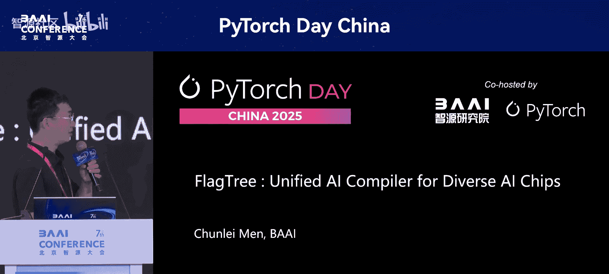
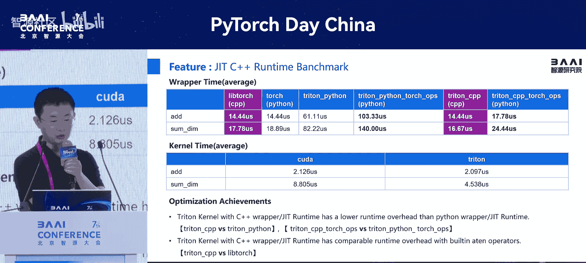

# PyTorch-Day-China-p15-FlagTree--Unified-AI-Compiler-for-Diverse-AI-Chips：Chunlei-Men

## 概述
在本节课程中，我们将学习由智源研究院（BAAI）门春雷分享的 **FlagTree** 项目。这是一个旨在为多样化AI芯片提供统一编译解决方案的开源AI编译器。我们将了解其设计动机、技术架构、核心特性以及如何解决当前AI芯片生态中的挑战。

---

## 技术架构总览 🏗️

智源研究院联合多家单位打造了开源的一站式软件技术栈，主要服务于多元化的AI芯片。

在大模型场景下，对算力的需求急剧增长，导致算力供给也呈现多样化趋势。下图左侧展示了当前AI芯片种类繁多，每种芯片通常配备自己的编译器和通信库。

为了解决芯片编程的碎片化问题，我们共同打造了 **FlagTree** 统一编译器。基于此编译器，上层构建了面向大模型的统一算子库 **FlagJams**。

为了实现多算力芯片间的通信，我们开发了 **FlagX** 通信库。基于 **FlagX**，可以实现多芯片间的互联通信。

最终，通过并行训练与推理框架，将各个组件集成在一起，以支撑上层大模型的训练和推理任务。

这是整个技术栈的架构图。

---

## 前期工作：FlagJams 算子库

在深入讲解 **FlagTree** 之前，我们先分享前期的核心工作 **FlagJams**。

**FlagJams** 的目标是为用户打造一个支持多种AI芯片且高性能的大模型通用算子库。我们很高兴地宣布，该工作已被 **NeurIPS 2024** 接收。

以下是该算子库的几个主要特性：

首先，从技术架构上讲，它采用插件式的使用方式，让用户可以无感知地将其接入到现有框架中。其核心提供了多种接入方式：
*   一种是无感知地通过 **Tensor** 方式注册，通过 **Dispatcher** 调用到算子库。
*   近期我们也增加了像 **CustomOp** 的接入方式，以扩充算子的覆盖范围。

其次，一个重要的成就是，我们已经在11家国内外芯片厂商的18款芯片上完成了适配和验证。这包括了国内外的主流厂商。

最终，我们希望通过 **“一次编写，处处编译，处处运行”** 的理念，来增强框架对AI芯片的扩展能力。

目前，算子库体量约有180多个算子。在部分主流芯片上，其平均性能已超过原厂提供的算子性能。

---

## 算子库的应用与验证

随着算子库体量的增长，我们也加强了其在落地应用方面的验证。

我们重点在主流模型的推理和训练上进行了验证。首要目标是保障算子库计算结果的正确性，其次是确保其覆盖度足够广泛。

通过一系列优化，最终实现了高性能的目标。下图展示了在两个主流模型上的验证结果：
*   一个是 **ChatGLM** 模型在 **DeepSeek** 框架下的推理性能。
*   另一个是智源牵头的开源模型 **OpenSeek** 的训练，我们也进行了结果正确性的验证。

这些是相应的成果展示。

---

## 基于 Triton 的早期实现与局限性

算子库早期是基于 **OpenAI Triton** 实现的。我们非常感谢 **Triton** 开源技术，并概括其几点优势：
1.  **Thonic 编程范式**：在GPU或高性能编程时，保证了易用性。
2.  **编译器辅助并行**：借助底层编译器技术，并行策略由编译器完成，用户无需感知。
3.  **Tile 编程范式**：率先引入了分块编程范式，带来了良好的性能保障。
4.  **与主流框架深度集成**：与 PyTorch 等主流社区深度集成，且 PyTorch 已将 Triton 作为官方支持的算子编程语言之一，与主流生态高度耦合。

然而，随着使用范围扩大，我们发现一个体量大、覆盖广的算子库若完全依赖 **Triton** 发展，也存在一些局限性：

1.  **易用性与性能的权衡**：**Triton** 更侧重于易用性以提升开发效率。但与 **CUDA C** 相比，其性能在局部可能更优，但总体上可能未完全挖掘硬件潜力。
2.  **对非GPU架构支持不足**：其设计之初是针对GPU架构进行的编程建模，因此对GPU天生友好。但对于非GPU架构（如DSA/NPU），性能往往不及预期。
3.  **社区治理与生态约束**：当前 **Triton** 主要由 OpenAI 等企业主导，需求演进围绕企业需求。社区中的小众需求或非GPU硬件需求往往难以兼顾。这导致了生态碎片化：上层有 **FlagJams** 这样做大一统的算子库，中间层有 **Triton** 做编程语言统一，但底层的 **Triton Compiler** 却是分散的。各硬件厂商为满足定制化需求都会维护自己的私有分支，这为后续实现生态统一带来了很大局限性。

---

## FlagTree 的设计动机与目标 🎯

针对上述几点，我们进行了深入思考和广泛调研讨论，达成了以下设计动机：

我们希望**既保持与上游 Triton 生态的兼容性**，又能**借助 MLIR 这种标准的编译器设计来加强对多硬件的底层支持**。

这带来两个好处：
1.  可以复用 **Triton** 已有的能力。
2.  加速一颗芯片推向市场的效率。

此外，我们希望通过编译器技术，实现基于最统一的基础编译器，达到 **“一次编写，多芯片运行”** 的目标，并共享通用的编译优化技术。最终实现上层算子及软件栈的平滑迁移。这是我们的愿景和目标。

---

## 实现路径与阶段成果

我们分阶段实现上述目标。

**第一阶段（v0.1版本）**：我们在今年3月发布了 **FlagTree v0.1**。其主要特性是**统一代码库支持多芯片**。

从系统架构图可以看出，在统一的代码库中，我们支持两条编译路径：
1.  **Triton IR 路径**：针对 GPU 架构的芯片可通过此路径接入。
2.  **LinAlg IR 路径**：针对 DSA 类芯片架构，可复用这套编译链路。

在 v0.1 版本中，我们支持了多款 AI 芯片，包括 GPU 和 DSA 类型，涉及约四五家芯片厂商。

在接入方式上，我们采用了 **“求同存异”** 的合作模式，支持 **Source Code** 接入和 **Library** 形式接入。架构设计采用模块化、可插拔式设计，让各厂商都能找到适合自己的接入方式，从而实现代码仓库的统一。

此外，我们建立了完备的 CI/CD 流程，确保每一笔提交都能在对应的硬件上得到正确性验证。

---

## 当前工作重点 🚀

我们当前正在进行的工作有三个重点：

1.  **加强编译技术，平衡开发效率与性能**：为了解决开发效率与性能的权衡问题，我们在 DSL 层做了两层设计：
    *   **Base Layer**：满足普通用户的编程需求，继续保持 **Triton** 的易用性以保证开发效率。
    *   **Expert Layer**：面向追求高性能的开发者，暴露更多的硬件特性，以达到更优性能。

2.  **构建统一的硬件抽象中间层**：在中间层，我们针对不同硬件架构设计统一的 IR，以满足不同芯片大类的诉求。

3.  **接入更多AI芯片**：我们正在接入更多类型的AI芯片，包括华为昇腾 NPU、基于可重构 RISC-V AI 扩展指令集的芯片（如清微智能）、Arm China 的周易 NPU IP 等。

有了统一的编译器 **FlagTree** 作为底层支撑，上层的 **FlagJams** 算子库的实现就能得到有力保障，避免了之前底层编译器版本碎片化的问题。

---

## 多后端接入架构设计案例

接下来分享几个 **FlagTree** 接入不同后端时的架构设计方案。

**华为昇腾 NPU**：采用了非常标准的接入方式，走的是 **Triton IR -> LinAlg IR -> Ascend IR** 的路线。这既支持从 Triton 自动生成，也支持手动实现单算子。华为的同事针对 NPU 特性，做了硬件感知的语义实现。这里运用了 MLIR 的标准能力，包括如何使用 Triton 中间 IR，以及在 NPU IR 层设计硬件感知与无感的 IR，这都是非常典型且具有代表性的 MLIR 实现。

**Arm China 周易 NPU**：该场景中，周易 NPU 拥有自己的编译器。为了既借力 **Triton** 编译器，又保留原有编译器路径，我们将 **LinAlg IR** 到 **AIPU IR** 做了转换 (**Conversion**)，从而打通两条编译器路线。这样既能享受 **Triton** 带来的上层成果，又能保持底层的编译路径。

**清微智能芯片**：其接入路线与华为昇腾非常相似，此处不再赘述。

---

## 高级特性预览：基于注释的编程范式

接下来向大家提前分享我们正在开发的高级特性。

我们设计了一种 **基于注释的编程范式**。其核心特性是：在保持 **Triton** 自身编程语言特性的同时，通过引入注释的方式，将硬件信息层层传递，最终到达硬件 IR 层面。底层的硬件优化 Pass 可以据此挖掘硬件特性。

具体分为三层：
1.  **DSL 层**：引入注释语义信息。例如，使用 `#!att` 这样的语法，对某个 DSL 语言元素注入语义信息（比如，注入它将采用共享内存感知的优化）。
2.  **中间表示层**：通过 AST 解析，将上层语义传递下来，并通过属性 (**Attribute**) 将语义注入到 MLIR 的 Operation 上。这样，IR 就携带了硬件语义信息。
3.  **底层优化层**：硬件厂商的优化 Pass 获取这些信息后，就能进行相应的优化（如共享内存层面的优化），最终带来显著的性能收益。

---

## 运行时性能优化

**Triton** 自身的一个 **Kernel** 包含三层：包装层 (**Wrapper**)、调用 Kernel 的 **Grid Function** 层、以及最底层 **Triton** 实现的 **Kernel**。这三层共同影响算子的性能。

当前的 **Wrapper** 和 **Grid Function** 由于是 Python 实现，带来了较大的性能开销。这里举一个例子：当 Kernel 执行时间很短时，**Wrapper** 等准备工作的耗时相对占比变高，导致 GPU 出现“气泡”，利用率降低。

这种情况的本质是语言的局限性。为此，我们进行了一系列优化，核心是**用 C++ 重写/重构了 Triton 编译器的运行时（Grid Function）**。基于 C++ 的运行时，我们再去编写 **Wrapper**。最终实现 **Wrapper** 层和 **Grid Function** 层都采用 C++ 实现。

以下是一个演示效果：
*   第一步：由于 **Wrapper** 用 C++ 实现，我们可以直接调用其 C++ API 对 Tensor 进行预处理。
*   第二步：我们重构了 **Grid Function**，它现在是一个 C++ 表示，可以调用一个用 Triton 语言写好的 Kernel 描述。
*   最终，保证了 **Wrapper** 和 **Runtime** 都是 C++ 实现，只有 **Kernel** 的实现是用 Triton，但执行时已是编译后的高效代码。

我们进行了基准测试，分别统计了 **Clone** 时间和 **Wrapper** 时间，并在 `add` 和 `sum` 这两个算子上，对比了多种实现方式。

从结果可以看出：
*   **Wrapper 层面**：yTorch 自身的 C++ 实现 (`libtorch`) 与 Triton 的 Python 调用 (`torch_onnx`) 耗时接近。
*   **关键对比**：Triton Python 调用 (`torch_onnx`) 与我们用 C++ 重构后的实现 (`triton_cpp`) 对比，耗时降低了数倍量级。
*   **封装成算子后**：将优化后的实现封装成可调用的算子 (`torch_ops`)，耗时也降低了数倍量级。

这表明我们的重构能显著节省运行时开销。同时，在 Kernel 层面，采用 Triton 描述的 Kernel 性能与 CUDA C++ 描述的 Kernel 相比，仍然具有竞争力。

---

## 总结

本节课我们一起学习了 **FlagTree** 统一AI编译器。我们从其诞生的背景和挑战（AI芯片碎片化、Triton的局限性）出发，了解了其核心设计目标：**在兼容 Triton 生态的同时，利用 MLIR 强化多硬件支持，实现“一次编写，多芯片运行”**。

我们回顾了其技术架构，包括底层的 **FlagTree** 编译器、上层的 **FlagJams** 算子库和 **FlagX** 通信库。接着，我们探讨了其实现路径，从 v0.1 的多芯片统一支持，到当前正在开发的高级特性（如分层DSL、统一硬件抽象IR、基于注释的编程范式）和运行时优化。

最后，通过华为昇腾、Arm China周易NPU等接入案例，我们看到了 **FlagTree** 灵活、可插拔的架构设计如何适配多样化的AI硬件。**FlagTree** 旨在为蓬勃发展的AI芯片生态提供一个坚实、统一的软件基础。