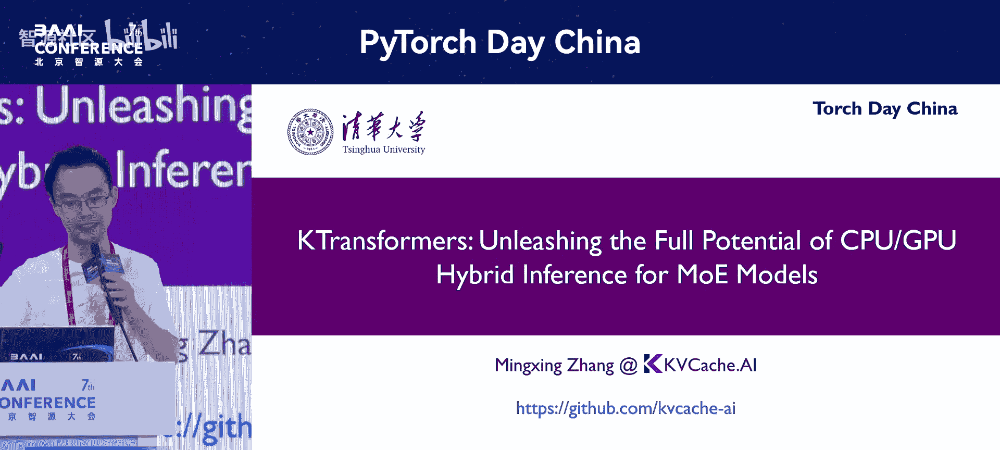
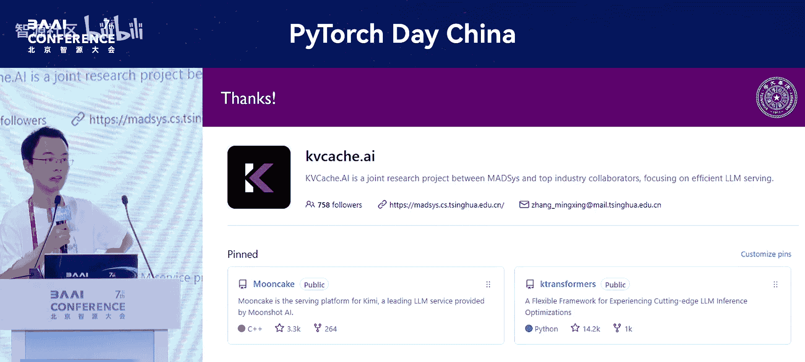

# PyTorch-Day-China-p16-KTransformers--Unleashing-the-Full-Potential-of-CPU-GPU-Hybrid-Inference-for-MoE

在本节课中，我们将学习KTransformers库如何通过创新的CPU-GPU混合推理策略，显著降低运行大型稀疏专家混合模型的门槛和成本。我们将探讨其设计理念、关键技术优化以及未来的应用方向。

## 演讲背景与库介绍

我们的演讲主题是介绍KTransformers库。这个库基于CK库构建，我们在此基础上增加了更多优化的算子以及更优秀的数据排布策略，因此加上了“quick”作为前缀。

实际上，KTransformers最初的设计目标并非纯粹的高性能推理引擎。我们希望它成为一个**灵活**的框架，以便整合更多不同算子层面的优化。巧合的是，这个库因此变得流行。现在它主要被视为一个在本地进行**CPU-GPU混合推理**的库，特别是针对MoE模型。今天我们将对此进行简要介绍。

## 动机：大模型推理的成本挑战

我们为什么会做这件事？原因很简单。我们相信，使用更多数据训练更大的模型，并让这些模型支持更长的上下文窗口，能带来更高的智能水平。

然而，问题在于，无论是增大模型规模还是扩展上下文长度，都会显著提升推理成本。如果两者同时增大，成本将呈二次方甚至三次方增长（因为注意力机制的计算复杂度是二次方的）。这显然不是理想状态。当然，如果你有充足的资金，可以购买大量GPU来低成本地部署大模型。但现实是，并非所有人都有这样的资源。

因此，在许多场景下，我们需要寻找替代方案。例如，在对吞吐量要求不高或并发请求不多的场景下，如何尽可能降低起步门槛，让模型至少能够运行起来，以便未来进行微调或开展各种实验和创新。

## 解决方案：利用模型稀疏化趋势

这里，我们利用了未来大模型的一个重要发展趋势：**稀疏化**。这与我们之前提到的两个趋势都有关联。

*   **更大的模型**：意味着更高的训练成本。为了平衡训练成本与效果收益，我们需要进行稀疏化，例如构建MoE模型。
*   **更长的上下文**：同样带来巨大的训练成本。解决这个问题也可能需要稀疏化技术。

一旦模型本身变得稀疏，特别是在并发请求不高的情况下，意味着我们有很大的**容量需求**，但在单批次或小批次场景下，实际激活的模型参数并不多。那么，我们能否找到一种容量成本相对便宜、同时带宽尚可的存储介质呢？

显然，当前的DDR内存，特别是DDR5，是一个非常好的选择。它的容量成本可能比对应的HBM低10倍，比GDDR低几倍。随着DDR5以及更新的内存技术（如带3D堆叠的DRAM）的发展，其带宽也在提升。未来，像Apple的LPDDR（用于Mac Studio）和AMD的APU系列，如果内存容量更大、带宽更好，都将是非常优秀的选择。你可以在本地以较低成本获得数百GB甚至上TB的容量，同时带宽也相当可观（例如300-400 GB/s），足以满足本地推理需求。

这种硬件发展趋势与大模型稀疏化的发展趋势正好**匹配**。

## 核心架构：CPU-GPU混合推理策略

在这种匹配趋势下，我们首先需要在系统层面进行设计。我们采用的是**CPU-GPU混合**方案，而非纯CPU方案。这主要基于当前模型的一个显著特点：它仍然包含**MLP**这样的算子。一个高效的MLP算子计算强度很高，非常适合在算力强大的GPU上执行。特别是，MLP层在计算过程中会压缩数据维度，使得数据大小相对较小，正好可以放入容量相对有限的显存中。

最近，英特尔也支持我们集成了**Arc GPU**。一张Arc 770显卡价格低廉，却能提供16GB显存，足以容纳100K上下文的KV Cache，非常适合这种场景。

另一个关键问题是模型参数量过大。传统的按层卸载策略（横切）在稀疏模型下并不适用，因为单层参数可能就达到14B或更大，24GB显存可能连两层都放不下。对于60层的模型，只放两层对提速效果甚微。

因此，我们采用的是**纵向切分**策略。这是一种针对MoE模型特化的方法，其核心原则是根据计算的**算术强度**，优先将计算强度高的部分（如MLP）放到GPU上，以利用其高效的计算能力。其他部分（如注意力机制中的投影层）则放在CPU内存中。如果你有更多显存空间，应优先将MLP相关的参数放入显存。这是一个基本原则。

## 性能优化：解码与预填充阶段

在实现这种灵活配置之前，我们首先需要优化性能。性能优化主要涉及两个方面：**解码**和**预填充**。

### 解码阶段优化：降低延迟与通信开销

在解码阶段，关键目标是降低**延迟**。当前在讨论延迟时，我们逐渐进入一个新状态：网络和通信速度越来越快。因此，更多时候我们需要尝试通过异构、分离或池化等策略，让不同硬件充分发挥性能。此时，**通信**变得非常关键。

但问题在于，瓶颈往往出现在**软件栈**上。物理介质的带宽和延迟已有多种手段可以低成本地大幅扩展。然而，扩展之后，上层的软件栈如果每次都需要重新调度，其引入的延迟可能远大于物理延迟。经典的解决方案是使用**计算图**。但动态计算图与静态计算图之间存在权衡，动态图在灵活性上更高，特别是在推理场景下，我们还有**动态专家路由**的问题，未来加入MTP后还有**动态稀疏注意力**的问题。在CPU-GPU通信中，还存在**同步**问题。如果采用简单的方法，这些都会打断计算图，导致计算被切分成多个片段。

为了解决这个问题，我们修改了所有相关的后端，以支持**动态切分**。未来，如果编译技术能做得更好，或许能尝试在这种场景下生成完整的端到端计算图。如果能实现，我们底层的工作会相对简单一些。

**总结一下**：通信本身不是问题，而且越来越快，大家更倾向于多用通信。但在通信过程中，我们需要通过系统软件层降低其在控制平面调用的开销，这是当前降低延迟的关键手段。

### 预填充阶段优化：提升CPU计算效率

在预填充阶段，虽然我们总说它是内存密集型，但当一次性输入几十K的提示词时，它实际上变成了一个**计算密集型**场景。如何解决这个问题？答案当然是让CPU“争气”，利用新的指令集，例如**AMX**就是一个典型代表。

本质上，这与编写CUDA算子的思路相似：进行**分块**和**局部性优化**。在CPU场景下也是如此，我们需要利用L3、L2、L1等多级缓存。同时，由于CPU带宽受限，我们可能需要进行**量化**。在设计量化格式时，需要将量化和反量化操作尽可能**融合**到计算内核中，并与其他操作重叠起来。特别是，当前CPU只支持INT8的矩阵乘法指令，因此在最终乘法运算前可能需要进行数据格式转换。

虽然因时间原因不深入细节，但一旦将这些优化做好，当前的CPU仍能发挥出相当不错的**TOPS**性能。虽然与GPU相比可能仍有差距，但总体而言是一个较好的性能水平。

## 实践成果与社区生态

最终，我们得到了很多人可能已经多次见过的成果：利用24GB显存运行128K上下文的模型。之所以只需要382GB系统内存，是因为我们探索了各种不同的**量化**组合。效果较好的策略很自然：在GPU需要的部分（如Q、K、V、O投影层以及MLP）使用原始精度（如FP8），而在CPU上的部分则尝试使用**低精度**量化。我们甚至尝试过混合精度（如Q4、Q1、Q2混合），并在专家激活时，对优先级最低的专家使用更低的精度，这可以进一步提升速度，但代价是增加内存消耗。由于当前内存消耗已经较大，我们没有特别强调这一点，但它理论上可以边际提升约20%的吞吐性能。

最初，我们主要支持**单批次**推理。后来，随着使用场景增多，大家也希望我们支持**本地小批次**推理。这也很简单，我们主要参考了计图的架构，可以将CPU和GPU的处理过程**流水线化**。同时，在多批次情况下，GPU部分的计算可以并行。而在CPU部分，由于并行度增加，可以更好地利用CPU资源。最终，吞吐量可以获得两倍多的提升。当批次更大时，瓶颈可能会出现在GPU上，此时可能需要更换更好的GPU或通过使用更多CPU来分担负载。

此外，我们还与**Qwen团队**合作，提供了早期支持。因此，在他们最初发布模型时，KTransformers就成为了首批支持的系统之一。对于像Qwen-71B这样对本地运行可能过大的模型，我们期待未来能看到更多针对**特定设备尺寸**设计的MoE模型。例如，使用消费级CPU加消费级显卡（如RTX 4070、Intel Arc或AMD显卡）的组合，因为在此场景下，显卡带宽并非主要瓶颈。如果现在能够针对某些特定的IPC设备设计对应的MoE模型，那么“个人大模型”的概念可能成为现实。

## 未来展望：稀疏注意力与灵活框架

最后，我们还有一点时间，稍微聊一下稀疏性的另一个关键方向：**注意力层的稀疏性**。

我们认为，未来特别是对于智能体、需要历史记忆或终身学习的场景，**上下文长度**必须比现在更长。100万个token甚至1000万个token可能都需要实现。如果继续使用全注意力机制，这是不可能维持的。因此，我们必须引入**稀疏性**。

无论是我们还是其他团队，在实际场景中都观察到，稀疏性是一个可以学习到的特性。在许多场景下，特别是当上下文长度越来越长时，使用全注意力机制不一定是好事，反而可能有害，因为它引入了过多的上下文干扰。模型必须学会如何关注真正关键的部分。稀疏注意力是对全注意力的一个有益补充。因此，从我个人的角度来看，未来**稀疏性**一定会成为标配。

实际上，我们已经看到相关进展。我们的KTransformers库在去年就已经支持了这种**稀疏注意力**。虽然具体实现方法各异，但底层框架类似：将序列切分成块，每个块选取一些代表性向量（无论是通过线性变换还是平均池化），然后挑选出最重要的top-k块进行计算，最后可能有一个重排序步骤。这种架构也非常适合CPU-GPU混合计算。这是我们下半年计划重点推进的工作之一。

最后再次强调，KTransformers的初衷是提供一个**灵活的算子注入框架**。如果大家对单个算子有优化方案，可以很方便地将其集成进来进行优化尝试。预计在一两个月内，我们将在推理功能的基础上，增加**本地微调**支持。这样，大家就可以基于本地的CPU加GPU硬件，对Qwen-71B这样的模型进行微调，从而解锁更多的实验场景。

除了KTransformers，我们还在同步维护另一个项目**Mose**，主要用于分布式推理场景。如果大家对我们的项目感兴趣，非常欢迎加入我们的社区一起交流。

---

**本节课总结**：我们一起学习了KTransformers库如何通过创新的CPU-GPU混合推理架构，解决大型MoE模型在本地部署时的成本和门槛问题。我们探讨了其利用模型稀疏化趋势、优化解码与预填充阶段性能、以及支持灵活配置和未来稀疏注意力扩展的核心思想。该框架旨在让更多人能够低成本地体验和实验前沿的大模型技术。