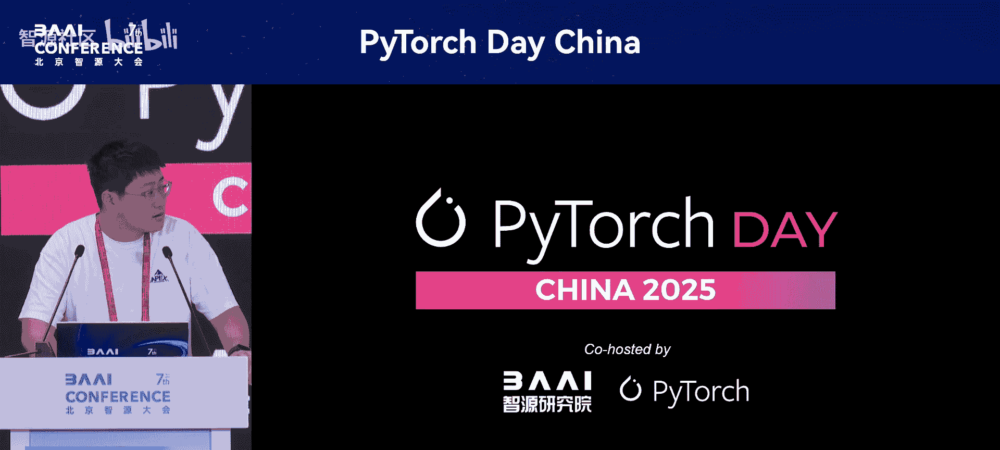
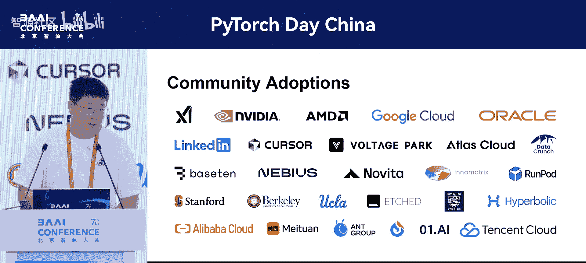

# PyTorch-Day-China-p17-SGLang--An-Efficient-Open-Source-Framework-for-Large-Scale-LLM-Serving：Liangshen



在本节课中，我们将学习SGLang，一个用于大规模语言模型服务的高效开源框架。我们将了解其核心特性、关键技术设计以及如何在实际应用中实现高性能。

## 概述

SGLang是一个快速的大语言模型服务引擎，是目前性能领先的开源解决方案之一。它是首个在开源实现中，于大规模部署场景下，几乎匹配DeepSeek官方博客所报告吞吐量的框架。其优雅、轻量且可定制的设计吸引了学术界和大型科技公司的广泛采用。

---

## 第一部分：发展历程与核心特性 🚀

上一节我们介绍了SGLang的基本定位，本节中我们来看看它的发展历程和关键特性。

SGLang的发展经历了多个重要版本迭代：
*   **2023年初版**：引入了结构化语言模型编程、前缀缓存以及约束解码。其中，高效的前缀缓存是首个开源实现，用于减少KV缓存和冗余计算。
*   **2023年夏季 0.2版**：在部署Llama 3模型时，在所有开源推理框架中取得了领先性能。
*   **0.3版**：通过集成`torch.compile`，实现了比vLLM快7倍的深度求值（Deep ML）速度，并支持多图像和视频模型。
*   **2023年底 0.4版**：包含零开销批处理调度器、缓存感知的数据并行路由器和XLA集成。同时，成为首个能够服务DeepSeek-V3模型的框架。
*   **近期更新**：首个开源实现了大规模专家并行（Expert Parallel）与预填充/解码分离（PD Segregation）技术，实现了比vLLM数据并行快5倍的性能，并匹配了DeepSeek博客中提到的API成本（约每百万令牌0.2美元）。

---

## 第二部分：预填充/解码分离的高效设计与实现 ⚙️

了解了SGLang的整体发展后，本节我们将深入探讨其核心优化技术之一：预填充/解码分离。

首先，我们需要理解非分离调度模式存在的问题：
1.  **额外延迟**：解码批次总是被预填充任务阻塞，这会为令牌生成引入额外延迟。
2.  **通信与负载不均衡**：在非分离模式下，数据并行注意力机制会导致同一DP组内通信与计算负载不均衡。解码和预填充批次可能混合在一起同时执行，这会增加解码令牌的延迟并导致负载不均。
3.  **与专家并行的兼容性问题**：预填充和解码通常使用不同的调度模式。在没有分离的情况下，数据并行无法在同一通信组内同时支持这两种模式。

SGLang通过实现预填充/解码分离来解决这些问题。以下是其架构概述：

```
[用户请求] -> [负载均衡器] -> [预填充实例] & [解码实例]
```

在设计中，负载均衡器与计算逻辑解耦，仅负责选择PD对并将请求路由到相应实例。框架支持非阻塞和基于RDMA的KV缓存传输，并提供了灵活的传输引擎API集成。

以下是PD分离的时间线步骤演示：
1.  **握手**：负载均衡器选择一个PD对，将请求发送给预填充实例和解码实例。双方交换元数据（如索引、地址），并初始化KV缓存发送器和接收器。
2.  **预分配**：解码实例确认有足够内存存放KV缓存后，在内存池中预分配空间，并通知预填充实例可以开始。
3.  **预填充**：预填充实例开始处理提示词，完成后将KV缓存发送给解码实例。
4.  **解码**：解码实例进行解码，结果通过负载均衡器返回给用户。

---

## 第三部分：大规模专家并行支持与DeepSeek性能复现 📈

上一节我们介绍了PD分离技术，本节中我们来看看SGLang如何支持大规模专家并行并复现DeepSeek的性能。

即使在DeepSeek模型中只有三层密集层，也需要高效地为这些带有密集前馈网络的层提供服务。SGLang选择使用纯数据并行，而非张量并行或混合并行，原因如下：
*   **避免碎片化**：可以避免在大隐藏维度上进行TP切分带来的碎片化问题。
*   **优化内存效率**：较低的TP度数（如TP=1）有利于预填充和解码，可以减少每个设备的内存占用。
*   **最小化通信开销**：纯数据并行可以避免张量并行组内的所有通信。对于每一层，仅在注意力部分之前有一次`scatter`操作，之后有一次`all_gather`操作，总共只有两次通信。

对于稀疏前馈网络的MoE层，SGLang采用了DeepSeek博客中提到的专家并行策略（DP Attention with Sparse FFN with Expert Parallel）。这样做可以扩展模型容量，将不同专家分区到不同设备上，从而支持更多专家数量并消除内存瓶颈。

然而，专家并行策略也带来了挑战：
*   **通信开销与GPU资源利用不足**：部署MoE层时，DP Attention分发专家、FFN计算、然后组合的模式会带来通信开销和GPU资源利用不足的问题。
*   **负载不均衡**：不同专家接收的令牌数量可能差异巨大。

幸运的是，这些问题可以通过**双批次重叠（Two Batch Overlap, TBO）** 和**专家并行负载均衡器（EP LB）** 进行优化。

**解决DP调度模式兼容性问题**：
DP持有两种调度模式：对预填充友好的“正常模式”（使用符号张量形状）和对解码友好的“低延迟模式”（使用静态张量形状）。两者都支持DP Attention，并有“自动模式”来处理输入和输出。然而，如前所述，在同一通信组内同时进行预填充和解码是不兼容的，这也是需要使用PD分离而非统一调度的原因之一。

**实现双批次重叠（TBO）**：
以下是TBO的启动顺序优化示例。不当的启动顺序会导致CPU在GPU接收完所有元数据前被阻塞，浪费计算资源。

**优化前（不当顺序）**：
1.  启动`dispatch`内核（通信）
2.  （CPU等待GPU同步）
3.  启动`MLP`内核（计算）

**优化后（正确顺序）**：
1.  启动`MLP`内核（计算）
2.  启动`dispatch`内核（通信）
3.  （计算与通信在GPU上同时执行）

SGLang通过**操作列表（Operation List）** 和**让出点（Yield Points）** 的抽象来实现清晰的TBO。这支持协同调度，消除了代码重复，并管理了不同解码器层之间部分完成的状态。

**性能表现**：
根据LM Sys博客发布的基准测试结果（在假设另一方资源无限的情况下独立评估预填充和解码）：
*   **预填充模式**：在16个TP秩上，吞吐量比原生vLLM快3倍。
*   **解码模式**：成功将批次大小从约15扩大到200以上，解码器吞吐量提升了5.1倍。这大致匹配了DeepSeek在2月份博客文章中报告的性能。

**专家并行负载均衡器（EP LB）**：
在真实场景中，负载不均衡问题会随着规模扩大而恶化。SGLang实现了EP LB来解决此问题。两种改进策略是：
1.  **增加批次大小**：通过推测解码等技术，可以一次前向传播多个令牌，从而使批次大小成倍增加。
2.  **集群再平衡**：通过点对点操作在不同设备间交换专家权重。

研究表明，平衡度（定义为MoE层在所有GPU中平均计算时间与最大计算时间之比）会随着系统节点数量的增加而降低。启用EP LB可以显著提高平衡度。

---

## 第四部分：生态系统、强大社区与未来展望 🌱

前面我们探讨了SGLang的技术核心与性能，最后一节我们来了解其生态系统和未来发展。

SGLang是首个开源实现DeepSeek大规模专家并行部署的框架。未来的工作重点包括：
1.  **延迟优化**：首令牌延迟和令牌间延迟仍然较大，需要为实时用例进行调优。
2.  **扩展序列长度**：当前受限于96 GPU的设置。
3.  **完全集成**：模型并行和数据并行注意力尚未完全集成，目前仅在模拟工作负载中。
4.  **优化密集层**：密集FFN层可以受益于小的TP尺寸，目前仅支持全张量和全数据并行。
5.  **支持新架构**：计划支持Black-White等新模型架构。

**团队与社区**：
SGLang团队由LM Sys孵化，拥有超过400名贡献者。其设计已被X AI、NVIDIA、AMD等公司采用。



**开源倡议**：
构建开放协作的AI生态系统至关重要。鼓励进行研究、开发项目时选择开放科学、开源的方式，使用开放的模型许可证，并加强跨领域对话与合作。

---

## 总结

本节课中我们一起学习了SGLang框架。我们从其发展历程和核心特性开始，深入探讨了**预填充/解码分离（PD Segregation）** 这一关键设计如何解决延迟和负载不均衡问题。接着，我们分析了其**大规模专家并行（Expert Parallel）** 支持，包括使用纯数据并行的优势、**双批次重叠（TBO）** 的优化实现，以及**专家并行负载均衡器（EP LB）** 如何提升系统平衡度，最终成功复现了DeepSeek的高性能。最后，我们了解了SGLang活跃的社区生态和未来的发展方向。SGLang通过其高效、灵活的设计，为大规模语言模型服务提供了一个强大的开源解决方案。