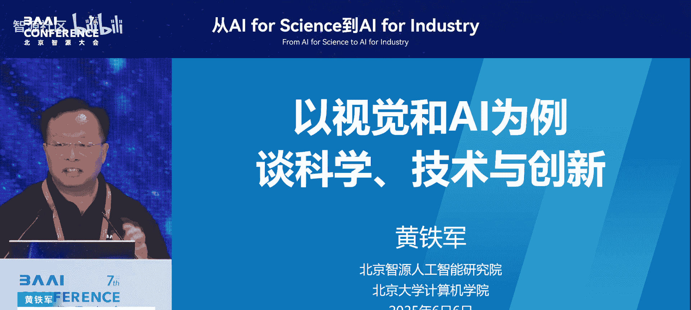
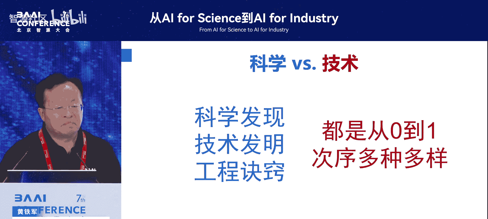
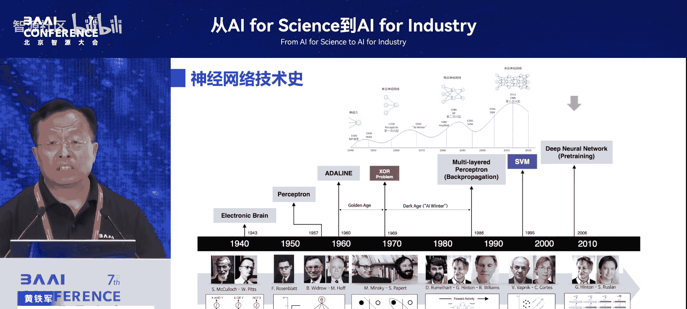
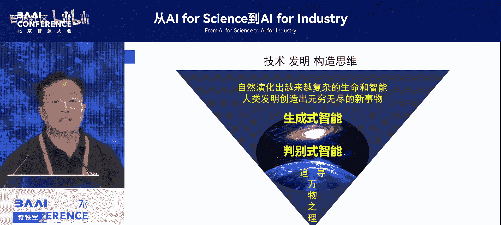
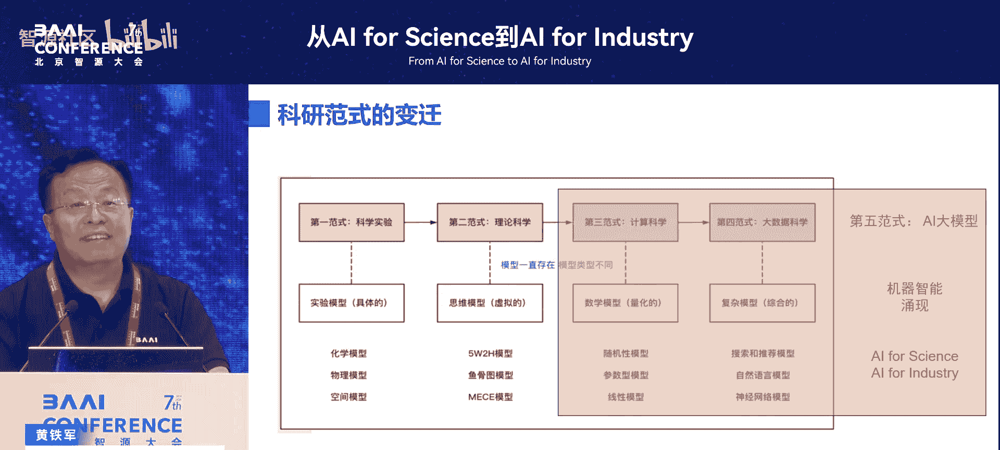

# 从AI-for-Science到AI-for-Industry-p03-以视觉和AI为例谈科学、技术与创新：黄铁军

在本节课中，我们将以视觉和人工智能为例，探讨科学、技术与创新三者之间的关系。我们将辨析它们的不同本质，并理解在当今时代，特别是人工智能时代，如何以新的思维方式推动创新。

## 概述：科学、技术与创新的本质辨析

首先，我们需要明确科学、技术与创新的基本定义。

**科学**是探索和发现事物与现象背后客观规律的活动。其研究对象是自然界中已存在的事物，例如物理、化学和生命现象。科学发现具有唯一性，即谁最先发现，谁就是第一。

**技术**是创造和发明新事物的活动。其研究对象主要是“人工物”，即自然界原本不存在、由人类创造出来的事物，例如手机、飞机和人工智能系统。

长期以来，一种普遍的观点认为“科学是基础，技术是应用”。这种观点在某些情况下成立，但在更多情况下是片面甚至不成立的。科学和技术是两种不同的思维方式，它们之间的关系是复杂且相互促进的，而非简单的单向基础与应用关系。

## 科学作为技术基础的传统案例

上一节我们定义了科学与技术，本节中我们来看看一个支持“科学是基础”观点的经典案例：核能技术。

核能（包括原子弹和核电站）是一项典型的技术发明，因为地球上原本并不存在这些事物。这项技术的诞生，确实受益于此前量子力学等物理学领域的科学发现。科学对物质微观结构的认识，为核技术的实现提供了基础。

然而，这并不意味着技术只是科学的简单应用。如何实现可控的核裂变或核聚变，每一个具体的技术环节都需要独立的创造和创新。例如，中国在外部严密封锁的情况下独立研制出“两弹一星”，这本身就是从零到一的重大技术创新。这说明了即使科学原理已知，技术的实现路径仍需自主探索，这本身就是创新的核心。

## 技术与科学脱节的典型案例

然而，科学与技术的关系并非总是如此紧密。在许多情况下，技术的发明和发展可以独立于，甚至领先于科学认知。

以摄影技术为例。人类对“光”本质的科学认识经历了漫长的争论，从牛顿的粒子说到惠更斯的波动说，直到1905年爱因斯坦提出光的波粒二象性。但摄影技术的发明（1839年）远早于对光的科学共识达成之时。发明者并不关心光到底是粒子还是波，他们利用化学方法成功记录了光。

更值得注意的是，尽管科学上对光的认识早已深化，但主流摄影技术（包括今天的数码摄影）在近两个世纪里一直沿用着“打开快门-曝光-关闭快门”的同一技术范式，并未因科学进步而发生根本改变。这揭示了**技术一旦形成，其发展路径具有强大的惯性**。直到最近，才有研究者（如讲者本人）开始基于“光是离散光子流”这一科学认识，探索全新的“脉冲视觉”摄影范式，这正是一个基于科学新认知打破技术惯性的创新机会。

## 独立于科学的技术创新

事实上，人类历史上大量重大技术创新在诞生时，完全不以当时的科学认知为前提。

以下是三个著名的例子：
*   **指南针**：中国古代发明指南针时，完全没有电磁学、地磁场等科学知识。
*   **飞机**：莱特兄弟在1903年成功试飞飞机，而相关的空气动力学理论是在几十年后才成熟。
*   **人工智能**：当前的深度学习、大模型等技术，是在我们尚未完全理解“智能”的科学原理之前，由工程师创造出来的。就像飞机能否飞起来不需要理论批准一样，人工智能的能力也应由其实际表现来评判，而非等待理论的“许可”。

许多人工物（如豆腐、混凝土）都是先被发明出来，之后人们才去探索其背后的科学原理。晶体管获得了诺贝尔物理学奖，但它首先是一项技术发明。这提醒我们，**技术本身具有独立的创新价值和地位**。

## 人工智能：技术先行的典范

现在，让我们将视角聚焦到本次课程的核心——人工智能。人工智能的发展历程，是技术驱动创新的绝佳范例。

人工智能首先是一门**技术**。从1940年代的人工神经网络开始，其核心目标就是**设计并训练出一个能产生智能行为的人工系统**。这是一个典型的创造“人工物”的过程。

人工智能领域的关键突破大多源于技术和工程上的创新：
*   **反向传播算法**：由杰弗里·辛顿等人于1986年明确提出，这是一种高效训练神经网络的技术方法，我们并未在大脑中找到完全相同的机制。
*   **生成式AI与大模型**：其技术路线的奠基性思想，源于本吉奥（Yoshua Bengio）团队在2000年代初提出的“用前文预测下一个词元（token）”的方法。`GPT`系列模型的核心预训练目标 `P(token_n | token_1, ..., token_{n-1})` 便源于此。

这些技术进步并非源于对智能本质的终极科学理解，而是工程师们通过设计网络结构、利用数据训练，不断优化系统性能的结果。智能的“涌现”更像是复杂系统演化出的新特性，而非预先完全设计的产物。

## 人工智能催生新科学认知

有趣的是，当人工智能这项技术发展到足够复杂的程度（如大模型）时，它反过来开始挑战和刷新我们传统的科学（特别是数学、统计学）认知，从而催生新的科学问题。

大模型的实践揭示了高位空间与低位空间截然不同的规律：
1.  **维度诅咒的破除**：传统认为高维数据会导致计算灾难。但在大模型中，高维表示反而成为优势，许多问题的复杂度从指数级降至线性级。
2.  **优化景观的改变**：传统优化理论认为，在高维非凸空间中容易陷入局部最优。但实践发现，在高维空间中，**鞍点**远比局部最优点常见，优化器更容易找到平坦的极小值区域。公式上，这源于海森矩阵（Hessian Matrix）特征值分布的变化。
3.  **对传统统计规律的突破**：出现了“双下降”现象，即当模型参数规模超过某个阈值后，不仅训练误差降低，**泛化能力**也再次提升，这与经典统计学的预期相悖。

这些现象表明，**大模型的实践走在了理论前面**。它迫使数学家、统计学家重新审视原有理论的前提假设，从而可能孕育出全新的科学理论。这正是技术实践反哺科学发现的生动体现。

## 总结：拥抱生成式创新思维

本节课中，我们一起学习了科学、技术与创新的多维关系。

我们认识到：
1.  科学与技术是两种不同的思维和实践范式，它们相互促进，但并非简单的“基础与应用”关系。
2.  大量技术创新独立于当时的科学认知，技术本身具有强大的创新惯性和独立价值。
3.  人工智能是技术驱动创新的典范，其发展主要依靠工程实践和算法改进。
4.  人工智能（尤其是大模型）的复杂实践，正在反过来挑战传统科学认知，催生新的科学问题，体现了技术对科学的反哺。

最终，这引导我们走向一种**生成式创新思维**。它不同于刨根问底的“判别式”科学思维，而是强调通过构建复杂系统（如大模型），在迭代和演化中让新属性（如智能）自然涌现。面对许多无法用简洁方程描述的复杂现实问题（无论是科学的还是工业的），这种基于计算和仿真的新范式，为我们提供了全新的强大工具。

在AI for Science与AI for Industry的时代，我们既要尊重经典科学的殿堂，更要勇于运用人工智能这种全新的“思维显微镜”和“创新引擎”，以更加开放和务实的态度推动从技术到科学的全方位创新。