# 从AI-for-Science到AI-for-Industry-p04-能源化工行业大模型建设实践：杨文军

在本节课中，我们将学习中国石油（中石油）在能源化工行业进行大模型建设的整体思路、顶层设计框架与核心方法论。我们将了解一个大型集团企业如何系统性地规划和应用大模型技术。

我们有请中国石油数字研究院院长杨文军先生进行主题为“能源化工行业大模型建设”的分享。

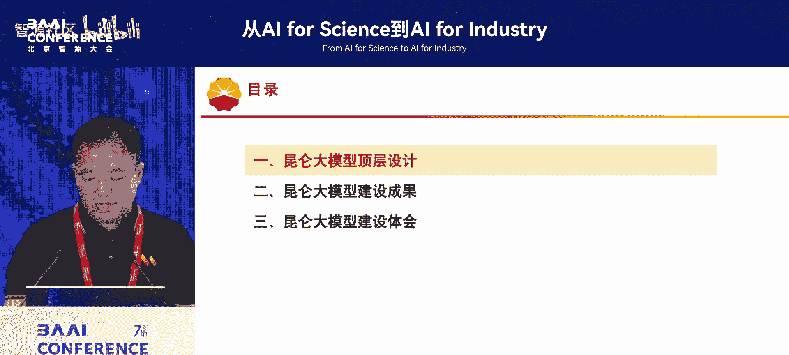

我是来自中石油数字研究院。过去一年多一直在进行中石油大模型的建设实践。我们与冯老师领导的团队合作，以季度为周期进行迭代，刚刚完成了第四轮迭代。冯老师邀请我来分享，起初我拒绝了。我认为我们的工作与AI for Science有距离，我们更侧重于解决企业实际问题，强调技术的可用性而非技术深度。但本次大会主题是“从AI for Science到AI for Industry”，我们的实践恰好能提供一个在传统能源企业应用大模型技术的案例，具有一定的借鉴意义。因此，我将做一个简要报告。

中石油的大模型名为“昆仑大模型”，于去年5月28日正式启动，至今已一周年，完成了四轮迭代。它是能源化工行业首个通过国家备案的行业大模型。

我们首先进行顶层设计，明确在一个集团级企业开展大模型应用应从何处着手。总体来看，我们设定了五大目标任务。

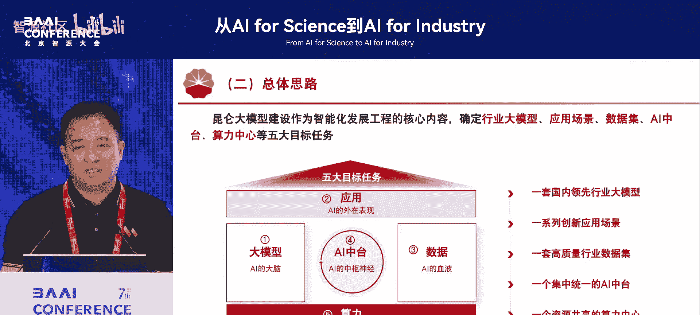

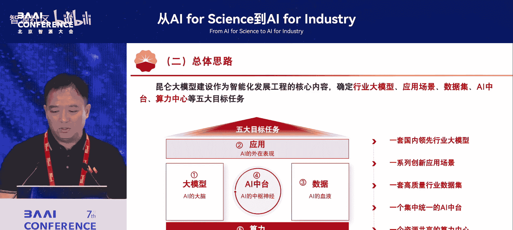

以下是五大目标任务的具体内容：
1.  **建设一套国内领先的行业大模型**：在基础模型之上，面向企业和行业应用，设计专属的大模型。
2.  **创新应用场景**：挖掘企业内部丰富的业务流程和价值链，设计有价值的应用场景。
3.  **构建高质量的行业数据集**：将企业每时每刻产生的数据有效利用起来，构建高质量数据集。
4.  **建设集中统一的AI中台**：与合作伙伴共同建设，统一管理AI开发与部署资源。
5.  **建设自有算力中心**：构建自主可控的算力基础设施。

我们将集团级企业开展大模型建设分为这五大任务。

## 大模型规划与分层架构

上一节我们介绍了整体建设目标，本节中我们来看看具体的大模型规划。在一个集团企业里，有上百家下属单位，若缺乏统一规划，建设容易分散、混乱和重复。因此，规划至关重要。

根据中石油产业链长、业务形态多样的特点，我们将大模型规划为四层架构。

以下是四层架构的具体划分：
*   **L0层：基础通用大模型**：采购的商业基础模型，包括多模态、语言和视觉大模型。
*   **L1层：行业大模型**：在L0层基础上，通过增强预训练，训练出面向整个能源化工行业的模型。
*   **L2层：专业大模型**：在行业大模型基础上，针对特定业务领域进行深化。这是难点，划分需平衡资源与专业化需求。我们主要分为四条线：**业务条线**、**管理条线**、**共性能力**和**科技计算**。
*   **L3层：场景大模型**：在专业或行业大模型基础上，通过微调或RAG（检索增强生成）技术，快速实现具体应用场景的模型。

这种四层划分对于集团企业目前比较适用。

## 应用场景规划

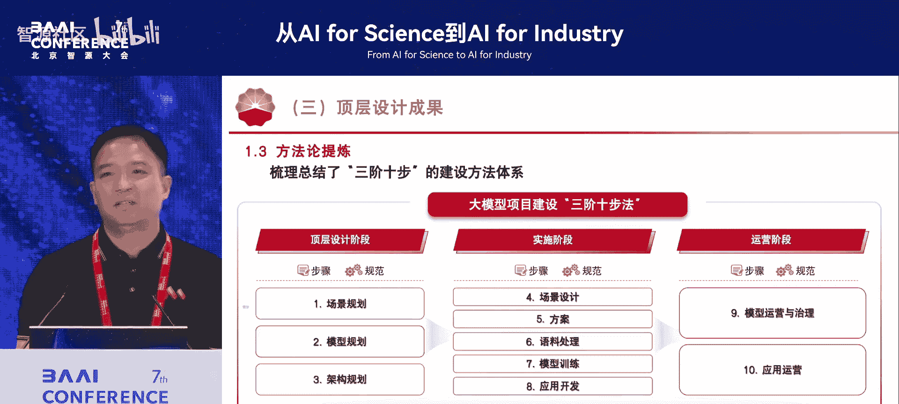

场景规划同样面临颗粒度划分和避免重复建设的问题。我们依据五大原则进行设计。

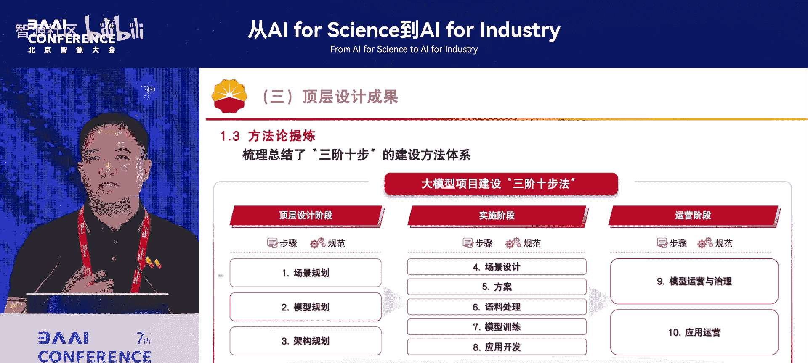

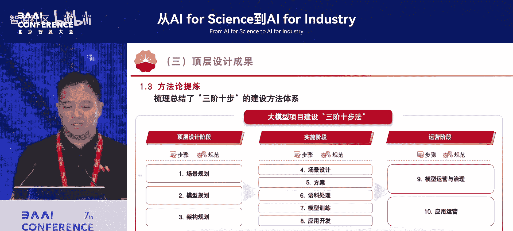

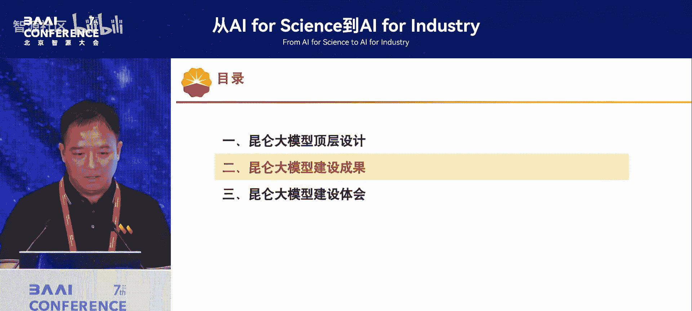

以下是场景规划的五大原则：
1.  突出主业
2.  体现价值
3.  语料丰富
4.  技术可行
5.  急用先行

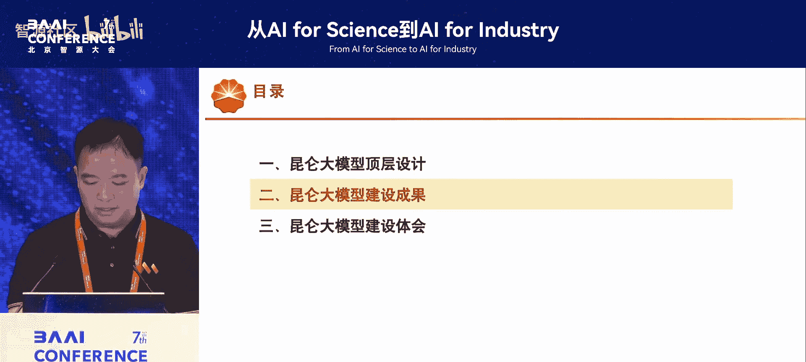

基于这些原则，我们设计了470个应用场景，其下还有上千个子场景，形成了“十亿百景千应”的全景视图。有了这个规划并持续维护，大模型建设才能有序开展。

在建设过程中，我们发现ToB领域全面应用大模型的经验较少。经过一年实践，我们提炼出自己的方法论，即“三阶十步”建设方法体系。

以上是我们在顶层设计方面所做的工作。

---

# 能源化工行业大模型建设实践：02：核心任务建设成果

在上一节，我们了解了昆仑大模型建设的顶层设计与规划框架。本节中，我们将具体看看围绕五大核心任务，中石油取得了哪些建设成果。

## 大模型训练成果

我们具体开展了以下工作，均围绕五大任务进行。首先是模型训练。

我们总共训练了60个大模型。其中包括4个行业大模型（涵盖问答、推理、语言、视觉、多模态），8个专业大模型（主要面向科技计算领域），以及在此基础上微调形成的48个场景大模型。我们按季度迭代的方式持续优化这些模型。

目前，我们的语言大模型参数量从700亿提升至3000亿，视觉大模型从3亿提升至44亿，多模态大模型从160亿提升至800亿。内部与第三方测试表明，这些模型在行业理解与推理能力上较基础模型有较大提升。

专业大模型是工业界的未来重点，旨在解决专业领域能提升效率的实际问题。

以下是我们在专业大模型领域的一些实践：
*   **勘探领域**：构建了覆盖地震处理解释、测井处理解释的全领域专业大模型。
*   **炼化领域**：开发了持续学习大模型，用于参数优化、设备预测性维护等。
*   **其他领域**：包括基于视觉的安全生产大模型、物资招采大模型、文档问答大模型、代码生成大模型等。

## 高质量数据集建设

数据集是大模型的“血液”。高质量数据集是模型效果的根本保障。

我们根据大模型分类（行业、专业、场景三级），明确了各级数据集的责任主体，并建立了内部共享与考核激励机制，以推动数据质量持续提升。存量数据并非为大模型训练准备，因此我们同时制定了数据集建设规范，确保后续系统产生和人工标注的数据符合标准，从而提升后续数据处理效率。

我们制定了14项行业级、专业级和48项场景级的数据采集与标注标准。目前，整个数据集规模达500TB，其中80%为工业数据，教材、期刊、论文等资料占比不足20%。我们构建了100万个问答对，其中大量经过人工标注与校验。近期还形成了25万个行业推理问答对。

## AI中台的建设与重要性

AI中台在企业中非常重要。对于拥有多支团队同时开展建设的企业，需要通过一个AI中台提供图形化操作界面，降低使用门槛。

我们部署了三大流水线，确保一个AI应用经过这些流程后能达到预期效果。同时，我们统一纳管了多家商业大模型的训练与推理工具链，形成了统一的操作界面。此外，也支持主流开源大模型的私有化部署，并集成了智能体构建平台。

AI中台的重要性在于，它集成了算力、语料、模型、人力资源，是统一的管理中枢。当整个集团在一个AI中台内开展AI建设时，整个过程是可控、可干预的，能有效避免重复建设。

## 智算中心建设

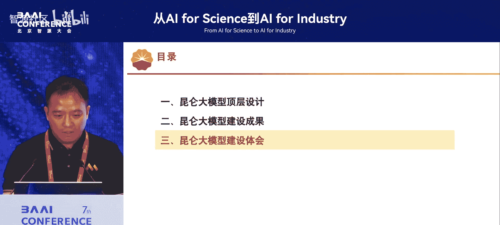

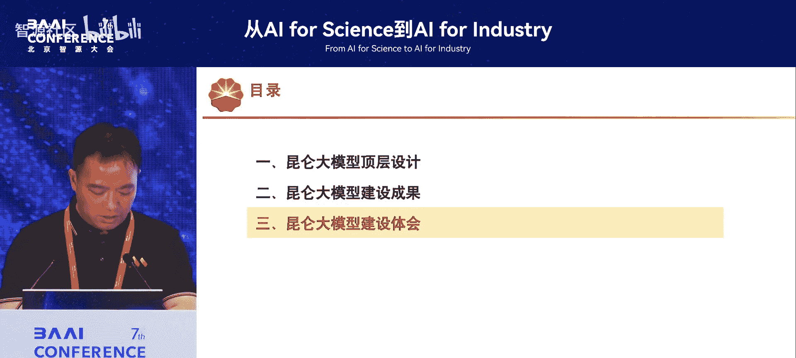

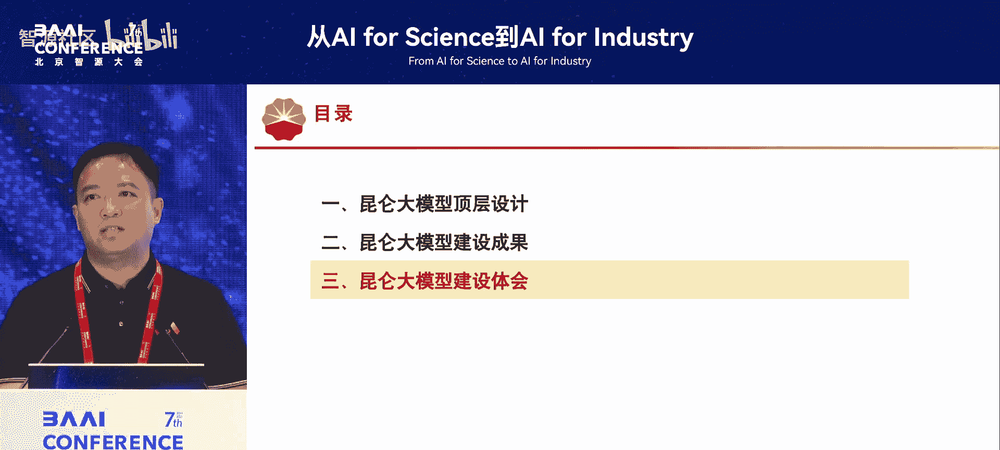

我们采用“自建+合作”的方式构建国产化算力体系。目前，完全在国产化算力芯片与计算架构上，我们完成了全部60个模型的训练与推理，相关指标均在可控范围内。高峰时算力规模已达1900多P，这反映了当前模型训练与应用的使用情况。

## 应用场景建设

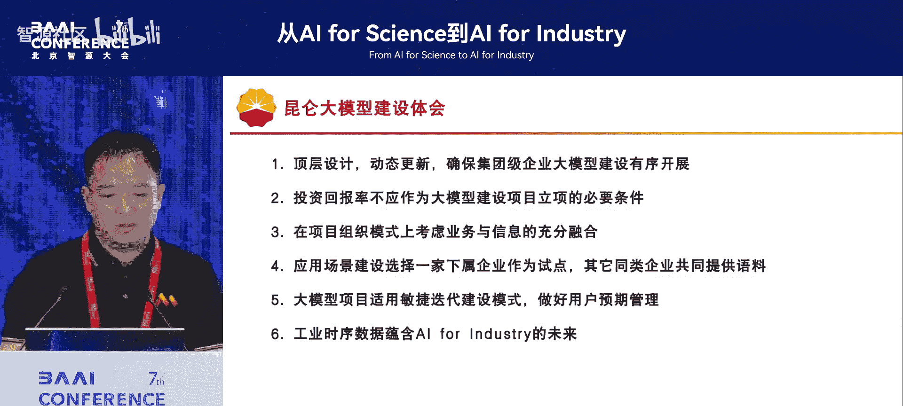

目前我们共建设了100个应用场景，优先选择价值大、难度可控、数据丰富的场景。其中，生产管理领域69个，办公、营销、服务类31个，已全部投产，有效提升了业务效率与效能。

生产领域的应用覆盖了主营业务，包括勘探开发、油气生产、炼油化工、油气销售、装备制造等。

以下通过三个具体例子，说明AI for Science如何走向AI for Industry：
1.  **地震数据处理**：通过**强述分暴算法**改写传统算法，利用GPU并行计算，大幅提升了处理效率。在国际石油区块竞标中，更快的计算速度意味着更高的效率和效益。
    *   **核心优化**：`传统CPU串行计算` -> `GPU并行计算 + 强述分暴算法`
2.  **乙烷制乙烯装置工艺优化**：利用工厂实时数据库中的海量时序数据，通过**强述分暴算法**将高维数据序列化，进行深度神经网络分析。目前效果已与机理模型相当，未来有望超越。
    *   **数据利用**：`历史监控数据` -> `强述分暴算法处理的高维时序数据`
3.  **智能制造**：
    *   **研发设计**：语言大模型可生成设计文档和CAD图纸。
    *   **质量检测**：视觉大模型解决了泛化性问题，一个模型可同时识别多种缺陷，即使某些缺陷样本稀少也能较好识别。

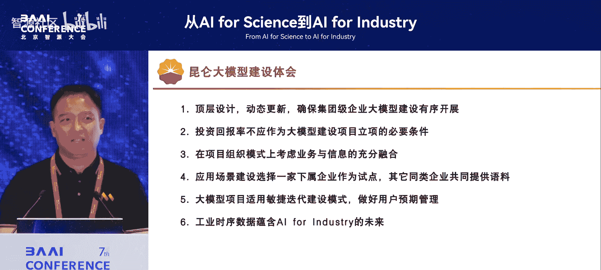

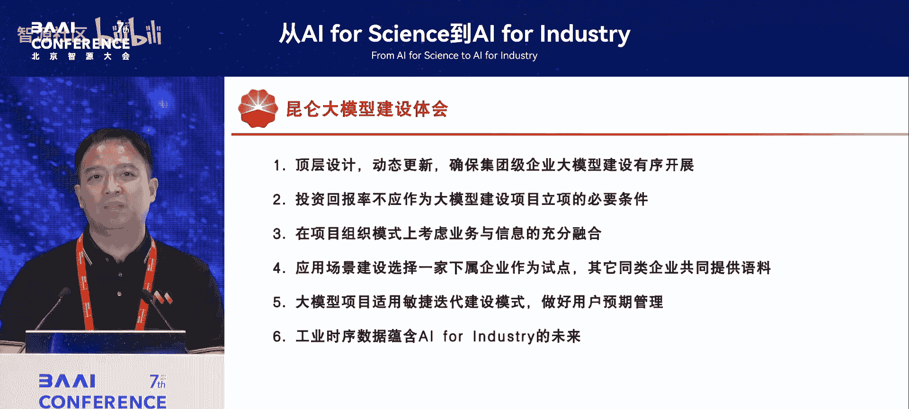

在管理服务领域，我们上线了一批数字员工，辅助人力提升效率。例如，数字招聘员工处理数万份简历筛选，将效率提升了55倍。

---

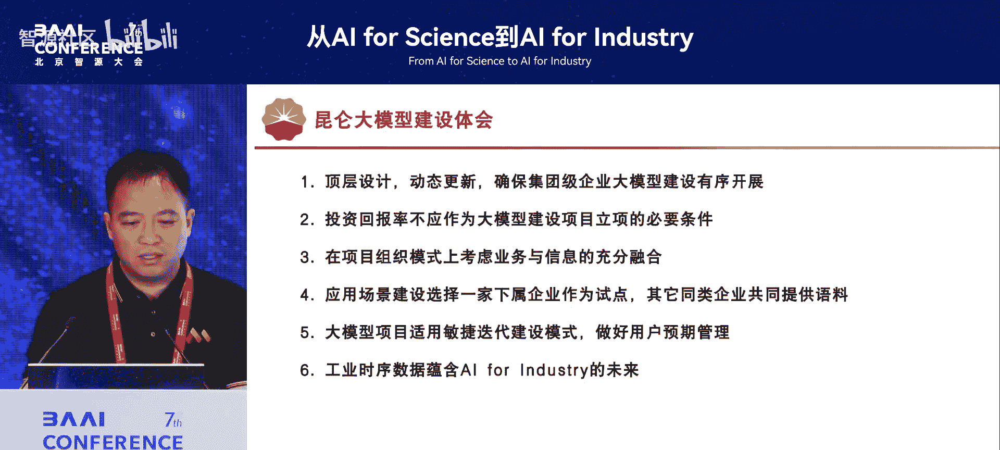

# 能源化工行业大模型建设实践：03：实践体会与总结

在上一节，我们详细探讨了昆仑大模型在五大核心任务上的具体建设成果。本节中，我们将分享从中石油一年多的建设实践中总结出的关键体会，并回顾本次课程的核心内容。

## 关键建设体会

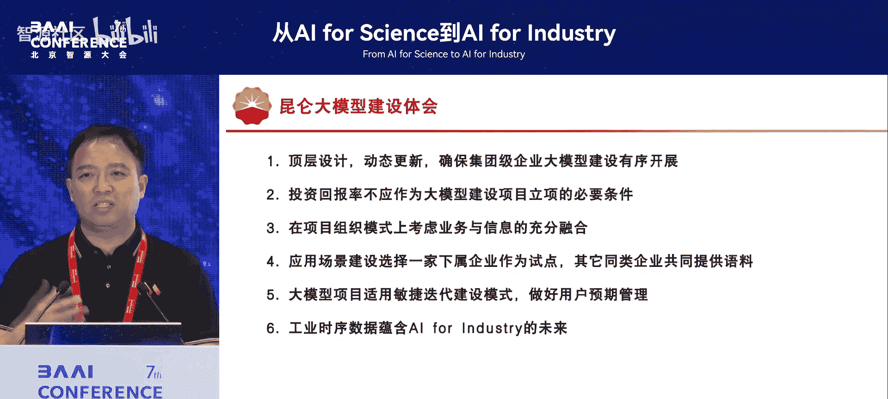

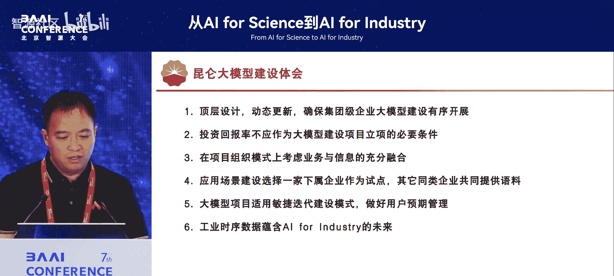

我参与大模型建设仅一年多，有以下几点体会供大家参考。

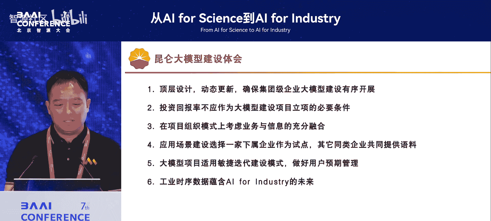

以下是在企业内推进大模型项目的六点关键体会：
1.  **强化动态更新的顶层设计**：技术不断发展，顶层设计需随之动态更新。例如，我们最初对科技计算大模型考虑较少，后发现其能带来巨大效益。保持最新的顶层设计，能确保集团内大模型建设有序开展。
2.  **不宜将投资回报率作为立项必要条件**：大模型项目很多是试探性、创新性的。若过分强调短期投资回报，会延长论证周期，限制大胆尝试和全面投入。看准方向后，应给予更多包容。
3.  **采用业务与信息融合的项目组织模式**：必须坚持业务驱动。我们为每个业务板块设立“专班”，由业务人员、AI算法专家、数据处理专家组成联合团队，确保应用场景被业务接受并具有生命力。
4.  **应用场景建设采用“试点引领，数据共享”模式**：对于多家同类企业都想做的场景（如20多家炼化企业都想做乙烷制乙烯优化），我们选择一家作为试点，其他企业共同提供数据。试点企业训练出的模型具备通用性，其他企业通过微调即可应用，避免了重复建设。
5.  **采用敏捷迭代的建设模式，管理好用户预期**：大模型项目不适合传统的瀑布式长周期开发。我们采用**每三个月迭代一次**的敏捷模式。关键在于管理用户预期：初期模型准确率可能仅60%左右，但经过多轮迭代（如四轮后）可提升至90%以上。若因初期效果不理想而放弃，便无法获得后续成果。
6.  **工业时序数据蕴含AI for Industry的未来**：工业界大部分数据是带时间戳的时序数据，这本身就是Transformer架构擅长处理的数据类型。这些数据蕴含着预测未来的信息。通过**强述分暴算法**等工具挖掘这些数据，应用领域将非常广泛，能带来倍增的效益和效率。因此，**工业时序数据是AI for Industry未来的重要方向**。

## 课程总结

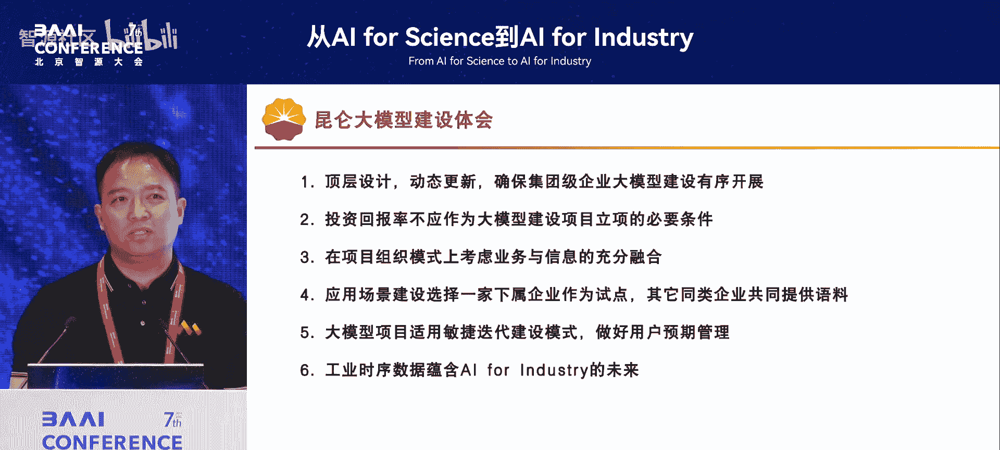

本节课中，我们一起学习了中石油“昆仑大模型”的建设实践。

我们首先从**顶层设计**入手，明确了建设行业大模型、创新应用场景、构建高质量数据集、建设AI中台和智算中心这**五大目标任务**，并规划了**四层模型架构**（基础、行业、专业、场景）和数百个应用场景。

接着，我们看到了具体的**建设成果**：训练了60个大小模型，构建了500TB以工业数据为主的数据集，建成了统一管理的AI中台和国产化算力中心，并在生产与管理领域落地了100个应用场景，显著提升了业务效率。

最后，我们分享了来自实践一线的**关键体会**，包括动态顶层设计、包容的投资心态、业务驱动的组织模式、试点共享的建设方法、敏捷迭代的开发流程，以及认识到**工业时序数据**的巨大潜力。

本次分享旨在提供一个传统能源企业在工业界实践大模型技术的案例，希望能为学术界和研究界在思考技术落地问题时提供参考。

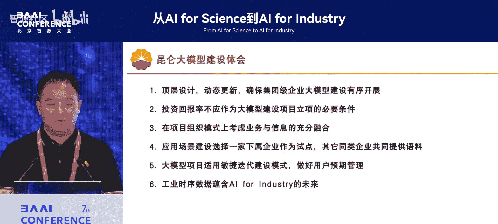

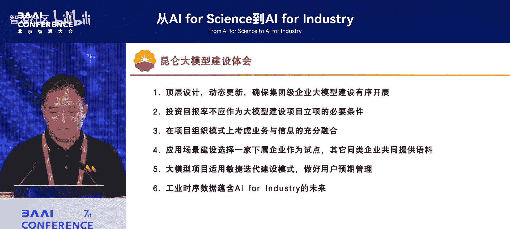

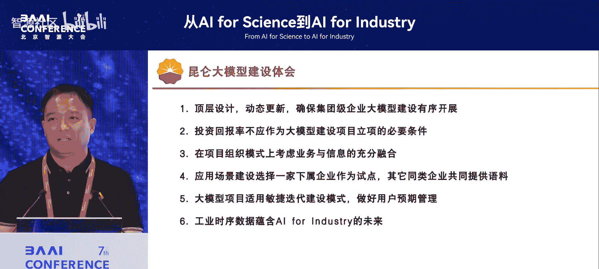

我的演讲到此结束，谢谢大家。