# 从AI-for-Science到AI-for-Industry-p07-人工智能赋能生命科学：曾泽贤

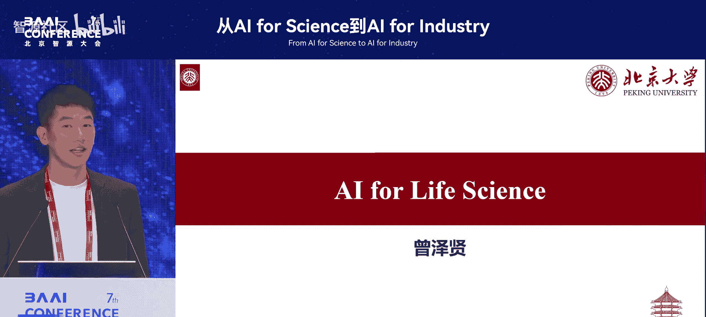

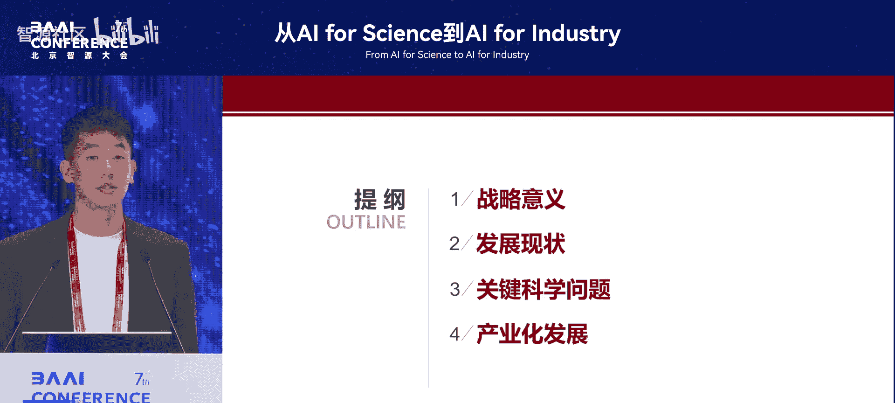

在本节课中，我们将学习人工智能在生命科学领域的应用现状、当前面临的核心挑战以及未来的发展方向。我们将从数据、模型和产业等多个维度进行探讨。

## 概述

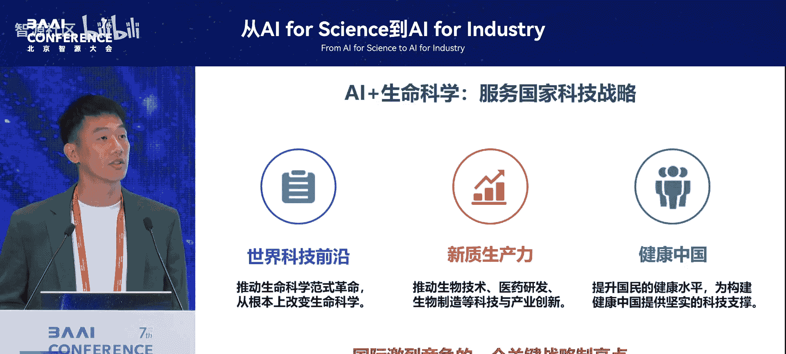

人工智能正在深刻改变生命科学的研究范式。从微观的分子结构预测到宏观的临床诊断，AI技术正被广泛应用于各个层面。然而，这一领域也面临着数据割裂、模型通用性不足等独特挑战。本节内容将系统梳理这些现状与问题。

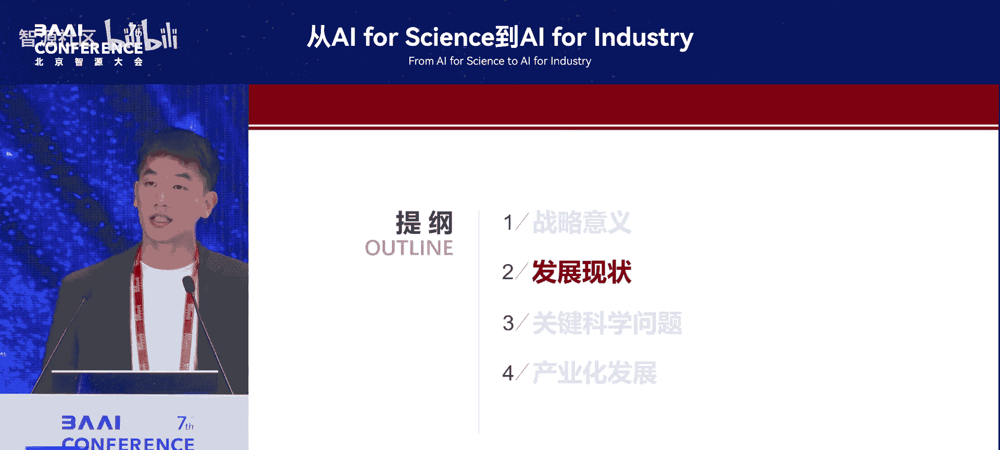

## 发展现状与意义

上一节我们介绍了AI for Science的宏观背景，本节中我们来看看其在生命科学领域的现状。AI for Science具有非常重要的意义，这一点在2024年诸多奖项的颁发中得到了体现。生命科学的研究范式正在数据驱动的浪潮下快速迭代，有人称之为“第五代工业革命”。AI赋能生物医疗产业的规模预测到2023年全球将达到1600亿美元，这是一个非常庞大的市场。

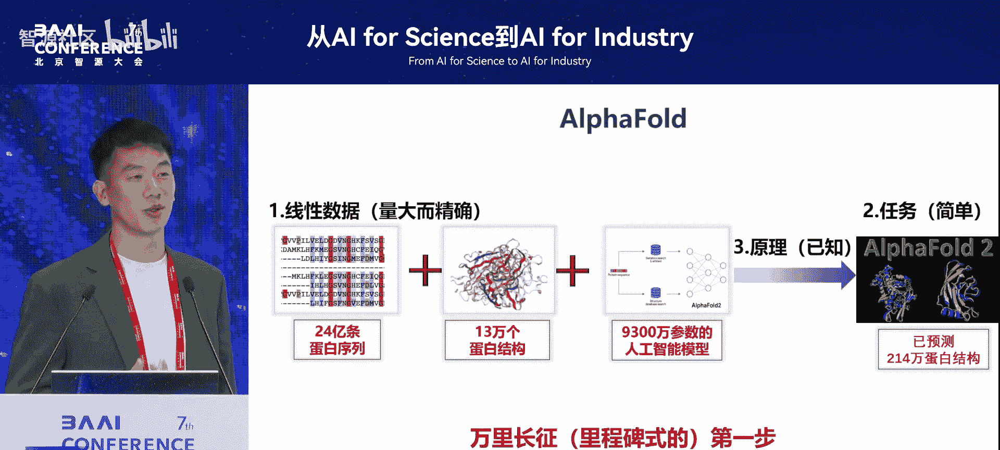

AI生命科学符合国家科技战略，作为新质生产力服务于“健康中国”目标，同时也是国际科技竞争的关键制高点。

## 成功案例：AlphaFold

谈到AI生命科学的成功，AlphaFold是一个无法绕开的里程碑。它因其在蛋白质结构预测上的突破性贡献获得了诺贝尔奖。从模型或生命科学的角度理解，AlphaFold的成功可以总结为几个关键因素。

以下是其成功的关键点：
*   **数据线性**：AlphaFold主要从蛋白质的氨基酸序列（一种线性数据）来预测其三维结构。
*   **任务相对简单**：其核心任务明确，即“从序列预测折叠后的蛋白质结构”。
*   **原理已知**：蛋白质折叠的基本物理化学原理是相对清楚的。

在拥有大量数据、原理已知且任务定义清晰的情况下，AlphaFold取得了巨大成功。当然，这仅仅是AI赋能生命科学“万里长征的第一步”。

## 生命科学的复杂性与数据割裂

随着AI发展和数据爆发，生命科学领域涌现了大量模型。然而，要利用数据和模型建立对生命的认知，必须首先理解生命本身的复杂性。

生命是一个从微观到宏观的多层次、多尺度复杂系统。从纳米级的分子到微米级的细胞，再到厘米级的器官乃至米级的人体，每个尺度的跨越可达十个数量级。每个层次都有其自身的逻辑结构，并且相互影响。

在数据获取方面，不同尺度（分子、细胞、器官、人体）的测量手段截然不同，且彼此割裂。例如，医生与分子生物学家看待生命科学的视角和工具完全不同；即便是同为分子生物学家，研究核酸和研究蛋白质结构的学者对数据的理解也大相径庭。整个领域目前处于测量手段快速发展但数据严重割裂的状态。

以下是几个具体层面的例子：
*   **分子与细胞层面**：遵循中心法则（DNA -> RNA -> 蛋白质）。一个约7微米的细胞核需要容纳约2米长的DNA，并精确调控其复制和表达。测量DNA、RNA和蛋白质的技术各自成熟，但领域间交流有限。
*   **器官层面**：与临床更相关，例如肿瘤诊断中的病理切片染色、空间转录组学等。
*   **人体层面**：主要是医院数据，例如电子病历和医学影像。电子病历数据价值高但隐私性强，“数据不出院”等现象导致大规模、高质量数据获取困难；医学影像分析虽发展多年，但同样面临数据孤岛问题。

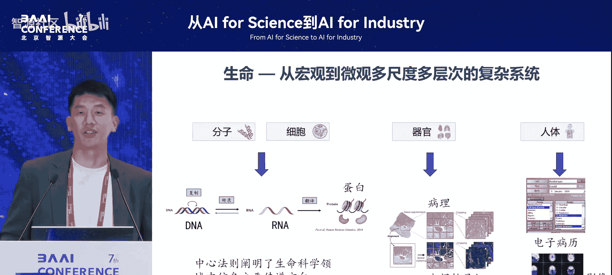

总而言之，尽管每日都产生海量数据，但这些数据并不流通，缺乏统一的体系，形成了严重的“数据孤岛”现象。

## 当前模型发展的碎片化

正是由于上述数据的割裂，导致了当前AI生命科学模型发展的碎片化。各个模态的数据都在催生各自的模型，但缺乏整合。

以下是不同数据模态对应的模型举例：
*   **DNA序列模型**：人体遗传物质DNA是ACGT的编码，序列长、数据量大，适合模型学习上下文信息，因此出现了专门的DNA大模型。
*   **RNA序列模型**：RNA同样是核酸数据，数据量庞大。例如，基于单细胞RNA测序数据构建的模型，可用于序列设计或表达量预测，催生了“单细胞大模型”等概念。
*   **蛋白质结构模型**：以AlphaFold为代表，专注于从序列预测结构。
*   **临床模型**：包括基于心脏跳动视频的影像分析模型、病理图像分析模型等。

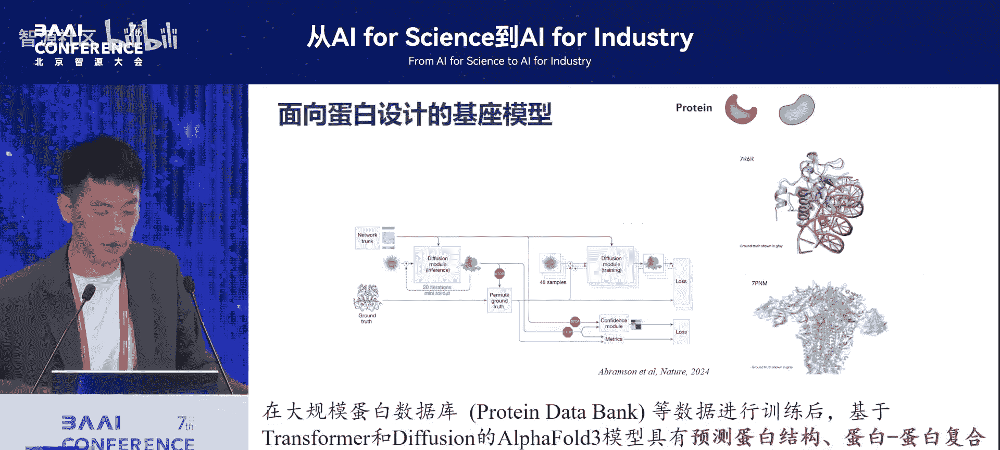

这些例子表明，各个模态的模型都在独立发展，呈现出局部化、碎片化的特点。数据的一致性问题、噪声和质量问题，是当前AI生命科学面临的主要挑战。这种割裂也造成了“高科技版的盲人摸象”，各领域研究者局限于自己的数据范畴。

## 核心挑战：数据生态与共享机制

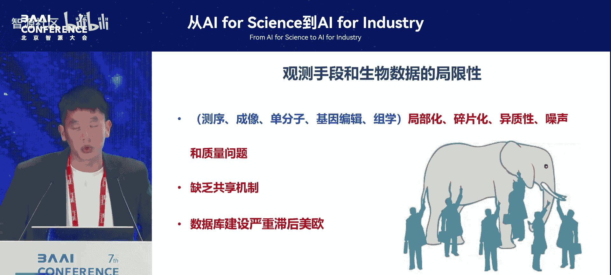

数据割裂的背后，是共享机制的缺失。我国在生命科学数据库建设方面，仍显著滞后于欧美。我们常常提及美国的TCGA、英国的UK Biobank等国际数据库，而国内缺乏类似规模的系统性资源。

生命科学领域缺乏的已不是一两套数据集，而是整个健康的数据生态系统。这个系统需要能够支持数据的标准化处理、安全流通与共享，从而形成可被广泛利用的资源库。

## 未来方向：整合与创新

面对挑战，未来的发展方向在于整合与创新。我们需要思考如何真正将这些多模态、多层次的生命科学数据整合起来，构建通用型解决方案。

以下是未来的关键任务与方向：
1.  **开发新方法**：生命数据（如高度折叠的DNA）并非简单的线性序列，其三维结构和功能复杂。因此，我们需要开发更适合生命科学的**嵌入方法**或模型架构，而非简单套用自然语言处理的`token`概念。
2.  **构建多模态大模型**：如何整合多模态、多层次数据，构建能理解生命连续特征和因果关系的统一大模型，是AI for Life Science的重要任务。
3.  **解决科学问题**：AI模型不应仅是“黑箱”，其最终目标是帮助我们发现普适的生命规律，服务于疾病治疗和新药研发，解决关键生物医学问题。

## 产业化发展的关键赛点

最后，从AI for Industry的角度看，产业化发展有几个关键赛点。

以下是产业化的核心要素：
*   **数据是核心赛道**：在生命科学这个高隐私、高壁垒、孤岛现象严重的领域，如何建立高标准、高质量且能统一利用的数据资源池，为模型训练提供燃料，将是未来的关键竞争点之一。整合公开数据并制定标准也是可行路径。
*   **培养交叉人才**：亟需既懂生命科学又懂AI的复合型人才。当前两个领域间存在知识壁垒，需要机构在招聘和培养上更具包容性，鼓励交叉学科发展。
*   **构建技术框架**：最终目标是构建一个以人工智能为底层框架，以生物数据资源为赋能基础，能够进行多模态整合的技术体系。通过寻找适合生命科学的嵌入方法，来布局面向未来的生命科学大设施与大模型。

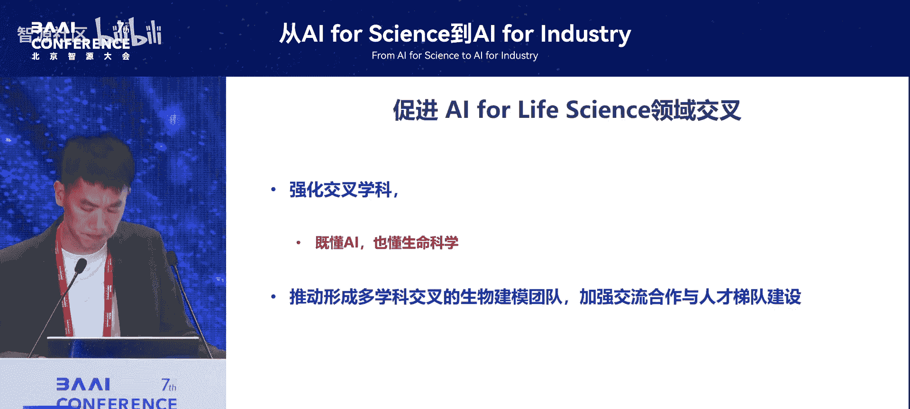

## 总结

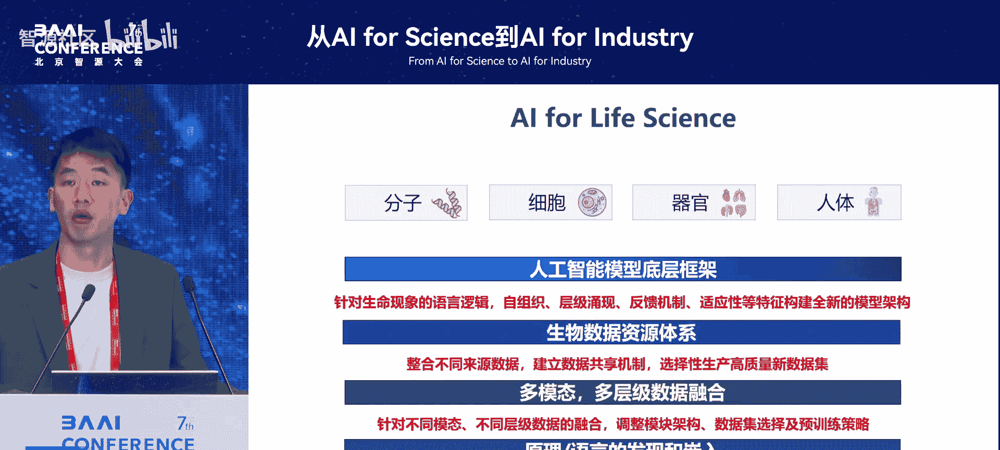

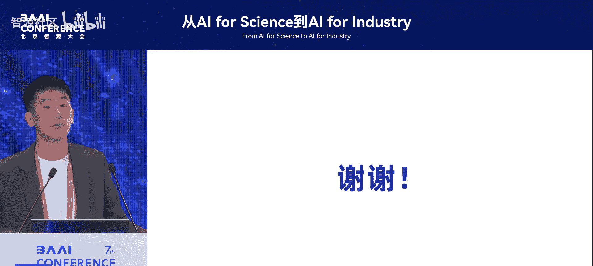

本节课中，我们一起学习了人工智能赋能生命科学的全景。我们回顾了以AlphaFold为代表的成功案例，深入剖析了生命本身的复杂性及其导致的数据割裂现状，这是当前领域发展的主要瓶颈。我们看到，从DNA、RNA、蛋白质到临床影像，模型发展呈现碎片化。未来的突破在于构建健康的数据共享生态、开发适应生命特性的新AI方法，并最终整合多模态数据构建统一的理解框架。同时，数据和交叉学科人才将是推动产业落地的关键。