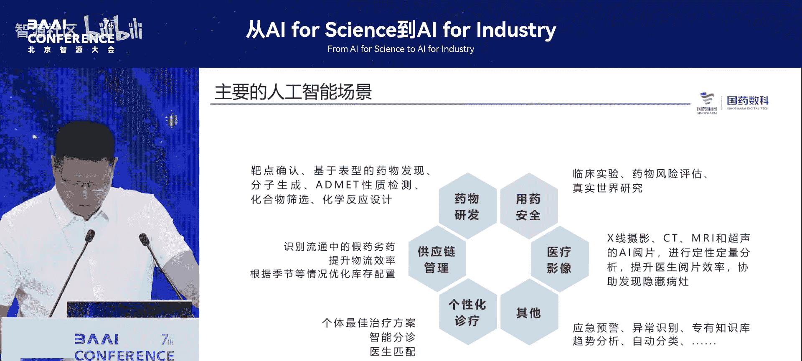
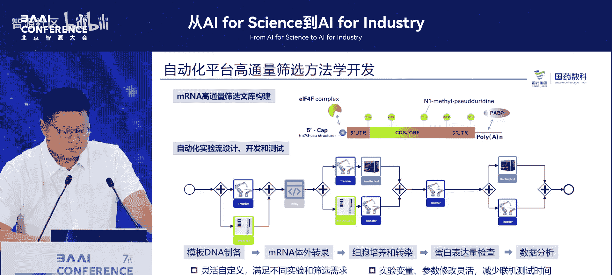
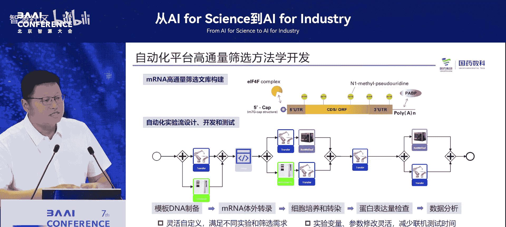
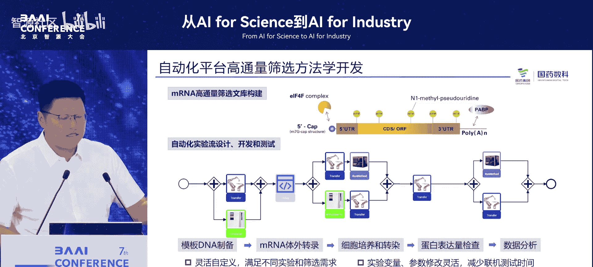
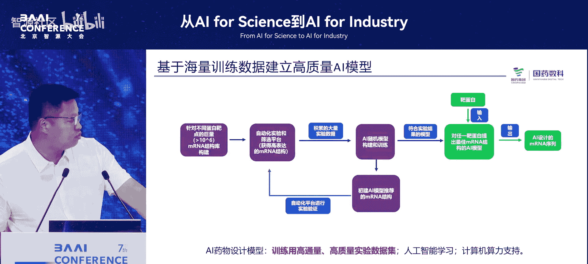
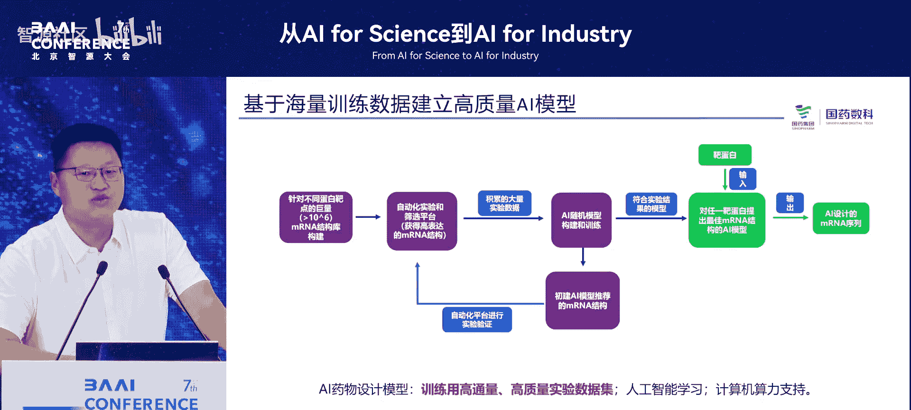
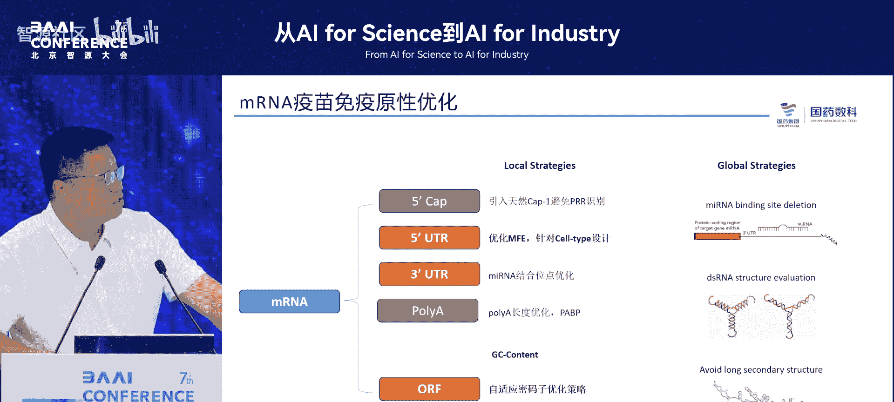
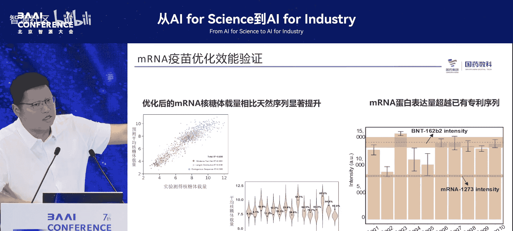

# 从AI-for-Science到AI-for-Industry-p08-基于AI的mRNA疫苗研发实践：罗-皓

在本节课中，我们将学习中国医药集团如何将人工智能技术应用于实际的医药研发与业务场景，特别是聚焦于mRNA疫苗研发的实践案例。我们将了解其战略布局、技术选型、核心挑战以及具体的落地经验。

---

## 概述

人工智能技术正深刻改变着各行各业，医药领域也不例外。作为一家高度市场化的中央企业，中国医药集团在响应国家政策号召的同时，积极探索AI在提升研发效率、保障用药安全等核心业务中的价值。本教程将系统性地介绍国药集团在AI赋能医药行业，尤其是在mRNA疫苗研发这一高价值场景中的具体实践、技术路径与心得体会。

---

## 国家政策与企业战略背景

上一节我们概述了AI在医药行业的潜力，本节中我们来看看推动这一变革的外部与内部动力。

国家层面高度重视人工智能发展。例如，2024年4月3日，工信部联合七部委发布了相关文件。国资委在2024年2月启动的“人工智能+”专项行动中，也将中国医药集团列为首批10家中央企业人工智能战略性高价值场景库成员单位之一。

这些政策导向带来了机遇，也带来了压力。作为一家高度商业化的企业，国药集团在投入任何新技术时，都必须审慎考虑投资回报。因此，其AI战略的核心是：**在控制成本的前提下，寻找能够快速落地并产生实际效益的应用场景**。

---

## AI赋能的核心价值：以用药合理性审查为例

在探讨具体的mRNA疫苗研发之前，我们先通过一个基础业务场景来理解AI带来的效率提升。

用药合理性审查是医疗机构的普遍需求。传统方式依赖人工总结规则，存在稳定性差、难以适应政策快速变化的问题。例如，国家医保政策实行“属地化管理”，且每年可能调整，导致药品报销适应症和分期限制复杂多变。

人工智能的引入，使得我们可以用相对较少的人力，构建能够快速适应规则变化的智能审查系统。其核心逻辑是：
1.  **构建知识库**：使用AI模型从药品说明书、医保政策文件等非结构化文本中，缓慢但精确地提取和构建复杂的用药规则知识库。
2.  **快速审查处方**：当海量处方需要实时审核时，使用另一个优化过的AI模型进行快速推理和判断。

这种“慢思考”构建知识 + “快思考”执行判断的模式，是AI在复杂业务中落地的典型思路。

---

## mRNA疫苗研发：AI解决的核心问题

上一节我们看到了AI在业务流程优化中的作用，本节中我们来看看它在尖端药物研发——mRNA疫苗领域面临的更复杂挑战。

mRNA疫苗设计是一个多目标优化难题，需要在海量的可能序列中，寻找满足多重苛刻条件的“最优解”。主要挑战包括：
*   **高表达**：疫苗需要在体内高效表达目标抗原。
*   **低免疫原性**：不能过度刺激人体免疫系统，以避免严重副作用。
*   **稳定性与半衰期**：结构需要稳定，且在体内的半衰期要长。
*   **易于生产**：序列设计需考虑工业化生产的可行性。

这些要求相互制约，使得可能的序列组合是一个天文数字（例如，4的N次方）。**核心问题在于：如何从如此海量的结构空间中，高效筛选出符合所有要求的候选序列？**



---

## 国药集团的AI研发体系与策略





针对上述挑战，国药集团构建了一套务实且高效的AI研发与应用体系。





### 整体战略布局

集团总部负责基础能力建设，其策略是：
*   **不自研基础大模型**：由于成本极高，选择引入和集成市场上成熟的基础模型。
*   **统一建设“模型积木库”**：根据不同的任务类型（如慢思考、快思考、视觉识别、语音处理），精选和部署多种专用模型，形成统一的能力平台。
*   **鼓励下属企业寻找场景**：集团160多家子公司负责寻找具体业务场景，并利用总部提供的“模型积木”搭建解决方案。
*   **集团直接攻坚高价值场景**：对于像mRNA疫苗研发这样的战略性项目，集团会直接下场，与科学家深度合作，推动示范应用。



### mRNA疫苗研发的技术闭环





mRNA疫苗的AI研发遵循一个“数据驱动实验”的闭环：

**核心流程公式**：
```
[ 高通量实验 ] -> [ 产生数据 ] -> [ 训练AI模型 ] -> [ 模型预测候选序列 ] -> [ 减少实验量，提升研发效率 ]
```

1.  **数据生成**：通过高通量实验平台（如384通道设备）快速进行大量生物实验，批量产生训练数据。
2.  **模型训练**：利用实验数据训练AI模型，使其学习序列与功能（如表达量、稳定性、免疫原性）之间的复杂映射关系。
3.  **序列优化与筛选**：利用训练好的模型，对海量虚拟序列进行预测和筛选，快速锁定少数潜力最大的候选序列，再交由实验验证。
4.  **效果**：该实践已取得积极成果，设计出的mRNA结构在关键指标上优于已有专利结构，显著加速了研发进程。

### 关键挑战：数据质量

在实践初期，团队曾尝试购买外部数据，但发现数据质量差，导致训练的模型无法工作（`not work`）。最终解决方案是**投入重金自建高通量实验平台**，以获取高质量、可控的一手数据。这印证了AI在科学领域的应用基石是**高质量、针对性的数据**。

---

## 实践经验与心得体会

通过上百个场景的实践，国药集团总结出以下关键经验：

### 1. 寻找场景的双重标准
寻找AI落地场景时，需平衡两个标准：
*   **高价值**：应用范围广、单价高、能解决核心痛点。
*   **易落地**：能够快速实施并产生经济效益，以支撑AI投入的可持续性。

以下是场景筛选的考量维度列表：
*   业务价值与付费意愿
*   技术实现的复杂度与周期
*   数据可获得性与质量
*   与现有业务流程的融合度

### 2. 人工智能是系统工程，而非单纯技术问题
AI落地本质是**工程化问题**。以处方审核OCR场景为例：
*   **技术挑战**：需要识别各省市不同医院、格式各异的处方及各类证明材料，泛化能力要求高，导致单张图片识别耗时长达10-20秒。
*   **工程化解决方案**：通过优化业务流程（如让患者首次购药时建档，后续仅审核变动部分），将识别压力分散，使单次审核时间缩短至10秒内，实现了技术与业务的可行嫁接。

### 3. 复合型人才是关键瓶颈
尖端应用（如AI制药）面临严重的人才挑战：**懂AI的不懂药，懂药的不懂AI**。推动两类专家相互学习、有效协作，是项目成功的重要保障。

---

## 总结

本节课中我们一起学习了中国医药集团将人工智能应用于医药行业的实践路径。我们从国家政策与商业回报的平衡谈起，了解了AI在用药审查等业务中提升效率的价值。随后，我们深入探讨了在mRNA疫苗研发这一高难度场景中，如何通过构建“数据-模型”闭环来加速创新。最后，我们总结了以“易落地”和“高价值”为导向寻找场景、以工程化思维解决落地难题、以及培养复合型人才这三条宝贵经验。

正如比尔·盖茨所言，对于AI技术，我们既不应高估其短期能力，也不应低估其长期潜力。在医药行业，AI正从一个辅助工具，逐渐演变为驱动研发革新的核心引擎之一。