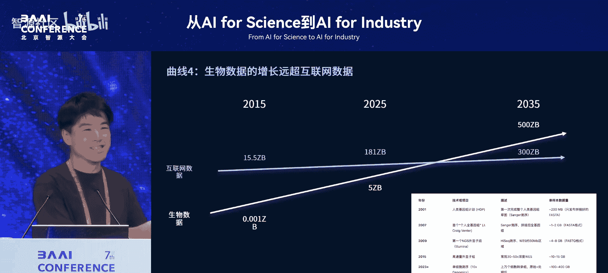
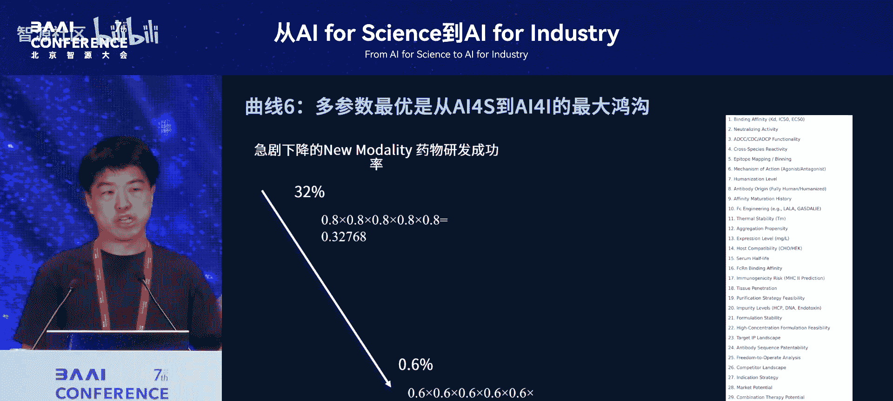
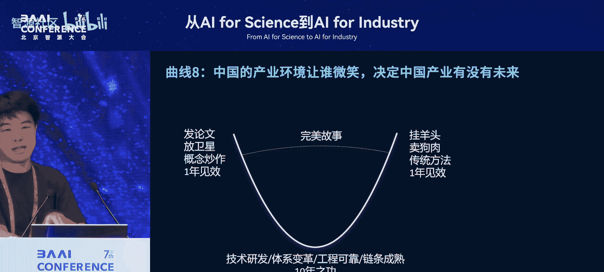
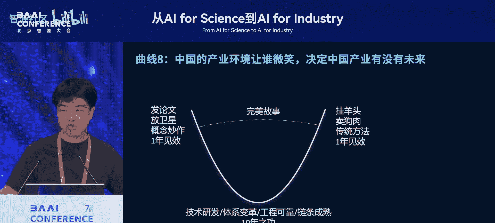
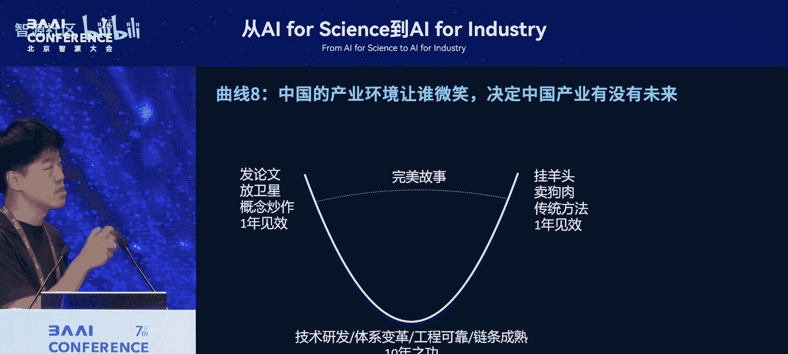
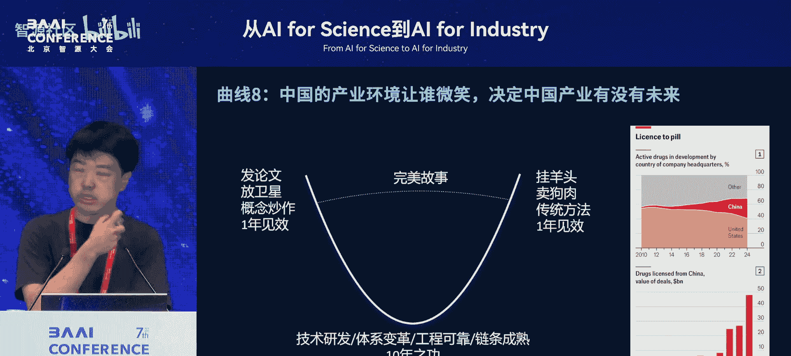

# 从AI-for-Science到AI-for-Industry-p09-生命科学AI落地的几条规律曲线：刘-维

在本节课中，我们将学习百图生科联合创始人兼首席执行官刘维先生分享的关于生命科学领域人工智能应用落地的核心见解与规律。课程将探讨从基础研究到产业实践的关键挑战、机遇与发展曲线。

## 课程：1：我们是谁？一条业务发展曲线

首先，我们通过一条业务发展曲线来介绍百图生科。

百图生科成立于2020年。在此之前，作为风险投资人，我们与百度创始人李彦宏先生共同投资了约11亿美元，覆盖了2016年至2020年间国内外大部分领先的第一代AI创新药物研发公司。

然而在2020年，我们决定亲自创立一家公司。核心动机是受到OpenAI GPT-3的启发，我们希望在生命科学领域构建一个**基础大模型**。

生命科学基础大模型的构建成本极高，涉及算力、数据和复杂的高通量实验体系。我们意识到，之前投资的单点技术创新公司可能难以承担如此巨大的投入。

因此，我们与李彦宏先生共同投入数千万美元天使投资，决心打造全球首个使用生物语言数据（如生物序列数据）训练的大规模基础大模型。

经过几年发展，我们取得了一些成绩：2022年推出了首个千亿参数的基础大模型，去年升级到2100亿参数、跨模态建模（涵盖DNA、RNA、蛋白、蛋白质相互作用、细胞等）的生物基础大模型。

基于这个基础大模型，我们构建了数十个专业大模型，例如脑科学大模型、海洋生物大模型、抗体药物大模型等，形成了一个基础与专业模型结合的家族。

值得一提的是，在美国国家安全委员会最近发布的《国家安全与生物技术》报告执行摘要中，百图生科被作为重点案例提及。报告认为，在利用AI与生命科学交叉技术方面，这类公司正在取得世界领先的领跑者作用。当然，这也给我们带来了新的挑战，即如何在全球市场受影响的背景下，在国内市场重新找到产品与市场的契合点。

## 课程：2：为何需要基础大模型？新药发现的范式升级

上一节我们介绍了公司的定位，本节中我们来看看为何要投入构建生命科学基础大模型。

在智源大会的语境下，大家对大模型的优势已有了解：它利用海量、弱关联的无监督数据，在缺乏精准标注的领域，展现出强大的泛化与生成式预测能力。

现在，让我们回到药物研发领域。通常，药物研发的核心在于新药发现。左上角代表的是“新药”，它可能针对新靶点或新管线，价值很高，但其形态可能仍是传统的（例如单克隆抗体），通过小鼠或噬菌体展示等平台筛选出来。

以下是传统筛选与AI辅助发现的对比：

*   **传统实验筛选**：搜索空间巨大（例如，抗体互补决定区20个氨基酸的变化，有 `20^20` 种可能）。依赖高通量实验，成本极高。这种方法学仍在不断进化，但本质是“穷举”逻辑。
*   **第一代AI（第二代发现系统）**：可以建模搜索空间，无需遍历每个点，可能只需要30%-50%的数据点就能有效建模并进行适当泛化。

然而，当今全球药物研发真正追求的高价值目标，是下图所示的“新方法学药物”。

例如，我们正在研发的一种可编程免疫调控“机器人”。它可能包含多个传感器、控制器（如数字电路中的“与门”、“或门”），其作用机制可能完全不同于自然界已有的抗体构型。简言之，它可能在约1000个氨基酸的范围内变化，其状态空间达到 `20^1000` 次方。

在如此巨大的空间内，目标点可能远离任何已知的实验数据。此时，无论是靠实验盲筛，还是传统AI模型，其预测成功率都急剧下降至接近零。在工业界真正关心的前沿问题上，上一代AI技术显得力不从心。

我们发现，一些AI药物研发公司存在两种现象：一种是讲述AI故事、发表AI论文，但实际仍用传统方法筛药；另一种是诚实地构建了AI方法并投入资源，确实筛出了药物，但行业不买单。因为行业认为，这些AI模型学习的仍是已有的实验数据，做出的药物与传统方法并无本质区别。

在极致追求创新的生命科学领域，效率提升并非首要目标。真正的价值在于能否做出 **First-in-class** 或 **Only-in-class** 的药物。从AI for Science（发论文）到AI for Industry（做成药），存在巨大的鸿沟。

## 课程：3：基础大模型的效能提升与虚拟进化树

上一节我们探讨了传统AI的局限，本节中我们来看看基础大模型带来的根本性改变。

我们的生物语言基础大模型，参数规模从千亿到两千亿，并向万亿迈进。随着生物数据的快速增长，其性能（Scaling Law）提升非常显著。

基础大模型最大的意义在于：通过对整个自然进化树、跨物种的同源约束规律进行学习，它内建（inbuilt）了对蛋白质、DNA或细胞序列空间的深刻理解。当将其投射到某个特定领域的数据问题时，能够大幅减少该领域所需的数据消耗量。

例如，可能将数据需求从某个任务的30%降低到5%。这种降幅在生命科学的前沿任务中至关重要，因为那里的每一条数据都来自昂贵的高通量实验。

前沿药物研发领域的数据获取尤其困难。例如，开发一种新形态抗体可能需要改造实验动物模型（如羊驼），产生的初始数据往往高度聚集（clustered），局限于该模型的遗传背景，难以对状态空间的其他区域做出预测。

基础大模型解决的正是这个问题。它学习的是全局最优，而非局部聚集的数据。我们认为，生命科学基础大模型的终极目标是构建 **“虚拟进化树”**——即推演进化史的过去与未来，模拟在地球重启百万次的不同压力下，生命可能进化出的各种形态。这才是底层生物语言大模型所揭示的规律。

## 课程：4：生物数据的海量增长是基石

构建基础大模型的可行性，除了算力投入，更根本的来源是生物数据的海量增长。

我用一张图来说明趋势（不同口径数据仅供参考）：2015年，互联网数据量约15 ZB，而生物数据仅约0.001 ZB。到2025年，这个对比可能变为互联网181 ZB，生物数据5 ZB。

我们自身的工作也受益于此。通过聚合公开数据、半公开数据合作，以及从论文和原始数据集中抓取信息，我们整合了数百PB级别的数据。训练上一版基础大模型使用的数据条数已达1.8万亿条。

行业数据增长得益于各种组学技术（基因组学、转录组学等）颗粒度变细（如单细胞测序）、空间信息增强、测序成本下降。数据来源从科研（全球每年约500个研究）扩展到临床和应用（全球每天可能有数千人进行测定）。

我们乐观预测，最迟到2035年，生物数据总量将超过互联网数据。互联网数据也在增长，但生物数据的增速得益于底层技术发展，要快得多。

这也是我们创立公司的初衷之一。作为投资人时，我们就重点投资下一代生物技术、生物数据和生物传感器。需要呼吁的是，微尺度的生物传感器等技术，很可能成为美国下一步对华限制的重点。没有这些底层技术，基础大模型无从谈起。

此处有一个观点可能与之前讲者不同：基础大模型的本质意义恰恰在于能够利用那些存在批次效应（batch effect）或标注不完美的数据。生物多样性导致许多测定本身带有误差，完全消除批次效应或进行精细标注是不可能的。基础大模型的世界观与生物信息学的传统世界观在此有所不同。

## 课程：5：闭环验证效率是巨大阻碍

前面几位谈到生物领域时都提及了这一点，我在此再强调一下：**闭环验证的效率仍是巨大的阻碍**。

在AI for Science的范畴，很容易实现快速迭代（SOTA），因为可以基于特定数据集无限次训练模型。

但在AI for Industry，例如创新药物设计领域，情况截然不同。即使是相对成熟的蛋白质表达环节，其周期在过去20年不断缩短，目前通过自动化可能仍需十几天，利用无细胞体系可能缩短到几天。假设周期为4天，那么每年最多只能迭代90次。

虽然可以通过96孔板、384孔板提高并行率，但绝对时间仍然很长。在众多生物问题上进一步优化这个绝对时间，并非单靠AI公司能解决。它需要整个生命科学行业围绕AI，特别是生成式AI的世界观进行投入和发展。

以CRISPR技术为例，过去20年其优化方向主要是“建库”和“库筛”，通过一轮实验获得高通量，用生物竞争法筛选出少数获胜者。这是一种“所见即所得”的模式。

而从生成式AI的角度，我们是在状态空间中进行扩散（diffusion）和探索，通过几轮分布广泛的“探针”实验，再逐步收敛。这就要求我们能够快速、准确、低批次效应地将预测的序列（蛋白或DNA）“打印”和制备出来。

这对生物技术提出了巨大挑战，涉及生物创新、自动控制、专用传感器和末端计算。这将是未来20年的重大机遇，正如自动驾驶依赖激光雷达，手机发展依赖多种传感器。

此外，还有一个现实问题：资金从何而来？如果不能结合高价值的前沿管线研发项目，找不到愿意为此付费的大药厂或大型投资机构（因为一个成功管线可能价值百亿，他们才愿意前期投入上亿），这个循环就无法建立。

这对中国产业界也是一个挑战：到底有没有容错机制和投入机制来真正支持前沿创新药？如果没有应用场景、数据、专家和需求，这个领域很难发展起来。

## 课程：6：多参数最优是核心挑战

我们之前讨论的多是抽象的AI单参数预测问题。但从AI for Science到AI for Industry，一个更大的鸿沟在于 **多参数协同优化**。

下图展示了一个趋势：前沿新形态药物（New Modality）的研发成功率在过去几年急剧下降。

原因在于它们远离了传统的生物筛选空间。在传统筛选中，筛选出的分子天然满足多个参数（如稳定性、可表达性）。而在前沿设计中，每个参数都需要单独考虑和优化。

即使每个参数的预测准确率从80%下降到60%，但需要优化的参数数量却极大增加。这里有一个抽象例子：5个独立参数，每个成功率0.8，整体成功率是 `0.8^5 ≈ 0.327`；10个参数，每个成功率0.6，整体成功率是 `0.6^10 ≈ 0.006`。多参数导致整体成功率呈指数级下降。

传统药物研发是“串行”模式，像铁路警察各管一段，分别解决亲和力、稳定性、免疫原性等问题。但在前沿创新药领域，这种方法几乎不可能成功，必须转向 **“串改并”** 模式，即并行考虑和优化所有关键参数。

让60位科学家同时开会协调是不现实的，而这正是AI模型，尤其是基础大模型的巨大机会。在新兴领域，要一次性构建几十个参数的预测模型，数据永远是不够的。基础大模型可以显著降低对每个独立参数模型的数据需求量。

## 课程：7：终局已明，但长路漫漫

从2015年投资第一代AI制药公司至今，我个人认为终局已经清晰。2024年是一个拐点之年。

2024年发生了几件标志性事件：诺贝尔奖颁发给AI预测蛋白结构的学者；FDA积极推动用AI模型替代部分动物实验；国际巨头赛诺菲与我们签订了超10亿美元的纯AI模型订单；过去一年中，辉瑞、礼来、阿斯利康、默沙东、诺华等大药企都任命了首席AI官，开始激进地拥抱AI。

原因在于，2015-2020年的第一代AI Biotech公司曾带来高预期，但随后跌落，因为其做出的分子与传统方法无异。而2023-2025年，包括我们在内的一些同行，确实在解决难题上取得了突破，例如针对不可成药靶点生成全新抗体，或将抗体亲和力从纳摩尔级提升至皮摩尔级。

行业因此重拾信心。但这个过程依然艰难，可能还需要10年“苦日子”（美国市场，中国可能更长）。现在，大药企开始动用核心研发预算投入AI，而不仅仅是创新或IT预算。

我们对终局的看法是：**AI模型最终将替代实验模型**。今天全球大药企每年在早期研发阶段的实验模型（动物实验、科学家、细胞系、CRO）上投入约3000亿美元。即使替代10%，也是一个300亿美元的巨大市场，这还不包括临床、生物制造和技术科研。

但这里还有一条曲线：需要等待由强AI驱动的真正第一代药物进入二期临床，才会引发更多跟随者；进入三期临床，整个行业才会大规模采用。这个过程仍然很长。

## 课程：8：中国的产业环境与未来

这是最后一页，也是一个比较尖锐的话题：中国的产业环境让谁微笑，决定了中国产业有没有未来。

这个行业始终存在两种力量：一种是发论文、放卫星、做概念炒作，一年就能见效；另一种是“挂羊头卖狗肉”，用传统CRO方法做药，贴上AI标签，一年也能见效。

目前令人担忧的是，在万众创业的环境下，这两者可能结合起来，形成一个“完美的故事”：既快速推进药物临床、产生收入，又拥有AI概念。但这并非真实的有机结合。

认真做这件事，需要技术研发体系的变革，需要工程化的可靠性，需要打通上下游链条（数据、实验）。这没有十年之功难以实现。这是一场长跑。在创新药研发领域，AI当前的作用并非将十年缩短，而是将原本百年都做不出来的东西，用十年或二十年做出来。这对人类的意义最大。

那么，中国的产业环境究竟是支持“完美故事”，还是支持“十年磨一剑”？这将决定我们这个产业的未来。

最后，我想传递一个积极信号：尽管国际形势复杂，但从去年以来，中国First-in-class或Fast-follow类创新药的海外授权（License-out）交易额正在快速增长，经常出现超10亿甚至百亿美金总金额的交易。这在中国几乎所有科技行业的出口中是唯一逆势增长的。

因为这些交易购买的是“真东西”。我们相信，假以时日，这将带动产业链中扎实做事的企业向上发展。同时，我们也相信，中国的产业环境、投资者、像国药集团这样的中央企业，一定会支持那些以“两弹一星”的精神、系统工程的思维，十年磨一剑，做出全球领先的不仅是技术大模型和生物技术，更是真正创新药物的中国公司。

希望我们一起做难而正确的事。

---

**本节课中我们一起学习了**生命科学AI落地的多条“规律曲线”，包括：1）基础大模型在生命科学领域的必要性与领跑作用；2）从传统筛选到AI生成式设计的范式升级挑战；3）基础大模型通过虚拟进化树降低数据依赖的核心价值；4）生物数据海量增长是基础；5）湿实验闭环验证的效率瓶颈；6）多参数并行优化是前沿药物研发的核心挑战；7）AI制药行业终局明确但道路漫长；8）中国产业环境需要支持长期主义与真实创新。这些见解勾勒出AI从服务科研到驱动产业变革的关键路径与挑战。