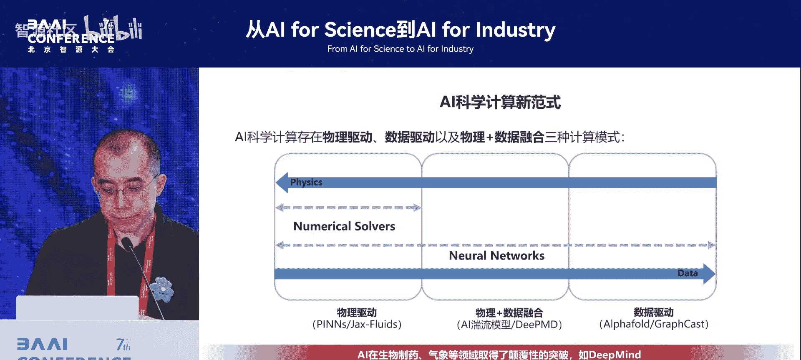
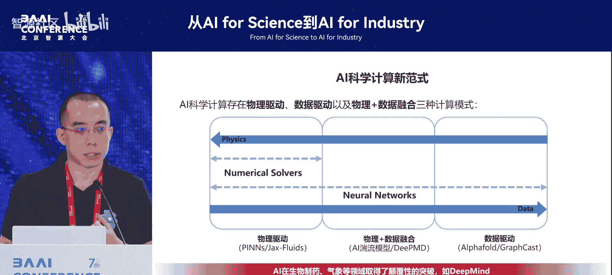
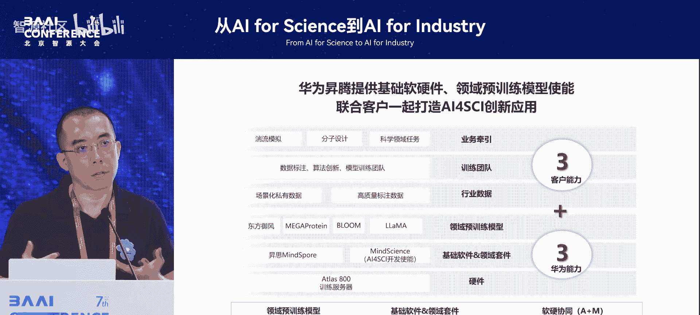
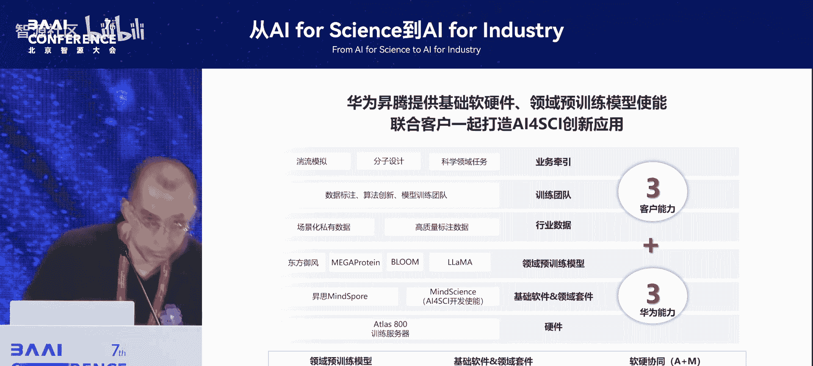

# 从AI-for-Science到AI-for-Industry-p10-大模型时代下的AI科学计算业界趋势及MindSpore实践：于璠

在本节课中，我们将学习大模型时代下AI科学计算（AI for Science）的业界发展趋势，并了解华为MindSpore框架在此领域的实践与探索。我们将从大模型带来的范式变革出发，梳理科学计算的不同路径，并介绍华为与各行业在生物、化学、流体、气象等领域的联合创新案例。

## 1：开场与背景介绍

感谢冯老师的邀请。各位领导、专家，大家下午好。

我准备了80页PPT，意识到可能超时，我将尽力完成这个任务。我来自华为2012实验室。华为作为基础设施提供商，旨在支撑科研与产业应用。我后续的分享将从基础设施的角度出发，探讨如何支撑各行各业的科研与产业落地。很多科研与产业领域我并非专家，若有不当之处，敬请指正。

我今天分享的主题是将大模型与AI for Science相结合。首先，作为企业代表，请允许我简要介绍华为的相关工作。华为于2018年发布了AI计算框架MindSpore。我负责的团队主要工作在框架层。此前，中石油和移动的领导分享了应用案例。从架构上看，除了底层内核，我们的主要工作是支撑大模型和AI for Science两大核心能力。这是一个全栈国产、完全自研的平台，几乎每一行代码都由我们自主编写，知识产权自主可控。

## 2：大模型发展的新趋势

上一节我们介绍了分享背景，本节中我们来看看大模型领域的新趋势。

自DeepSeek模型发布以来，行业趋势发生了变化。技术发展从单纯追求“技术摸高”，转变为“技术摸高”与“工程创新”并行。同时，模型开发从以预训练为主，走向了预训练、后训练与推理优化三轮并行的状态。

以下是关于DeepSeek模型的一些关键观察：
*   DeepSeek发布了V3和R1两个模型，目前广泛应用的是R1，其效果与当时的顶尖模型相当。
*   其最重要的贡献之一是开源了大规模强化学习方案，并展示了完整的演进范式。
*   其早期版本在图形推理上稍弱，但最新发布的模型已在此方面显著增强。

以下是DeepSeek强化学习方案的意义：
*   它开启了一种无需人工标注数据的无监督强化学习新范式。
*   它提供了一个从基础模型训练到业界顶尖水平的完整样板和实现路径。
*   其能力可以蒸馏到其他企业已部署的模型上，实现能力提升。

## 3：大模型与科学计算的结合案例

上一节我们讨论了大模型的新范式，本节中我们来看看大模型与科学计算结合的具体案例。

与科学计算相关的应用案例非常多。我在此列举几个例子。

以下是两个结合案例：
*   **DeepSeek用于流体计算与风力发电选址**：除了大模型本身的能力，结合一些科学计算知识即可实现。我已附上链接供大家查阅。
*   **语言模型与气象领域结合**：例如，使用自然语言进行气象信息交互与对话。

在生物医药领域，例如清华大学的团队结合DeepSeek后，各项指标均有提升，模型困惑度也有所降低。此外，在疾病诊断、风险预测和知识库挖掘等方面，大模型也展现出更强能力。

更有趣的是右边这两个案例：
*   **中科院物理所“天目杯”物理竞赛**：使用DeepSeek R1、GPT-4等模型答题。DeepSeek R1取得了100分的成绩，相当于所有选手中的第四名。题目涉及热力学、量子力学，包含证明与计算。
*   **数独求解**：虽然不是DeepSeek代码的直接应用，但借鉴了其强化学习算法思想来解决数独问题，效果和扩展性都很好。

各行各业现已开始应用这些技术。最后，我们的MindSpore框架结合昇腾硬件，已支持大模型的训练、推理和强化学习全流程，可以开箱即用。

在大模型训练能力方面，我们在全栈国产软硬件上，相比业界最强方案可能有20%以上的性能收益。在国产化大模型知识领域，我们可能占据了约40%的份额。

## 4：AI科学计算的范式分类

现在回到我们今天的正题。我请教了许多老师和行业专家，将科学计算分为三大部分。前两部分非常重要，但从基础设施的视角看，目前仍比较零散。我希望能推动其系统化发展。因此，我后续将重点讲述如何将AI与传统的科学计算相结合，特别是在生物和流体等领域。

我们从计算角度对范式进行了分类。最左边是**物理驱动**，最右边是**数据驱动**，分类主要依据所使用的数据量。

以下是两种范式的说明：
*   **物理驱动（如PINNs）**：基本不使用实验数据，旨在求解方程（如偏微分方程）。传统方法如有限元、有限体积法或求解析解。AI在此的角色是找到一个近似的解析解，后续用于快速推理。
*   **数据驱动**：此类成果丰硕，广泛应用于生物、气象等领域。

在AI for Science领域，我已有约五、六年的实践经验。期间产生了许多新技术，例如大模型。像OpenAI的路径是从数据驱动向物理AI演进，试图将物理规律融入生成式模型，使生成结果更符合物理规律，尽管目前能力尚有不足。

从基础设施提供者的角度，我的职责是梳理和支持所有可能的技术路径。我需要梳理范式变化、模型类型，并支持长序列训练等软件需求，将底层能力准备好。

我们同时与科技部等部委联动，梳理业界生态。今年我们在中关村发布了第二期AI for Science技术生态地图，相比第一期更加细化，深入到了更多行业。可以看到，生物化学领域仍然是规模最庞大的。

## 5：业界关键进展速览

前面许多专家已有深入分享，我在此快速过一下几个关键的业界进展。

以下是几个领域的进展：
*   **蛋白质结构预测**：从AlphaFold到AlphaFold 3，模型已经能够将蛋白质、DNA、配体等的结构和相互作用纳入统一框架。模型变得更通用，节省了泛化成本，但在某些关键领域（如抗体设计）精度仍需通过微调提升。
*   **ESM蛋白质语言模型**：这是一个从AI研究者视角构建的通用基础模型。
*   **DNA/基因基础模型**：许多行业客户对此有强烈需求。由于数据量较大，训练效果通常较好。
*   **虚拟细胞**：这是一个前瞻方向，目前更多是以智能体（Agent）的方式串联DNA、RNA、蛋白质等已有模型，具体形态仍在探索中。
*   **材料与化学**：进展相对生物领域稍慢。当前从2D有机分子建模发展到3D无机晶体建模，并出现了一系列模型。多尺度材料体系模拟也在推进中。
*   **气象预报**：AI已近乎征服该领域，改变了科研工作模式。但当前模型多使用“干净”的再分析数据，真实环境数据（如雷达数据）多样且“脏乱”，未来AI需要能直接处理此类原始数据。
*   **PDE求解**：希望AI能发展成为求解各类偏微分方程的基础模型。
*   **AI驱动的科研探索**：如Google DeepMind的“Deep Research”等，通过大语言模型辅助提出科学假说和发现，这也是基础设施需要关注的方向。

## 6：华为的洞察与生态布局

前面介绍了业界进展，本节中我将分享华为基于这些观察形成的一些洞察。

我们认识到，AI for Science是一个从微观粒子到宏观体系的连续系统。我们认为当前有可能进行一些更跨界的突破性研究。

以下是几个我们看好的潜在突破领域：
*   **材料领域**：可能诞生类似AlphaFold或David Baker团队在蛋白质设计方面的诺奖级成果。
*   **生命科学**：如虚拟细胞、脑科学。
*   **工程与流体**：如流体力学、飞行器设计、气象预报。

我们愿意与各行各业的研究者联动合作。工业界，谷歌和英伟达在此领域进展迅速。谷歌尤其致力于重塑整个行业，其布局从底层基础设施到上层应用非常完整。

基于业界洞察，我们对自身技术软件进行了升级，从主要支持AI扩展到全面支持科学计算。我们具备底层一系列基础能力，上层则由科学家和行业客户与我们共同构建套件。正如前面专家提到的，科学家直接使用AI存在鸿沟，我们需要搭建桥梁。

我们广泛与头部科研机构、国家级实验室联动合作，已与几乎所有国家级实验室建立深度合作，例如昌平实验室、崂山实验室、广州实验室、怀柔实验室等，共同推进关键攻关。同时，我们也支持关乎国计民生的央企进行技术突破。

## 7：生物与化学领域的联合实践

上一节我们介绍了华为的生态布局，本节中我们具体看看在生物和化学领域的实践。

在生物领域，我们与昌平实验室等机构合作规划了技术栈。底层是基础能力，上层是典型应用，我们持续进行突破创新。最关键的是如何在药企、制药和医疗行业中真正用起来、转起来。

以下是几个联合创新案例：
*   **蛋白质结构预测**：与合作伙伴联合创新，将模型中原有的部分替换为纯神经网络，并在孤儿序列和数据集上开源。
*   **蛋白质设计**：支持中国科学技术大学团队进行蛋白质结构设计，其成果与国际先进水平相当。
*   **抗体设计**：支持相关研究，例如针对周期性的流感病毒。
*   **多组学大模型**：支持北京生命科学研究所开展相关工作。
*   **药物文献挖掘**：与上海药物所合作。药物专利数据存在多模态、信息故意错误等问题，我们通过AI模型进行信息提取与校正。
*   **AlphaFold 3支持**：在MindSpore上完成了对AlphaFold 3的支持，推理精度与业界SOTA对齐，并能实现单卡推理2K序列长度。

生态建设是企业的重要优势。在化学领域，我们借鉴生物领域的经验，与科研院所及国内大型化学企业（如万华化学）合作。因为没有企业参与，技术往往难以最终落地。

以下是化学领域的合作案例：
*   **薛定谔大模型**：与相关院所合作，利用MindSpore的二阶优化（二阶微分）能力进行量子力学求解，性能呈现线性增长。
*   **化工大模型**：与相关院所合作，聚焦化学工程最后一环，即如何将确定的化合物、反应物、温度等参数输入化工流水线，使整套设备运行起来。
*   **化学机器智能**：支持中国科学技术大学团队进行研究，这更像一个智能体（Agent）系统。

## 8：流体、气象与工业领域的实践

上一节我们探讨了生物化学领域的应用，本节中我们转向流体、气象等工业领域。

在流体领域，我分享几个例子。

以下是流体领域的合作案例：
*   **与中国商飞合作**：支持其进行飞行器动力学模拟，核心是求解NS方程。我们从二维机翼切面开始，拓展到全三维模拟。除了性能提升，更重要的是，AI方法对机翼与机身结合部等复杂区域的预测比传统方法（如有限体积法）精准得多。该成果获得了世界人工智能大会（WAIC）的奖项。
*   **与国家电网合作**：选择其核心业务——电力负荷预测与潮流计算中的一个细分场景进行攻关。其科学问题本质是：在包含上百个节点（每个节点有5个控制参数）的电力网络中，针对不同场景（如新能源接入），如何调整参数以满足基尔霍夫定律等约束，并使整体效率最高。传统方法是矩阵迭代运算，我们尝试用AI方法解决，取得了不错的效果，也获得了WAIC奖项。
*   **与29基地合作风洞与飞行器设计**：他们拥有大量风洞实验数据，用于设计飞行器。当前模型未包含发动机，但最终落地必须考虑。
*   **与北京大学团队合作PDE求解**：目前已完成二维工作，三维模型正在研发中，这可能是该方向发展的一个关键节点。

关于地质勘探，正如中石油领导所提，昆仑大模型中包含相关模块。传统方法是在油田放炮并收集回波数据来探测矿藏。我们合作提升了计算速度。更长远的目标是，希望AI方法能在传统方法发现不了的区域找到油藏。这里的一个关键替换是将方程的正向求解变为神经网络的求解，使用了FNO（傅里叶神经算子）模型，其结合了傅里叶变换和Transformer。

其他案例快速浏览：
*   **气象预报**：全流程近乎打通，主要剩余环节是原始数据同化。华为也发布了气象模型，其效果与业界SOTA模型相当。相关模型已在华为算力基础设施上得到支持，并应用于海洋等领域。
*   **代码迁移**：与崂山实验室合作，将原有的Fortran科学计算代码迁移到Python平台，这有助于传统科学与AI的结合。
*   **电池与电磁仿真**：
    *   **手机电磁仿真**：传统仿真（4卡，10小时）用于计算手机各部位电磁场强度。在华为手机年销量2.4亿部时，仅此一项仿真成本就达数千万美元。我们与北京大学合作，用AI方法将误差控制在10%以内，同时速度大幅提升。
    *   **电磁脑研究**：将此方法拓展支持东南大学的“电磁脑”项目。

## 9：总结与展望

最后，我想强调的是，单个案例并非最重要。最终我们形成了一套方法论：华为在底层提供基础设施能力和已验证的案例模板，上层则需要依赖更多的行业客户和科研专家联合打造。只有大家共同投入，才能将这个领域推向更远、更深。谢谢大家。