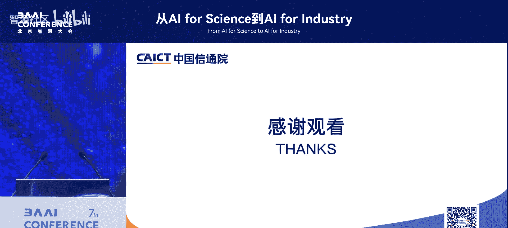

# 从AI-for-Science到AI-for-Industry-p11-AI-for-Science到AI-for-Industry的智能计算发展：栗-蔚

在本节课中，我们将学习智能计算如何作为关键驱动力，推动AI从科学研究（AI for Science）走向产业应用（AI for Industry）。我们将探讨计算范式的转变、行业应用现状，以及支撑这一发展的技术架构与挑战。

---

上一节我们了解了AI变革的宏观背景，本节中我们来看看驱动这场变革的核心要素——智能计算。

整个AI的变革不仅仅是算法的提升，更是计算范式从**CPU**向**GPU**的转变。同时，认知过程从“搜索结果”转向“推理找到答案”，人机交互方式也发生了根本变化。

---

我们已经来到了第三次计算与网络交融的历史时期。

以下是前两次交融的简要说明：
*   **第一次交融**：以“互联网”为代表，实现了通用计算计算机之间的网络互联。
*   **第二次交融**：当前阶段，是智能计算能力的全方位互联互通。这包括资源层、网络层以及智能体（Agent）之间的互联。

---

上一节我们提到了智能计算的互联，本节中我们来看看开源与AI发展的关系。

开源与AI的发展相辅相成。以DeepMind为例，早期我们并非将其视为人工智能平台研究，而是作为一个生物领域的开源协作平台，用于实现蛋白质结构预测等创新。

---

AI for Science并非全新概念，其发展始终与科学互相促进。

在AI发展初期，包括逻辑与符号推理的时代，其初衷就是为了解决和证明数学问题。因此，AI的发展对科学的促进至关重要。

---

在产业应用（AI for Industry）侧，发展势头迅猛。

以下是来自中国信息通信研究院（CAICT）的几个关键数据：
*   **供给侧**：中国AI企业数量已达约4500家，增长迅速。
*   **需求侧**：在智能客服、智能推荐等特定场景，AI已带来显著的效率提升。

根据信通院的“智能运营成熟度（IOMM）”评价模型，各行业智能化水平如下：
*   **通信行业**处于引领地位，不仅完成了自身转型，还对外赋能（如中国移动的“九天”大模型）。
*   **金融行业**：例如工商银行已部署大规模（千卡/万卡级）AI集群用于大模型训练。
*   **能源与制造业**也在积极推进智能化转型。

---

上一节我们概述了产业现状，本节中我们通过一个具体案例，深入看看智能计算架构如何支撑科学研究的转型。

我们与中国科学院合作的案例揭示了其智能计算架构转型的三个层面：
1.  **资源层**：实现线下模型的线性预测。
2.  **系统层**：需调度数据的跨地域迁移（例如，FAST“天眼”在贵州产生的数据，可能需要传输到江苏的计算中心进行处理）。
3.  **服务层**：实现超算、智能计算与云计算的融合。传统超算任务（如64位精度计算）需要被拆分为更细粒度的函数式调用，这要求应用范式向云原生演进。

---

为了支撑上述架构转型，需要在多个技术层面进行创新。

以下是需要关注的四个关键层面：
*   **计算架构**：从CPU的指令集驱动，转向GPU的函数库驱动。需要丰富适用于科学计算的GPU函数库。
*   **软件技术**：实现不同芯片间统一函数的调度，并与云计算结合，形成云原生的调度能力（如Serverless）。
*   **网络技术**：需要高性能的全光网络来保障FAST到计算中心等场景的大数据量、低延迟传输与流量调度。
*   **资源互联与调度**：需要将中科院各研究所的计算资源与超算资源进行跨域的统一编排与调度。

---

在云计算层面，需要一个整体的四层架构来管理芯片资源：
1.  底层的资源纳管。
2.  二层的调度加速。
3.  三层的编排引擎开发。
4.  四层的应用支撑。

---

智能体（Agent）是连接底层模型（L0）与上层场景应用（L1/L2）的关键枢纽。

在Science等垂直领域，需要多个专业智能体相互协作。例如，有的智能体负责调度生物数据进行训练，有的则负责处理天文数据进行推理。虽然现有协议（如MCP用于连接智能体与数据库，Google的A-to-A用于智能体间通信）提供了基础，但在垂直领域，智能体间的通信协议仍需进一步发展和完善，以更好地支撑AI for Science。

---

最后，从Science到Industry的转化是同步进行、相互促进的过程。

以下是四个关键结合点：
1.  **丰富AI应用**：拓展AI在科学与产业中的场景。
2.  **产业与技术结合**：推动软件、智能芯片（如AGI芯片）等技术与产业需求结合。
3.  **从科学发现到商业价值**：打通科研成果转化的路径。
4.  **创建行业优质数据资源**：构建高质量、高价值的行业数据集。

---

中国信通院（CAICT）在推动AI落地方面开展了以下工作：
*   构建了覆盖**基础设施、数据、模型、研发运营、智能体（Agent）及上层应用**的全方位企业AI应用标准体系，服务于科学、通信、金融、能源、制造等多个行业。
*   为众多垂直行业和传统企业提供咨询与赋能服务，助力其智能化转型。

---

本节课中我们一起学习了智能计算在连接AI for Science与AI for Industry中的核心作用。我们探讨了计算范式的转变、产业应用现状，并通过中科院案例分析了支撑转型的技术架构与挑战，包括资源调度、软件范式、网络互联以及智能体协作等关键层面。最后，我们了解了产研结合的方向以及相关推动工作。智能计算正成为驱动AI跨领域融合与创新的核心基础设施。