# 从AI-for-Science到AI-for-Industry-p12-产、学、研共筑AI开源生态：杨-建

在本节课中，我们将探讨从AI for Science到AI for Industry的背景下，如何通过产业、学术与研究机构的共同努力来构建一个繁荣的AI开源生态。我们将分析当前生态的现状、面临的挑战以及未来的发展路径。

## 引言：AI开源生态的重要性

最后，我们有请浙江大学的杨建博士分享关于AI开源生态的见解。需要声明的是，本次分享以个人身份进行，不代表任何企业立场。

今天讨论的题目是“产、学、研共筑AI开源生态”。这个主题与从AI for Science到AI for Industry的整体发展脉络高度相关。实际上，我认为这个议题的意义比“AI for Industry”更为宏大。这个概念是我去年提出的，我们可以从一个更广阔的视角来审视它。

## AI for Science的典范与模式

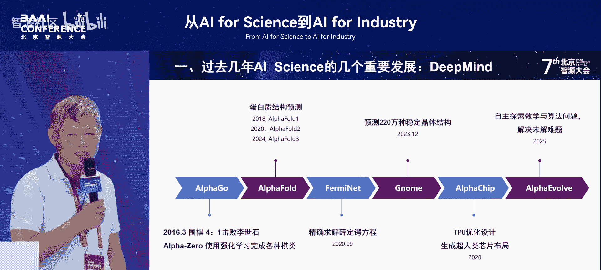

过去几年，AI for Science领域取得了重要进展。以DeepMind为例，它虽然产出的成果数量不多，但每一项都可称为精品。可以说，DeepMind在AI for Science领域的所有工作几乎都是精品。当然，其中也存在一些争议，例如AlphaFold的相关论文一直受到质疑。但总体而言，其工作质量非常高。

以AlphaFold3的开源为例，在发布的第二天，我就收到了至少上百个关于部署该模型的咨询请求。这反映出DeepMind的工作模式：它长期深耕一个专题，将其做到极致，从而引领整个细分科学领域的发展。

## 中国AI for Science的开源力量

再看中国的情况，开源力量最初主要体现在一个项目上：他们使用了1亿个水分子的模拟数据。最近，其应用范围已经扩展到材料力学、生物物理、药物研发和能源等领域，涵盖了大约60多个不同的AI for Science训练和推理任务。

另一个重要的发展方向是“AI for Science”，其涵盖范围非常广泛，包括流体工业、制造、材料、气象、地球科学以及生物学等。它同时支持数据驱动和机理驱动两种范式，更广泛地将传统科学与AI深度融合，而非局限于单一场景。

## AI for Science的实际应用场景

我过去几年接触了非常多的AI for Science场景，以下是一个简单的列表：
*   从基因到分子
*   到蛋白质
*   到生物制药等

然而，仅仅了解每个场景的输入和输出是不够的。实际上，在真正的药物研发、基因或材料领域，AI for Science通常只占据整个流程的10%到20%，其余部分仍然以传统计算为主。

此外，机器学习的应用场景还包括医学影像处理、材料科学、化学、气象学、流体力学、地学等众多领域。这是我过去几年接触到的部分领域，每一个都进行了一些初步的实验性探索。

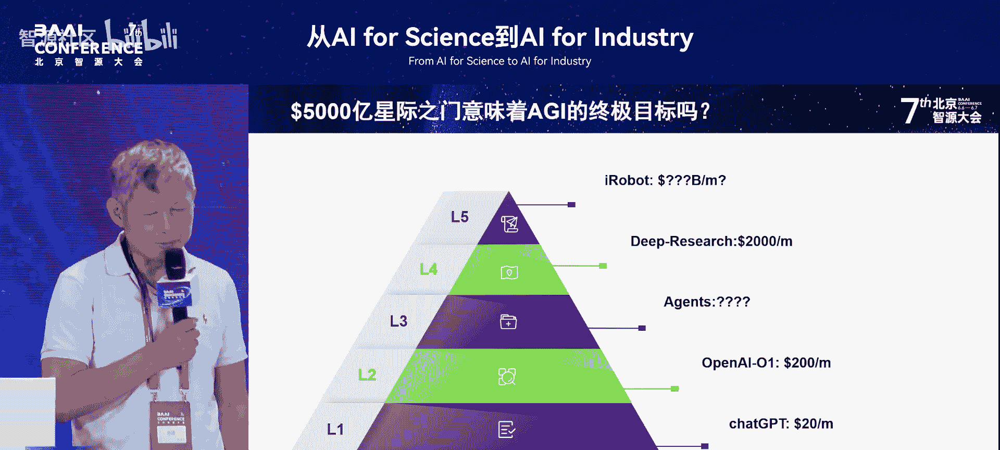

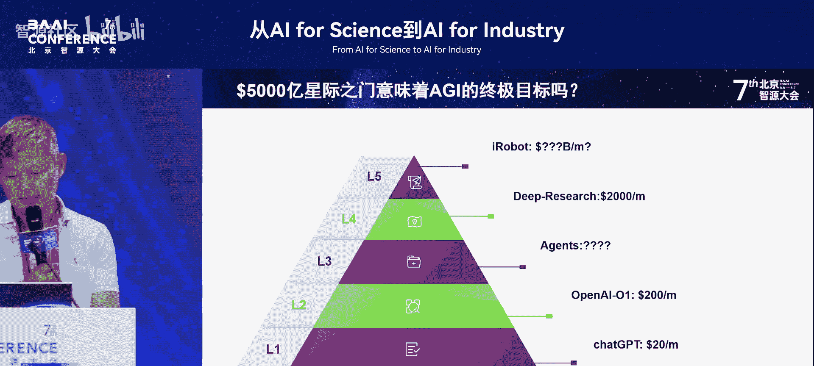

## 大模型时代的平权与变革

那么，AI for Science、大模型以及AI之间有什么关系呢？我们来看一个重大的发展趋势：大模型平权是如何实现的。

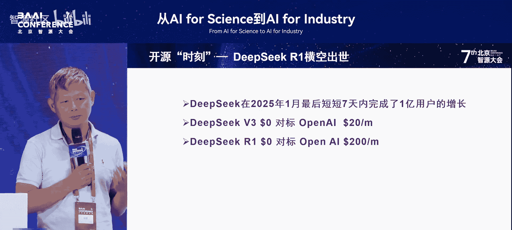

观察美国的xAI公司，其目标是打造一个由大模型控制的未来。就像自动驾驶替代人类司机一样，未来的企业、科学家、工厂流程控制师、生产排程员，甚至董事长和总经理，都可能由虚拟人担任。人类将脱手管理企业，全部交由大模型控制。目前，xAI大概处于“智能体”或“创新者”的第三、第四层发展阶段。其每月的计算成本（CO）大约是2000美元，用于运行约100亿参数的两个任务。

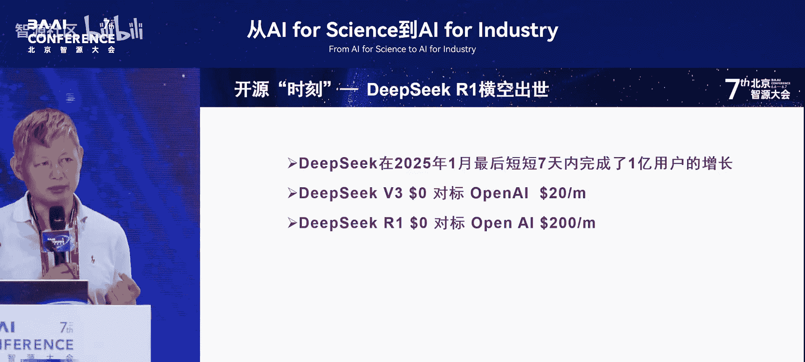

这是xAI努力的方向。而在中国，当DeepSeek等开源模型出现后，情况发生了变化。我们使用V3模型可能不需要费用，但如果要对标GPT-4，可能需要20美元。当我们使用200美元级别的模型时，很多时候我们甚至可以零成本使用。

下一代模型，例如对标GPT-4-o1水平的模型，会是什么样子？模型规模可能会变大4倍或10倍，这是一个未知数。但可以肯定的是，我们正处在一个开源的时代。开源带来了大模型的平权。

## 开源模型带来的关键能力

直接跳到核心问题：在开源模型出现之前，为什么没有大模型平权？实际上，大模型的落地非常缓慢。开源模型提供了两个关键要素：
1.  **低成本**：模型使用成本大幅降低。
2.  **后续训练方法**：正如之前有人提到的，后续训练方法意味着可以用极低的成本（万分之一或千分之一），针对特定垂直领域训练出达到博士水平的小型模型。这一点非常关键。

拥有了这样的模型后，在推理阶段，我们可以利用“推理优化”等技术。这意味着，我们拥有了博士水平的模型，并投入足够的算力，就可以在极短的时间内解决一个工程或设计问题。例如CAD设计、生产流程设计，或者像混凝土配比优化这样的实际问题（我曾实地考察过工地）。这相当于让100万个博士同时来解题。

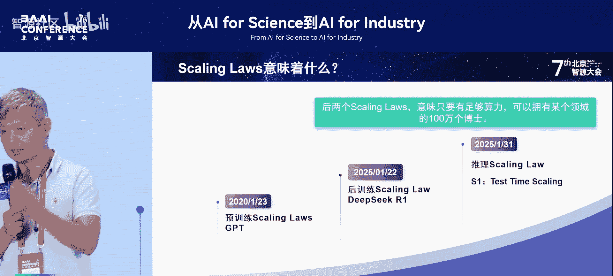

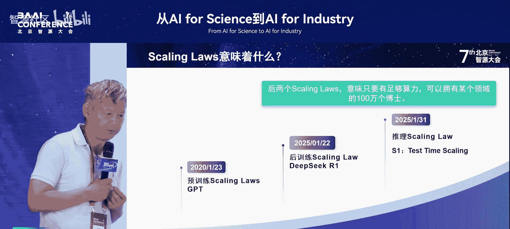

这一页是我要表达的核心重点，并由此引出我的结论。

## 垂直领域模型的应用前景

基于此，我们可以在许多领域进行拓展。例如，北京大学有30个强势专业，可以生成30个专属模型来解决各自领域的问题。一家农业公司可以开发多个农业专业领域的模型。工业领域也是如此。实际上，从教育、工业、商业、农业到航天、信息产业，都可以这样做。

我举一个实例，说明这已经带来了一个时代的巨大变革。

## 当前生态面临的三大缺口

在这个时代已经到来之际，我们整个社会缺少什么？这就是我今天演讲的主题。我们主要缺少三样东西：
1.  **优质算力**
2.  **海量的开源应用资源**
3.  **大模型开发者**

首先解释为什么缺少大模型开发者。实际上，从2022年到2024年，中国99%的AI创业公司都失败了，这非常关键。失败的原因主要有两个：
*   第一是疫情影响，资金短缺。
*   第二是美元资本受美国政策影响撤出中国，导致许多公司无法融资，没有项目和资金，最终倒闭。

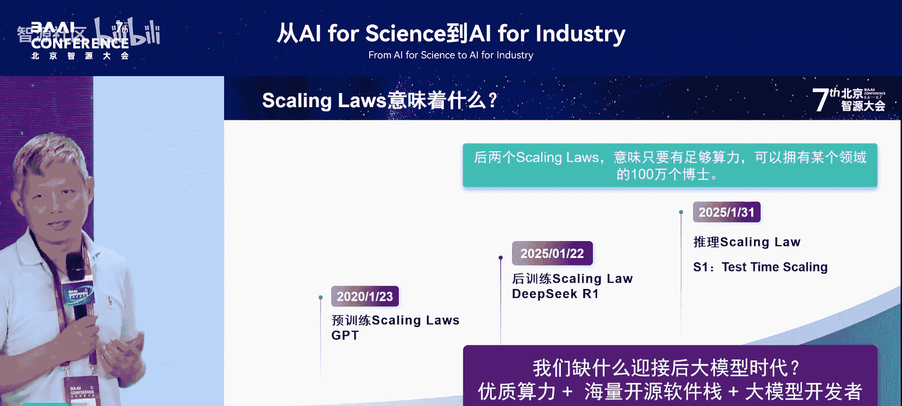

许多创业者在公司倒闭后，甚至需要变卖资产来补缴注册资本。这些人遭受重创后，往往选择回归大公司。因此，到2024年，整个产业实际上是在下滑的。虽然开源带来了新的活力，我们需要增长，但老一辈的创业者退出后，需要新一代人接棒创业，整个生态和社会才能发展。这一点至关重要。

我们测算，到2029年，全国大约需要1000万大模型开发者。

## 从AI for Industry到AI for Engineering

为什么我认为“AI for Industry”这个题目太小了？我与许多企业交流过，在2024年之前，企业很难真正落地AI应用。因为当时最常见的应用是问答模型，例如客服机器人。

但是，以中国商飞为例，在设计飞机时，需要获得100多个国家的适航证。每个国家的适航证要求都不同。如何证明所有材料都符合各国适航证的各式各样要求？如果由人来做，完成一个国家的认证通常需要具有8年左右工作经验的工程师团队。那么，如何让新入职的工程师或毕业生，利用大模型在6个月内达到8年经验工程师的水平？

因此，我提出了一个新概念：**AI for Engineering**。它包含的内容远不止“AI for Industry”，这是我去年在非公开场合首次提出的概念。我认为“工业”范畴太小了。以设计行业为例（我的博士研究方向是CAD和CAE），存在众多不同的设计领域，这些领域不一定都属于传统工业，但大模型都能发挥作用。

为什么？因为任何设计都可以看作自然语言与程序语言的结合体。编程今天已经可以用大模型辅助或替代。任何CAD软件，无论是设计汽车零件的机械CAD，设计电路板的PCB CAD，还是设计室内装饰的CAD，本质上都是CAD。它只是自然语言的另一种表达形式，这种表达同样可以用大模型来处理。

之所以在设计领域不热门，是因为程序员领域的公开数据太多，而设计领域的私有数据丰富但未开放。例如，建筑设计院、机械设计院都有大量专属数据，这就形成了一个新的广阔领域。因此，我定义了“AI for Engineering”这个概念。

## 一个震撼性的实例

我举一个非常典型的例子，说明这个时代已经到来。这个例子深深震撼了我。这是一位工程师用三个星期取得的成果，其价值有多大？我们来看一下。

他将性能最高提升了6.5倍以上，实际上某些算子的性能提升甚至达到了30倍。他总共优化了94个算子。在中国，完成这项工作大概需要6万人民币，在美国则需要约2万美元/月的工程师工作数月。我测算了一下，大约需要400人月的工作量。

关键在于，这些算子此前都已经被优化过，而且是世界顶级工程师优化的。也就是说，大模型是在顶级优化的基础上进行了再优化。如果让人类工程师在现有基础上再优化，可能需要增加10倍的工作量，即4000人月，价值约4000万美元。

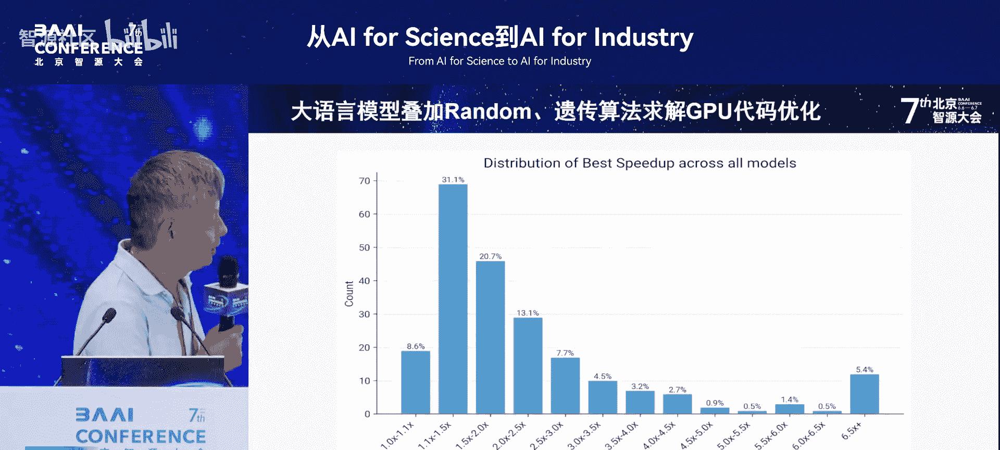

然而，一位工程师利用计算机，结合大模型、推理优化和一系列算法，就解决了这个问题。实际上，工程领域有很多问题是确定性的，原理相通，只是应用领域不同。这是一个巨大的时代变革。

## 开源力量的崛起与贡献

在这个时代，我们缺少人才，该怎么办？答案是：我们需要开源。

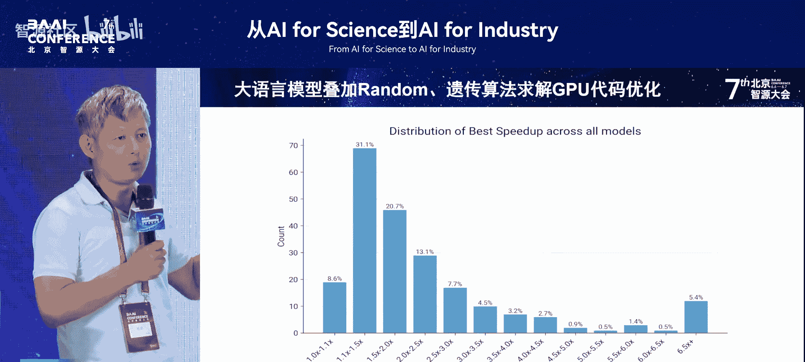

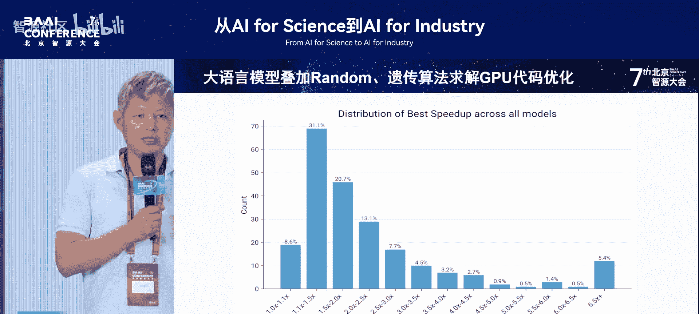

观察过去一年全球开源的发展，其增长曲线非常陡峭。我们再看一下过去开源项目的发展情况。你会发现，过去开源贡献非常密集。我选取了10个项目，其中华人的工作量约占一半。总体来看，贡献量巨大。

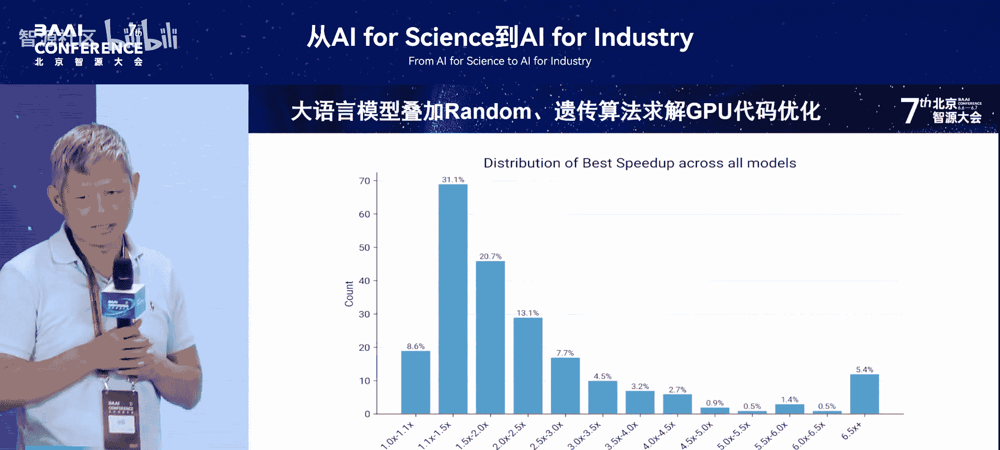

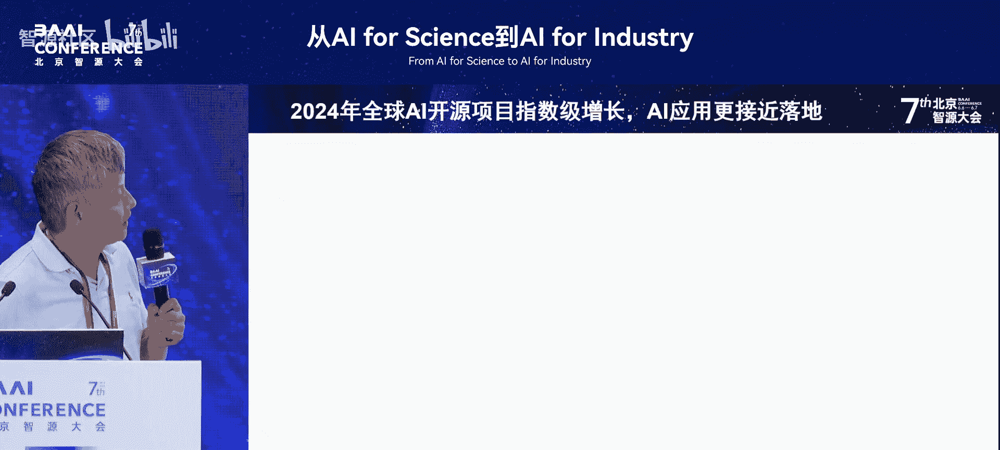

接近2万次提交，这意味着在这个团队中，大约相当于18000名工程师一年的工作量被贡献出来。这是一个开源项目的例子。

另一个例子是关于复现工作的。原本使用OpenAI的API需要2万美元/月。我尝试使用开源项目进行复现，我们自己搭建环境，每次实验成本仅需1分钱，算下来一次实验大约1元钱。这完全颠覆了我们使用商业API的成本结构，充分体现了开源的力量。

中国的开源正处在一个新的历史阶段，我们快速略过这部分。

## 培养大模型人才的体系化方案

我们还有其他一些好的进展。例如，全球部署量最大的可能不是阿里的模型，而是上海人工智能实验室的“书生”模型。最近也有非常好的开源模型加入。

为了培养大模型开源生态和人才，我们认为到2029年需要在高校培养100万大模型人才。因此，我们成立了相应的组织，由王怀民院士亲自牵头负责。在3月12日左右的成立大会上，梅宏院士也亲自出席。该组织汇聚了学术界、企业界、互联网公司以及大模型公司的力量，涵盖从大模型、芯片到生态和应用的各个环节，旨在系统化培养人才。

此外，还有国家层面的开源协会，例如朱其刚负责的相关机构。整个体系需要包含以下内容：
*   **大模型通识课**：大学里每个学生都需要学习。
*   **大模型开发课**：部分相关专业的学生需要学习。
*   **开源式毕业论文**：学生的毕业论文可以以开源项目的形式呈现和提交。
*   **竞赛机制**：通过比赛激发创新和实践。
*   **投资对接**：引入投资界人士（例如金沙江创投），为有潜力的项目和新成立的大模型公司提供资金支持。

最终，形成一个集产、学、研、用于一体，并包含投资环节的完整生态。

最后一页是上述内容的具体化展示，在此不再赘述。

好的，时间到了，我的分享到此结束。谢谢大家。