# 多模态模型-p02-主题演讲：国际嘉宾

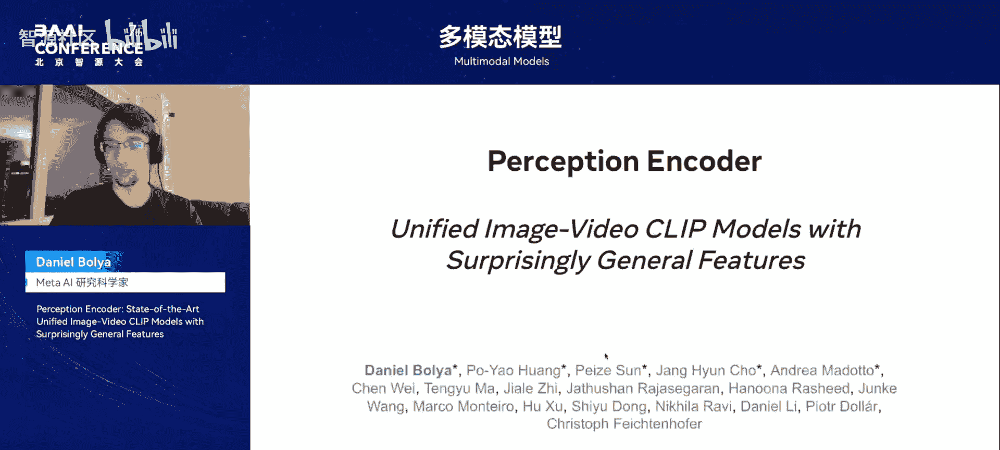

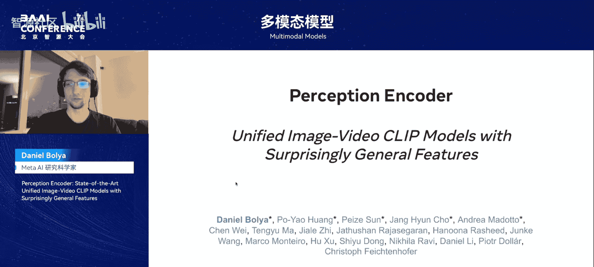

在本节课中，我们将学习一个名为 **P-Core** 的统一图像与视频模型，以及如何利用其内部特征构建出在多种下游视觉任务上表现卓越的模型家族。我们将从核心模型出发，探讨其训练方法、性能表现，并深入分析其内部特征如何被用于增强语言建模和空间感知任务。

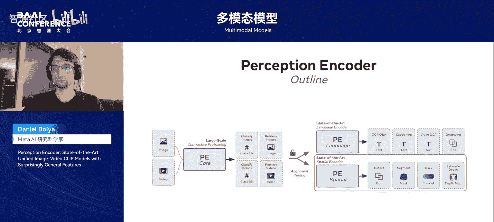

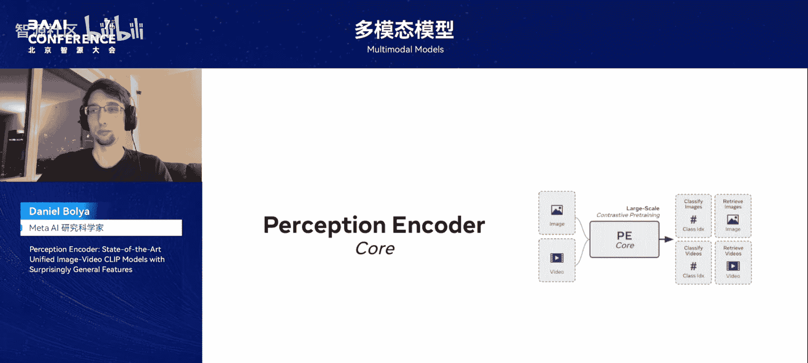

## 核心模型：-Core

上一节我们介绍了本次演讲的主题。本节中，我们来看看核心模型 **P-Core** 的构建思路。它是一个通过大规模对比学习预训练的统一图像与视频模型。

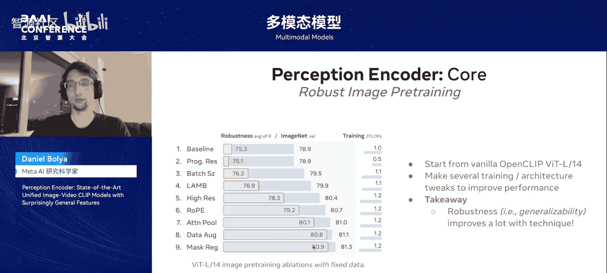

**P-Core** 的训练分为两个关键阶段：
1.  **仅使用图像的鲁棒预训练**：首先，在大量图像-文本数据上进行预训练，目标是尽可能稳健地从固定数据集中提取信息。
2.  **通过数据引擎扩展到视频**：利用图像模型构建一个视频描述生成器，通过人工反馈循环迭代优化，生成高质量的视频-文本对，然后在这些数据上对模型进行微调，使其同时理解图像和视频。

以下是实现鲁棒图像预训练所采用的关键技术点：
*   增加预训练的批次大小。
*   添加旋转位置编码。
*   使用更长的训练周期和更优的学习率调度。
*   这些看似微小的调整累积起来，显著提升了模型的零样本图像分类准确率，更重要的是，大幅增强了模型在各种下游任务上的鲁棒性。

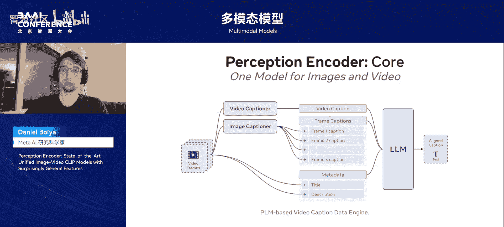

## P-Core 的性能表现

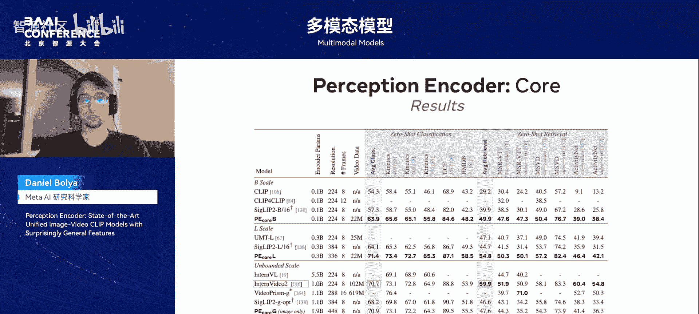

在了解了模型构建方法后，我们来看看它的实际性能。**P-Core** 在标准的零样本图像分类、细粒度分类和图像检索基准测试中，全面超越了之前的先进模型（如 SigLIP-2）。

在视频任务上，**P-Core** 作为一个基于帧的编码器（即独立编码每一帧，然后平均其嵌入向量），其性能与采用完全时序注意力机制的先进视频模型（如 InternVideo2）相当，甚至在分类任务上有所超越。这证明了其视频数据引擎和联合训练的有效性。

## 模型“感觉”测试：图像检索实例

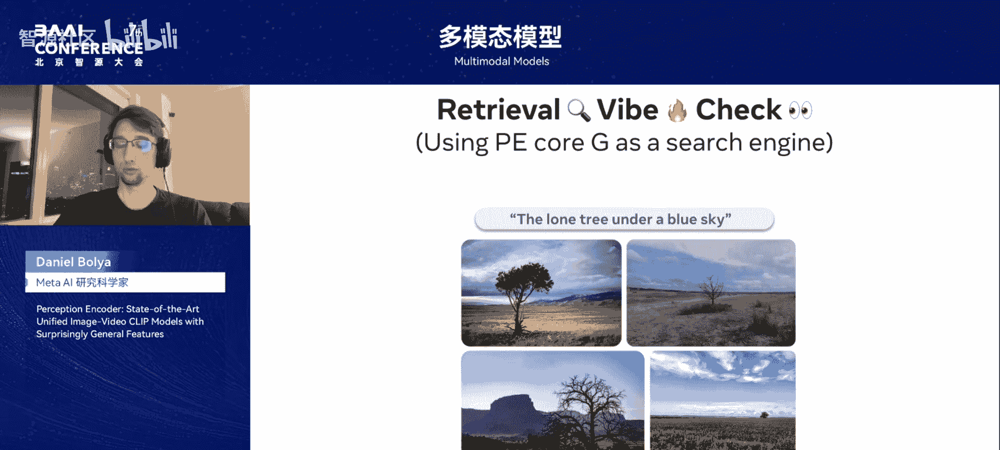

数字指标并不能完全反映模型的感知能力。让我们通过构建一个图像搜索引擎来直观感受 **P-Core** 的理解能力。我们将数十亿张无标签图像编码为嵌入向量，然后通过文本查询进行检索。

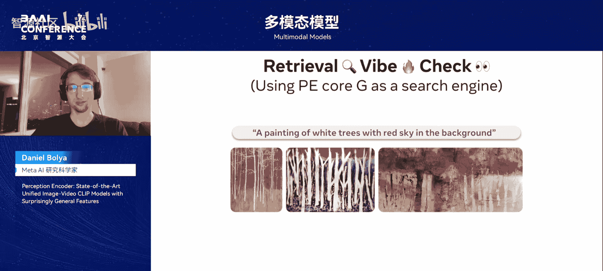

以下是几个查询示例及其检索结果：
*   **“蓝天下有树的风景”**：模型能准确检索出符合描述的典型风景图片。
*   **“橙红色天空下的树”**：模型能理解非典型场景，找到符合描述的图片。
*   **“一只酷狗”**：模型能捕捉“酷”这种主观概念，返回戴墨镜、有特殊造型的狗图片。
*   **“一只嗅探摄像头的狗”**：模型能理解具体的动作和互动关系。
*   **“一只加拿大餐车”**：模型能结合物体（餐车）和背景信息（加拿大标识），准确找到目标，展示了强大的细粒度理解和上下文关联能力。

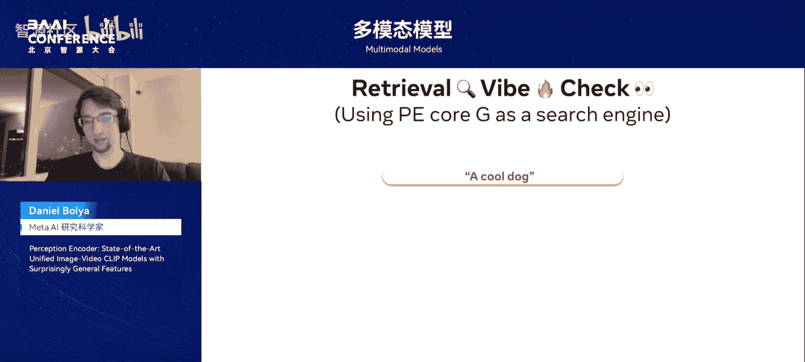

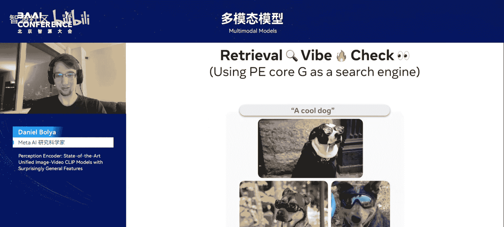

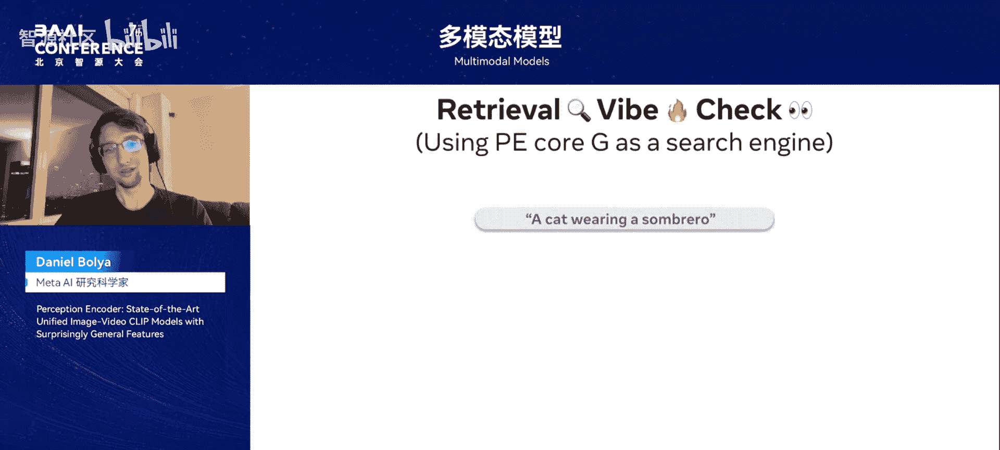

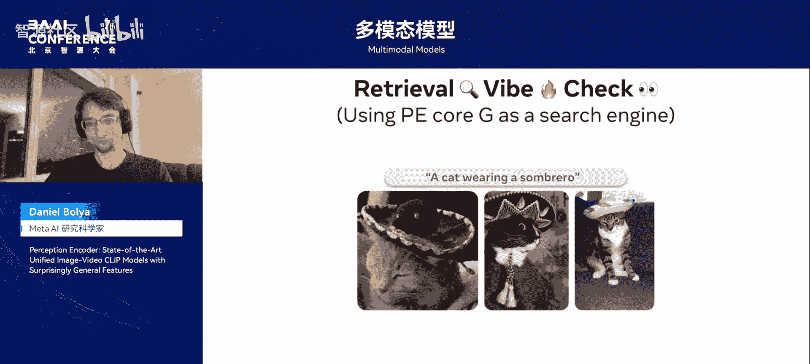

这些例子表明，**P-Core** 在图像-文本对齐方面表现出色，能够处理复杂、细致甚至带有主观色彩的查询。

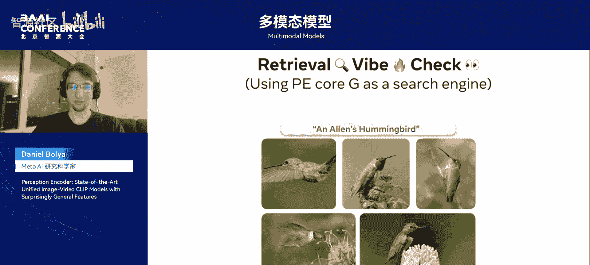

## 超越检索：-Core 的通用中间特征

虽然 **P-Core** 作为 CLIP 模型在分类和检索上表现优异，但我们的目标更广泛。通过分析模型不同层的特征，我们发现了一个惊喜：**P-Core 的中间层特征对于许多下游任务具有惊人的通用性**，而这些任务通常是 CLIP 模型不擅长的。

具体来说：
*   **语言建模任务**：如 OCR 问答、视觉问答等，**P-Core** 中间层的表现接近甚至超过了专门为字幕任务训练的视觉编码器。
*   **空间感知任务**：如目标检测、目标跟踪等，**P-Core** 中间层的表现也显著优于其最终输出层，并且接近专门为密集预测任务设计的模型。

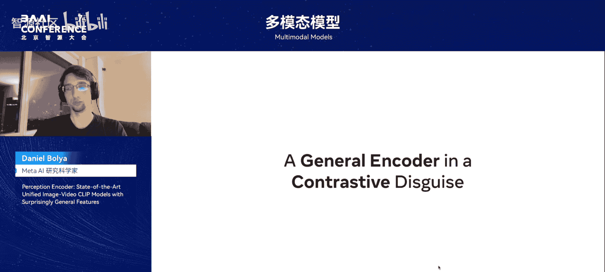

这意味着 **P-Core** 在训练过程中，其网络中层学习到了非常丰富和通用的视觉表示。然而，这些有益的特征在网络的最终输出层却“消失”了，因为对比学习目标驱使最终层特征更偏向于全局的、与文本对齐的表示。

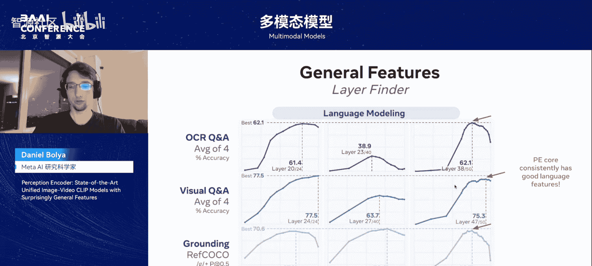

## 构建专用编码器：-Language 与 P-Spatial

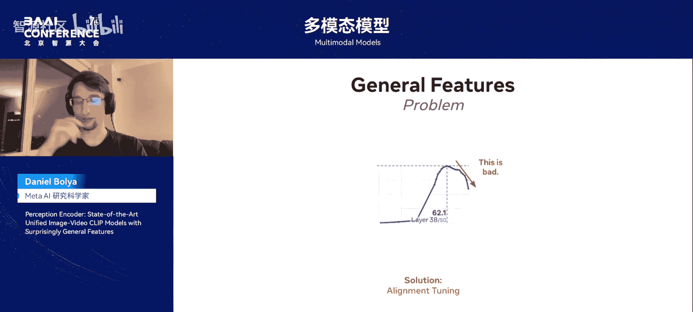

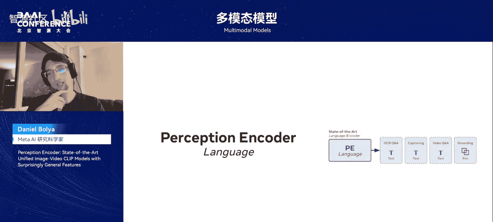

基于上述发现，我们构建了两个新的专用视觉编码器，将 **P-Core** 的强大中间特征“对齐”到特定任务的输出层。

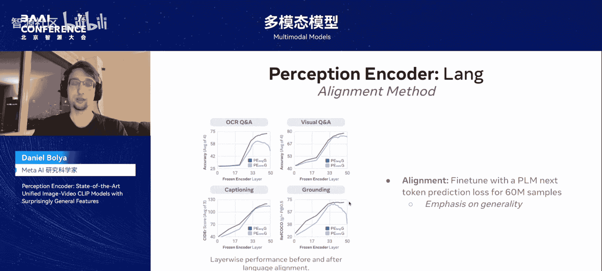

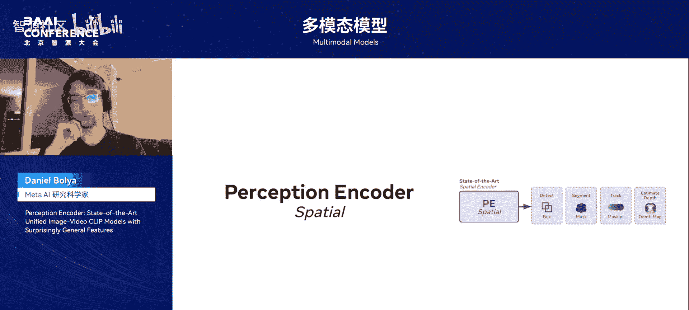

**P-Language：用于多模态语言建模**
*   **方法**：在 **P-Core** 之上连接一个大语言模型进行微调，然后将微调后的视觉编码器单独提取出来。
*   **效果**：通过精心设计的训练方法，我们成功地将语言任务的最佳性能从中间层提升到了模型的最终输出层。由此构建的多模态大语言模型在多项基准测试中达到了先进水平。

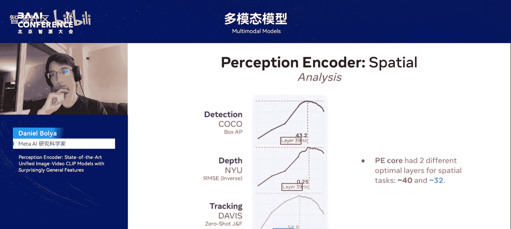

**P-Spatial：用于密集预测任务**
*   **挑战**：空间任务需要同时具备良好的语义信息（如“这是一只猫”）和精确的位置信息（如“猫的边界在哪里”）。**P-Core** 的最终层缺乏后者。
*   **方法**：我们采用了一种双重对齐策略：
    1.  **特征对齐**：将模型的最终输出层与其自身在空间任务上表现最好的中间层（如第40层）的特征进行对齐，以保留语义信息。
    2.  **局部性对齐**：引入一种新颖的 **SAM 掩码逻辑** 监督信号。通过连接 SAM 模型随机生成的多组掩码对应的逻辑值，我们得到了富含局部位置信息的特征。将最终层特征也与这些 SAM 逻辑对齐。
*   **效果**：联合使用这两种对齐方式，**P-Spatial** 的最终层特征同时获得了良好的语义和精确的局部性，从而在目标检测、实例分割、深度估计和视频目标跟踪等多个密集预测任务上超越了之前的专用模型。

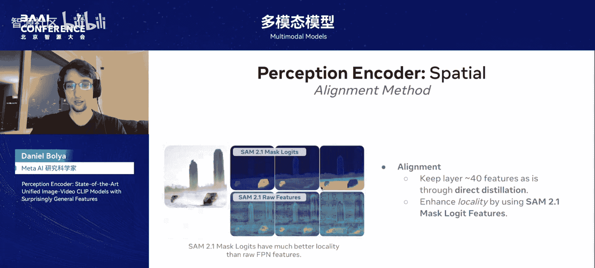

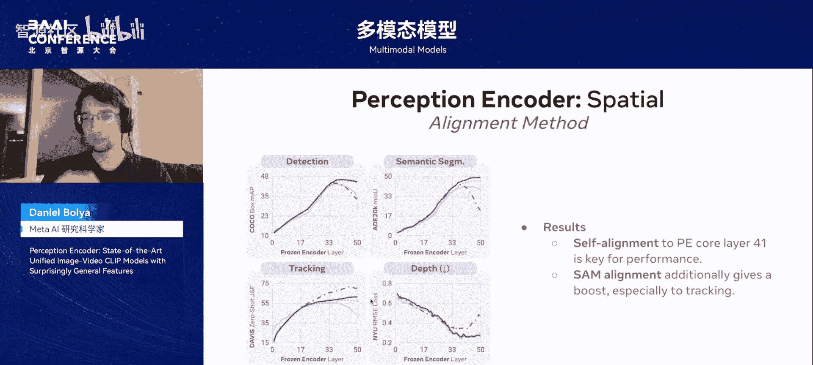

## 总结

本节课中我们一起学习了 **P-Core** 模型家族：
1.  **P-Core** 本身是一个强大的统一图像与视频 CLIP 模型，通过两阶段训练和创新的视频数据引擎，在零样本任务上取得了领先性能。
2.  我们发现其**中间层特征具有超出 CLIP 目标的通用性**，适用于语言和空间任务。
3.  基于此，我们通过特征对齐技术构建了 **P-Language** 和 **P-Spatial** 两个专用编码器，分别在多模态语言建模和密集空间预测任务上取得了卓越成果。

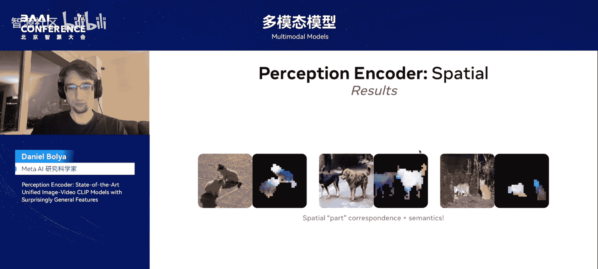

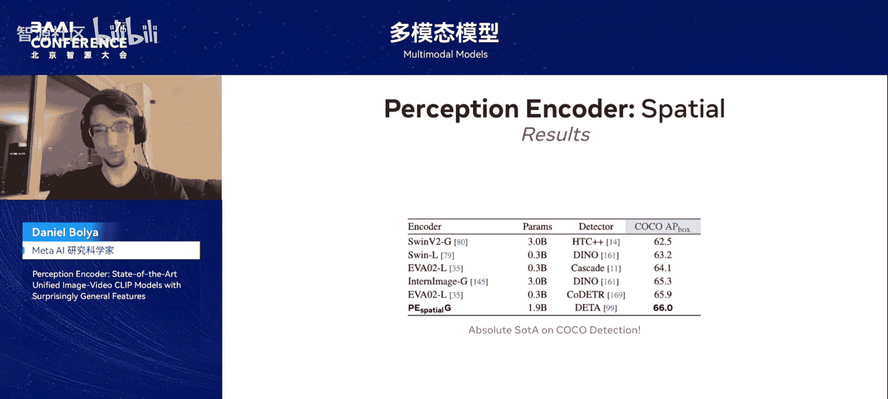

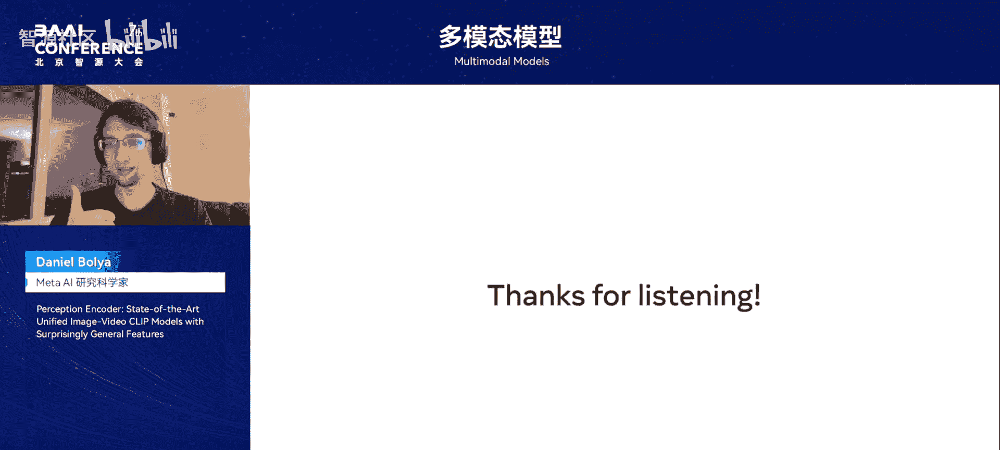

这个工作表明，通过精心设计的大规模预训练和针对性的特征工程，我们可以从一个基础模型出发，衍生出解决多种复杂视觉任务的强大工具。