# 多模态模型-p03-腾讯混元多模态生成模型实践：芦清林

在本节课中，我们将学习腾讯混元多模态生成模型的技术发展路径，包括图像生成模型、视频生成模型的核心技术突破，以及这些模型在腾讯内部多个业务场景（如游戏、社交、广告）中的具体应用实践。

## 图像生成模型

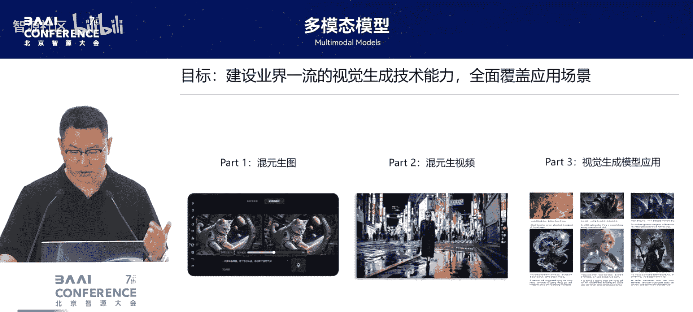

上一节我们介绍了课程的整体框架，本节中我们来看看图像生成模型的具体技术细节。

从2021年第一代DALL-E模型出现开始，视觉生成模型经历了革命性的爆发。腾讯混元团队于2024年5月发布了第一代基于DiT架构的图像生成模型并开源。随后，团队将模型参数量提升至10B级别，并致力于提升模型的推理速度，以实现更流畅的交互体验。

### 核心技术：速度与质量提升

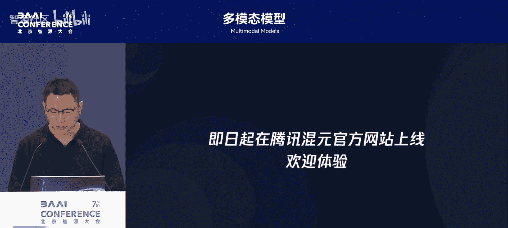

为了实现毫秒级出图的交互体验，团队在模型架构和数据层面进行了多项优化。

以下是实现高速图像生成的核心技术点：

*   **超高倍率图像编解码器 (VAE)**：采用32x32超高压缩倍率的VAE，将32x32像素块压缩为1个token，显著减少了推理时的token数量和计算复杂度。
*   **对抗性蒸馏**：在应用高倍率压缩的同时，通过对抗性蒸馏方案保证生成图像的质量不下降。
*   **视觉-语言大模型编码器**：使用视觉-语言大模型作为文本编码器，利用其强大的世界知识和图文对齐能力，提升模型对提示词的理解与跟随能力。
*   **专业化数据与奖励模型**：联合专业美术人员定义美学标准、筛选数据，并训练专门的奖励模型，通过强化学习优化模型在**人像质感、OCR文字准确性、饱和度、肢体自然度**等方面的表现。

### 模型可控性与扩展能力

除了基础文生图模型，团队还开发了多种插件以增强模型的可控性。

以下是主要的模型插件与应用：

*   **主体一致性插件 (Character)**：允许用户上传参考图片，并基于该主体生成不同场景的图像。通过**文本适配器注入**和**多阶段课程学习**，在保持主体特征和遵循新提示词之间取得平衡。
*   **图像编辑能力**：模型支持增、删、改等图像编辑功能，实现一键修图。
*   **轮廓生图**：支持根据参考轮廓生成图像，在美术设计领域有广泛应用。

## 视频生成模型

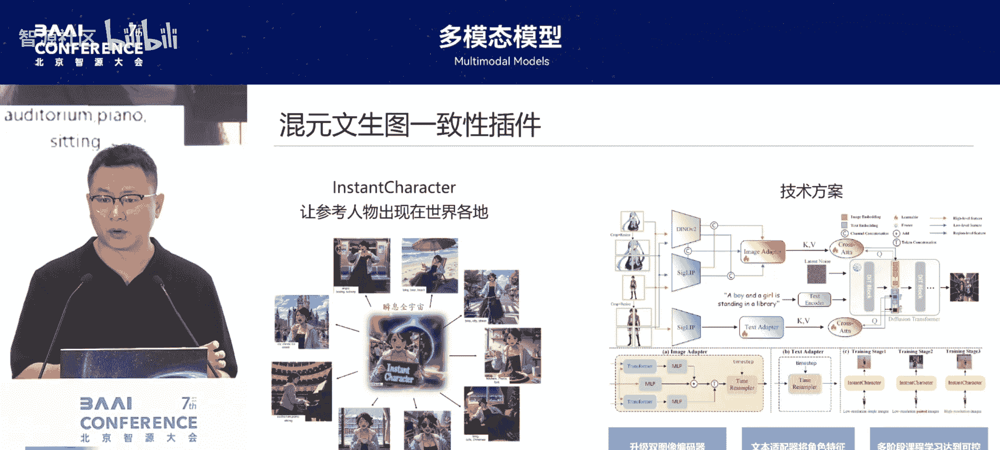

了解了图像生成的核心技术后，本节我们将目光转向视频生成模型。

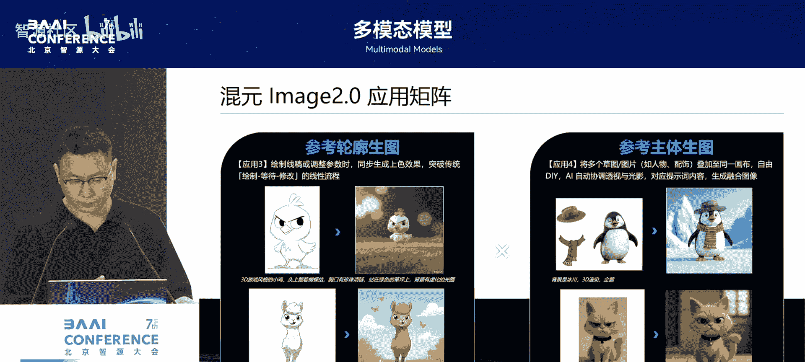

腾讯混元于2024年12月开源了参数量达14B的视频生成模型。该模型在文本理解、帧间一致性和多模态统一方面取得了显著进展。

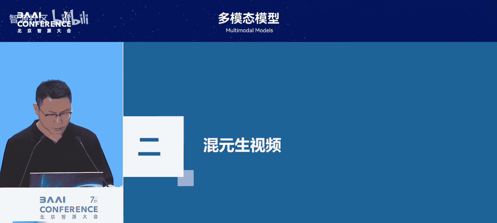

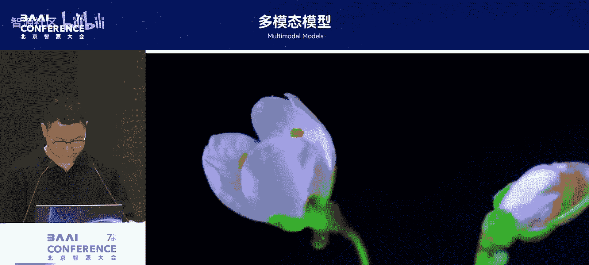

### 核心技术突破

视频生成模型面临比图像生成更复杂的时序一致性与动态表现挑战。

以下是视频生成模型的三大技术亮点：

1.  **多模态大模型作为文本编码器**：与图像模型类似，采用视觉-语言大模型进行文本编码。其优势在于丰富的世界知识和可通过**指令微调**让其更关注提示词中的关键属性（如数量、颜色），从而提升生成准确性。
2.  **DiT双模态扩展法则**：基于计算量和数据量，科学地规划模型参数规模，确定最优训练方案，确保模型性能。
3.  **3D VAE编解码器**：设计统一的3D VAE，可同时处理图像和视频的潜在表示，为未来实现“图-视频”统一生成模型奠定了基础。

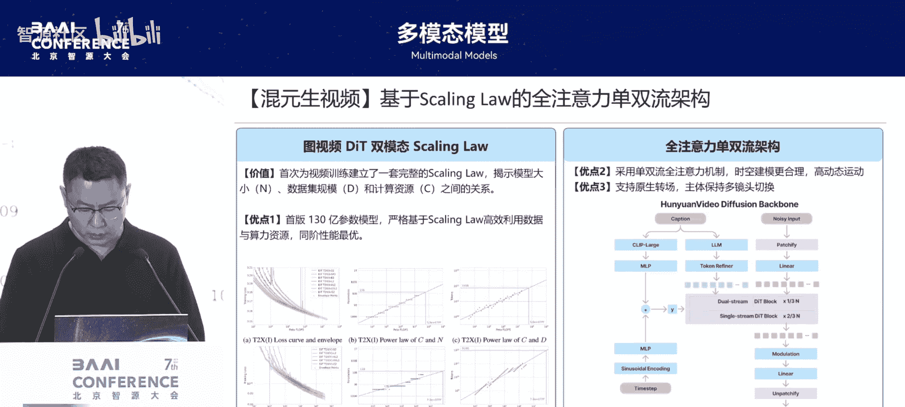

### 多样化控制与生成

视频生成模型同样具备丰富的可控生成能力。

以下是视频模型的主要扩展应用：

*   **驱动类生成**：支持**表情驱动、肖像动画、姿态驱动**，能够根据输入的动作序列生成相应视频。
*   **语音驱动Avatar**：不仅驱动口型，还能生成匹配语音内容的自然肢体动作和表情。
*   **主体一致性视频生成**：将参考人物注入模型，使其能在不同场景和动作中保持身份一致。
*   **多条件统一生成**：支持将**人物、物品、文本、语音、动作序列、物品轨迹**等多种条件融合，生成复杂的交互视频。例如，生成人物介绍特定商品并与之自然互动的视频。

## 在腾讯业务中的应用

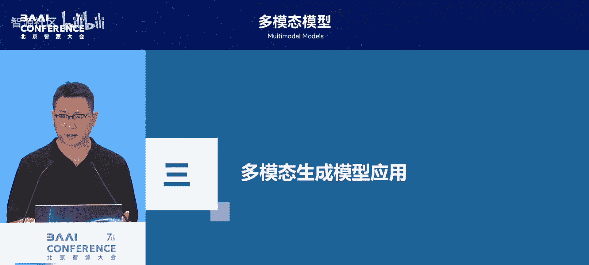

前面我们分别探讨了图、视频生成模型的技术，本节我们来看看这些技术如何落地于腾讯丰富的业务场景。

腾讯的业务板块如社交（微信/QQ）、游戏、广告、内容（腾讯视频）等，对视觉生成有强烈诉求。混元模型已在多个场景中实现深度应用。

### 游戏开发提效

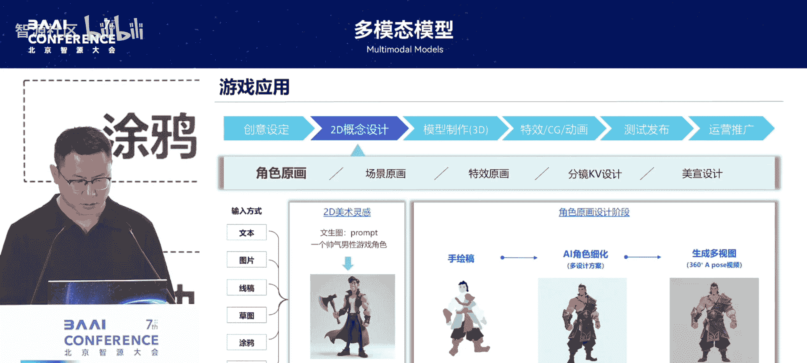

在游戏研发中，AI生成技术能大幅缩短从概念设计到最终素材的流程。

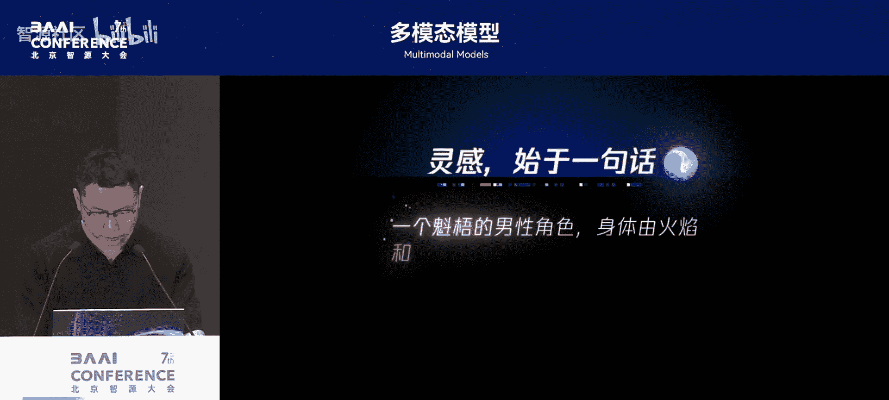

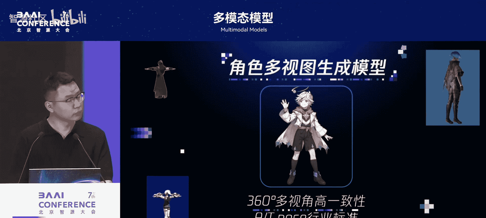

以下是AI在游戏生产管线中的具体应用：

*   **概念设计**：通过文生图快速生成大量角色/场景概念图，辅助美术人员筛选创意。
*   **线稿细化**：基于手绘线稿，由AI自动完成上色与细节渲染。
*   **角色三视图生成**：确定角色形象后，可直接生成360度多视图，无需等待完整的3D建模。
*   **一站式生产引擎**：腾讯发布了集成数十项AI功能的游戏AI生产引擎，覆盖从原画、3D模型到营销素材的全流程。

### 社交内容创作

在社交领域，AI降低了内容创作门槛，激发了用户创造力。

以下是社交场景中的典型应用：

*   **公众号文章转视频号**：通过**长文理解、分段、提示词转换、风格一致性控制**等一系列技术，将公众号长文自动转换为配有连贯图文视频的内容，发布至视频号。
*   **表情包二创**：用户可结合“谐音梗”等创意，利用AI生成个性化表情包，促进UGC内容生态。
*   **视频号特效**：利用生成式模型实现过去难以做到的**丝滑变装、趣味互动（如“万物皆可夹娃娃”）** 等复杂视频特效，提升趣味性。

### 广告素材生成

在广告业务中，AI已成为提升效率、优化效果的核心工具。

以下是AI在广告领域的应用方向：

*   **效果广告素材批量生产**：近半数腾讯广告素材由AI生成，包括文生图、图生图、图生视频等，用于快速测试和优化投放效果。
*   **爆款素材复刻**：通过图生图技术，参考跑量效果好的素材生成风格类似的变体，延续其投放表现。
*   **照片级数字人**：低成本生成商品讲解、知识分享等口播视频，解决真人拍摄的成本与肖像权问题。
*   **品牌广告制作**：结合大语言模型与生成模型，从广告词、设计理念到成片全流程AI生成，达到品牌广告所需的精美质感。

## 总结

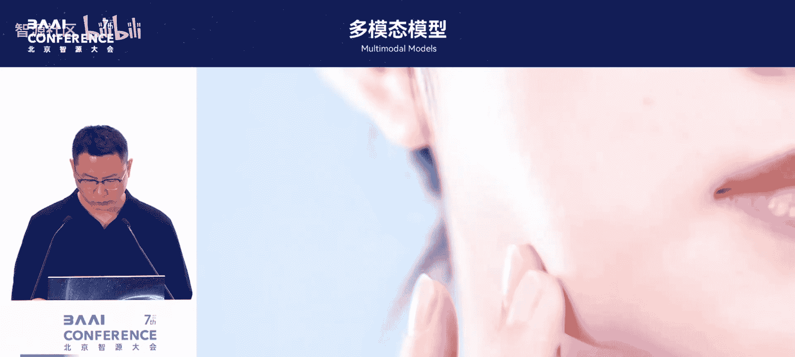

本节课中我们一起学习了腾讯混元多模态生成模型的技术进展与应用全景。我们从**图像生成模型**的高速度与高质量优化方案出发，探讨了其可控插件的发展。接着，我们深入了解了**视频生成模型**在文本理解、一致性与统一架构上的突破，及其多样的控制生成能力。最后，我们看到了这些技术如何切实落地，在**游戏研发、社交内容创作、广告素材生产**等腾讯核心业务场景中发挥价值，提升效率并激发创新。混元模型的实践表明，生成式AI正从技术探索走向大规模产业应用，深刻改变着内容创作与生产方式。