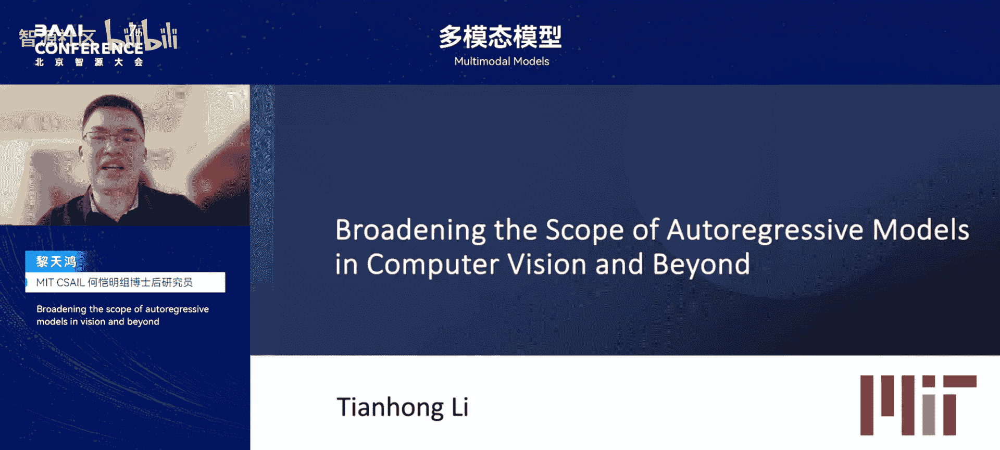
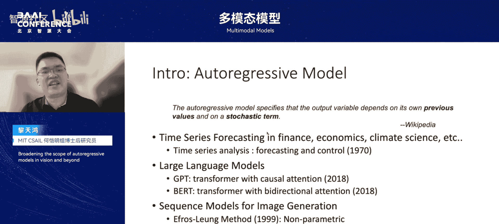
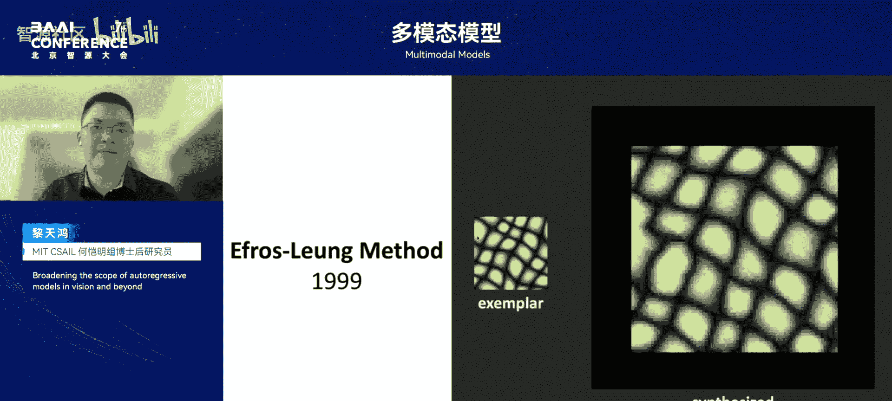
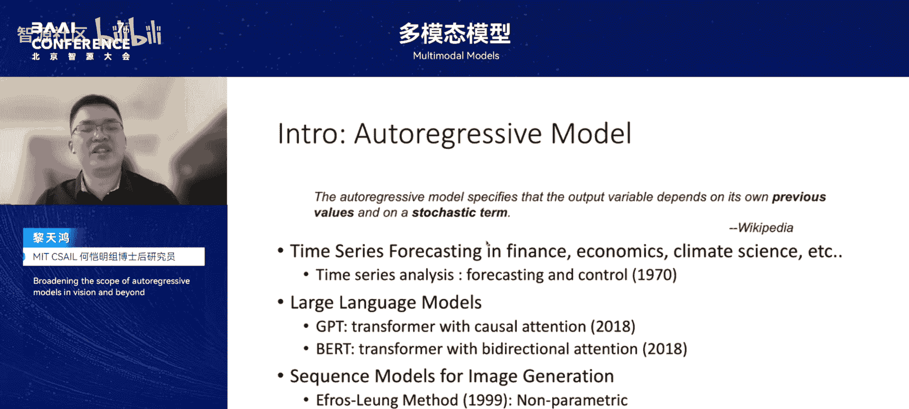
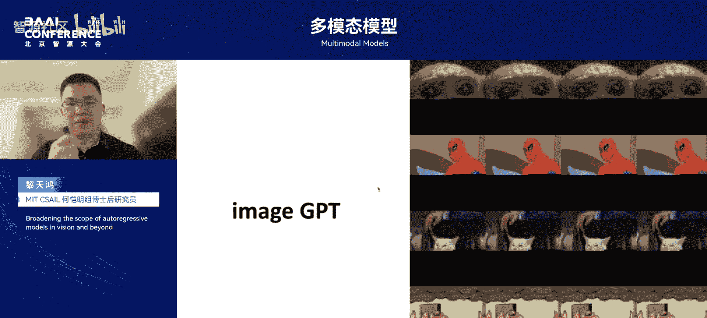
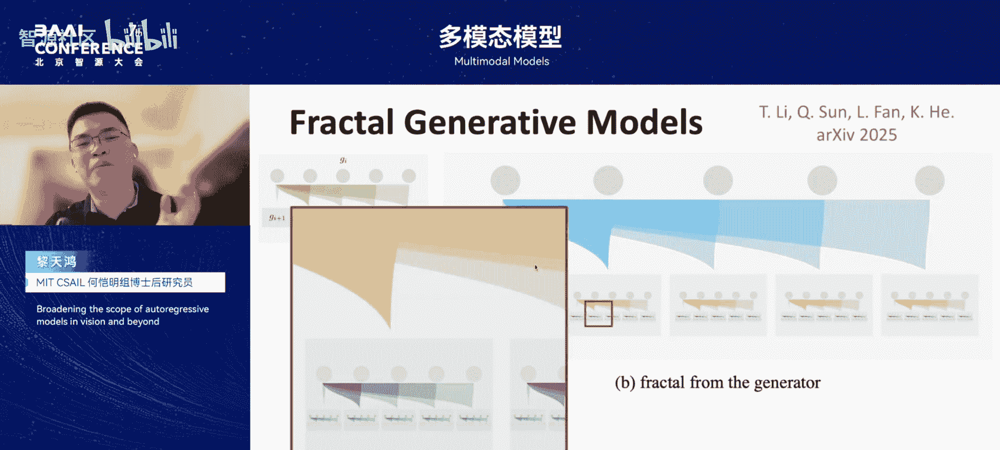
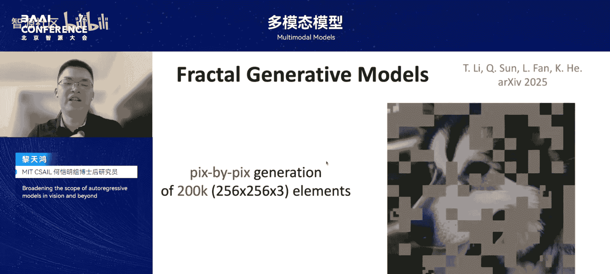
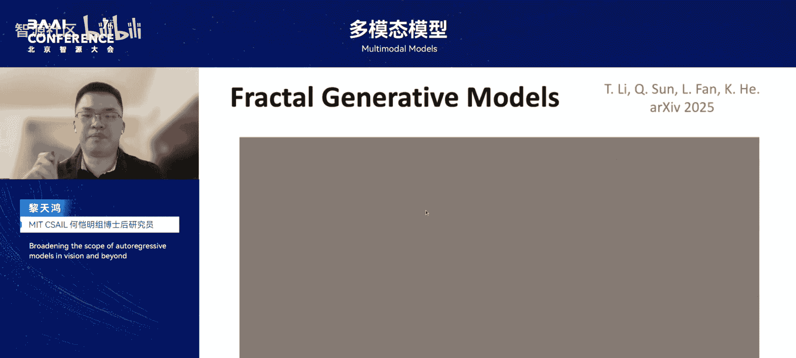
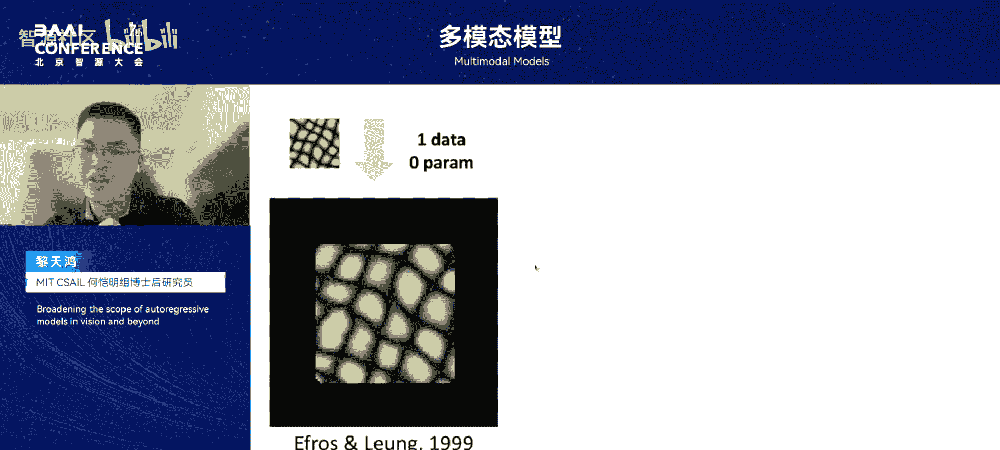
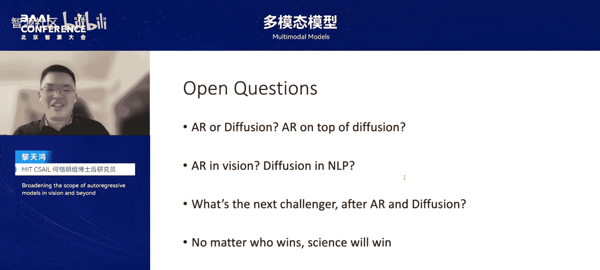

# 多模态模型-p04-Broadening-the-scope-of-autoregressive-models-in-vision-and-beyond：黎天鸿

在本节课中，我们将学习如何拓宽自回归模型在视觉领域的应用，并探讨如何解决其在图像数据上的一些本质问题。课程内容基于黎天鸿老师在2025北京智源大会上的分享，将介绍自回归模型的基本概念、在图像生成中的传统做法及其局限，并重点讲解两项突破性工作：**扩散损失**和**分型生成模型**。最后，我们将一起思考自回归生成模型的根本价值。

## 研究背景与问题定义

在正式进入主题前，我们需要明确要解决的核心问题。本节将介绍自回归模型的基本概念及其在图像生成中的传统应用框架，并分析现有框架的局限与挑战。

### 自回归模型的基本概念

自回归模型的定义是：模型的当前输出依赖于其自身过去的取值，并受一个随机项的影响。这是一个非常通用的定义，并未限定具体的数据类型或模型结构。

早在20世纪70年代，自回归模型已被广泛应用于金融、经济、天气预测等时间序列分析领域。当时对其更狭义的理解是，输出必须是过去若干观测值的**线性组合**。而如今，基于Transformer等非线性神经网络的自回归模型已成为主流。

当前最广为人知的自回归模型代表是大语言模型。2018年，研究者先后提出了基于Transformer的GPT和BERT模型。两者的核心区别在于注意力机制：GPT使用**单向注意力机制**，而BERT使用**双向注意力机制**。在ChatGPT出现后，基于单向注意力的自回归生成模型受到了更多关注。

### 图像生成中的自回归思想

在图像生成领域使用自回归思想的时间比许多人想象的更早。早在1999年，Liu和Tsay就提出了一种非参数的纹理合成方法。该方法通过估计已知纹理样本的条件概率分布，**逐像素自回归采样**下一个像素，从而生成新的纹理图像。整个过程完全基于统计概率估计和随机采样，不包含任何复杂神经网络。

随着深度学习时代的到来，视觉任务转向神经网络。在Transformer出现之前，2016年的PixelCNN和PixelRNN首次提出使用自回归神经网络模型**逐像素生成图像**。2019年，OpenAI推出了著名的ImageGPT，将Transformer架构引入图像建模，进一步验证了自回归框架在视觉生成中的能力。

然而，直接在像素空间建模对Transformer来说计算开销过大。因此，从2021年开始，出现了VQ-GAN等一系列工作。这些工作借鉴了语言模型的思路，最关键的一步是将连续的图像表示成**离散的token**，即**向量量化**。

### 基于向量量化的自回归图像生成框架

当前，基于向量量化的自回归图像生成总体框架如下：
1.  使用一个编码器将原始图像映射到一个较小的潜在空间。
2.  对该空间中的每个向量，通过一个码本寻找最近的**离散编码**进行替换。
3.  将图像转换为离散的视觉token序列。
4.  在此token序列上进行自回归生成。
5.  最后，通过一个解码器将生成的离散token重构回图像空间。

这个框架的核心是依赖一个**向量量化编码器**将图像离散化。

### 向量量化框架的局限与挑战

然而，向量量化本身带来了两个主要挑战：
1.  **训练困难**：量化步骤是不可导的，无法直接进行梯度回传，只能通过**直通估计器**等方法近似，导致训练不稳定，超参数难以调节。
2.  **重建质量有限**：即使是精心训练的VQ编码器，其重建质量也远低于连续型编码器。这意味着下游生成模型从未“见过”高质量的原图细节，严重限制了其生成能力。

训练不稳定和重建质量低是VQ tokenizer的根本缺陷。如果我们始终依赖它为每种数据模态训练单独的tokenizer，将带来巨大的研发和计算开销。

因此，我们认为拓宽视觉自回归模型的关键，并非打造更完美的VQ tokenizer，而是**摆脱对向量量化和tokenizer的依赖**，直接对原始图像进行建模。

## 工作一：连续数据上的自回归生成

上一节我们指出了依赖离散tokenizer的局限。本节中，我们来看看如何让自回归模型直接在连续数据上工作。

### 核心思路：用生成模型替代分类头

传统的离散自回归生成中，模型预测每个token在离散类别上的概率分布，使用**交叉熵损失**进行训练，并通过**类别采样**生成下一个token。

我们将这个流程模块化，它包含两个必要特性：
1.  **损失函数**：为模型提供训练信号，使其逼近目标分布（离散情况下是交叉熵）。
2.  **采样函数**：基于预测的分布进行采样以生成数据（离散情况下是类别采样）。

要将自回归扩展到连续空间，只需在连续域中找到同时具备这两项特性的对应模块即可。而几乎所有主流生成模型都能对连续的条件分布 `p(x_t | z)` 进行建模。

因此，我们引入 **Diffusion Loss** 模块。简单来说，它使用一个非常小的**条件扩散模型**来对每个连续token的条件分布进行建模，从而替代了离散建模中的交叉熵损失模块。

### Diffusion Loss 的实现

Diffusion Loss 模块同样需要损失函数和采样函数：
*   **损失函数**：采用扩散模型中经典的**去噪L2损失**。在一个小型MLP中输入带噪声的连续token，预测噪声。
*   **采样函数**：采用经典的扩散模型采样过程，如DDPM、DDIM等。

这个想法的核心在于，用一个已有的、小的连续生成模型（如扩散模型）去模拟每个token上的连续分布，从而替代之前用于模拟离散分布的softmax分类器。

### 实验结果

实验表明，无论在哪种自回归架构上，只要在连续token上使用Diffusion Loss，其效果始终优于在离散token上使用交叉熵损失。这一差距的根本原因正是向量量化带来的严重信息损失。

基于连续token的模型，只要自回归模型本身容量足够，就可以生成细节丰富、外观逼真的图像，并且随着参数规模增大，呈现出清晰的**缩放定律**趋势。而基于离散token的模型，其生成能力被tokenizer的重建质量所限制。

## 工作二：分型生成模型

上一节我们介绍了如何用扩散损失处理连续token。本节中，我们将进一步探索如何彻底摆脱对tokenizer的依赖，直接对高维像素数据进行自回归建模。

### 核心灵感：自回归模型的递归嵌套

在Diffusion Loss中，我们引入了一个“生成头”来对每个token的分布进行建模。这个“头”本质上是一个生成模型。我们思考：如果把这个生成子模块也替换成另一个自回归模型，会发生什么？如果层层递归、嵌套地使用自回归模型来构建整个体系，会带来怎样的表现？

基于此，我们提出了**分型生成模型**。其核心理念是：将自回归模型本身视为一个迭代函数，用**递归的方式**去逼近数据分布。

### 模型架构：从粗到细的逐级生成

分型生成模型通过自回归模型套自回归模型，形成一个自相似的分型结构，实现从粗到细的逐级生成。

以生成256x256分辨率图像为例，我们构建了4个分型层：
1.  **第一层**：在全图级别，对16x16的图像块之间的顺序关系进行建模。
2.  **第二层**：在每个16x16的图像块内部，对4x4的子块顺序进行建模。
3.  **第三层**：在每个4x4的子块内部，对16个1x1的像素顺序进行建模。
4.  **第四层**：对每个像素的RGB三个通道进行自回归建模。

这种从粗到细、层层递归的建模方式，能将Transformer平方级的计算成本降低到 `O(N log N)` 级别，从而使得**逐像素生成高分辨率原始图像**成为可能。

### 生成过程与结果

生成过程是逐像素进行的：先生成细节像素，再聚合成小子块，然后拼接成大子块，最后组合成完整图像。实验证明，分型生成模型能够逐像素地生成逼真的高分辨率自然图像。

## 总结与思考

本节课中，我们一起学习了如何拓宽自回归模型在视觉领域的应用。我们回顾了自回归模型的基本概念及其在图像生成中的传统做法，并重点分析了对向量量化tokenizer的依赖所带来的根本局限。

为了突破这些局限，我们介绍了两项工作：
1.  **Diffusion Loss**：通过引入一个小的条件扩散模型作为“生成头”，使自回归模型能够直接在**连续token**上进行建模，避免了向量量化的信息损失。
2.  **分型生成模型**：通过将自回归模型**递归嵌套**，构建分型结构，实现了无需任何tokenizer、直接对高维像素数据进行从粗到细的逐级自回归生成。

最后，我们探讨了研究视觉自回归模型的根本动机。自回归模型与其他生成模型（如扩散模型）最本质的区别在于：它并非直接优化高维分布之间的距离，而是将高维分布**分解为多个简单的低维条件分布**并逐一建模。这赋予了它建模极其复杂分布的潜力。

我们认为，自回归模型与其他生成模型并非冲突，而应处于更高层级：如果其他模型能很好地拟合一个图像块的分布，自回归模型就应建模图像块之间的联系；如果其他模型能生成单张图像，自回归模型就应建模多张图像（如视频）之间的联系。这种层级化的建模思想，是自回归框架的独特价值和魅力所在。

无论未来是扩散模型、自回归模型还是其他模型成为主流，科学的探索和进步永不停歇。