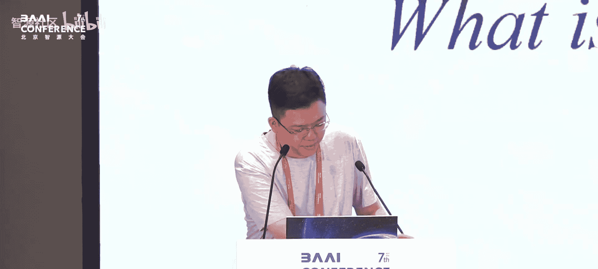
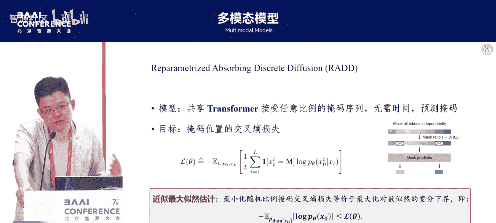
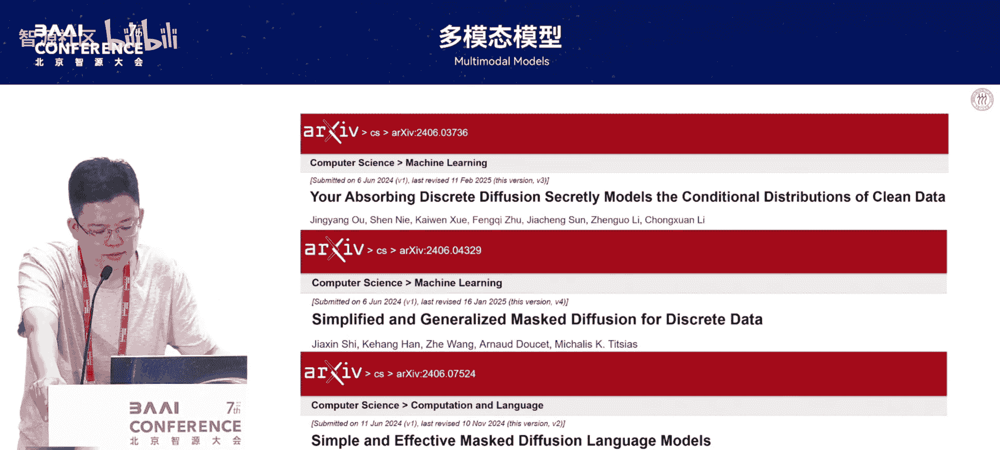
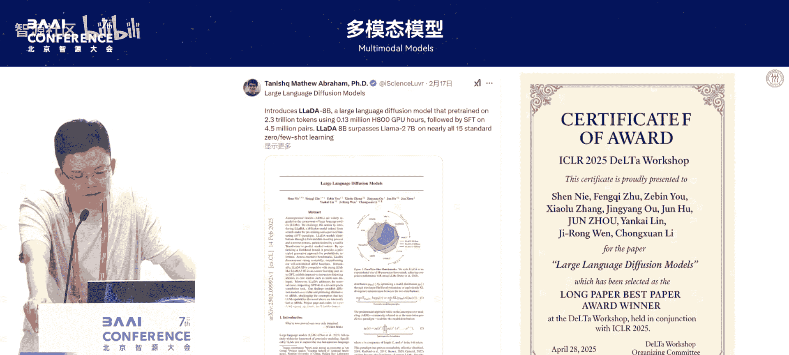
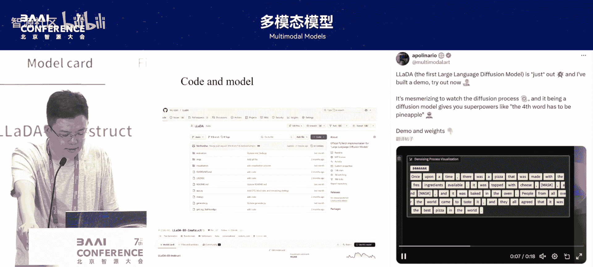
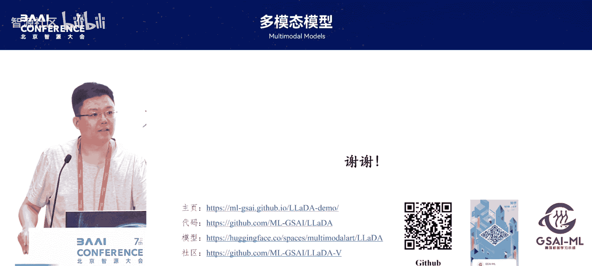

# 多模态模型-p05-大语言模型新范式：李崇轩

在本节课中，我们将学习一种不同于传统自回归模型的语言生成新范式——扩散模型。我们将探讨其研究动机、技术路线，并深入了解一个名为LaDA的具体扩散大语言模型是如何构建和工作的。

---

## 研究动机：自回归是唯一路径吗？

上一节我们介绍了自回归模型在语言生成中的主导地位。本节中，我们来看看探索新范式的动机。

我个人认为，有三个要素帮助生成模型表示高维概率分布：
1.  **网络结构**：Transformer结构在许多模态上都表现出强大的可扩展性。
2.  **模型规模**：扩展规模有助于建模复杂的分布。
3.  **概率建模方法**：这是一种与前两个维度正交的维度。

目前，视觉和语言领域分别主要采用扩散和自回归这两种不同的概率建模方法。一个核心问题是：**自回归是否是实现语言智能的唯一路径？**

自回归模型的核心可以用两个原理总结：
*   **原理一：生成模型**。它通过最大似然估计，优化模型分布与真实数据分布之间的KL散度。公式表示为：`min KL(P_data || P_model)`。当模型足够大、数据足够多时，生成的分布就会接近人类语言。
*   **原理二：链式法则**。它通过链式法则将高维联合概率分解为一系列低维条件概率的乘积，从而实现从左到右的生成。

**第一个观察**：大语言模型的许多优良特性（如可扩展性、指令跟随、情境学习、理论上的压缩极限）主要源于“原理一”，即其作为生成模型的本质，而非其自回归的特性。这些特性理论上也适用于其他生成模型，如扩散模型。

**第二个观察**：大语言模型的一些局限确实源于自回归建模本身。
以下是自回归模型的两个主要局限：
*   **生成速度与长度正相关**：由于其逐词生成的特性，生成时间大致正比于输出长度。工程优化（如KV缓存）减少的是每次迭代的计算时间，而非迭代次数本身。
*   **缺乏双向建模能力**：给定生成顺序（如从左到右）后，模型只能进行单向的条件概率建模，缺乏全局、双向的协同生成能力。这导致已生成的token难以修改，并且需要复杂的技巧（如思维链）来进行反思和修正，效率可能不高。

那么，是否有更好的方案？**扩散模型或许是一种可行的替代路径**。

---

## 技术路线：从连续扩散到离散语言

上一节我们讨论了自回归的局限，本节中我们来看看如何将扩散模型应用到离散的语言生成中。

扩散模型是一个“由粗糙到精细”的迭代生成过程。与自回归不同，它在每一步迭代中都观察并修改所有维度（即所有token位置），因此具有**双向建模能力**，且迭代次数不一定依赖于输出长度。关键挑战在于：如何将连续域上成功的扩散范式迁移到离散的语言上？

我们的技术路线始于2023年6月对离散扩散的探索。2024年6月，我们提出了一个简单有效的离散扩散建模方法——**ReAD**。基于此，我们在2024年10月训练了第一个扩散语言模型，并于2025年2月发布了**LaDA**模型（一个80亿参数的扩散大语言模型），并开源了代码和模型参数。

**离散扩散是如何工作的？**
我们选择了一种与现有Transformer架构和数据预处理高度兼容的方案。其核心过程如下：
1.  **前向加噪过程**：这是一个逐步添加掩码（[MASK]）的过程。在`t=0`时刻是干净文本，在`t=1`时刻变为全掩码文本，中间状态按一定概率比例添加掩码。
2.  **反向去噪过程**：模型需要学习一个反向过程，从全掩码文本逐步预测并恢复出原始文本。我们使用一个共享的Transformer网络来建模这个转移过程，并将时间步`t`作为条件输入。

一个重要的理论发现是，在掩码扩散的设定下，关于时间`t`的函数可以重参数化为一个与`t`无关的核心网络和一个已知的关于`t`的闭式解。这意味着在训练时，我们可以**去掉时间步输入**，直接让网络学习预测掩码位置的真实token，其训练损失是掩码位置上的交叉熵损失。这简化了学习目标，并与BERT等掩码语言模型的训练方式对齐。

然而，BERT使用固定的掩码比例，并非一个完整的生成模型（无法定义联合概率分布并从噪声采样生成）。我们的方法允许**任意比例的掩码**，并保留了完整的生成建模框架。

---

## LaDA模型：构建与验证

上一节我们介绍了离散扩散的基本方法，本节中我们来看看如何将其扩展为一个实用的大语言模型——LaDA。

为了真正验证扩散路径的可行性，我们需要将模型做大。LaDA的训练流程尽量与主流自回归模型对齐：
1.  **无监督预训练**：使用ReAD方法在大规模文本语料上进行训练。
2.  **有监督微调**：使用指令数据。在微调时，只在`response`部分添加掩码，让模型学习基于完整`prompt`的条件生成。
3.  **能力验证**：训练后，模型能够接受用户输入，并从全掩码状态生成连贯的回复。

以下是LaDA在一些关键方面的表现：
*   **下游任务**：在MMLU等20多个主流文本任务上，LaDA与同规模、数据量更大的代表性自回归模型（如LLaMA-3 8B）相比，整体表现相当，基本持平。
*   **双向推理优势**：在一些需要双向推理的任务（如诗词填空、反向问答）上，LaDA展现出一定优势，而自回归模型在这些任务上通常表现不佳。
*   **灵活生成方式**：得益于其建模方式，LaDA支持多种无需微调的采样方式，例如完全随机的扩散采样、分块扩散采样（如每8个token一块）。当块大小设为1时，其采样方式就退化为类似自回归的逐词生成。这为融合不同生成范式提供了机会。

LaDA的工作表明，对于机器学习模型而言，学习人类语言的核心目标是**拟合数据分布**。只要能够更准确地刻画整个句子的联合概率，**从左到右的生成顺序可能并非唯一自然的选择**。

---

## 延伸工作：对齐与多模态

上一节我们看到了LaDA在纯文本上的潜力，本节中我们简要探讨其在价值对齐和多模态理解方面的延伸进展。

**1. 基于强化学习的价值对齐**
LaDA初版仅进行了有监督微调。一个自然的问题是：扩散模型能否与强化学习（RL）有效结合进行价值对齐？主要挑战在于，主流RL方法（如DPO）需要比较策略模型和参考模型在人类偏好数据上的**对数似然**。在自回归模型中，计算似然是直接的。但在扩散模型中，似然是通过变分下界估计的，且估计过程涉及双重随机采样（对时间步和掩码状态采样），会引入较大的方差。

我们提出了方差缩减技术来解决这个问题，例如优化采样分配、在比较似然时固定部分随机性。应用这些技术后，LaDA在RL对齐后获得了全方位的性能提升，其提升幅度与同规模自回归模型相当，证明了扩散模型RL对齐的可行性。

**2. 统一的多模态理解**
我们的最终愿景是建立一个统一的概率建模框架来处理多模态。Transformer已统一了架构，如果概率建模方法也统一，那么多模态处理将更加一致。在LaDA解决语言生成的基础上，我们将其扩展到了多模态理解。

我们采用了一个简单的方案：沿用LaDA的语言模型部分，并利用约1000万的图文/视频-文本数据进行了视觉指令微调。实验发现，尽管纯文本能力上LaDA仍落后于顶尖自回归模型，但在进行多模态指令微调后，其在**多模态理解任务上的表现显著提升**，甚至与当时顶尖的视觉语言模型结果接近。这表明**扩散模型在多模态领域的潜力尚未被充分挖掘**，其统一的生成范式可能带来优势。

---

## 总结与展望

本节课中，我们一起探索了使用扩散模型进行语言生成的新范式。

我们首先分析了自回归模型的优势与局限，提出了扩散模型作为一种互补路径的动机。接着，我们介绍了将连续扩散适配到离散语言的技术路线，特别是**ReAD方法**。然后，我们深入了解了**LaDA扩散大语言模型**的构建、训练过程及其在文本生成、双向推理任务上的表现。最后，我们展望了扩散模型在价值对齐和多模态统一理解方面的初步进展和未来潜力。

当前，扩散语言模型仍处于早期阶段，在纯文本能力上与顶尖自回归模型尚有差距。但它提供了不同的生成视角、潜在的速度优势（通过采样加速）以及更统一的多模态建模可能性。未来，在模型架构、训练方法和加速推理等方面，仍有大量探索空间。