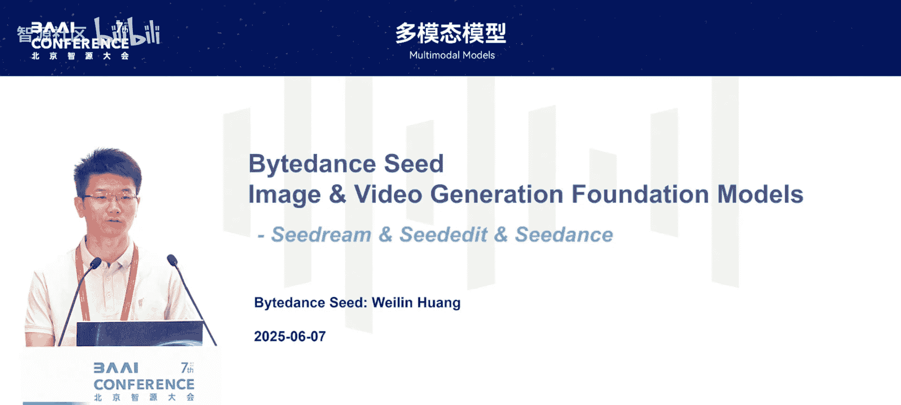
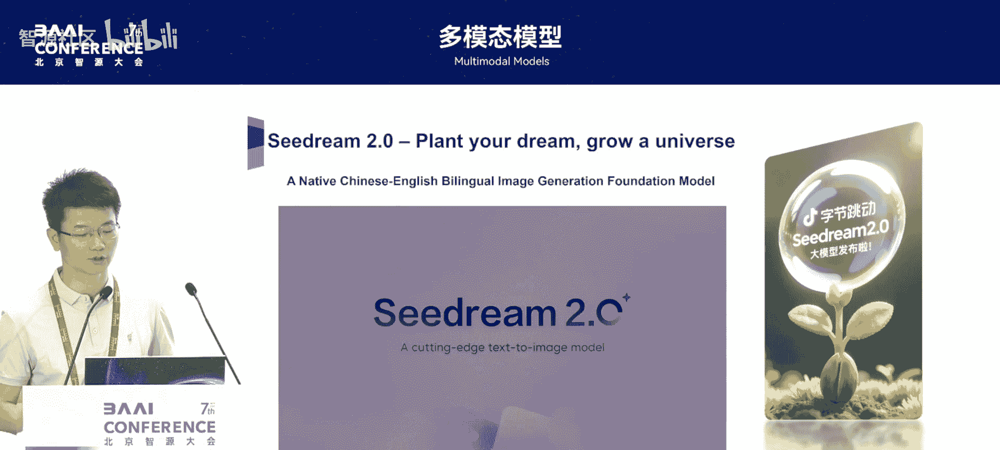
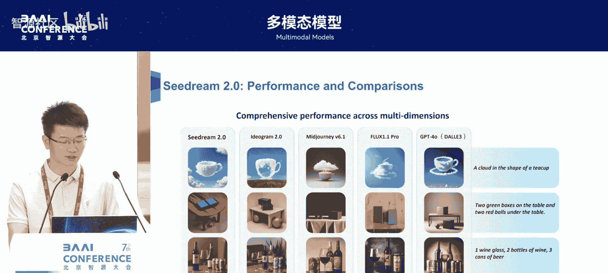
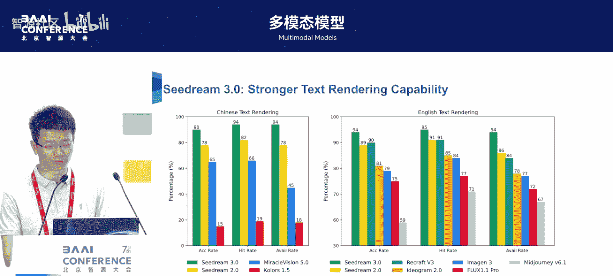
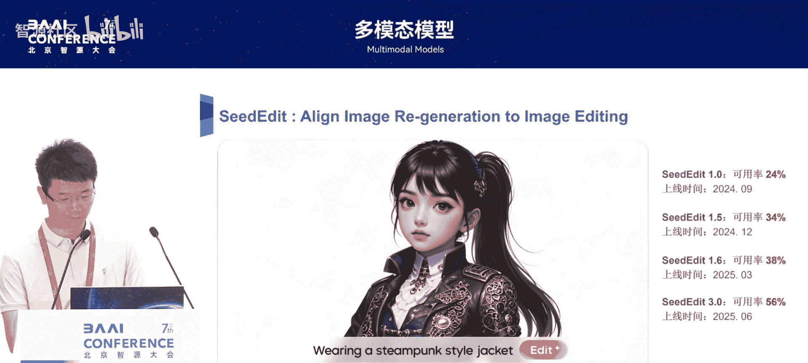
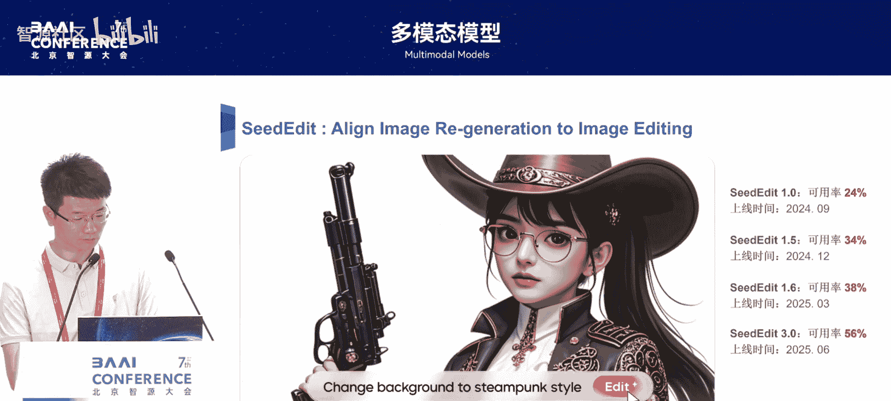
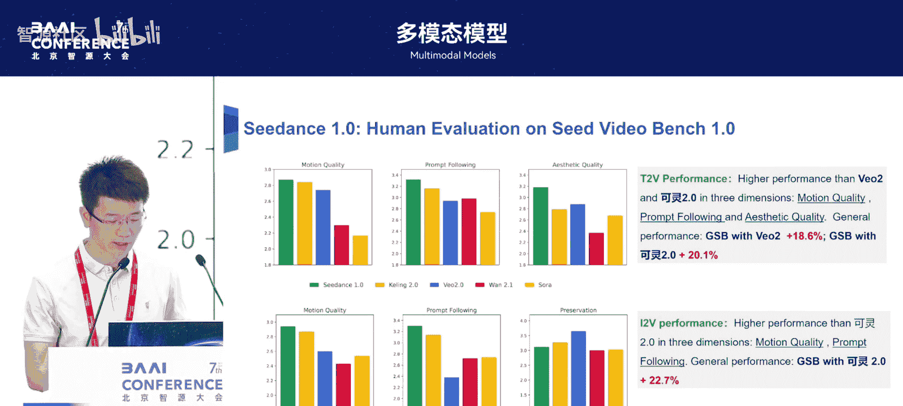
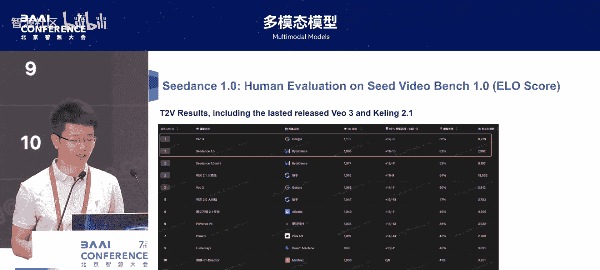
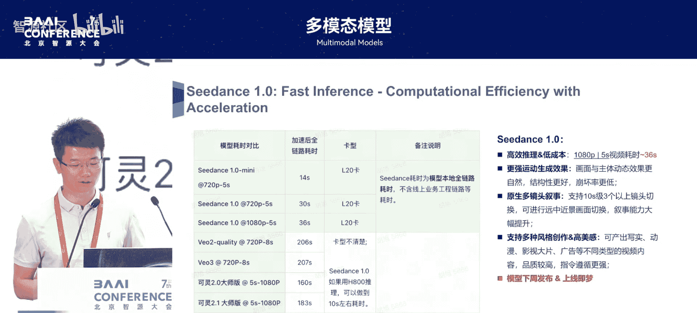
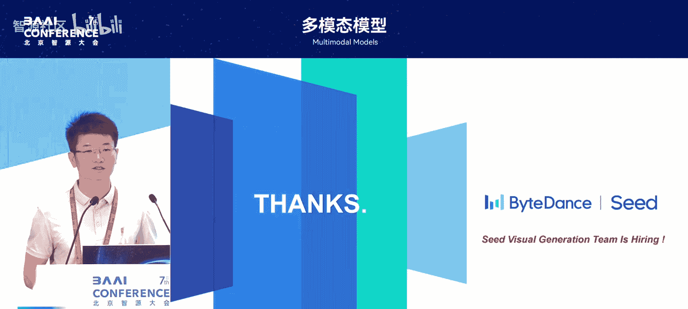

# 多模态模型-p06-Bytedance-Seed-Image-&-Video-Generation-Foundation-Models：黄伟林

在本节课中，我们将学习字节跳动在图像与视频生成基础模型方面的技术进展。课程将涵盖三个核心模型：两个图像生成与编辑模型，以及一个即将发布的视频生成模型。我们将了解它们的设计思路、关键技术点以及如何实现商业化落地。

## 🖼️ 图像生成模型：Seed Dream 2.0 与 3.0

上一节我们介绍了课程的整体内容，本节中我们来看看第一个图像生成模型 Seed Dream 2.0。该模型于2024年8月上线，主要目标是打造一个中文能力与美感俱佳的双语生成模型。

### 核心设计目标与挑战

当时业界的模型存在几个关键短板，而我们认为这些对于商业落地至关重要。因此，我们重点优化了以下方面：
*   **基础生成能力**：提升提示词（prompt）的理解与响应能力。
*   **文字渲染**：解决文字生成不准确的问题。
*   **中国元素生成**：更好地理解和生成具有中国文化特色的内容。

### 关键技术方案

为了实现上述目标，我们主要从数据和模型架构两方面进行了创新。

**1. 多层次数据系统**
我们构建了一个高效的数据系统，从多个维度对数据进行筛选和优化：
*   **质量筛选**：选取美感强、质量高的数据。
*   **分布与多样性**：通过超大规模聚类方法，确保数据覆盖全面且避免重复。
*   **知识增强**：建立文本知识库，扩展数据结构，增强模型的知识性。
*   **针对性优化**：针对模型的薄弱环节，进行专门的数据检索与优化。

在过去一年中，我们处理的数据规模增长了5到10倍。

**2. 创新的模型架构**
我们在模型架构上做了三项关键改进：
*   **采用Decoder-Only语言模型**：在23年底率先将仅解码器（Decoder-Only）架构用于文本编码器（T5 encoder），取代了当时主流的T5或CLIP文本编码器。这带来了原生中文理解能力的提升，并能跟随语言模型的快速迭代而升级。
*   **强化文字生成**：专门针对文字生成这一重要特性进行优化。
*   **引入DiT架构**：自2023年上半年起采用扩散变换器（Diffusion Transformer， DiT）架构，该架构在扩展数据和模型规模时能带来稳定高效的性能提升。

**3. 持续优化与迭代**
在2.0版本之后，我们通过以下方式持续提升模型：
*   **训练奖励模型（Reward Model）**：针对图文匹配、美感和文字渲染等关键能力，分别训练了专门的奖励模型。
*   **精细化数据标注**：与设计师合作，迭代优化用于训练奖励模型的数据。
*   **采用直接偏好优化**：使用直接奖励（Direct Reward）方法进行优化，相比DPO等方法，在生成任务上更高效。

### 模型效果

Seed Dream 2.0在多项指标上达到业界第一梯队水平，特别是在图文匹配、复杂提示词响应以及中国元素生成方面表现突出。

---

从2.0到3.0，我们实现了能力的又一次飞跃。Seed Dream 3.0于今年4月上线，其核心是进行了约6倍算力的扩展，带来了显著的效果提升，内部评测可用率从40%+提升至65%左右。

### 3.0版本的升级点

以下是3.0版本的主要改进：

**1. 数据与训练**
*   数据质量更高，规模比2.0增长约3倍。
*   对文字生成（OCR）数据进行了更精细的优化。
*   在监督微调（SFT）阶段，从追求“通用美感”转向追求“艺术美感”，并为此构建了高质量数据集。

**2. 模型架构与推理**
*   模型参数规模增大。
*   改进了生成流程（pipeline），从两阶段（基础模型+细化模型）升级为单阶段直接生成2K/4K分辨率图像。
*   在推理阶段进行了极致优化，大模型生成时间可缩短至约3秒，极具速度优势。

**3. 奖励模型**
*   采用大语言模型（LLM）作为奖励模型，带来了明显的效果收益。

### 3.0版本效果

3.0在各项评测中均保持领先，基础能力（如肢体结构、复杂构图）大幅增强，文字生成准确率与召回率显著提升。与同期模型相比，在中文文字生成、小字符及排版方面更具优势。

---

## ✏️ 图像编辑模型：从C2 1.0 到 3.0

上一节我们介绍了图像生成模型，本节中我们来看看图像编辑模型的发展。编辑模型旨在实现“一键P图”，即根据指令修改图像。从去年9月的C2 1.0到昨天发布的3.0，其可用率实现了从24%到56%的跨越，使其能够广泛应用于广告、设计等商业场景。

### 技术方案：基于反演（Inversion）的编辑框架

我们的核心思路是在预训练的文生图（T2I）模型和视觉理解（VL）模型基础上，通过反演技术构建编辑模型。关键在于平衡两种能力：
*   **重建/保持能力**：保留原图中不需要修改的部分。
*   **编辑/响应能力**：准确修改指令要求的部分。

**框架简述**：
1.  输入原图和编辑指令。
2.  视觉理解模型会结合图像和指令，生成描述“编辑前”和“编辑后”状态的文本。
3.  将这些文本通过交叉注意力（Cross-Attention）机制输入到扩散模型中，引导其生成编辑后的图像。

该框架简洁，但其效果高度依赖于**高质量的训练数据构建**，即需要大量（原图，编辑指令，目标图）的三元组数据。

### 3.0版本的改进

3.0版本在1.0基础上进行了多项升级：
*   **基础模型升级**：将底层的T2I模型从Seed Dream 2.0升级到3.0。
*   **理解模型升级**：采用了更强的视觉理解模型。
*   **数据与训练优化**：进行了更精细的数据设计，并通过指令微调（Instruction Tuning）增强模型对编辑任务的理解。
*   **身份（ID）保持**：针对人物编辑，引入了人脸身份保持损失（Face ID Loss），确保编辑前后人物一致性。

这些改进使得模型在指令响应和图像一致性两个维度上更加均衡，综合效果优于主流竞品。

---

## 🎥 视频生成模型：Seed Dance 1.0

前面我们探讨了图像生成与编辑，本节我们将视野扩展到视频生成。我们的视频生成模型Seed Dance 1.0将于下周发布，它在提示词响应、运动稳定性和风格化方面均有出色表现。

### 模型架构设计

Seed Dance 1.0的架构围绕高效性设计，主要包括三个部分：

**1. 文本编码器（Text Encoder）**
继承了图像模型的优势，采用反演训练的大语言模型，并结合精细的提示词处理，使模型具备极强的提示词响应能力。

**2. 3D VAE（三维变分自编码器）**
采用常规设计，使用16倍时间下采样和4倍空间下采样的3D VAE，将视频压缩到潜在空间。

**3. 时空扩散模型**
我们设计了一个高效的时空U-Net架构：
*   **时空注意力交错**：交替使用空间注意力和时间注意力，提升效率。
*   **窗口注意力（Window Attention）**：在时间维度使用窗口注意力，大幅节省计算量。
*   **级联（Cascaded）架构**：先生成低分辨率（如480p）视频，再通过超分辨率模型提升画质。

### 数据处理与训练

高质量数据是视频模型的关键：
*   **数据源多样性**：收集多种来源的视频数据。
*   **多阶段过滤**：对数据进行离线的多阶段清洗和过滤。
*   **动态描述词**：为视频帧生成静态和动态的描述词，使文本描述更准确。

### 训练与推理流程

推理流程主要包括：提示词处理 → 文本编码 → 基础视频生成 → 奖励模型优化 → 超分辨率。
我们采用了**直接奖励优化**方法，相比DPO等，在视频任务上效果更稳定。我们训练了三个奖励模型，分别针对：基础质量、运动平滑度和视频美感。

### 模型性能

根据内部评测，Seed Dance 1.0的效果处于业界第一梯队。在性能上，其全链路模型耗时仅需36秒即可生成5秒的1080P视频，推理效率显著高于同类高性能模型。此外，它还支持原生多镜头切换、丰富的风格创作与美感控制。

---

## 📝 总结与展望

本节课中，我们一起学习了字节跳动在多模态生成模型上的进展：
1.  **图像生成**：从Seed Dream 2.0到3.0，我们系统性地解决了图文匹配、结构稳定性等基础问题，并显著提升了文字生成和艺术美感，使其成为可靠的生产力工具。
2.  **图像编辑**：通过基于反演的框架，持续优化数据与模型，实现了高可用性的“指令式”图像编辑能力。
3.  **视频生成**：即将推出的Seed Dance 1.0采用高效架构设计，在生成质量、运动稳定性和推理速度上均有竞争力。

未来，我们将致力于打造统一的**多模态生成模型**，整合图像、编辑、对话等多种能力，并继续推进视频生成等模型的商业化落地。