# 多模态模型-p07-从推理优先的角度启发新的预训练范式：宋佳铭

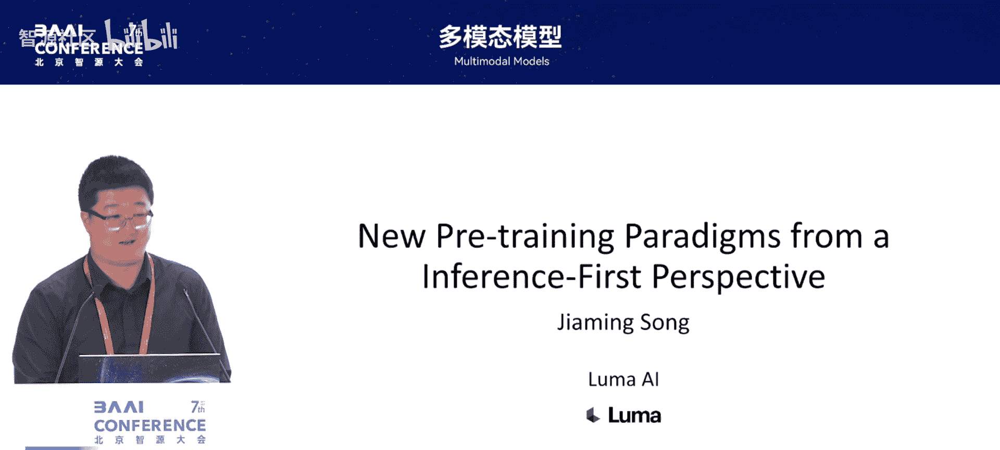

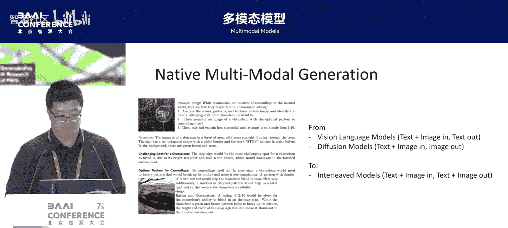

在本节课中，我们将学习如何从推理过程的角度出发，分析和设计新的预训练算法范式。我们将探讨现有主流生成模型（如自回归模型和扩散模型）在推理扩展性上的特点与局限，并介绍一种“推理优先”的思考框架，以启发更高效、更强大的模型设计。

---

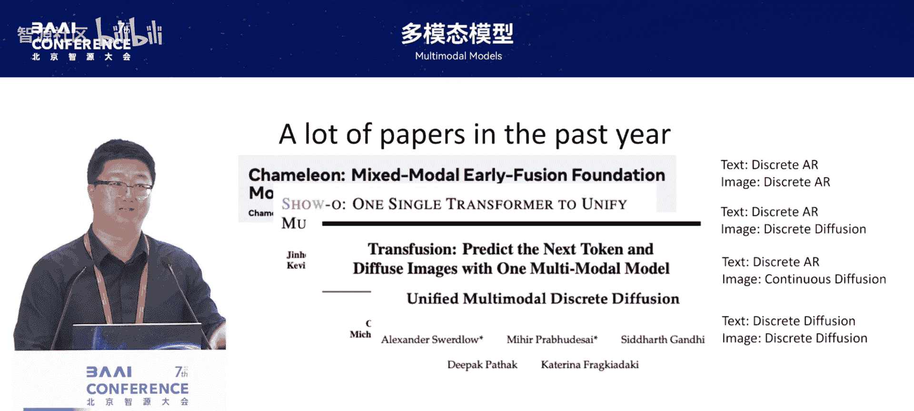

## 现有成熟方案的推理维度扩展

上一节我们介绍了课程的主题。本节中，我们来看看如何从两个维度分析现有生成模型的推理扩展能力。

一个核心观点是，模型在推理时（即生成内容时）的扩展能力至关重要。这种扩展主要分为两种简单类型：

以下是两种主要的推理扩展维度：

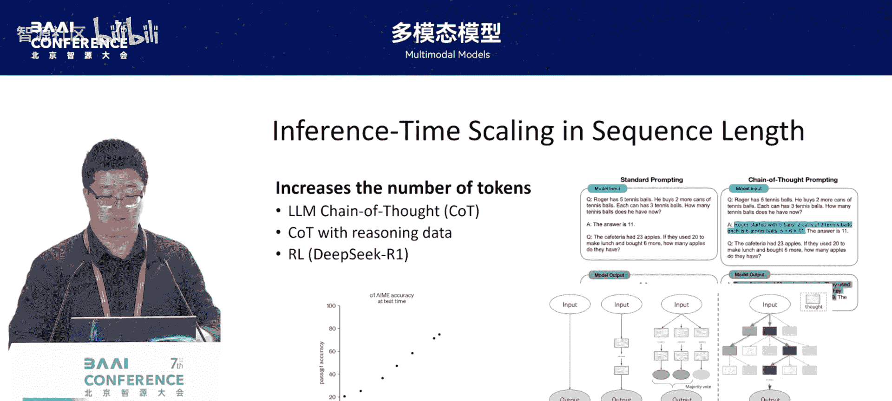

1.  **增加序列长度**：通过生成更多的token来扩展推理过程。这在语言模型中很常见，例如通过思维链（Chain-of-Thought）等技术来提升复杂推理能力。训练算法可能从最初的监督微调（SFT）发展到最新的强化学习（RL）方法。
    
2.  **优化已有token**：不增加token数量，而是对已有的token表示进行多步迭代优化。这更接近于扩散模型或流匹配模型的做法。模型通过增加优化步数（如扩散步数）来提升生成质量。
    

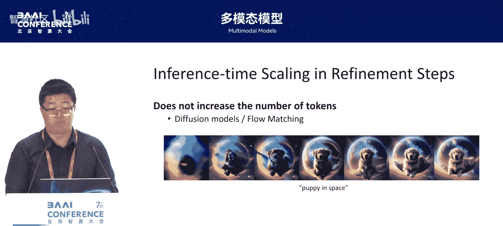

我们可以通过一个坐标系来总结现有算法在这两个维度上的表现：

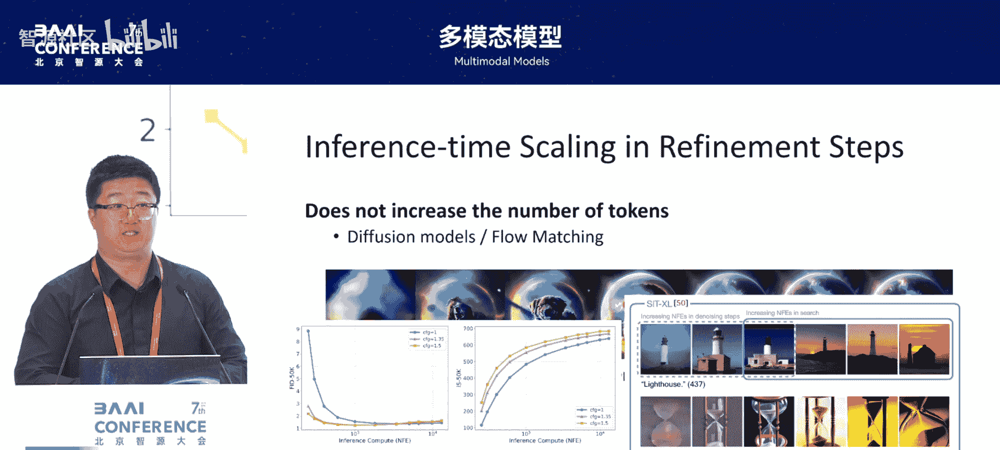

*   **两个维度都不扩展**：例如变分自编码器（VAE）、生成对抗网络（GAN）或标准化流（Normalizing Flow）模型。
*   **仅扩展序列长度**：例如GPT系列等自回归模型。它们通过预测下一个token来延长序列，但每个token只生成一次。
*   **仅优化已有token**：例如标准的扩散模型。它们从一个噪声起点开始，通过多步去噪生成最终结果，序列长度在开始时即已确定。
*   **两个维度都扩展**：这是更强大的范式。一种常见模式是外层循环扩展序列长度，内层循环优化当前序列。这基本上是将自回归和扩散模型结合的做法，例如在生成每个新token时，都对其进行多步扩散优化。也有一些工作探索了相反的循环顺序。

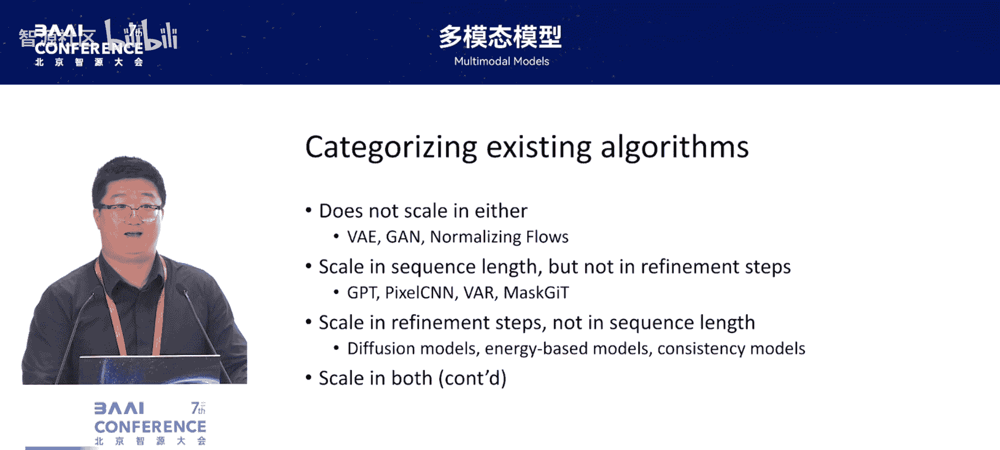

---

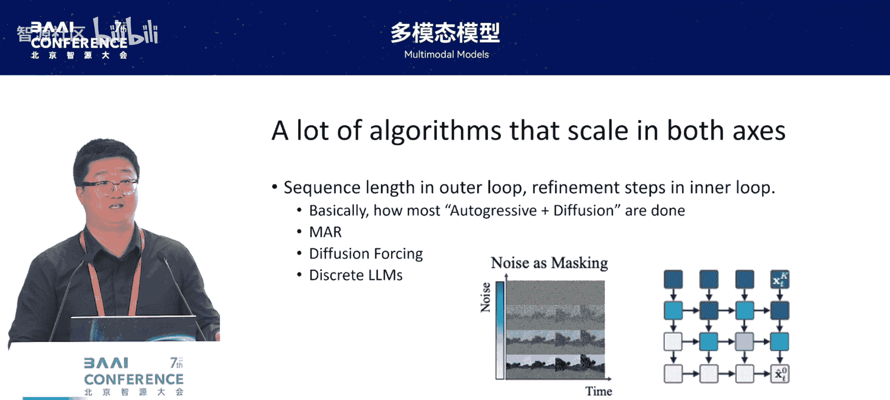

## 推理效率的重要性

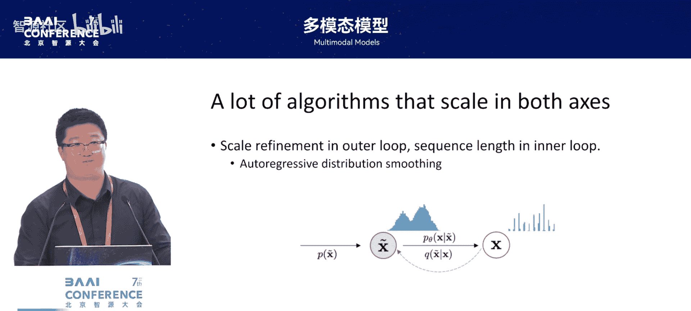

上一节我们介绍了模型在推理时需要具备扩展能力。本节中我们来看看，仅有扩展能力是不够的，扩展的效率同样关键。

如果一种方法的扩展效率极低，那么其实用价值就很小。一个极端的例子是“无限猴子定理”：让无数只猴子随机敲打打字机，经过无限时间，理论上能打出任何著作，但因其效率低下而毫无实际意义。

在现实的人工智能进展中，高效的推理扩展往往是成功的关键。例如，在AlphaGo的开发中，其突破不仅在于使用了强化学习算法，更在于利用深度神经网络更高效地评估棋局价值，从而极大地提升了搜索和推理的效率。

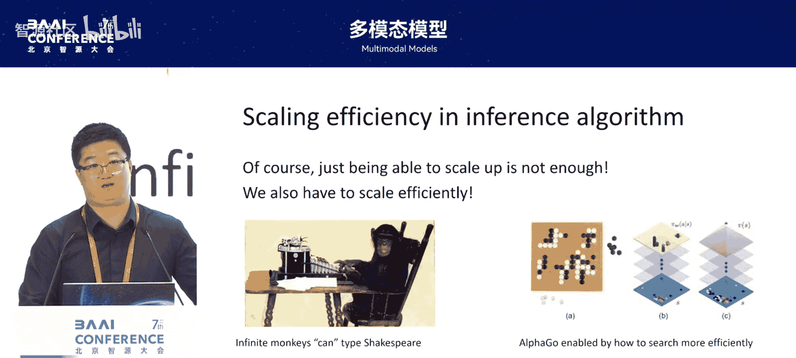

基于以上观察，可以得出几个核心观点：

1.  未来的优秀算法，在推理时都应具备在上述两个维度上进行可控扩展的能力。
2.  在假设模型容量足够大（即具备通用近似定理下的强大拟合能力）的前提下，我们希望其推理扩展的效率越高越好。
3.  在设计训练方法之前，应先分析算法如何进行推理。通过理解推理过程，可以发现现有算法的缺陷，并找到优化方向。

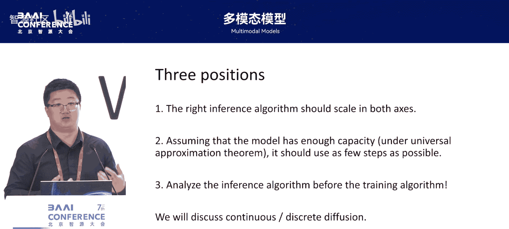

---

## 连续空间案例：扩散模型的次优性

上一节我们建立了“推理优先”的分析框架。本节中，我们以连续空间中的扩散模型为例，应用这个框架进行分析。

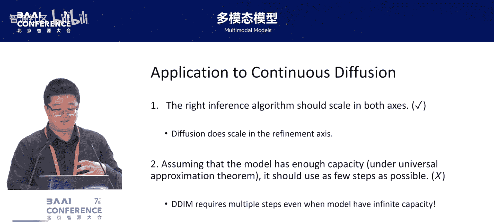

首先检查扩散模型是否符合前两个观点：
*   **观点一（可扩展）**：符合。扩散模型可以通过增加去噪步数来获得更好的生成效果。
*   **观点二（高效率）**：不符合。即使模型表达能力无限，由于标准扩散模型的训练目标（在强噪声下预测数据均值）和采样方式（如DDIM）的限制，它无法在一步内生成高质量结果。有人可能会想：能否保持DDIM采样方式，但换用更强的训练方法（如蒸馏）来逼近一步生成？答案通常是否定的。

接下来我们深入推理过程，证明DDIM为何无法成为最优解。我们期望的理想采样器应满足：
*   **正确扩展**：对于任意步数N，都存在一个模型能在N步内生成正确的数据分布。
*   **高效生成**：当模型能力无限时，应能一步生成正确分布。

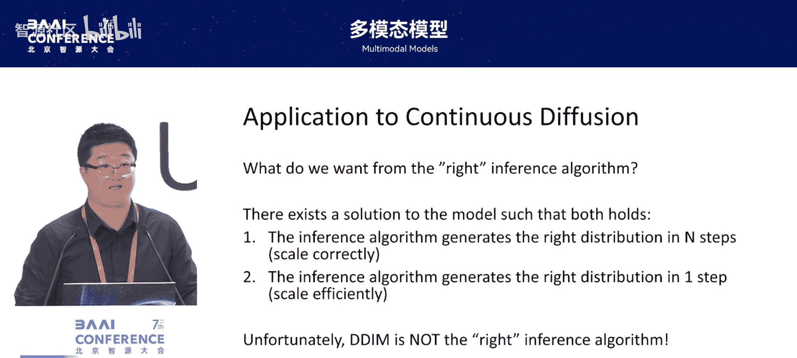

然而，DDIM的采样过程存在根本限制。其采样规则可以简化为一个**线性插值**公式：
`x_{s} = (1 - λ) * x_t + λ * model(x_t, t)`
其中，`x_t`是当前步的带噪数据，`model(x_t, t)`是模型预测的去噪方向，`λ`是一个系数，`x_s`是下一步的结果。

问题在于，无论模型`model`的能力有多强，下一步状态`x_s`始终是当前状态`x_t`和模型预测值的**线性组合**。这种线性形式限制了其表达能力。如果一个模型被训练成能在一步内生成完美结果，那么当把同样的采样算法应用到多步时，这个模型可能反而会出错。

一个直观的解决方案是：既然对下一步`x_s`的灵活性不足，我们就让模型直接参与决定从`x_t`到`x_s`的路径。具体来说，让模型同时接受**起始时间步**和**目标时间步**作为输入，即`model(x_t, t, s)`。这样，模型就能学习更复杂的跨步映射关系，从而解决表征能力受限的问题。这种思想在一些新工作中已有体现，被称为“流匹配”或“一致性模型”框架。

---

## 新的算法探索：归纳匹配

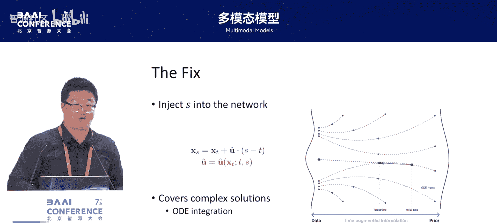

上一节我们分析了DDIM的局限性并提出了改进方向。本节中，我们介绍一种符合理想推理框架的新算法——归纳匹配。

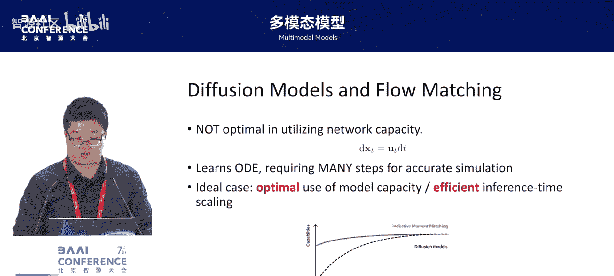

在确定了更灵活的推理算法（模型接受起止两个时间步）后，可以采用多种方式进行训练。例如，已有工作如Consistency Model、Rectified Flow、Flow Matching以及最近的MEFlow都符合这一框架。

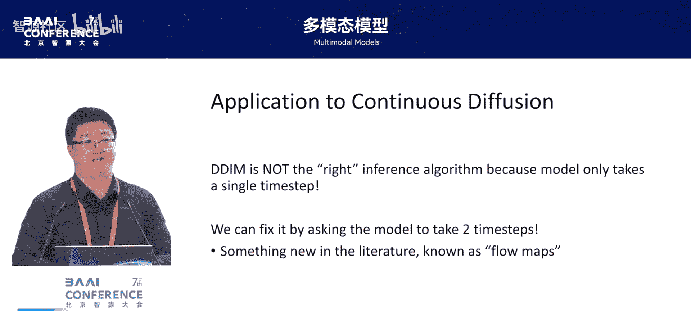

我们提出的**归纳匹配**算法，旨在满足理想训练算法的要求：既能进行稳定的单阶段训练，又能实现快速、高质量的生成。之前的算法往往难以兼顾：扩散模型单步生成效果差；而一些蒸馏方法训练则不够稳定。

归纳匹配的核心思想是确保模型在不同路径上预测的一致性。假设有三个时间点 `s < r < t`。我们希望模型从`x_t`直接预测`x_s`的结果，与模型先从`x_t`预测`x_r`、再从`x_r`预测`x_s`的结果，二者应该保持一致。我们使用一种稳定的训练方法来衡量和优化这种一致性，例如基于**最大平均差异**的方法，它类似于GAN但训练更稳定。

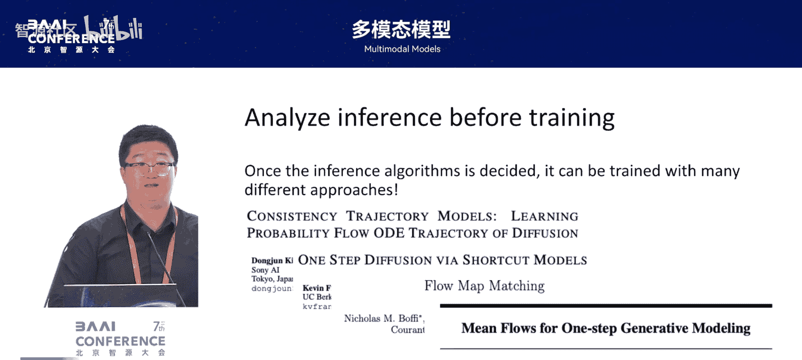

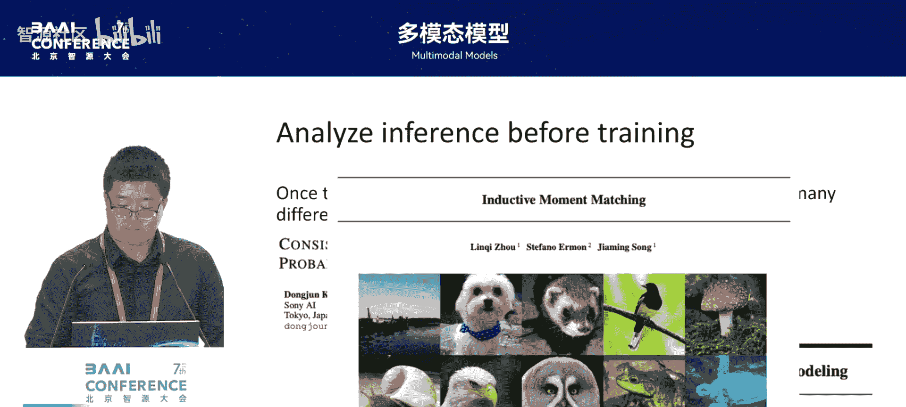

归纳匹配具有以下优势：
*   **单阶段训练**：只有一个统一的训练目标。
*   **一致性扩展**：是Consistency Model思想的扩展。
*   **稳定高效**：训练稳定，且能用极少的步数达到接近扩散模型多步采样的效果。

实验表明，在图像生成任务上，归纳匹配能在采样计算量和生成质量（FID分数）之间取得更好的平衡。

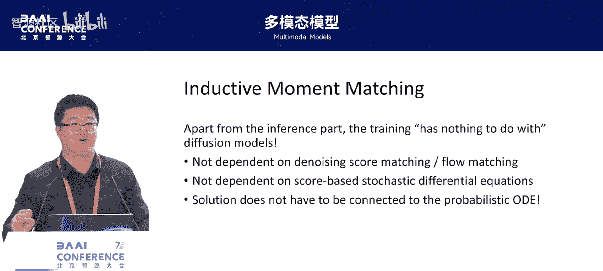

---

## 离散空间案例：掩码扩散模型的分析

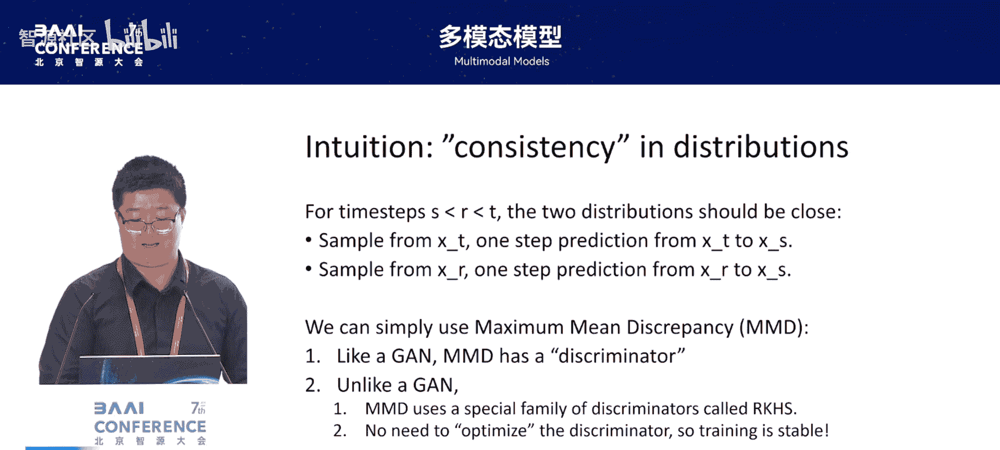

上一节我们探讨了连续空间中的改进。本节中，我们将“推理优先”的框架应用到离散空间，分析如掩码扩散模型这类方法。

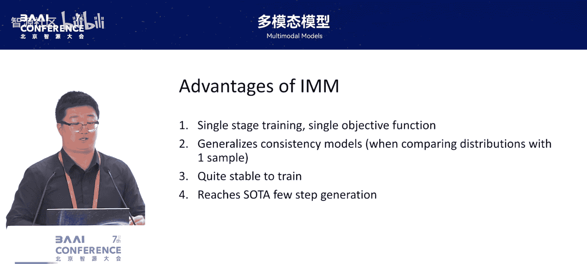

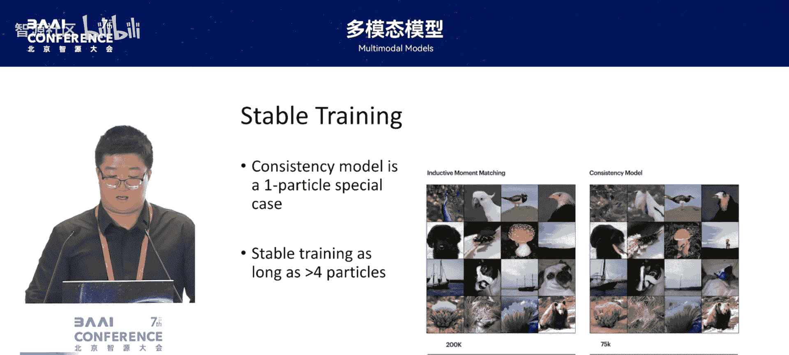

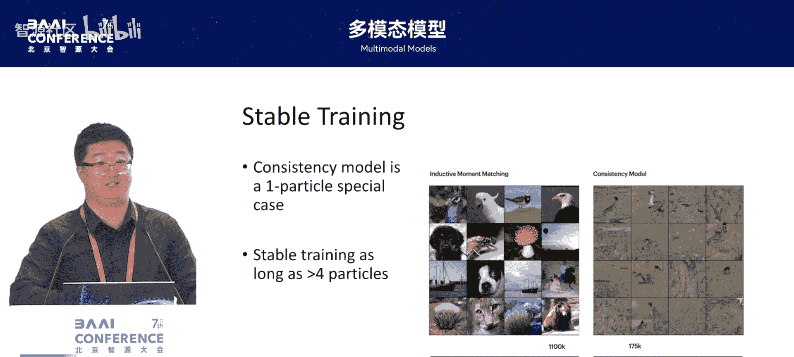

以掩码扩散模型为例，其推理过程是：从全掩码的序列开始，通过多步迭代，每次预测一部分被掩码的token，逐步还原完整序列。

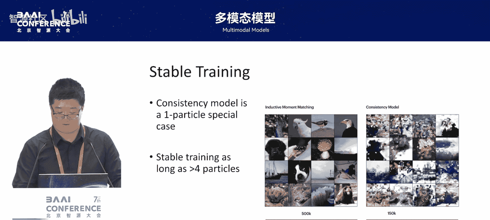

这里存在一个关键假设：一旦某个位置的token被预测出来并“去掩码”，在后续步骤中它将保持不变，模型只会修改仍被掩码的部分。

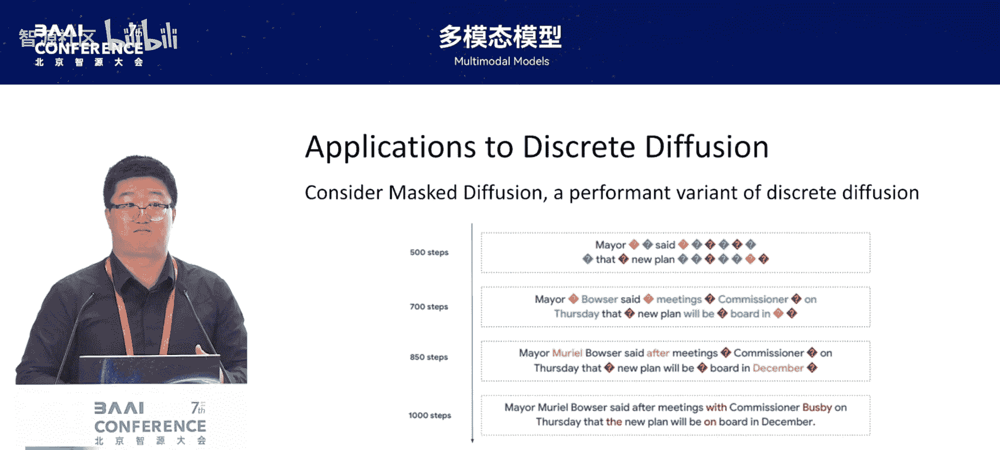

这带来一个问题：如果序列长度为`N`，而我们希望推理迭代步数`L`远小于`N`（以实现加速），那么根据鸽巢原理，至少在某些步骤中，模型必须**同时预测多个token**。

这时，使用类似BERT的编码器架构可能会遇到限制。考虑一个简单例子：需要同时预测“high _”和“_ car”两个掩码位置。合理的预测组合可能是“high car”或“to pair”。然而，标准的掩码语言模型会**独立地**为每个掩码位置进行预测和采样。这意味着，它同样有可能采样出“high pair”或“to car”这种不合理组合。这是因为模型对多个掩码token的预测是条件独立的。

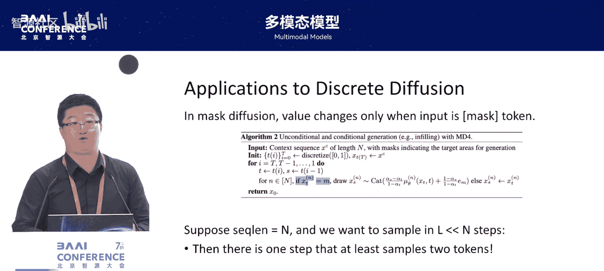

因此，如果我们关注的任务是快速生成序列（步数远少于序列长度），那么由于基础架构的条件独立性假设，可能会限制模型的最终性能或效率。

---

## 总结与启示

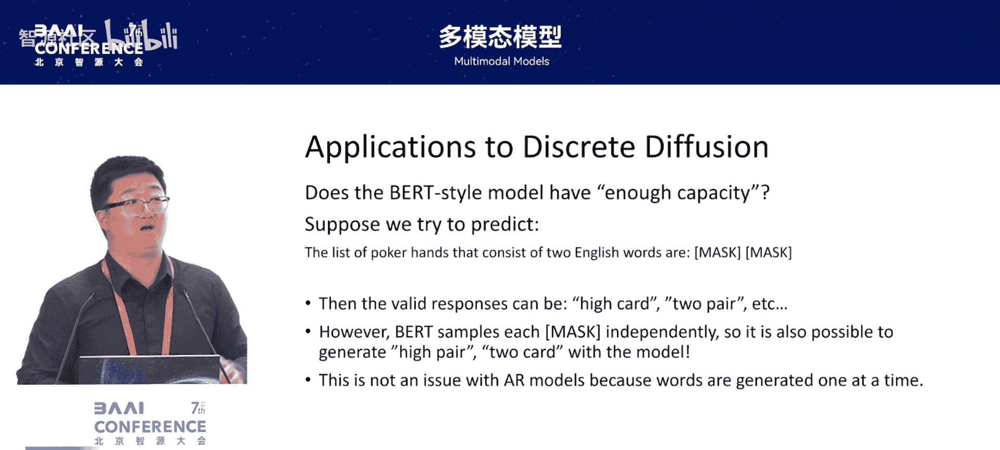

本节课中我们一起学习了如何从“推理优先”的视角来审视和设计生成模型。

核心总结如下：
1.  **推理是关键**：在设计预训练算法时，应优先考虑模型将如何进行推理（生成），然后再设计相应的训练方法。推理方案的选择相对有限，而训练方法可以多种多样。
2.  **分析现有局限**：通过分析推理过程，我们可以更深刻地理解当前主流模型（如DDIM、掩码扩散模型）的固有限制，这些限制可能源于其采样规则或架构假设。
3.  **启发新的方向**：这种思路能启发新的改进。在连续空间，它引导我们设计像归纳匹配这样更灵活、高效的采样器；在离散空间，它帮助我们认识到在加速生成时，需要超越简单的条件独立预测，探索能更好处理多token联合预测的架构或推理机制。

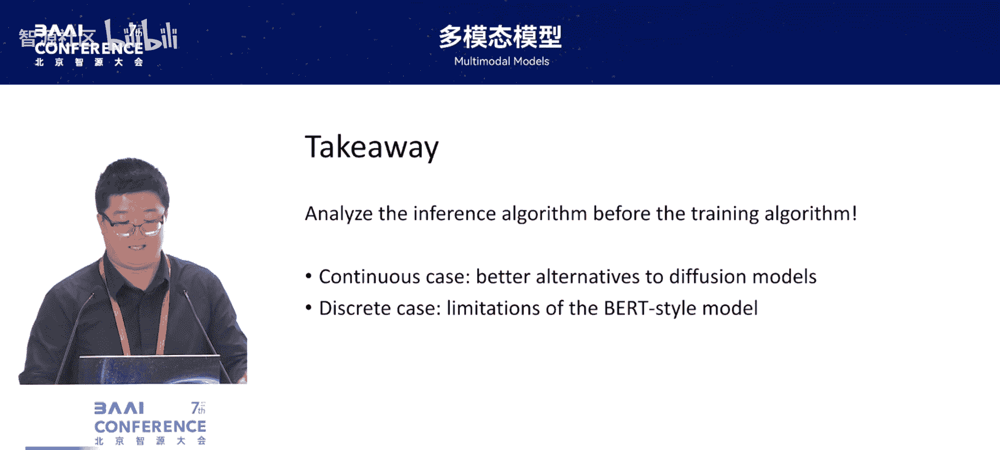

总而言之，“推理优先”的范式为我们提供了一种强大的分析工具，有助于打破现有算法的性能上限，推动下一代生成模型的发展。