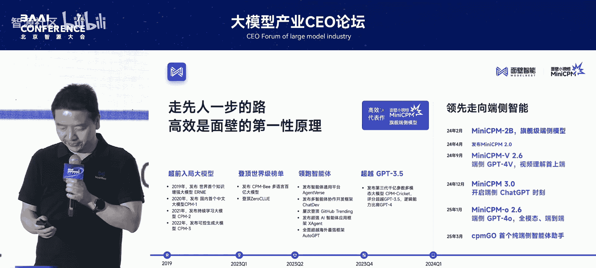
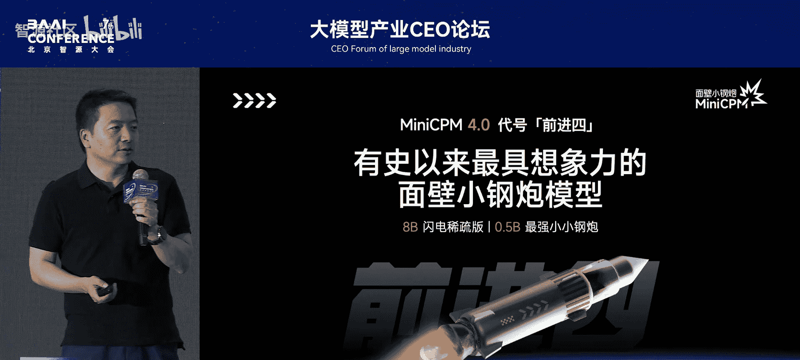
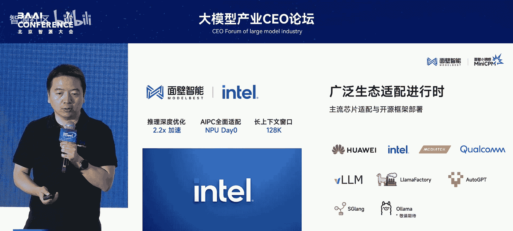
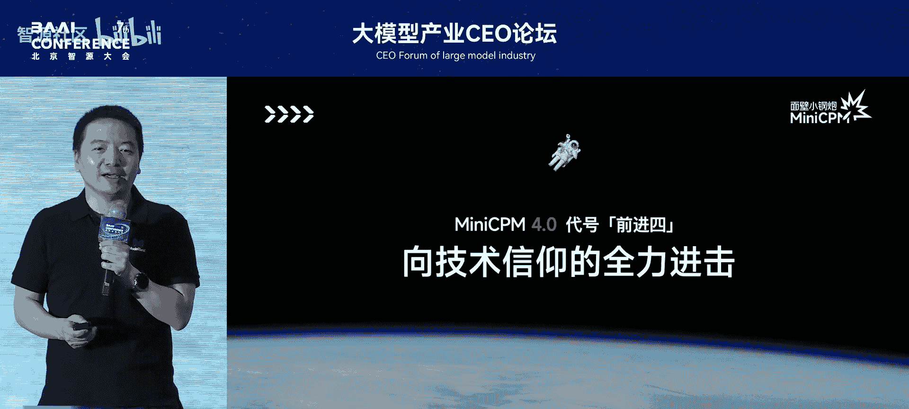
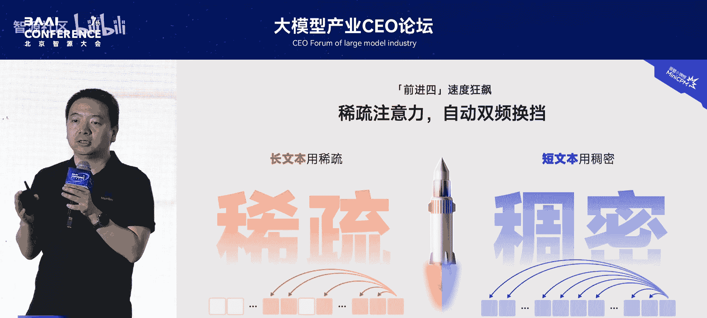
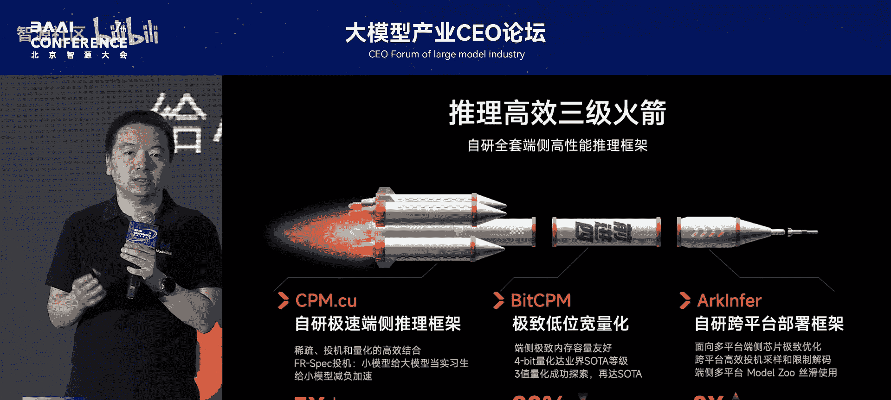
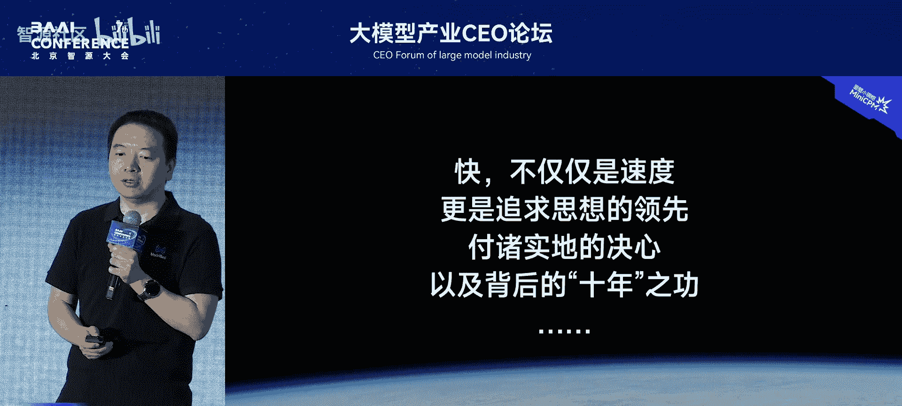
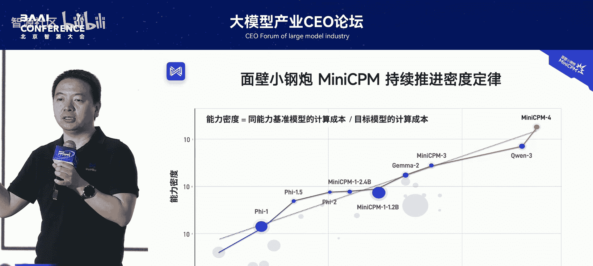

# 大模型产业CEO论坛-p01-高效大模型路径探索：李大海

在本节课中，我们将学习面壁智能如何通过技术创新，打造高效、快速且性能强大的端侧大模型“小钢炮4.0（前进四）”。我们将探讨其背后的核心思路、技术架构以及应用前景。



## 公司介绍与技术聚焦

面壁智能是一家技术全栈的大模型公司，覆盖从架构、数据、模型预训练、对齐强化学习到智能体的完整技术链。然而，公司将所有技术力量聚焦于**端侧大模型**的开发。

之所以选择端侧，是因为我们洞察到大模型发展的一个关键趋势：**知识密度**越来越高。这一趋势使得在终端设备上运行强大模型成为可能，并大有可为。

## 产品矩阵与市场认可

自2024年2月起，公司持续发布端侧大模型，主要分为三类：
*   **语言基座大模型**：纯语言版本。
*   **多模态大模型**：专注于图像、视频和声音的理解。
*   **全模态大模型**：更接近人类大脑，能同时处理视觉、听觉和语言任务。面壁智能是全球首个将全模态模型做到端侧的公司。



在接近10个版本的迭代中，这些模型在全球获得了超过1000万次下载，得到了广大开发者的认可，并被众多智能硬件创业者用于产品开发。

## 全新发布：小钢炮4.0 “前进四”

本次发布的核心是全新的“面壁小钢炮4.0”模型，代号“前进四”。这个名称源自科幻作品，寓意达到最快的巡航速度，体现了本次模型最大的特点：**快**。

本次开源了两个版本：
1.  **8B稀疏版本**：针对长上下文场景进行了优化。
2.  **0.5B超级硬核版本**：极致轻量化模型。

### 性能表现：又快又好

上一节我们介绍了模型发布概况，本节中我们来看看其具体的性能表现。“快”是核心优势，但并未牺牲质量。

*   **速度优势**：在需要140K长上下文的极端场景下，得益于稀疏化技术，避免了内存溢出和速度骤降的问题，取得了巨大的速度领先优势。在常规场景下，也有3到5倍的速度优势。
*   **质量表现**：
    *   **0.5B模型**：在1B参数量级的模型中综合得分（平均52.99分）表现突出。
    *   **0.5B三值量化版本**：参数仅取-1, 0, +1三个值，量化比特数小于2，平均得分达到56分，成绩卓越。
    *   **8B稀疏版本**：在权威评测集上的平均分对标主流大模型，并显著超越了参数量更大的某些模型。

### 应用示例与生态合作

有了强大的端侧模型基础，可以开发多种应用。以下是面壁智能基于此开发并开源的两个示例：

*   **MCP模型**：在端侧利用MCP协议支持15个主流应用，在相关评测中得分很高。
*   **MiniCPM4-Serv版本**：将深度研究（Deep Research）能力构建于端侧。用户可在个人电脑（AIPC）上构建本地研究服务，结合本地私有文档和云端信息进行深度探索，保护隐私的同时提升研究质量。

同时，模型已与众多生态伙伴展开合作：
*   与**英特尔**深度合作，稀疏加速工作已落地并取得2倍以上加速效果。
*   模型已能在**华为昇腾**、**高通**、**联发科**等芯片平台上流畅运行。
*   支持**vLLM**、**GPTQ**、**SGL**等推理框架，并积极适配其他框架。

## 技术揭秘：如何实现“又快又好”





下面这一部分，我们来深入探讨“又快又好”背后的技术原理。我们的核心思路是围绕 **“高效”** 在架构、推理、学习和数据四个方面进行极致优化。

### 1. 架构高效：系统级上下文稀疏

我们知道，在Transformer架构中，处理长上下文时，每次推理都需要与之前所有的注意力进行计算，开销巨大。



我们实现了行业首个全开源系统级上下文稀疏高效方案。其核心思想类似于检索：并非与所有历史信息交互，而是只对稀疏化筛选出的关键模块进行计算引用。

**核心公式/思路**：
```
稀疏化计算量 ≈ 原始计算量 × 稀疏度（如5%）
```
通过这种方式，将计算量极大降低。同时，创新性地采用了**双档自动换挡技术**：长上下文时启用稀疏方案，短上下文时切换回稠密方案，避免了稀疏化在短上下文场景下的效果损失。

### 2. 推理高效：三级火箭框架



在推理层面，我们构建了“三级火箭”推理框架。
*   **自研极速推理框架**：实现了稀疏、投机采样（Speculative Decoding）和量化的高效结合，并已开源。
*   **极致量化**：如前所述，推出了高性能的三值量化版本。
*   **自研跨平台部署框架**：为了解决端侧芯片生态多样、适配成本高的问题，我们正在开发统一的部署框架，旨在简化“M个模型适配N种芯片”的复杂度。



### 3. 数据与训练高效

模型卓越表现的另一个关键优势是：**仅使用了非常少的高质量训练语料**。

对比数据：
*   某些主流模型使用了约 **36T** 的高质量数据。
*   我们的8B模型仅使用了约 **8T** 的高质量数据，便在多项评测中达到顶尖水平。

这背后意味着我们能用更少的训练数据、更低的算力成本，获得高性能的基础模型，极大降低了落地成本。此外，团队还在高效训练（如FSDP）、推理监督模式（如FMMTP）等方面进行了诸多创新探索。

## 理念总结与未来展望

“前进四”的代号也体现了面壁智能的精神内核——源自《三体》的“面壁者”计划，代表着以技术为驱动，兼具人文关怀与想象力。



去年，我们提出了 **“大模型知识密度定律”**。最初观测是每8个月知识密度翻倍，但将统计周期更新后，发现速度已加快到约每3.3个月翻倍。我们以此为首要原理，持续推动模型进化。小钢炮4.0正是在知识密度上持续高速推进的成果。

**本节课总结**：
我们一起学习了面壁智能通过系统化的技术创新，在端侧大模型上取得的突破。具体包括：
1.  发布了“又快又好”的小钢炮4.0模型，在长上下文场景下可实现百倍加速。
2.  其核心技术围绕“高效”展开，涵盖了**系统级上下文稀疏**、**三级火箭推理框架**和**高质量数据高效训练**。
3.  强大的端侧模型为智能硬件提供了“端侧大脑”，赋能了MCP工具调用、本地深度研究等应用，并与主流芯片平台建立了广泛生态合作。

最后，展望未来，我们相信随着如小钢炮这类高效端侧模型的成熟，2025年及以后将会涌现出越来越多、越来越聪明的智能硬件和终端设备，更好地为人们服务。