# 大模型产业CEO论坛-p02-PixVerse(拍我AI)：如何打造6000万用户喜欢的AI视频产品？：王长虎

在本节课中，我们将跟随爱诗科技创始人王长虎的分享，学习如何从零开始打造一款拥有超过6000万用户的AI视频生成产品。我们将重点剖析影响PixVerse（中文名：拍我AI）发展的三个核心战略决策，了解在激烈竞争和技术快速迭代的环境中，一个创业公司如何生存并取得成功。

## 课程概述：ixVerse（拍我AI）产品现状 📊

大家好，我是爱诗科技的王长虎。很荣幸被邀请来到智源大会的大模型产业论坛做分享。一年前我主要聊技术，今天则想与诸位聊一聊产品。

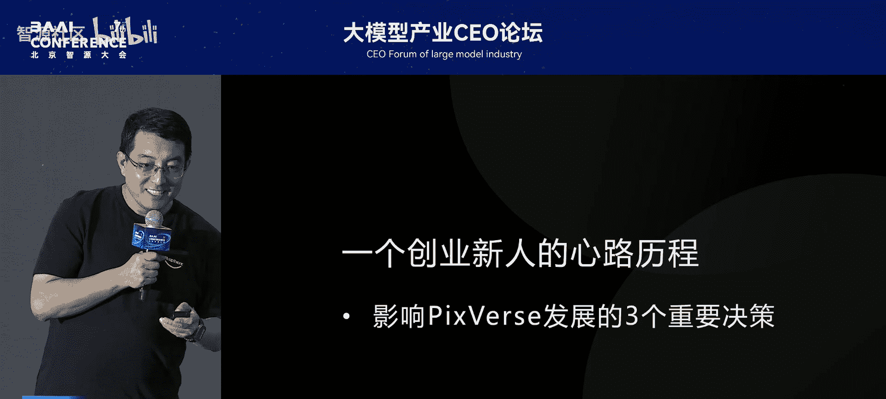

今天的主题是PixVerse，以及如何打造一个很多人喜欢的产品。PixVerse这个词很绕口，因为它是一个海外产品，所以我们特意起了一个中文名字叫做“拍我AI”。

这并非一个成功之后的分享，因为我们依然在创业。创业就是在刀尖上行走。这次分享产品发展历程的同时，也是一个创业新人在过去两年创业过程中的心路历程，本质上是一个故事。

故事中间有3点想重点介绍，即影响PixVerse发展的三个重要决策。

首先，用一页PPT简单介绍一下产品当前现状。在过去一年，爱诗科技的模型在全球范围内持续领先。在2024年12月Sora姗姗来迟正式可测时，第三方评测显示，当时的第一梯队前三名是Kling、海螺以及我们的PixVerse。

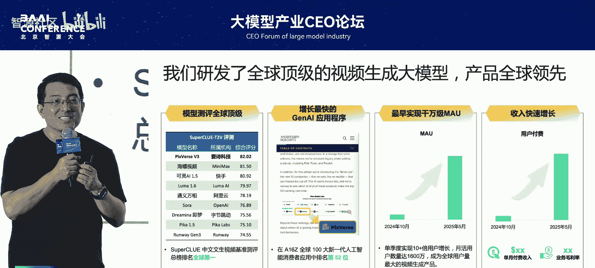

相对靠谱的一点是，直到现在，全球用户量最多的三个视频生成产品也是这三家。同时，我们的产品发展很快。我们的移动端在2024年12月正式上线，不到一个季度，在2025年2月，全球知名投资机构a16z发布的全球100大人工智能应用（App端）排行榜上，我们排到了第52位。如果算上网页端，我们能排进前20名。

从去年10月之后，我们的用户量增长非常快。至今为止，我们的月活超过了1600万，同时也带来了营收的快速增长。

## 第一决策：All In 视频生成 🚀

上一节我们介绍了PixVerse的现状，本节我们回到起点，看看第一个关键决策是如何做出的。

两年前，像我这样一个在人工智能领域闯荡了20多年的老兵，很多人问我为什么想不开出来创业，特别是在2023年整个融资环境非常差的时候。

激励我纵身一跃的最重要原因，是我们和很多同行一样，看到了一个新时代的到来。因此，在2023年4月，我们走上了创业的不归路。公司成立的时间是2023年4月。事实上，在ChatGPT刚刚上线之后的2022年年底，我们就开始筹备创业之路了。

这就涉及到我们要做的第一个重要决策：出来创业干什么？这不是一个容易回答的问题，特别是在两年前。今天这个论坛一半以上都是做视频的，但两年前并非如此。当时视频生成赛道冷得不得了。

我们可以对比一下，当时大语言模型公司融资的金额是数百亿、数十亿、数亿美元，而视频生成赛道就这么几家。Runway已经成立了5、6年，融资很多；海外还有个Pika；而我们融资数百万美元。这是蚂蚁跟大象的关系，大家能感觉到有多冷。

那时候做什么也不是显而易见的。我聊过很多人，99%的投资人和业界专家跟我说，为什么干视频生成？5年之内它没法落地，因为你看右上角那个当时的水平，当时最好的模型生成出的示例就是那个样子。而图像生成已经跑出来了，有开源模型，可以方便套壳做应用。做大模型很烧钱，很多人跟我说，你就别做大模型了，行业的人不会投我们，因为他们觉得大模型没前途。看好大模型赛道的人也不会投我们，因为他们觉得前面有大语言模型，那个更性感。

应用侧也有很多机会，我们可以做游戏、做广告，可以直接变现。但是我们的认知是什么？我们有文生图，有大语言模型，为什么不做视频？因为过去我在字节跳动，陪伴抖音、TikTok成长了好多年，我们的认知就是：**视频是最贴近用户的内容形态**。那个时候不做视频就没有道理。

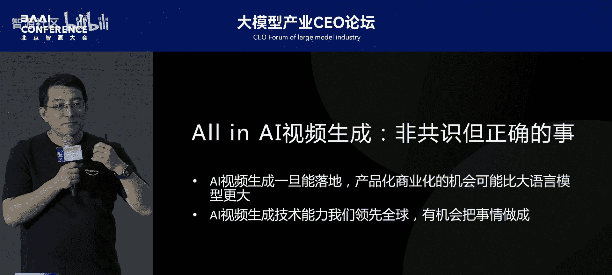

所以我们选择了一个非共识的事，当时是非共识，但我们内心认为是正确的事：**All In 视频生成**。我们认为文生视频这件事一旦能够落地，它的产品化、商业化的机会可能不比大语言模型差。另一方面，因为我和我团队当年支撑了抖音、TikTok这些国民级产品背后的视频AI能力的发展，我们有信心别人认为做不出来的东西，我们能做出来。二者合起来，我们没有理由不做这件事。

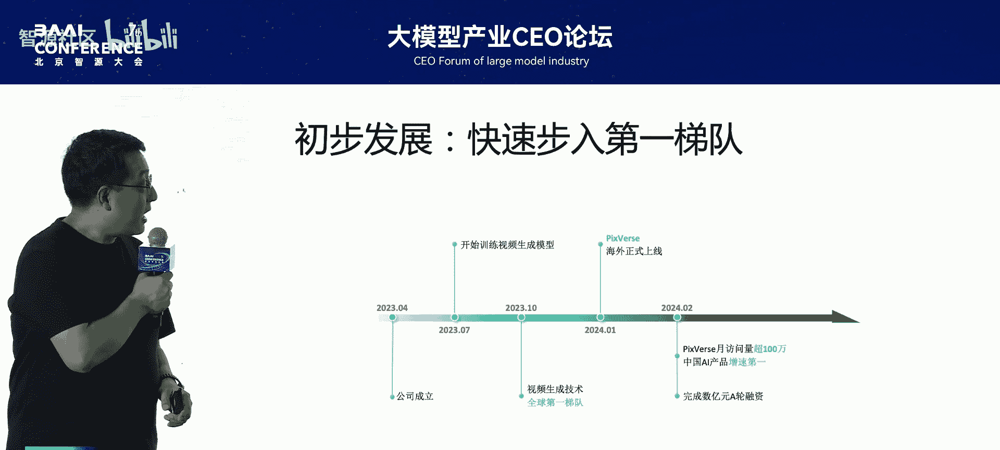

一旦做了这个决策，很多发展就比较顺利了。这是一个时间线：我们在4月成立公司，真正7月开始All In训练视频生成大模型，3个月时间，10月就已经在全球第一梯队了。我们在2024年1月正式在海外上线网页端。

一个月之内，在2月的时候，我们在各种排行榜上已经冲到前面了。

这是去年智源研究院和中传媒大学做的一个非常专业的评测。那时也是我们第一代模型。Sora大家都知道，所以那个时候的Sora是个假的东西，带个星号。当时评测我们在全球范围内是前二名，国内是第一名。

但我们知道模型打榜不能只看这个，还要看产品。我们在1月上线一个月的时间，在各种榜单增速榜上都是稳居第一名。作为新产品增速快是当然的，但你看它的访问量绝对值，当时刚上线第一个月就已经跟当时最著名的大模型产品，包括豆包、通义千问，在同一个量级了。这是我们非常兴奋的事情。

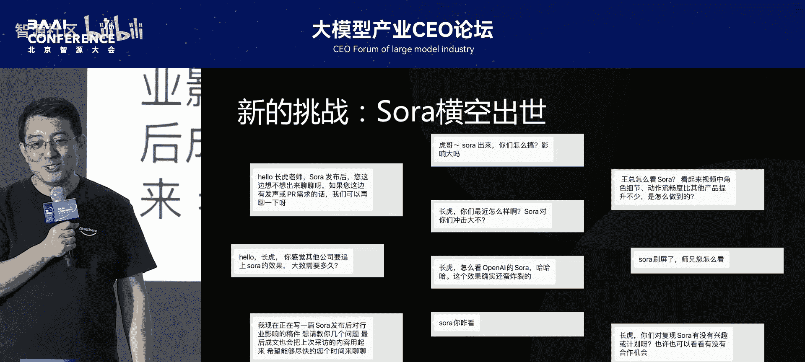

一切好像都很美好。但是大家记得突然发生了什么事情吗？我们是2024年1月正式上线的，在海外取得非常好的口碑，大量用户在使用。突然2月，那个Sora横空出世。那个春节期间，早上起来，我的微信叮叮响，好多人关心我们的人给我发信息，很担心，说GPT出来的时候领先了这么多，Sora出来之后，你们公司是不是就会完蛋了？当然我们现在看那个时候是个假的东西，但忽悠了很多人。很多都是这样的关心信息，包括我们的投资人很焦虑，我们的很多同行、朋友很焦虑。

但也有好的事情，因为Sora的出现让这个方向形成了一定的共识。我们非常想要招过来的候选人，突然给我发了信说决定加入我们了。这个人后期在我们公司发展过程中起到了非常重要的作用。

## 第二决策：面对Sora，跟还是不跟？ ⚔️

上一节我们讲到，在初步成功后遭遇了Sora的冲击，这引出了第二个重要决策。

Sora出来了，你跟还是不跟？这是一个很重要的事。首先，这个方向从一个非共识的状态变成一个非常热门的方向，留给小公司猥琐发育的时间结束了。很多大公司、大厂，比如Google、快手，还有那些融资金额是我们几十倍的大模型公司纷纷加入竞争行列，竞争更激烈。

形成共识之后，融资是不是更好融资了？融资环境2024年比2023年更差。很多人担心，你是不是比Sora已经落后很久了，你还有机会吗？你的资金实力没那么雄厚，怎么比？

很好，因为我们过去那一年发展得不错，所以我们拿到了第二轮的融资。但是，训练这个大模型，现在需要过去10倍的资源，你要不要搞？你的现金流只能支撑你一次机会，训练不成功就完蛋了，没有第二次机会，你搞不搞？是继续训练大模型，还是放弃转身做应用？如何杀出重围？

我们遇到这么大的挑战，在这么多问题的情况下，我们要做个决定：要不要跟？但你要知道，创业就是纵身一跃，这一跳我都跳了，第二跳还怕啥？所以我们决定是All In，但也是有逻辑的。

首先，我们是有前瞻性的。很多在2023年跟我们聊的投资人，在Sora还没出来的时候，我们跟他们规划技术路线时，就有DiT这个架构，而且当时计划在第二年春节前后，拿到第二笔融资之后，能够支撑我们训练更大模型的时候，训练这个架构。所以如果不是Sora先发布，有可能是我们先做出来。这个路线，我们是认同并且相信的。

第二个是我们觉得我们能力好。因为你看ChatGPT出来之后，大家的认知是大语言模型中国落后美国很多。因为它太火了，导致很多人把这个认知变成了AI中国落后美国很多。但实际上过去这几年我们做的抖音、TikTok，我和我团队在做的事情是领先全球的，视频AI能力是领先全球的，这是我们的认知。所以我们觉得我们有能力做好，并且可以10倍效率、10倍低成本地做好。

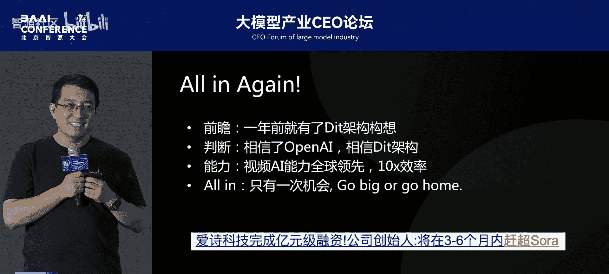

那时很多媒体朋友还想问，你得说个数字吧，你们什么时候能赶超Sora？我很谨慎地跟我们的技术同学仔细盘了盘，我们当时得出3到6个月。当时非常谨慎，就3到6个月。

实际上发展过来之后，你会发现基本还实现了。你看我们从1月产品正式上线，2月日活已超百万。然后我们在3、4月开始筹备做大模型，又囤了很多机器，然后做DiT架构。3个月时间，我们的7月就正式上线了V2产品。在爱诗科技，在PixVerse没有发布这个概念，我们历史上没有发布，直接上线。所以我们是创业公司里最早一批上线这类产品的。

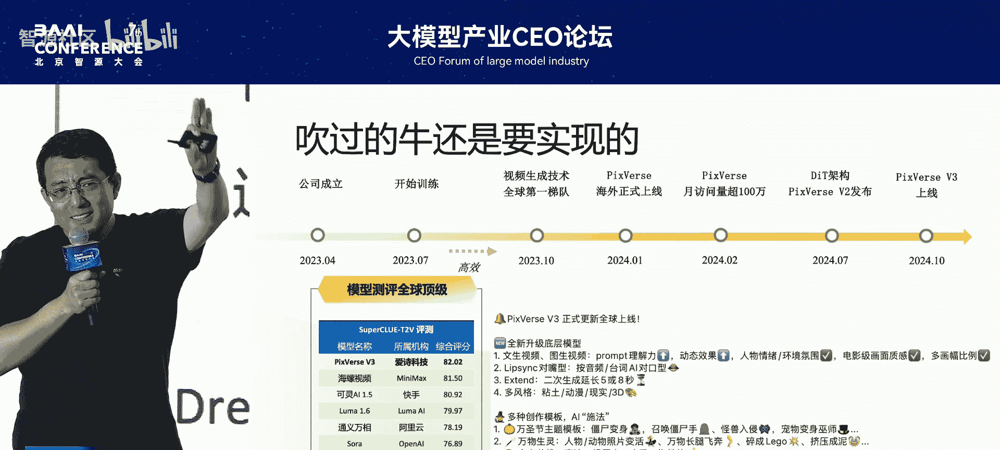

又过了3个月，10月我们正式上线了V3。如果大家有印象的话，第一页PPT时，你发现为什么我们的用户量、营收都是从10月开始涨起来的？这是一个重要的里程碑。

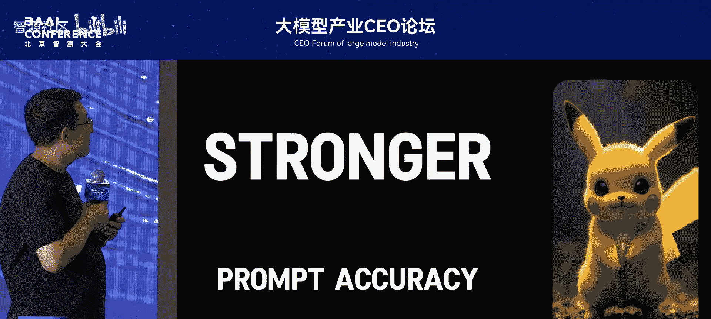

这是我们V3模型在2024年10月正式上线时的视频。

（视频内容展示，此处用文字描述核心功能）
我们的产品页面里有一个选项叫做“特效”，里面有好多种特效模板。有没有大家熟悉的？第一个很熟悉，是“毒液”变身。这个特效火爆了。

我们是一个海外的产品，国内还是没法用的，但它在抖音居然火起来了。如果你仔细看，它几乎每个视频上面都有个logo “PixVerse”，带来了病毒式的传播。当然，因为流量太大了，有一些明星也自发模仿。

火到什么程度？在闲鱼上，你搜索“AI”，直接搜索“AI”，发现推荐的都是“PixVerse毒液生成”，最贵的18块钱一个。因为我们毕竟是一个海外的产品，所以中国火了，海外更火。我们在各种社交媒体上爆火。当然也不止毒液火了，很多东西都火了，全球持续发酵。

这有一些数据了，这是中国产品出海增速榜，我们排在了第二名，当月11月份访问量直接接近有80%的提高，在各种中国AI产品里面排行第二，你看这单日的访问量已经远超于第一名了。

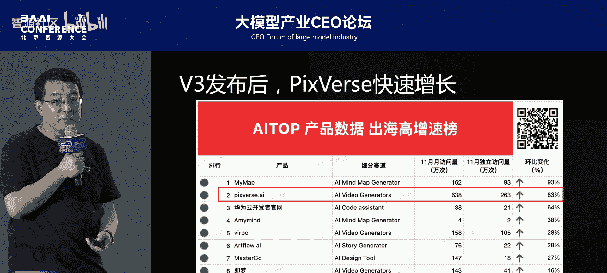

我特别喜欢张一鸣的一句话，就是“务实浪漫”。大家很奇怪，务实跟浪漫怎么能放在一起呢？我们认为我们第二个决策All In视频生成，这件事就是一个务实又浪漫的事。确实是背水一战，大家想象不到，那个时候钱就够你训练一次，犯一个大错误就没机会了，真的是背水一战。

我想跟大家也分享一下我的一些观点：做容易的事不是务实，短期投机不是务实，做正确的事才是务实。我们认为我们做的是正确的事。认识世界多样性是务实，很多人都做大语言模型，我们就要做视频。独立思考、穿越喧嚣是浪漫，有生命力是浪漫，面向未来是浪漫，拥抱不确定性是浪漫，这就是我们在做的事情。

V3成功的背后有很多力量，包括我们过去All In视频的各种思考，包括我们背水一战，包括我们把这件事情做成了，就形成预言。但大家看到漏了什么？这些是不是都是关于技术的？产品呢？这就涉及到我们做的第三个战略决策。

## 第三决策：做什么样的产品？ 🎯

上一节我们分析了技术突破带来的成功，本节我们来看看产品策略这个关键决策。

V3的成功是技术和产品的成功。那么，做什么样的产品呢？To B还是To C？很早时候不知道，但当我们All In之后，我们就很清晰了。

服务哪些用户？如何设计？在All In视频生成那一刻，我们的愿景就是想帮助每一个人成为生活的导演。那是To B还是To C？我们要先做To C，再做To B。我们认为我们这个团队是一个全球化团队，我们伴随抖音和TikTok的发展，是个全球化的团队。所以我们有限资源情况下，我们先做海外再做国内。

“每个人成为生活的导演”，每个能玩抖音、TikTok的人成为生活的导演。所以我们希望能够让几十亿的普通人能够用起来。有了这个目标，后面就很清晰了。我们要做好两件事情：第一，如何降低普通人创作门槛；第二，如何提升普通人的创作体验。

我们再来回头看看那个爆点“毒液变身”为什么能成？用户只需要上传一张照片，然后选择一个模板，比如“毒液”模板，不需要输入Prompt就能生成这样一个视频。他也可以选择上传照片之后，选择“毒液变身”，或者“一起摇摆”。是不是很好用？

所以为什么V3成功？首先，我们做到了降低创作门槛，不需要再输入Prompt了，只需上传一张照片就OK，每个人都可以做。第二，提升创作体验。你要知道在这之前，所有的产品都在服务于那些创作者，创作者有创作目标，他可以容忍你的不好的地方，生成10个视频才有一个可用，出图概率是1/10，生成5个视频才有一个可用，出图概率20%。普通人谁会去用？第一个生成视频不满意，他就不会生成第二次了。所以成功之处在于我们把出图概率直接拉到接近百分之百。任何一个普通用户、没有经验的用户，从第一个视频就成功，他就会传播。

所以，去年2024年10月，我们V3和产品上线，是第一次真正让普通用户、普通消费者用AI能力创造出过去无法创造出来的视频。在我心中，这个时刻才是视频生成的“GPT时刻”。

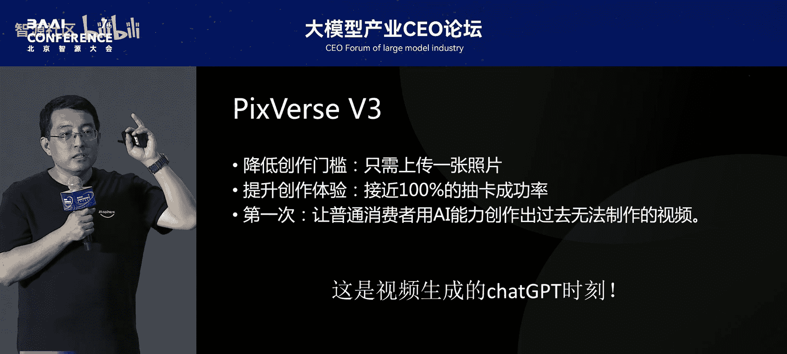

好的模型带来了好产品。当然，这个火谁都能看到，同行都看到了，所以他们快速上线了同样的“毒液变身”能力。但是，好的模型带来好的产品。为什么前面说V3那模型是全球最能打的模型？能打在哪？我做个对比。

左边是一个同行（毒液变身是一个非常强、非常重要的同行），他当时也上线了这个变身能力。上传这样一张照片，你看他怎么变身的。这个准确吗？这个毒液是跟这个人脸不太有关。我不知道大家会去传播这样的给自己的朋友圈传播这样的视频吗？右边是我们的。所以本质上用户喜欢是因为模型好。

有了这个认知之后怎么办？我们要做的更好，就要做更好的模型。当时毒液变身火，不知道大家对毒液印象更深刻，还是对PixVerse印象更深刻。很多人说，这个东西很多家都有这个毒液变身能力，都有魔法能力。那是毒液变身火了，还是你PixVerse火了？

这是一个佐证，这是Google Trends上面的搜索指数。我们是10月初开始，你看我们的搜索指数蓝色直线上升。中间两条线是列的全球最好的视频模型产品，Sora和Runway。Runway在英语里是一个单词，所以这个曲线是虚高的。我们已经远超过他们了。所以那个时候，视频生成的“GPT时刻”，不是毒液变身火了，是PixVerse火了。

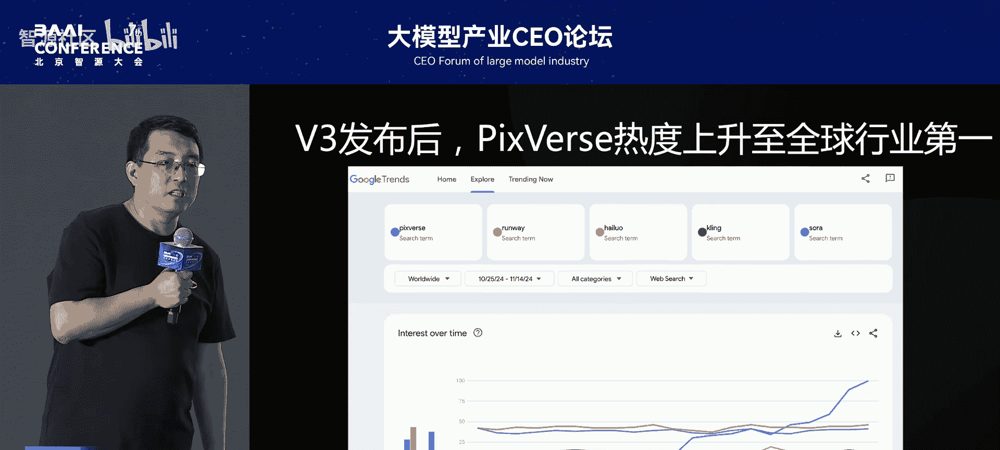

所以我们要去做更好的模型。我们速度很快。我们在10月上线了V3，11月上线了V3.5。因为我们觉得普通用户不会有耐心去等待你去生成。过去全是分钟级别的生成视频，1分钟、几分钟、十几分钟，我们直接把它拉到了10秒钟之内，这是V3.5。这样的话我就可以支撑我们的移动端App上线这个产品了，普通用户就可以去使用了，要不然普通人不会花那么多时间去等待你的生成。

2月我们上线了V4，更快了，而且支持实时生成的效果。5月上线了V4.5，每一代都有巨大的进化。

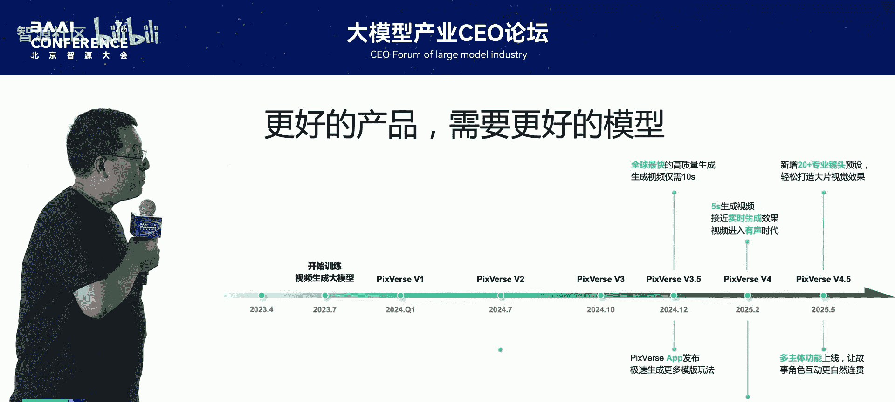

我不会详细介绍了，只是说一些视频。比如V3.5，它是一个全球最快的视频生成模型。当然也有其他能力，包括我们提供了一个“首尾帧生成”功能。这个全球也火爆了一圈。上传左边一张图片作为视频的首帧，上传右边一张图片作为尾帧，希望生成一个视频从第一帧过渡到最后一帧。你看生成视频是什么样子的？打开门，镜头钻进去，看到一个新世界。这个视频里的所有镜头都是用这个能力生成的，这样给大家提供更多的玩法。

模型好不能自吹自擂，产品好也不能自吹自擂。所以这个是1月的时候，全球AI产品增速榜。1月出现了一个历史性事件，大家都知道D-ID横空出世。你看，那个时候1月全球的AI产品里面，在访问量和增速上面同时超过我们的只有D-ID。

2025年2月，V4上线了，它不仅更快了，几乎5秒钟就能生成5秒钟的视频，几乎都要实时了。同时，它让视频生成进入到了有声的时代。大家知道最近Vidu上线了带声音的生成，而我们在2月就已经上线了。大家可以看一下，过去视频在社交媒体传播时的声音都是后配的，我们是同时生成出来的。当然可以去指定这张图里面的人说哪些话，口型能对上。很多其他能力就不具体介绍了。

2月上线，你看我们4月的时候，这是中国产品出海总榜（移动端）。刚才的是访问量，这是移动端。你发现很巧，所有中国AI产品里面出海的产品，在MAU和增长上面超过我们的只有剪映。所以也很惊讶。

好，我们2025年5月，上个月刚发生的，我们的V4.5正式上线。它也带来了非常多的功能，一些进阶的消费者也能够生产创作电影级的内容，包括多角色联动等能力。

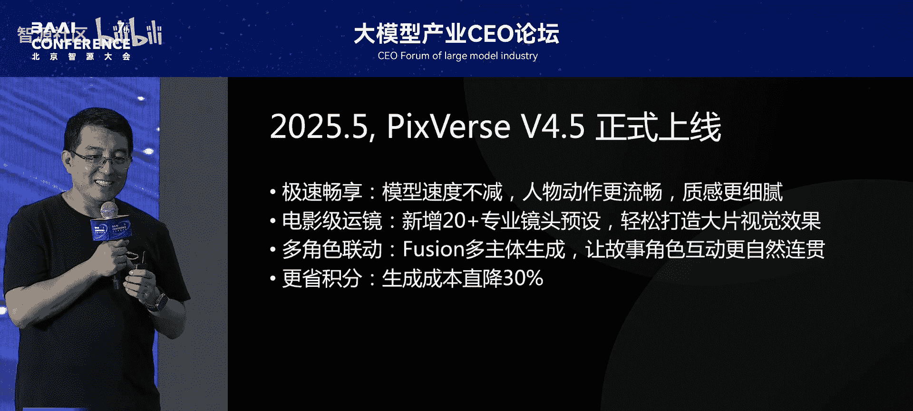

这是一个视频，体现各种专业运镜。你的小猫B弟跟我眼神接触。可以看到各种专业的运镜了没有？快速推拉。什么叫多主体？就是上传两张照片，生成一个视频，是这个主体在这个背景里面畅游。

5月其实发生了一件事情，我们非常开心。突然一大早起来，同事和朋友给我发信说，在美国的总榜上面，iOS总榜上面，你们跑得很前面了。这是两个榜，都是美国的总榜。第一个是所有App总榜，我们排到了第四名。可以看到排在后面的包括Google Maps、剪映、WhatsApp，当然还有一些比如TikTok。在“照片与视频”这个分类榜上面，我们排到了第一名，后面是剪映、Instagram、YouTube等等。我们非常开心，但不可能一直霸榜，可能是昙花一现，我们非常开心。

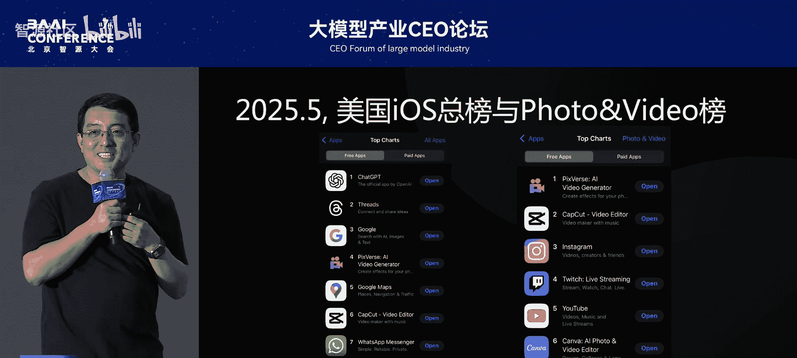

所以当前我们已经超过6000万用户在使用PixVerse。大家很好奇，这帮人用它干啥？我们可以看一下，我们在TikTok里面搜索PixVerse，你可以看到很多用PixVerse生成的视频。用户是怎么用的？（视频内容略）大家可以自己去看一下。

我们在1月的时候，因为我们产品在国外已经火得不得了，很多B端客户、企业用户找我们说，能不能让我们用你们的API？有很多能力我们是想用上。我说，我们已经有超过6000万用户的最佳实践了，我们知道他们喜欢什么，知道他们爱用什么，知道他们怎么用。这些能力真的可以赋能我们全球的B端客户。所以我们可以在1月的时候开始逐渐开展B端业务，支持了各行业的API和定制化的视频生成能力，覆盖了非常多的场景，互联网、营销、电商等等。这里就不多介绍了。

但我们依然是一家海外的产品。大家去国内的App Store上面，各种应用商店上面去搜，发现全是李鬼，全是盗版。因为对，我觉得也对，有很多网友说，你们产品这么烂呀？我说我们没上线呢。所以应用户的要求，我们筹备了几个月时间。今天，正是今天，在国内全面上线公测，我们的名字叫“拍我AI”。

首先它很全，在国内各商店上面都可以去下载，包括网页端。同时它对齐了PixVerse最新的基模和所有的功能。同时它是一个中国的模型，中国风、中国味，模板和内容。同时我们有一个新的域名，PixVerse太绕口了，对中国用户来说，我们给它起名字叫“拍我”，所以域名是 pai.video，很好记。同时我们B端服务也全面升级。

拍我AI，首先拍我和Pix对于我这种英语不好的人来说，确实有点像，但它有自己独特的命名原因。我们可以看一下这个视频，镜头都是由拍我AI生成的。

（视频旁白内容）
“拍，是人类最简单的创作行为。”
“拍，是人类最原始的赞赏本能。”
“当技术拥抱艺术。”
“拍，是激起每个人的创作本能。”
“我是主角。”
“我也是导演。”
“红中。”
“吃。”

特别幸运，创业两年，依然留在了牌桌上。

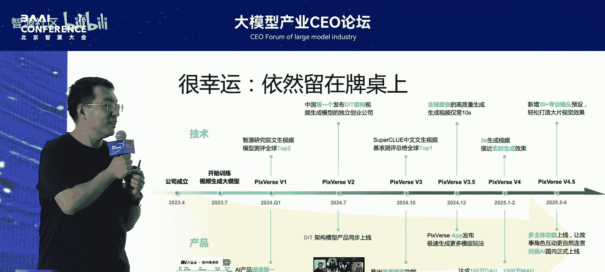

好像一切又挺美好，对不对？这里为什么又有个“又”？似曾相识啊，跟去年年初很像。

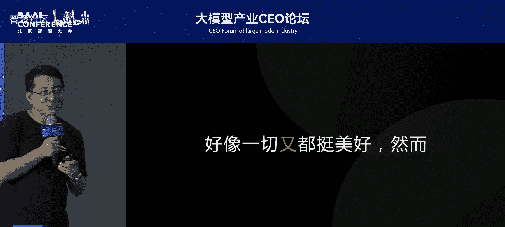

任重道远，需要刀尖上求生存。

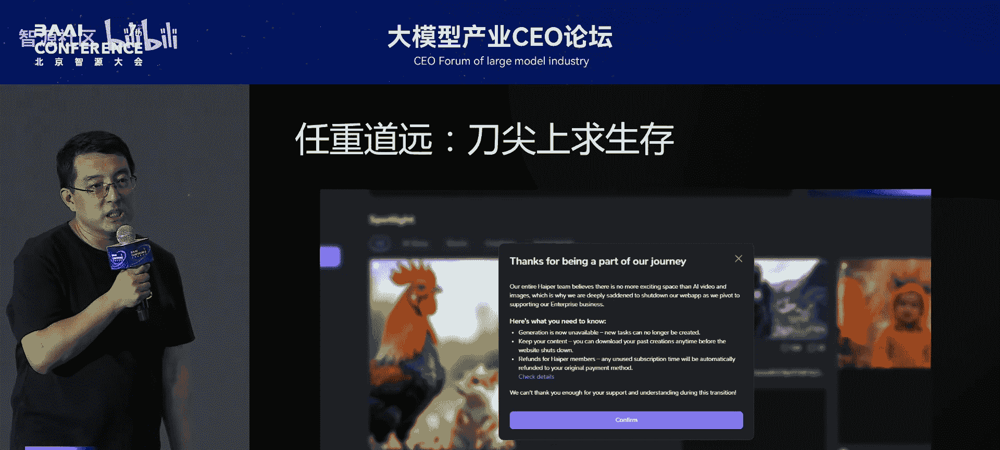

我们有很多竞争对手。过去这两年其实有好多的同行，其实都被落下了，但都没有触动我。真正触动我的是今年上半年，突然发现一个我们一直在关注的产品，HeyGen，突然暂停服务了。触动很大，因为它一直在我们的竞品名单上。所以创业很不易。

未来有非常多的挑战：一个是技术迭代快，如何持续保持第一梯队？过去两年你成功了，不代表未来两年你能成功。大模型很烧钱，我们没那么大，不像大语言模型那么烧钱，我们可以很高效地烧钱，但依然要烧钱，如何持续融资？如何确保现金流健康？如何加速商业化？不止于工具，我们如何做好产品差异化？如何建好竞争壁垒？如何应对大厂的竞争？如何应对开源生态？这也是未来爱诗科技、拍我AI要进一步思考的。

所以过去总结这过去这两年，其实我是不会创业的，都是一猛子扎下去了，然后在想思考干啥。过去两年这三个重要决策，我们做了，影响了产品的发展，其实都是在边做边学。

那学到的一个很重要的点就是，这个企业呀，它是有生命的。它就像一个小孩一样，你的孩子。事实上，创始人的经历、认知、经验，影响着每一个决策。你的孩子嘛总是像你的。但是小孩的成长过程中如何去教会他能够有面对困难、勇往直前的勇气？如何教会他更坚韧一点？在各种极限压力情况下，让他更好地具备更好的性格、更好的发展。小孩子哪能不犯错？会犯错，但是你不能犯大错，像我们一犯一个大错误，公司就黄了，现金流就断了。但是要有快速纠错的能力。还是说，实践出真知，边做边学，持续成长。

因为时间原因，我有很多其他的认知，这里就没法介绍了。其实创业这过程中，这两年其实是蛮孤独的。特别是当你聊了100个投资人，99个都不看好你的方向的时候，就很孤独。创业是一段孤独的旅程，就像在戈壁上独行一样。同时他又是一场非常幸福的修行，遇到非常多的懂你的人，和你一起战斗的人。你可以看着你的孩子逐渐有性格，变得越来越强壮，非常的开心。

最后，致敬这个时代，所有有梦想的这些人。谢谢大家。

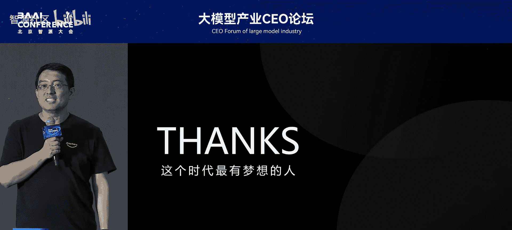

## 课程总结 📝

在本节课中，我们一起学习了PixVerse（拍我AI）从0到6000万用户的创业历程。我们重点剖析了三个影响其发展的核心战略决策：

1.  **All In 视频生成**：在行业非共识的早期，基于“视频是最贴近用户的内容形态”的认知，果断选择正确的赛道。
2.  **面对Sora，坚决跟进**：在巨头入场、竞争加剧的危机下，凭借前瞻性的技术路线和团队能力，选择背水一战，持续投入大模型研发。
3.  **打造面向普通消费者的产品**：明确“帮助每个人成为生活的导演”的愿景，通过**降低创作门槛**（如免Prompt模板）和**提升创作体验**（将出图概率拉近100%），成功引爆市场，实现了视频生成的“GPT时刻”。

这三个决策环环相扣，体现了在创业过程中，将**前瞻的技术判断**、**坚定的战略定力**与**以用户为中心的产品思维**相结合的重要性。创业之路充满挑战，需要在刀尖上求生存，但坚持做正确而非容易的事，务实又浪漫地前行，是穿越周期、留在牌桌上的关键。