# 大模型产业CEO论坛-p03-多模态生成从模型走向生产：骆怡航

在本节课中，我们将学习多模态生成技术，特别是视频生成，如何从模型研究走向规模化生产落地。我们将探讨其背后的驱动力、面临的挑战，以及申树科技（Vidu）在这一领域的实践路径。

## 概述

多模态生成技术，尤其是视频生成，正处于规模化生产落地的关键拐点。这主要由技术快速迭代、旺盛的行业需求以及产业落地节奏加快所驱动。传统的视频内容生产方式存在周期长、成本高、依赖专业人员等痛点，而AI生成技术有望带来革命性的改变。

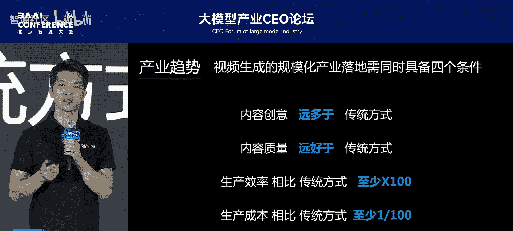

## 规模化落地的四个关键条件

要实现视频生成的规模化落地，必须同时满足以下四个核心条件：

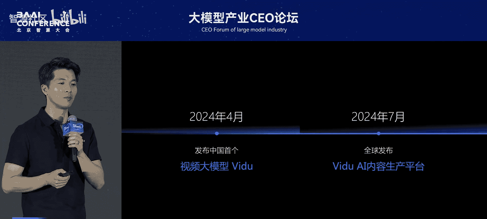

1.  **内容创意**：创意主要依赖于人的想象力和创造力。
2.  **内容质量**：生成内容的质量需达到或超越传统制作水平。
3.  **生产效率**：相比传统方式，效率需有**百倍级**的提升。
4.  **生产成本**：相比传统方式，成本需降低至**百分之一**。

只有当AI生成在质量、效率（百倍提升）和成本（百分之一）三个维度上全面优于传统方式时，其推动力才是颠覆性的。

## 申树科技（Vidu）的聚焦与实践

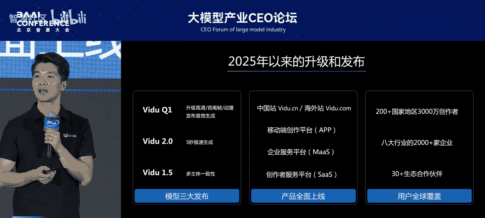

申树科技聚焦于多模态生成领域，当前以视频（含音频）生成为主，未来将向3D虚拟空间等领域拓展。其目标是服务专业用户与企业用户，推动模型在八大行业、三十大场景中落地。

这些场景之所以是“生产场景”，在于其内容具有明确的商业与消费价值，例如自媒体、广告、电商、动漫、文旅、教育培训、短剧及影视制作等。

## Vidu产品的发展与核心能力

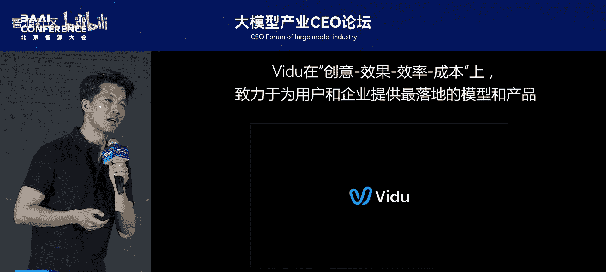

申树科技的核心产品是“Vidu”AI视频生成平台。自跟进Sora并推出国产视频大模型以来，Vidu在模型、产品和用户层面均取得了显著进展。

以下是Vidu模型迭代的核心方向：

*   **Vidu 1.5**：专注于提升生成效果。通过参考视频保持多主体一致性，使其更适应各类商业场景的落地需求。
*   **Vidu 2.0**：极大提升生成速度，实现**5秒级**视频生成。
*   **Vidu Q1**：进一步升级，提供高清版本、首尾帧连贯生成、动漫风格生成等能力，并集成了音效与音频生成功能。

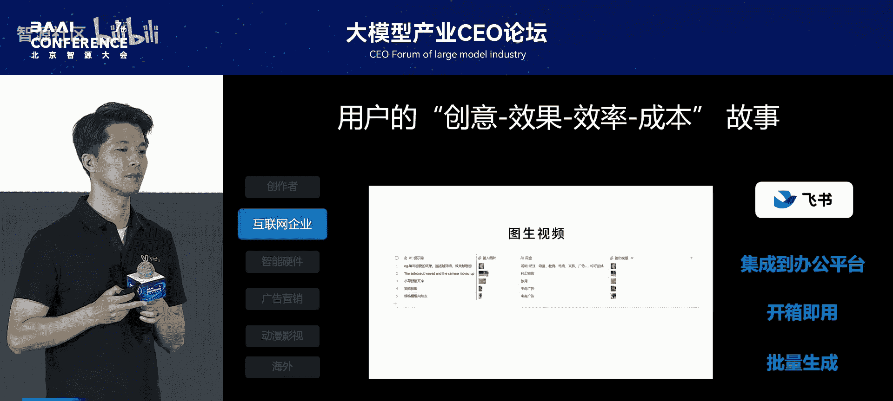

在产品形态上，Vidu为个人创作者及团队提供SaaS平台，为企业提供MaaS服务及API集成，并覆盖移动端应用。其服务已覆盖全球200多个国家和地区。

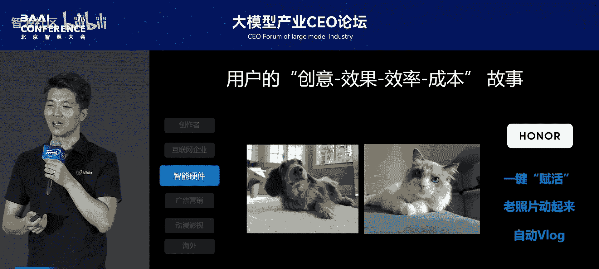

## 用户案例与价值体现

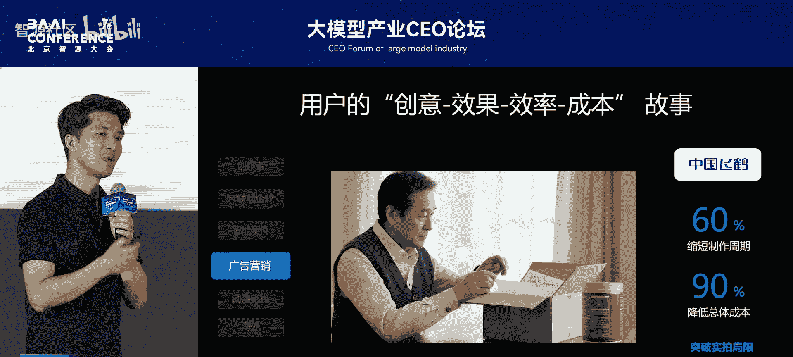

用户选择Vidu，是为了表达创意，并追求效果、效率与成本的兼顾。以下是几个典型案例：

上一节我们介绍了Vidu的核心能力，本节中我们来看看它在不同用户手中的实际应用。

**案例一：个人创作者“柔术特效”**
*   **背景**：一位动漫爱好者，创作动漫连载作品。
*   **成果**：作品在分发平台获得超300万观看。
*   **价值**：相比传统或业界常规制作方式，效率提升**10倍以上**。

**案例二：海外作家Kimberfish**
*   **背景**：一位60岁的作家，希望将文字著作转化为视频。
*   **应用**：使用Vidu的图生视频功能，将著作插图转化为配套视频。
*   **价值**：单人即可高效生产大量配套视频，深受读者喜爱，极大丰富了内容表现形式。

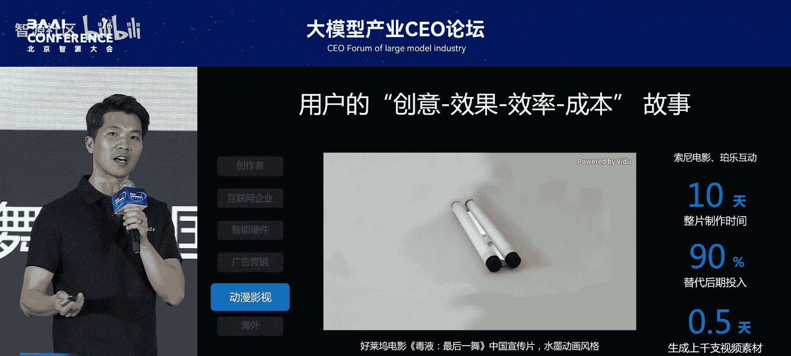

**案例三：企业协同与广告制作**
*   **集成办公**：Vidu API集成至飞书等办公平台，实现开箱即用和批量视频生成，提升团队协同效率。
*   **品牌广告**：与飞鹤合作制作电视品牌广告。相比传统实拍，让创意人员更专注于创意本身，突破了实拍局限，在创作周期和总成本上获得极大优化。
*   **电影宣传**：与索尼电影合作，以中国水墨画风格制作《毒液》电影中国宣传片。使用首尾帧生成技术，在10天内完成传统方式需一个月的工作，成本节省约**90%**，并在半天内生成上千支素材供挑选。

**案例四：动漫与科幻创作**
*   **动漫工作室**：海外动画工作室基于Vidu打造AI动漫工作流，批量进行创意生成，将人力集中于创意部分，计划在两个月内完成50集AI动漫。
*   **科幻剧集**：个人创作者利用Vidu生成宏大、精美的科幻场景与叙事，制作高质量科幻短片。

## 驱动增长的“飞轮”模型

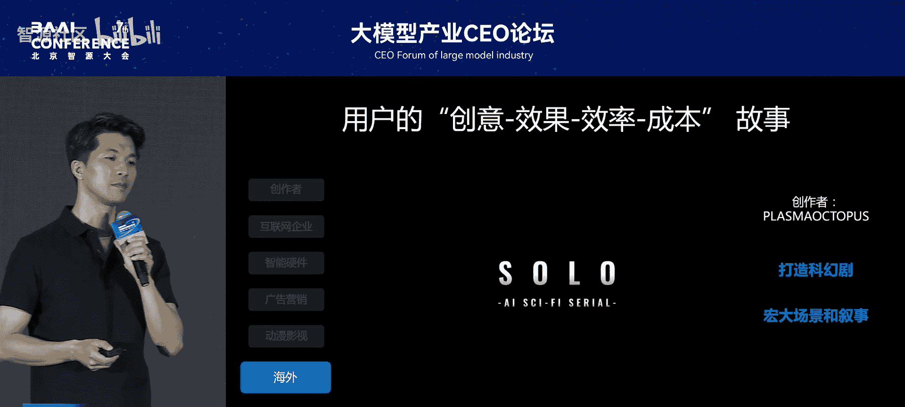

Vidu能够获得用户认可并持续增长，源于其构建的模型、产品、用户三者驱动的“飞轮”效应。

*   **快速响应**：团队能快速响应用户需求与反馈。
*   **广泛满足**：基座模型能力的通用性，使其能广泛满足八大行业的需求。
*   **深度适配**：通过“基座模型能力 + 场景微调 + 产品化”的方式，深度适配各行业复杂、专业的需求，真正实现生产效率的百倍提升和生产成本的百分之一降低。

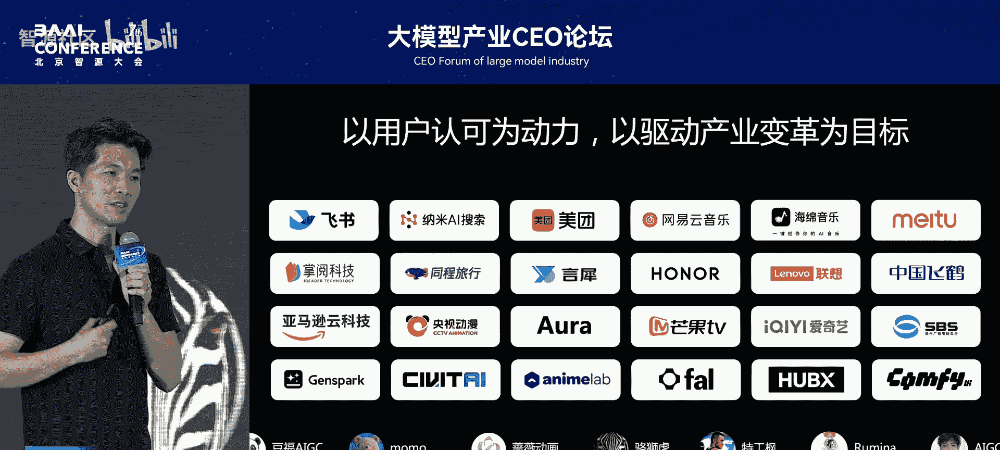

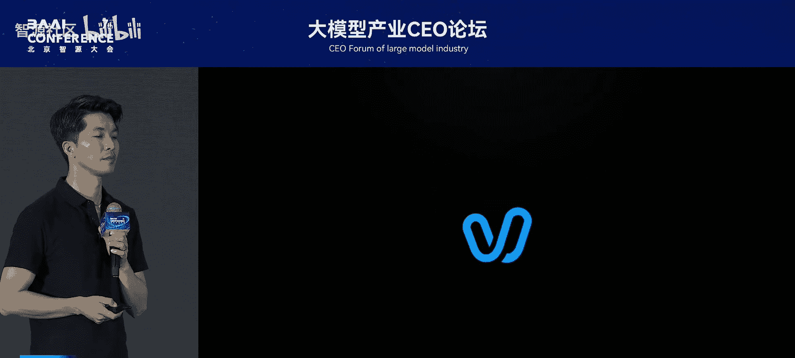

在此飞轮驱动下，Vidu平台的专业创作占比增长了300%，生成量、付费量、使用时长大幅提升，企业客户增长150%，其中互联网广告、动漫、电商等专业场景应用占比达80%。

## 愿景与总结

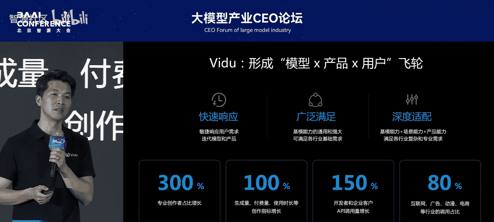

AI不是替代人的工具，而是释放人类创造力的伙伴。申树科技的愿景是让Vidu不仅带来互动与娱乐，更能赋能生产力，让每个人的想象力与创造力得以尽情释放。

本节课中我们一起学习了多模态视频生成规模化落地的关键条件，了解了申树科技Vidu通过模型迭代、产品矩阵和深度场景适配，在提升内容质量、实现百倍效率提升和百分之一成本降低方面的实践路径，并看到了其在赋能个人创作者与企业客户、变革内容生产流程方面的具体成果。