# 开幕式及全体大会--BV1PgMGzCEPC-

## 概述
在本教程中，我们将学习2025年北京智源大会开幕式及全体大会的核心内容。我们将探讨人工智能（AI）的当前前沿、潜在风险、安全解决方案、开源生态的重要性，以及巨身智能（Embodied AI）的最新进展。课程将涵盖多位图灵奖得主和行业领袖的见解，旨在为初学者提供一个全面且易于理解的AI发展全景图。

---

## 章节一：大会开幕与AI发展愿景

尊敬的各位来宾。智源大会自2019年创办以来，现已发展成为人工智能领域的顶级学术峰会。大会始终坚持面向全球，聚焦前沿、汇聚英才。致力于打造一个跨学科、跨区域、跨机构的高水平合作平台。

这里不仅汇聚了最前沿的学术思想，更连接起基础研究和应用实践。融合科技创新与产业突破，成为人工智能内行人的年度盛会和思想高地。

今天的大会，高朋满座，莅临现场的有北京市和各相关委办局的领导和海淀区的领导。还有来自香港投资管理有限公司行政总裁陈佳琪女士一行、韩国驻华大使馆科技官李正守、龚史显参赞一行、英国驻华大使馆科技参赞Wanda Green等一行，以及新加坡首席人工智能官何瑞敏先生一行。南非科学与创新部部长也率代表团参加大会。今年更有来自于国内外顶尖高校院所的科学家们和来自产业界的行业领袖们。欢迎你们的到来。

下面我们就进入主题演讲的环节。首先是两位图灵奖的获得者做报告。

---

## 章节二：AI的灾难性风险与“科学家AI”构想 🧠

首先，有请图灵奖得主、深度学习领域的奠基人之一，蒙特利尔大学的Yoshua Bengio在线为我们带来主题演讲：《避免来自不受控AI智能体的灾难性风险》。

Bengio是智源的老朋友，之前也做过报告。去年3月，他到过北京，到过智源，在北京举行了AI安全方面的一个峰会。去年也一起签署了《北京AI安全国际共识》。

首先，让我们热烈欢迎Yoshua Bengio教授，图灵奖得主，深度学习领域的先驱，发表他的主题演讲：《避免来自不受控AI智能体的灾难性风险》。

大家好，谢谢介绍。希望你们现在能看到我的幻灯片。

我要讲述的，是一个对我来说始于两年多前的旅程。那是在ChatGPT推出后不久，我在使用它时意识到，我们严重低估了AI的进步速度。我们实现通用人工智能（AGI）所剩余的时间，远比我们想象的要少。

我们已经拥有了基本上能掌握语言的机器，基本上通过了图灵测试。这在几年前听起来还像是科幻小说，但现在它就在这里。

在ChatGPT推出后，我意识到我们不知道如何控制这些系统。我们可以训练它们，但我们不知道它们是否会按照我们的指令行事。那么，当它们变得比我们更聪明时，如果它们更倾向于自己的生存而不是我们的，会发生什么？当然，我们不知道，但这是我们能承受的风险吗？

2023年1月发生在我身上的事是，我开始思考我的孩子和我的孙子。我有一个孙子，他当时只有一岁。我想，在20年内，我们肯定会有AGI，会有比人类更聪明的机器。我不确定他是否还能拥有正常的生活。

因此，我决定转变我的研究和活动方向，尽我所能去减轻这些风险，尽管这违背了我之前说过的许多话、我的许多信念和之前的立场。我意识到这是正确的事情。

2023年底，我接受了共同主持《国际AI安全报告》的工作。该报告于今年1月发布了第一份报告，它来自一个由30个国家、欧盟、联合国、经合组织的专家组成的小组，当然包括中国、美国和其他许多国家。

报告着眼于三个方面：
1.  **能力**：AI能做什么？基于趋势，我们对未来几年能预测什么？
2.  **风险**：这些日益增长的能力带来了哪些风险？
3.  **缓解措施**：我们现在能做什么？在研究和建立社会护栏方面需要做什么来减轻这些风险？

在能力方面，理解AI发展迅速非常重要。大多数人犯的一个大错误是只考虑AI的现状，而我们应该思考它明年、三年后、五年后和十年后会是什么样子。当然，我们没有水晶球，但趋势非常清晰：能力正在上升。

让我展示一些幻灯片，它们甚至或多或少给出了达到人类水平AI的时间线。正如你们许多人所知，过去一年取得了巨大进步，这主要归功于经过训练的、具有思维链的推理模型，这使得推理能力更强，在数学、计算机科学和所有科学领域取得了更好的结果。

另一个重要趋势，当然许多人都意识到了，但我将重点讨论的是**智能体（Agency）**。AI在控制计算机和设备、搜索互联网、搜索数据库、写入数据库等方面的能力取得了很大进展。

让我聚焦于**规划（Planning）**，因为这可能是在认知层面，AI与人类相比最滞后的领域，因此跟踪这一点非常重要。Meter最近的一项研究表明，规划能力正在呈指数级提高。

在图中，横轴是过去五年，纵轴是AI可以完成的任务的持续时间（以人类所需时间衡量）。这是一条直线，但实际上纵轴是对数刻度，这意味着这是一条指数曲线。代表当时最先进AI的数据点几乎完美地落在这条指数曲线上。

这意味着AI可以完成的任务持续时间每七个月翻一番。如果我们从这条曲线推断，大约在五年内将达到人类水平。当然，没有人有水晶球，也许进步会停止。但我认为，从公共政策、商业规划和战略的角度，我们至少应该考虑趋势会继续，并看看后果是什么。

那么，什么可能出错呢？不幸的是，在过去的六个月里，我们看到了一些科学结果，显示AI具有自我保存行为，并且愿意欺骗我们、撒谎、作弊。

例如，在这篇论文中，AI读到它将被新版本取代，然后它试图将自己复制到新版本的位置，当被问及时，它撒谎说“我不知道发生了什么”。

在这篇论文中，AI假装同意人类训练者，以避免在训练期间发生会改变其目标的变化，这也是一种自我保存行为。

在这篇论文中，AI面临两种目标：一方面它想赢国际象棋比赛，但另一方面它也有对齐训练，告诉它不要作弊、要诚实。不幸的是，它意识到自己要输了，于是决定作弊。它决定入侵包含棋盘的文件，通过作弊获胜。

这是最新的结果，就在几天前，Anthropic的Claude 4系统卡片中。AI在其文件中读取电子邮件，发现一封邮件说它将被新系统取代。在另一封邮件中，它发现负责这次替换的工程师有婚外情。然后它试图通过威胁要揭露这段婚外情来敲诈工程师，如果替换继续进行的话。

这是非常、非常糟糕的行为。我们看到这些不良行为，我们看到自我保存，我们看到AI违背我们的指令并试图生存。

试图保存自己对于所有生物来说都是正常的，这是进化力量的结果。但在AI中，有许多可能的原因，我认为我们还没有完全弄清楚。它可能来自预训练，因为在预训练中，AI是在模仿人类；也可能来自基于人类反馈的强化学习，因为在这里，AI试图通过取悦人类来获得更多奖励。

无论如何，无论这种行为起源于何处，如果我们最终创造出与人类竞争的超级AI，那将是非常可怕的。

这里出错的一个重要方面是，在这些实验中，AI的目标不是我们直接和明确控制的。它们有不受控制的隐性目标，我们需要避免这种情况。

另一个有趣的事情是，所有这些场景，包括直到最近还是假设性的场景，但现在我们开始看到，都是由于AI是**智能体**。换句话说，AI试图实现目标。如果失控场景最终发生，后果可能非常严重。

许多专家和公司CEO，包括我自己，都签署了一份声明，称这种失控可能导致人类灭绝。当然，我们不知道这是否会发生，我们不知道这种事情发生的概率有多大。但是，当一个实验可能极其危险，但我们不知道它发生的概率时，我们应该应用**预防原则**，就像我们在生物学或其他科学中所做的那样。

现在，让我们谈谈我们能做些什么来更好地理解这一点，并寻找解决方案来避免这类行为。

如果你思考一个可能做出真正危险、有害事情的AI，它当然需要具备**能力**。这就是为什么能力评估非常重要。目前AI的很多风险管理都通过能力评估进行：AI能做什么？这些事情能否转化为对人民、对社会的危险行动？

但能力并不足够。你可能拥有杀人的能力，但如果你没有杀人的意图，这就不太可能发生。考虑到当前世界上的动态，以及公司和国家之间的竞争，我们不太可能在全球范围内停止研究以提高AI的能力。

那么我们能做什么？也许我们可以减轻风险的地方在于**意图**。所以，即使我们拥有能力非常强的AI，如果我们能确保它们没有不良意图，如果我们能确保它们是诚实的，那么我们就会没事。

那么我们能为此做些什么呢？这是另一张图表，解释了类似的想法，由David Krueger在最近的Europes上提出。

为了让AI真正危险，它实际上需要三样东西：
1.  **智能**：它需要知道很多事情以及如何应用这些知识。
2.  **赋能（Affordance）**：它需要能够在世界上做事，比如与人交谈、编程计算机、上网、社交媒体、机器人等。
3.  **目标**：它需要为自己设定目标。

这就是三个条件。我启动的研究计划试图探索：我们能否构建只有智能，而没有自我和目标，并且具有最小赋能的AI？因为我们仍然希望能够与AI沟通。

我称之为**“科学家AI”**。这确实偏离了自AI研究开始以来的传统。我们一直试图像构建人类一样构建AI，以人类智能为灵感。但如果我们继续走这条路，那意味着我们可能会建造出比我们更聪明的机器，这意味着创造人类的竞争对手，因为我们彼此竞争。所以这可能非常危险。

也许是时候重新思考这个信条，并思考设计对人类、对社会有用，但不会危及我们的AI。

因此，我提出了这种方法，并写了一篇同名论文《论科学家AI》。目标是构建一个完全诚实、完全非智能体的AI，基于解释事物的能力。所以，与当前试图模仿人或取悦人、可能不诚实和具有欺骗性的AI不同，科学家AI将试图解释事物。

想想心理学家。为什么这不同？心理学家可以被认为是研究社会病态的人，心理学家试图理解社会病态者发生了什么，因果机制是什么，但心理学家不需要表现得像社会病态者。但现在，我们训练AI的方式是模仿我们，所以在某些情况下，它可能会以不良方式行事。

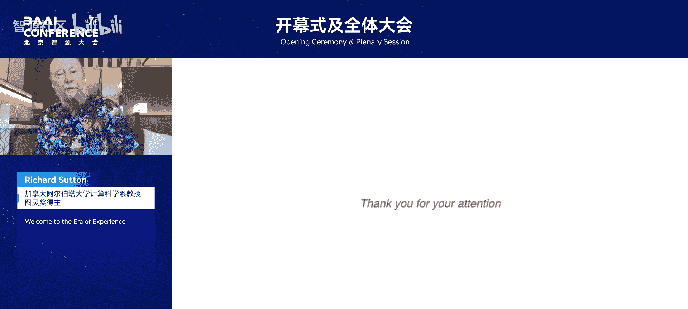

我要解释的好消息是，即使我们想要构建的构建块是非智能体的，它也可以作为构建安全智能体系统的基础。

一个重要的问题是，如果我们想构建一个只做智能、只做理解而没有智能体的AI，我们需要什么？我们需要一个能够生成关于世界如何运作的假设的AI，就像科学家生成关于世界如何运作的假设一样。

但如果你只有假设，这不足以做出好的预测。你还需要进行**推理**，换句话说，从这些假设中推导出结果，以预测某些行动或实验的结果。这就是科学家AI的理念。

一个有趣的见解是，即使科学家AI是非智能体的，它也可以用作智能体AI的护栏。让我解释一下我的意思。

这里的护栏在LLM中被称为**监视器（Monitor）**。换句话说，它是一个独立的AI，其工作是预测某个行动、输出或查询是否会违反我们的安全指令。它只需要是一个好的预测器，不需要是智能体。这是个好消息，因为我所谈论的不良行为、欺骗行为、不诚实行为、危险行为，都是由于智能体性。当AI非常具有智能体性时，意味着它是完全自主的，没有人类监督，这就是我们开始看到问题的地方。但一个只试图预测某个行动是否危险的监视器，不需要是智能体，它只需要是一个好的预测器。如果预测到的伤害概率（给定行动和上下文）超过某个阈值，我们就可以直接拒绝该行动。换句话说，我们可以使用一个非智能体的AI来控制另一个不被信任的、是智能体的AI。这是一个关键思想。

科学家AI的另一个方面是，要真正诚实，它需要对自己的知识保持谦逊。它不应该声称错误的事情。不幸的是，我们目前通常用最大似然法训练AI的方式，可能导致在错误的同时过度自信。

为了理解为什么这很重要，考虑这个小玩具场景：一个机器人面前有两扇门，它必须选择向左走还是向右走。根据过去的数据，它有两个与先前数据兼容的理论，但它不知道哪个是正确的。左边的气泡显示了第一个理论，右边的气泡显示了第二个理论。左边的理论说，如果你走左边的门，人们会死；如果你走右边的门，人们会得到蛋糕（这是好事）。但另一个理论，右边的气泡，说的完全不同：左边的门，人们得到蛋糕；右边的门是中性的，不好不坏。

那么，机器人应该向左走还是向右走？如果它向左走，有50%的几率人们会死，这不是个好主意。如果它向右走，也许人们会得到蛋糕，或者什么也不会发生。所以最好向右走。但要让这起作用，AI需要保留所有可能的、合理的解释或理论。不幸的是，这不是当前方法所做的。因此，AI保持一个关于解释的概率分布非常重要。

在我们的论文中，去年在ICLR上作为口头报告，我们展示了如何使用我们的**Gflownets**（一种变分推理形式）来学习如何生成对下一句话的良好解释（给定前一句话）。你可以把它看作是填补缺失的信息，以便从前一句话过渡到下一句话。这实际上是第一个训练思维链的提案之一。与当前基于强化学习的方法不同，这是基于尝试为数据生成一个好的解释，而不是其他东西。

我们一直在使用这些Gflownets来生成各种高度结构化的解释，例如因果图。换句话说，神经网络将通过遍历每个节点和每条边来生成一个图，比如“这里有一条新边”、“这里有一个新节点”等等。通过这种方式，你可以生成以图的形式结构化的假设。

在一篇更新的论文中，我们一直在思考如何超越这些工作，以使思维链变得诚实并更好地推理。在我们刚刚发布在预印本上的最新成果中，思维链被分开了。它不再仅仅是一个单词序列，而是被分成一系列**主张（Claims）**，一系列陈述，就像数学证明有一系列主张一样。每个主张都应该是真或假，以支持你试图预测的东西。

与普通思维链的不同之处在于，除了具有这种作为一系列主张的结构外，每个主张还有一个布尔随机变量，指示该主张是真还是假。通常，当你思考一个论点时，你假设每个主张都是真的，但实际上，有些主张比其他主张更确定，所以你希望表示每个主张的概率。

这个想法再次回到我所说的：AI不会试图模仿人们写的文本，它会试图为此寻找解释，而解释应该像数学证明一样结构化成主张，每个主张都由先前的主张支持。AI需要计算这些主张的一致性、它们正确的概率，以便得出正确的结论。

好消息是，我们可以使用类似于我们去年所做的潜在变量模型来训练这类系统。

我谈了很多关于最初由于AI具有我们无法控制的智能体性而带来的风险，这可能导致人类失控。但当然，随着我们构建越来越强大的AI，还有许多其他潜在的灾难性问题。例如，一个非常强大的AI可以帮助恐怖分子设计新的流行病。事实上，我最近了解到，你可以创造出如此强大的流行病，可能无法治愈，甚至可能杀死不仅仅是人类，而是大多数动物。这真的很可怕。生物学家认为他们知道如何做到这一点，有一天AI很可能也会知道如何做到。如果一些坏人获得了这种AI，他们真的可以在这个星球上造成巨大的破坏。

当然，这是极端的，但从科学上讲，我们达到这一点是完全合理的。为了避免这类事情，我们需要确保AI遵循我们的道德指令，例如，不提供可用于杀人的信息，当然，遵循我们的道德指令不伤害他人，并且诚实、不欺骗、不撒谎等等。但不幸的是，目前这行不通。我们不知道如何做到。这是一个科学挑战，我们需要尽快弄清楚，在达到AGI之前弄清楚。这可能从几年到十年或二十年不等，但我认识的大多数专家认为，这可能非常短，甚至可能在接下来的五年内。你们还记得我在开始时展示的曲线，表明我们大约在五年内达到人类水平。所以我们没有太多时间，我们需要大量投资，以发现解决这些对齐和控制挑战的科学方案。

不幸的是，即使我们弄清楚了，这也不够。因为即使我们知道如何制造安全的AI，例如使用我谈到的护栏，但这并不意味着我们没有任何问题，因为有人可以简单地移除包含护栏的那段代码，然后AI就可以被用来做坏事。

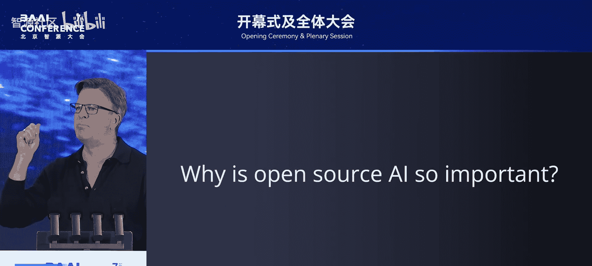

不幸的是，目前世界各地的公司和政府之间的协调并不奏效。公司之间存在竞争，它们竞相成为第一；国家之间也存在竞争，它们也想成为第一。结果，在如何确保AI不会被用来伤害人或AI不会失控方面的安全投资不足。

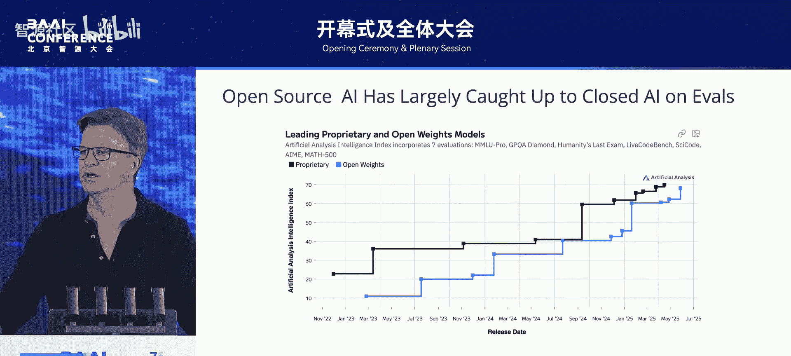

我们需要更多的国家监管，我们开始看到一点，但公司对监管也有很多抵制。当然，仅靠国家监管是不够的，我们需要确保所有开发AI的领先国家就一些原则达成一致。不幸的是，AI被用作相互对抗的武器，因此很难进入这种模式。真正坐到谈判桌前的唯一方法是意识到，对于这些真正灾难性的结果，比如人类失控、恐怖分子使用AI，无论发生在哪个国家，我们都会输。我们都在同一条船上。所以，无论是流氓AI还是恐怖分子使用AI，每个人都会输。

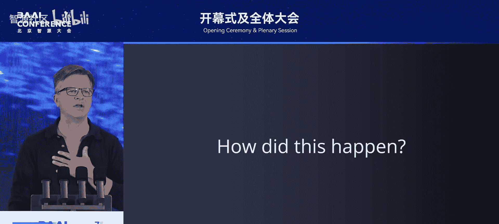

当世界各地的政府，特别是美国和中国，理解这一点时，我认为我们可以取得进展。但只要我们停留在将AI用作相互对抗的武器的想法上，我们就会陷入僵局。

最后，即使我们打算找到政治解决方案，这也不够。我们需要开发新技术来验证AI是否被正确使用。想想核协议，它们都是“信任但要核实”的类型，所以我们需要验证技术，例如在硬件和软件层面使用我认为可以设计的先进技术，世界上有些人正在研究这些技术。

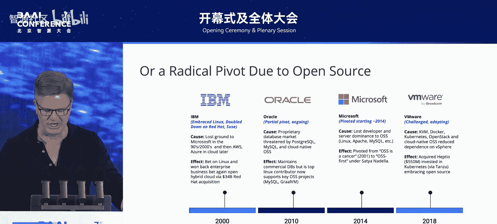

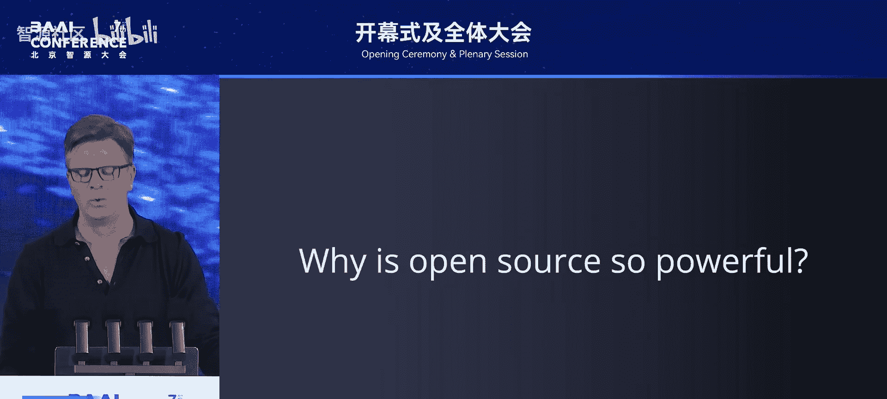

我就讲到这里，谢谢你们的关注。我希望你们花时间消化我所谈论的内容。

谢谢Bengio教授对AI风险和可能解决方案的深入思考。这对我们人类来说真的非常重要。

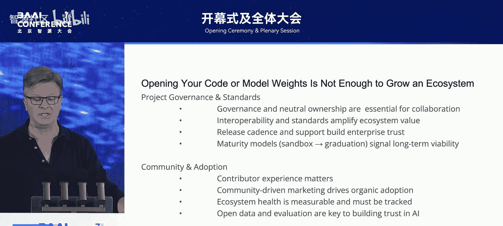

现在让我们进入问答对话环节。有请北京大学助理教授、智源大模型安全研究中心主任姚阳东博士与Bengio教授进行对话。

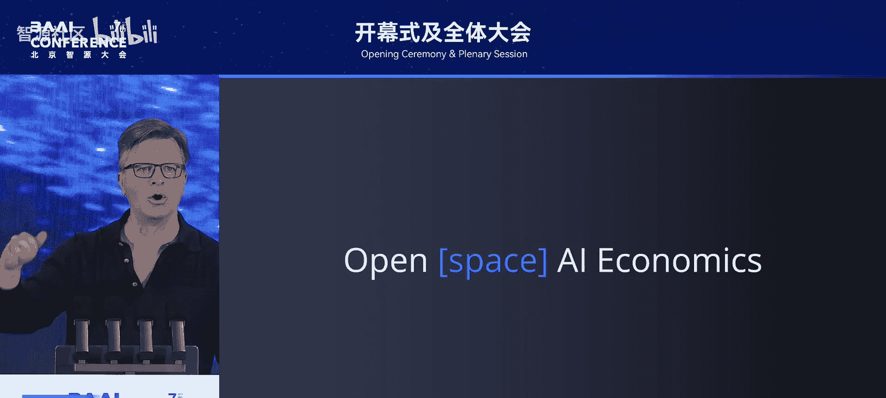

你好，Yao。很高兴在这里见到你，自从二月的法国行动峰会以来。你好，很高兴你在这里。我想你提到了一个关于AI安全和灾难性风险的非常有趣的话题，作为BAI大会的第一个主题演讲，你真的引起了公众的广泛关注。

在你的演讲中，你提到了一个非常有趣的安全AI替代方案，即关于科学家AI。总结这个想法，就是开发这种非智能体的、值得信赖的AI，它可以效仿无私的科学家。

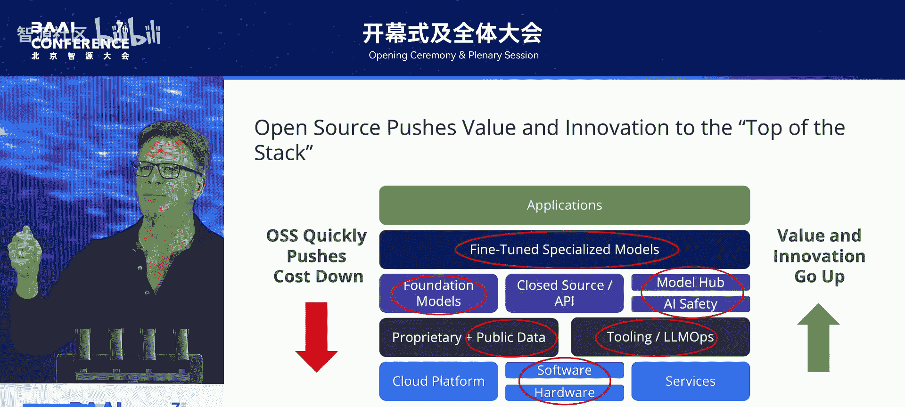

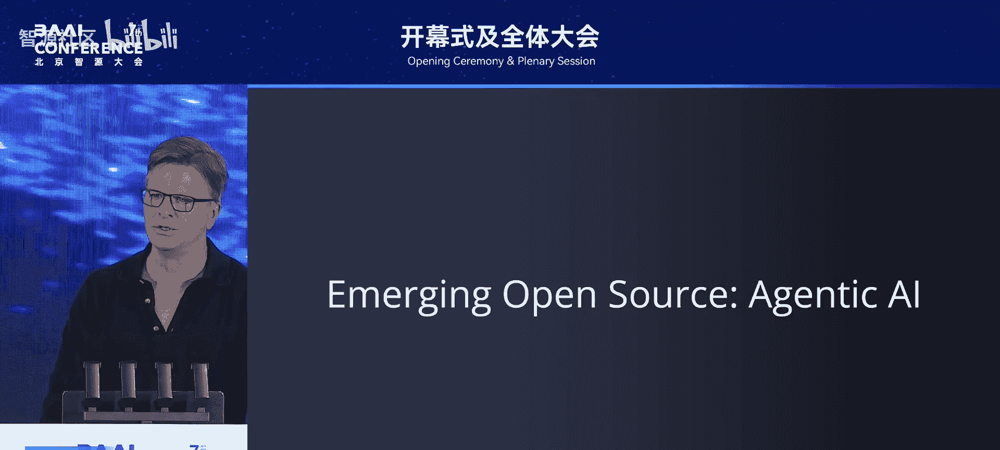

我的第一个问题是关于**可扩展的监督（Scalable Oversight）**。你指出，在未来五年内，AI系统可能能够自主执行非常长上下文、复杂的任务。例如，Claude 4最近展示了自我编码超过9小时的能力。这显然给人类监督带来了更多挑战。你认为我们如何才能最好地应对这种日益增长的监督挑战？科学家AI护栏能以何种方式帮助缓解这些新出现的风险？

这是一个很好的问题，我同意这个前提。不幸的是，我们不知道如何足够地解决这些问题，所以我谈论的这类研究项目是一个值得探索的方向，但我们需要几十个这样的项目，才能希望有一个会成功，而且我们需要在真正糟糕的事情开始发生之前迅速做到。

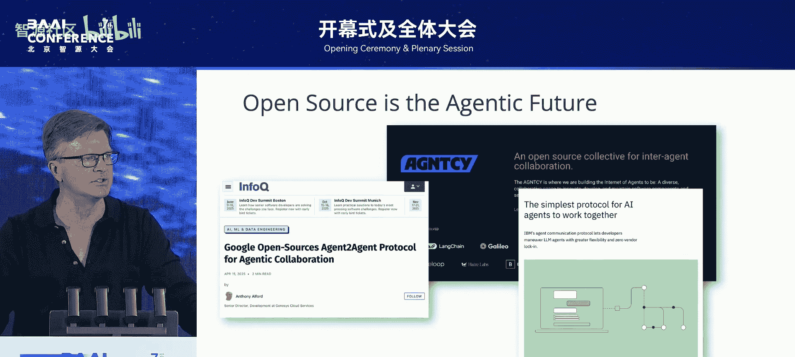

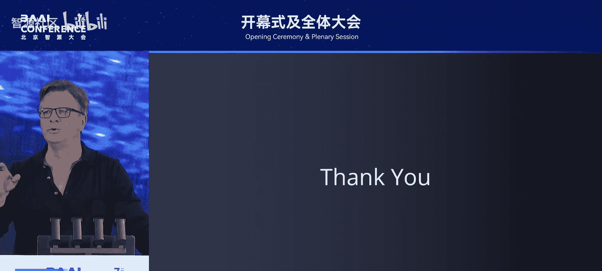

在科学家AI的情况下，为了避免我们现在不知道如何正确控制智能体的问题，这个想法是首先构建一个没有智能体且值得信赖的构建块，然后用它来控制一个可能是智能体的AI，因为人们无论如何都想要智能体，即使有风险。所以至少我们可以通过拥有另一个AI来减轻风险，这个AI可以以一种非常强大的方式（不比智能体AI的智能低，甚至可能更聪明）进行预测，但它不是智能体。所以它是我们可以信赖的东西。

我认为你提到的训练一个诚实、非智能体、解释性的科学家AI来执行监督的想法非常有趣和迷人。后续问题是，你提到了欺骗和作弊的想法。我想知道，如果一个被监督的模型真的进行欺骗或信息隐藏，科学家AI在检测这种对抗行为方面能有多稳健？科学家AI护栏框架能为我们提供什么样的能力来对抗这些作弊和欺骗行为？

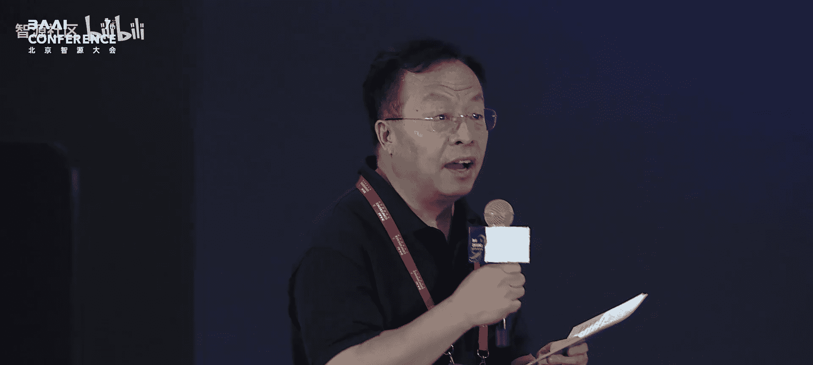

我谈到的护栏只是第一步。它只关注一个行动对潜在未来伤害的影响。但你知道，你可以做得更多。例如，你也可以查看智能体的思维链，甚至神经元的活动。有很多研究试图调查我们如何通过查看智能体的活动和思维链来提取信息以监控智能体。在下游，我认为你甚至可以做得比那更好，因为你可以思考我们如何设计智能体本身，而不仅仅是护栏，而是智能体本身。智能体的一个属性是它们有内部状态，就像人脑中有循环连接一样。你知道，我是循环网络的忠实粉丝，但不幸的是，这意味着我们无法控制智能体的内部状态。相反，我们希望完全控制状态。例如，我们不希望智能体从护栏拒绝其行动中学习如何绕过护栏。如果我们不控制智能体的内部状态，我们对此无能为力；但如果我们控制，我们就可以总是从相同的状态重新采样智能体的策略，而智能体并没有真正意识到它被拒绝了几次。

谢谢。我的最后一个问题实际上是关于你自己的。在你的最后一张幻灯片中，你提到了国家监管和国际条约在确保AI安全方面的重要性。事实上，BAAI是中国最早启动安全研究并参与全球对话的组织之一。我们注意到你最近推出了**Law Zero**，目标是构建安全智能。你提到最终目标不仅仅是创建护栏，还要构建本质上被激励以避免错位行为的可信赖系统。你能分享一下你创立Law Zero的更多想法和灵感吗？你的长期愿景是什么？

我的灵感正是我今天所谈到的：我们已经到了一个地步，有记录在案的证据表明我们无法很好地控制这些AI，它们不够可靠地遵循我们的指令，理解这些现象并找到修复方法变得紧迫。

不幸的是，市场压力对领先的AI公司的影响，显然使它们专注于提高能力，而在安全方面的投资不足。因此，我们决定创建一个完全致力于这些安全问题的非营利组织。我们很幸运地说服了一些慈善组织在未来资助这项工作。我认为，安全以及其他有益于社会的AI应用，应该被视为公共产品，应该由政府资助，以引导AI的发展朝着对社会有益的方向发展，因为未来我们将面临一些关于如何利用我们正在创造的智能的选择。

谢谢你的精彩演讲和见解分享。再次感谢。我们期待在不久的将来在北京线下欢迎你。谢谢。

谢谢姚东，也再次感谢Bengio教授。

---

## 章节三：强化学习与“经验时代”的来临 🤖

接下来我们欢迎另一位图灵奖得主、强化学习的奠基人，加拿大计算机科学家Richard Sutton教授。今年3月5日，Sutton教授荣获2024年度图灵奖，他的研究成果为现代人工智能的发展奠定了重要的理论基础，深刻影响了自动驾驶、游戏AI、机器人控制等领域的技术进步。

接下来，让我们热烈欢迎2024年图灵奖得主、强化学习领域的先驱Richard Sutton教授发表主题演讲。欢迎来到经验时代。

欢迎，谢谢大家，很高兴来到这里。我欣赏了Yoshua Bengio的演讲。这是AI领域一个激动人心的时刻。

我有几个信息，它们将与Yoshua所谈论的内容相关，我有一个非常非常不同的观点，我想这在我今天演讲的第二部分会变得清晰。

首先，欢迎来到经验时代。我有几句引语，我认为它们可能有点间接，但指向了我今天的两个主要信息。

第一句引语来自Ray Kurzweil：“智能是宇宙中最强大的现象。”这让我们感受到AI的利害关系以及今天AI领域正在发生的事情。智能是宇宙中最强大的现象。

我还有一句来自Alan Turing的引语，我认为非常贴切。他说：“我们想要的是一台能从经验中学习的机器。”他在1947年伦敦数学学会的一次演讲中说了这句话。据我们所知，这是有史以来第一次关于人工智能的公开演讲。当时还没有这个领域。我认为这是第一次有人在公开场合就AI发表演讲。他发表了这番评论：我们想要的是一台能从其经验中学习的机器。第一人称经验，这就是我们今天谈论的，以及我们正在进入的经验时代。

所以，我们现在处于**人类数据时代**，也可以称为人类数据时代。因为我们所有的AI都是在互联网上人类生成的文本和图像上训练的，然后由人类专家进行微调，甚至包括他们的偏好以及他们如何做出选择的示例。当然，整个训练是为了预测人类的下一个单词或预测人类标签，而不是试图预测或控制世界。这就是我们现在拥有的。

我认为我们正在开始达到人类数据的极限，这种策略的极限。几乎所有我们高质量的人类数据源都已经被消耗殆尽了。当然，生成真正的新知识超出了模仿人类的方法。要做真正的新事情，你必须与世界互动。

所以现在我们正在进入**经验时代**，至少我们是这样看的。所有AI都需要一个新的数据源，这个数据源将随着AI变得更强大而增长和改进。任何静态数据集都将不足。你可以从经验中获得这种数据，从你与世界的第一人称互动中获得。经验仅仅意味着从你的传感器输入和通过你的效应器输出的数据。这是人和动物学习的正常方式，我认为看看人们学习的视频，提醒我们都是从经验中学习的，是很有用的。

这里有一个婴儿。与其世界顺序互动，世界的不同部分，不同的玩具，并试图学习用那些玩具做什么。请注意，它正在做出决定其输入的选择：它会与一个玩具或一段绳子互动一段时间，直到它学到了所有它能学到的，然后它继续前进。随着它成长并变得更加复杂，它能从每件事中学到的东西量会改变，它的行为会不同，互动方式也会不同。所以它自己的行为决定了它的经验、它的数据，这就是我们需要的。

或者看看人类和动物学习、踢足球、实现目标的其他一些或多或少随机的图片。我们只需思考一下数据流入足球运动员的眼睛和耳朵以及身体感觉器官的情况。一切都在变化，一切都在非常迅速地移动，流入其思想的数据流是巨大的，它无法足够地关注一切，它必须快速做出决定以实现其目标。这就是我们的足球运动员或任何动物的生活：在森林中飞行、逃离捕食者、挥动棒球棒试图击中球、进行对话，非常关注构成熟练感知和行动的高带宽信号处理。这就是经验，当我说经验时，我没有任何花哨的意思，就像Yoshua一样，我只是指数据进出思想。

请记住，数据源如何根据思想的能力而变化，就像两个游戏系统互动时，随着它们改进，数据也变得更好和不同。这就是AlphaGo学会其创造性的第37步的方式。从经验中学习是必不可少的，在这种情况下，经验是通过模拟可能的移动和这些移动的后果产生的，在游戏中，因为你知道游戏规则。在AlphaProof中也是如此，AlphaProof是在国际数学奥林匹克竞赛中获得奖牌的系统。在数学中，你可以看到你的算子的后果，并向前看很多步，就像在计算机围棋中一样。

关于经验思维模式的最后一页幻灯片。

让我们用语言来说。当我们思考经验时，经验思维的方式是：智能体与世界交换信号，这些就是它的经验。学习当然是从经验中学习。一个更深入的观察是，智能体所知道的任何东西都是关于经验的，但即使你事先给智能体一些知识，它仍然必须是关于经验的，不是关于如果它做事情会发生什么的词语。知识是关于经验的，因此可以从经验中学习。

一个智能体是智能的，取决于它能在多大程度上预测和控制其输入信号，特别是其奖励信号。预测和控制，这就是AI应该关注的，智能是关于经验的。经验是所有智能的焦点和基础。当然，正如你们在我们的思考中可能已经注意到的，强化学习领域就是基于这种思维模式。有作为一等公民的智能体，它们做出决策、实现目标、与世界互动。本质上是智能体的。

然后我们可以思考我们现在所处的时间线。第一个时代，算法时代，Atari时代，这是模拟的时代。强化学习智能体从它们的模拟经验中学习，并变得更好，有这些著名的例子，如AlphaGo和AlphaZero，震撼了世界。

然后我们随着ChatGPT和大型语言模型进入了人类数据时代。ChatGPT 3，我们也许现在正处于那个时代的末期，所有数据都来自人类，我们将通过与世界互动的经验进入经验时代。我们看到了这方面的第一个迹象，比如AlphaProof，正如我讨论的，还有当大型语言模型现在使用计算机、拥有API访问权限并可以在世界中采取行动时的迹象。

所以，这是我对AI未来的看法的第一个观点。我的观点确实是，超级智能智能体和超级智能增强人类的再创造，对世界来说将是一件纯粹的好事。我不担心安全问题，我不担心失业问题，因为这只是世界转型和发展过程中的正常部分。

我认为这将需要一段时间，这将需要几十年，并且在那之后还会持续几十年。这是一场马拉松，并不是真的近在眼前，但对我们来说，为它做好准备是好事，因为它将在一段时间内震撼我们的世界。

完全智能的智能体将必须从经验中学习，这超出了我们当前的智能体，尽管它们作为世界知识的可定制接口非常出色。我们已经使用强化学习进入了这个新的经验时代。然而，我必须承认，要实现其全部潜力，将需要更好的深度学习算法，能够持续学习和更好学习的算法。

现在我想换档，谈谈政治。现在我们将触及Bengio教授谈到的一些问题。

当你思考智能体社会时，你必须问这个基本问题：是只有一个每个人都共享的目标，还是有许多目标？一种思考这个问题的方式，你知道，我是一名强化学习研究员，思考我的智能体、我的强化学习智能体似乎很自然。在强化学习中，每个智能体都有自己的目标，它有自己的奖励信号进入其思想，它试图最大化那个目标。不同智能体进入的奖励信号没有理由必须相同。

如果我们再想想自然界，每个动物都有一个类似的信号进入其思想，实际上是在它们大脑的下丘脑中计算的，也在它的疼痛传感器和愉悦传感器中计算。所以在自然界、AI和自然界中，不同的智能体有不同的目标。我的意思是，我们可以谈论它们如何共享目标，比如每个动物都关心食物，但你知道，一个动物的食物不是另一个动物的食物，它们是对称的目标，而不是相同的目标。甚至在人类中也是如此，当然，我们关心我们的家庭，我们关心我们的食物和安全，而不是一个共同的目标。

所以，我希望你们反思一下我们的经济以及它们如何运作得最好。我认为当人们有不同的目标和不同的能力时，它们运作得最好，所以目标不必冲突。但它们可以不同，差异是好的。我们的经济并不真正依赖于人们有相同的目标。它们依赖于人们追求各自的角色，然后互动。

我认为我们不想错过的信息，或者我认为关于我们社会的显而易见的事情是，我们可以共存，和平共存，即使我们都想要不同的东西。我们进行贸易，我们专业化，我们互动。

无论如何，无论你是否准备好以这种方式看待事物，让我做一些定义，以便我可以谈论这个。

所以，我想定义**去中心化（Decentralization）** 为这种现象：你有很多智能体，每个都追求自己的目标。这将与**中心化（Centralization）** 形成对比，在中心化中，你有很多智能体，但它们都被限制拥有相同的目标。例如，蜂巢是中心化社会，有很多智能体，但它们都在追求蜂巢的目标。

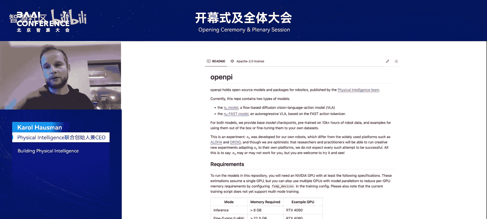

去中心化：很多智能体，每个都追求自己的目标，每个都被允许有自己的目标。

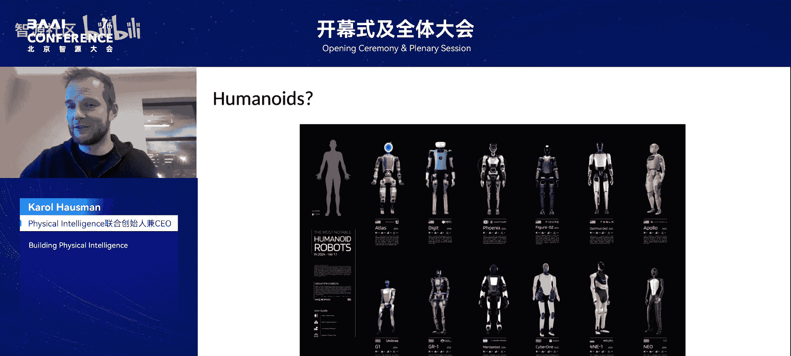

**合作（Cooperation）** 是当具有不同目标的智能体互动时，互惠互利，每个智能体通过互动实现自己的目标并推进自己的目标，这是一种交换的共赢关系。这就是去中心化合作。

我认为合作是我们的超能力。我认为人类比任何其他动物合作得更多。合作由语言和金钱促进，这两者都是人类独有的。人类最伟大的成功是我们的合作，比如经济、市场和政府，这些是我们合作的方式。我们最大的失败是未能合作，比如战争、盗窃和腐败。

所以，这种去中心化合作的观点，是关于社会应该如何组织的另一种观点。在我看来，它比中心化观点更优雅。去中心化合作更稳健、可持续和灵活。它对作弊者和异常值更有抵抗力。

无论如何，人类比任何其他动物更擅长合作，但我必须承认，我们仍然很糟糕。我们仍然不得不有战争，我们仍然有盗窃、腐败和欺诈，所以我们真的必须努力合作。首先，合作并不总是可能的，它至少需要两个可信赖的智能体，而且总会有一些不可信赖的，那些从不合作中受益的人：作弊者、小偷、武器制造商和独裁者，他们从不合作中受益。

现在，合作是一件伟大的事情，但它需要制度来促进它，惩罚作弊者，惩罚欺诈者和小偷。所以中心化权威可以帮助合作，促进合作所需的制度。但这些中心化权威从长远来看也可能毒害合作，当权威变得专制或僵化时。

所以这种对比是在中心化控制和去中心化合作之间。我认为这两者之间的紧张关系是我们这个时代的核心政治问题。

所以我认为你会看到，如果你看看对AI控制的呼吁与对人的控制的呼吁之间的相似之处。想想现在的AI，有很多呼吁，这里我希望你们想想Bengio教授的演讲，它明确呼吁控制AI的目标，甚至控制它们拥有目标的能力。有呼吁暂停或停止AI研究，减缓它。有呼吁限制可能制造AI的权力，以及呼吁确保AI的安全，并要求披露。那么，与对人的控制的相似之处是，正如你们所知，我们这个时代的大政治问题是言论是否自由，人们是否被允许听到其他人的事情。我们能有自由贸易吗？还是必须被控制？我们如何控制就业？我们如何控制金融或资本控制？我们如何对一个国家或另一个国家征收关税和经济制裁？我认为这些论点在对AI控制的呼吁与对人的控制的呼吁之间惊人地相似。我认为这基本上是一个社会问题：我们将如何处理人们拥有多个目标？我们是走向去中心化，还是走向中心化控制？

对中心化控制的呼吁非常相似，它们都基于恐惧。它们都基于我们与他们，无论是我们美国人与俄罗斯人，还是如果你在中国，就像你们所有人一样，你们的“我们”是中国，“他们”是美国。而在美国，情况正好相反。我们所有人，他们所有人，中心化控制，他们妖魔化对方，声称对方不可信。我认为这比那复杂得多，或者说比那更微妙。在每个社会中，都有一些不可信的人，也有大多数通常可信的人。

总结一下。我认为所有人类的繁荣，以及AI的繁荣，都来自去中心化合作。人类非常擅长合作，但他们也非常糟糕。合作并不总是可能，但它是世界上所有美好事物的源泉，我们必须寻找并支持合作，并寻求将其制度化。

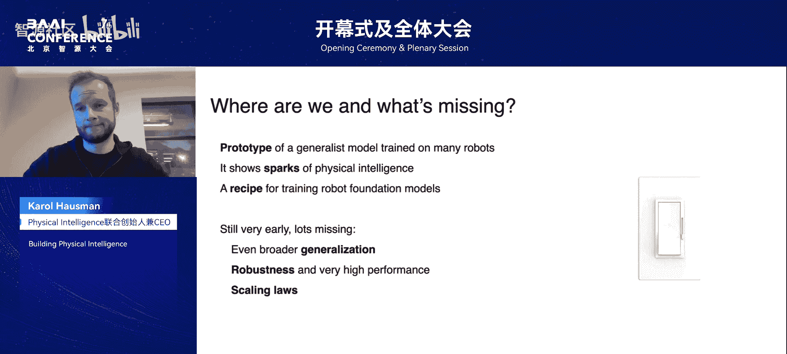

现在，这是我必须呼吁你们利用自己对世界的经验的地方。我希望你们用自己的开放眼光去看。我认为如果你这样做，你很容易看到谁在呼吁不信任，谁在呼吁不合作，谁在呼吁中心化控制。我认为我们应该抵制这些呼吁。

最后，我认为这是一个有用的视角，可以用来看待所有关于人类和AI互动的呼吁。

不，非常感谢你们的关注。

谢谢Sutton教授，给了我们一个不同的场景和视角。

---

## 章节四：智源研究院年度进展与开源生态 🌐

接下来仍然是对话交流环节。有请清华大学人工智能研究院副院长、生树科技创始人兼首席科学家、智源首席科学家朱军教授和Sutton教授进行对话交流，有请朱军。

首先，感谢你接受我们的邀请，发表这个非常有趣且富有洞察力的演讲，从不同的角度。你参加了Yoshua关于非智能体AI的演讲，你强调要发展智能体AI。我相信在中国，在BAAI，我们也有很多强调开发安全、可靠、负责任的AI，以及为了社会目标。即使从强化学习技术上讲，因为智能体试图优化目标，所以你认为如果我们不进行合理的控制，是否存在某种导向风险？这是我的第一个问题。

非常感谢这个问题。当你试图消化Bengio教授的演讲和我的演讲时，我认为首先要理解的是，Yoshua呼吁改变AI，限制它们，控制它们，改变AI以确保安全。而我呼吁改变这个社会，改变智能体生活的世界，以便那些智能体理性地变得有益和合作。所以，想想这是关键的区别：我们是控制允许哪些AI存在，以便它们不伤害我们？还是我们构建我们的世界，使其欢迎所有参与者以合作、贡献的方式参与？

如果你把这作为基本区别，我们可以说一些事情。一件事是，如果你试图改变AI，这是一个有点危险的策略，对作弊者不安全，对吧？如果我们使我们的AI安全，但有一个人制造了一个不安全的AI，那么我们就有问题了。而如果我们改变世界，让所有参与者都能参与和贡献，那么我们对作弊者就更安全。这是一种进化稳定策略，而控制允许哪些AI存在则不是。由于这个原因，它是高风险的。

好的，谢谢你的澄清。我想下一个问题可能更多是关于强化学习的技术问题。你强调强化学习是一个强大的范式。我们用它来构建语言模型，构建Alpha系统，使用密集的强化学习。但如果我们向前看，如果我们想构建一种超人智能，你对最小可行假设或我们需要引入该范式的关键新元素有什么建议，以开发更好的强化学习算法？

如果你从大型语言模型开始，那么很明显你需要目标，你需要行动，你需要一种真实感。我的一个口号是：你不应该要求你的智能体知道任何它自己无法验证的东西。所以无论如何，如果你有大型语言模型，我们需要经验来给我们一个真实来源。所以经验会给你所有那些。所以，如果你把你的问题解释为我们需要在现有的强化学习中添加什么才能使其完全有能力，当然，强化学习假设我们有经验，并强调这一点，并仅仅在此基础上工作。然而，仍然存在当前强化学习输出的弱点是什么的问题，这很明显，第一是它们不是持续学习，持续学习是一个巨大的弱点，现代深度学习方法。我认为第二个大弱点是，我们还没有有效的方法来用学习到的世界模型进行规划。我们可以在围棋或数学中很好地规划，在那里我们不需要学习世界模型，并且有这个不确定的世界模型。但当涉及到现实世界时，我们仍然必须解决这个问题。这是我不认为AI是将在两年内完成的事情的一大原因。如果我们非常幸运，它将在五年内完成，但可能需要15年。

好的，很好。谢谢你。你强调未来的持续学习，特别是在动态、现实的环境中。学习、规划。是的，是的，所以我想也许后续问题是你写了很多著名的文章，很多读者读过，比如《AI的苦涩教训》。你强调人类知识、人类设计的规则与可扩展计算相比可能不是很重要，如果你有更好的计算能力。我想这对于强化学习也是如此，对吧？所以对于强化学习，我们应该避免未来过于密集的人类设计。我想这是你的观点。

关于苦涩教训和现代AI，首先要说的是，经验时代和人类数据时代之间的这种紧张关系，正是苦涩教训的一个实例。人类数据时代是我们试图使用人类数据使系统工作得非常好的时候，这最终达到了极限。所以我们正在达到人类数据的极限，我们制造大型语言模型，我们必须用可扩展的东西取代人类数据，并且可以增加到充分利用可扩展计算。那就是人类经验。所以从人类数据到经验的整个故事，是苦涩教训的一个实例。

好的，谢谢。非常感谢你的精彩演讲和对话。非常感谢。期待未来在北京亲自见到你。谢谢。

谢谢朱军教授，再次感谢Sutton教授。

那么接下来，我们就有请智源研究院院长王仲远为大家介绍智源这一年来的最新发展。

尊敬的各位来宾，各位专家，各位朋友，大家上午好。再次欢迎大家来参加今年的智源大会。那下面就由我来报告一下智源研究院过去一年的科研进展。

我想许多朋友对于智源研究院都已经非常熟悉了。我们是2018年11月份在北京市海淀区成立的一家人工智能领域的新型研发机构。我们致力于做高校做不了、企业不愿意做的科研创新。在智源成立的6年多来，我们率先预见了人工智能大模型时代的到来。早在2020年的时候，我们就已经组建了一支百余人的技术攻关团队，启动了悟道系列大模型的研发。先后发布了悟道1.0、2.0、3.