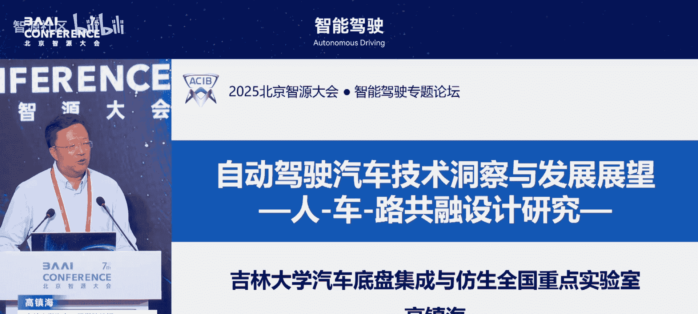
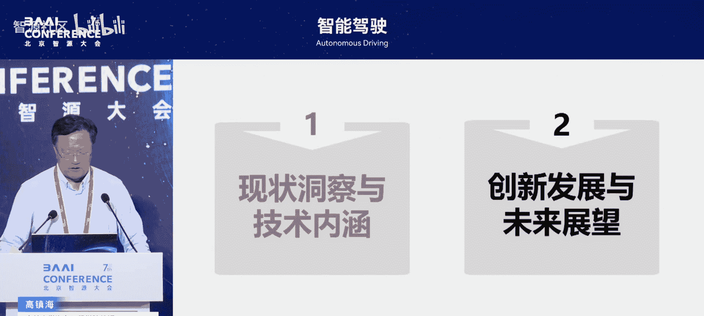
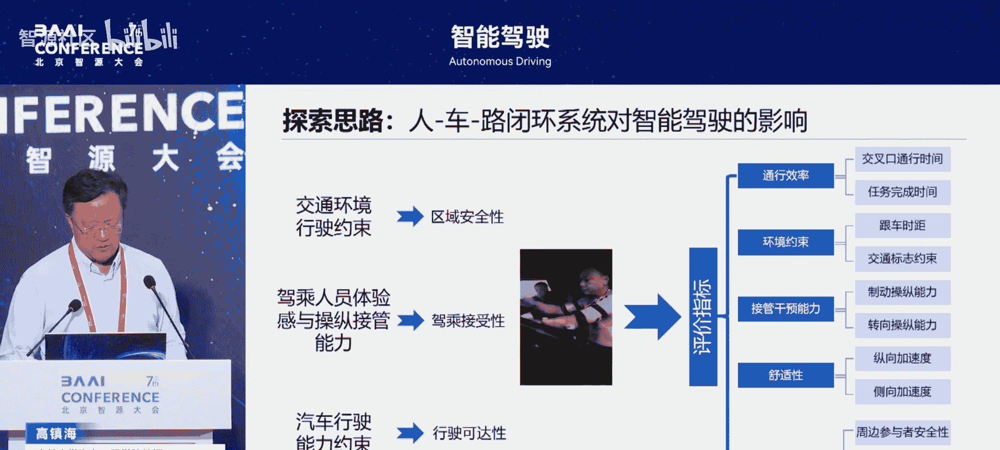

# 智能驾驶-p02-自动驾驶汽车技术洞察与发展展望：高镇海

在本节课中，我们将学习自动驾驶汽车的技术内涵，并从车辆工程专业的角度，探讨智能技术如何重塑汽车的设计与控制理念。课程将结合研究团队的实际工作，分享在数字智能时代对汽车未来发展的思考与实践。

## 概述：从车辆工程视角看自动驾驶

感谢邀请。今天有机会进行分享。正如刚才黄老师所说，我来自纯粹的车辆工程专业。我从1990年入学开始，就在吉林工业大学的汽车工程专业学习。我们一直在思考，当人工智能和数字智能时代来临，汽车未来应如何发展。因此，我今天将从车辆的角度出发，探讨如何理解自动驾驶。

结合我们团队在数字智能技术上的研究进展，与大家进行分享和展望。我为此设定了一个副标题。因为所有汽车，乃至所有运载机械，最终都归结于**人-车-路**的共融设计与控制。

我们团队从1990年我读本科、1994年读研究生开始，就一直致力于**人-车-路闭环系统**的设计。因此，我将从共融的视角展开讨论。

## 研究背景：实验室与团队简介

首先介绍我们的实验室。我自2008年起在学校工作已近24年，担任副院长、院长16年。同时，我在我们的国家重点实验室工作已接近25年。

我们实验室的历史可追溯至1955年，当时组建了长城汽车拖拉机学院，这是中国第一所专注于车辆与行走机械专业的高校。1986年，组建了中国第一所汽车学院，即吉林工业大学汽车工程学院。1988年，组建了中国首批汽车领域的全国重点实验室，最初名为“汽车动态模拟国家重点实验室”。2022年，为顺应科技体系改革，实验室重组为全国重点实验室。

重组时，我们聚焦于**汽车底盘**领域。我们拥有中国汽车工程领域的第一位院士——我的导师郭孔辉院士。我们一直在思考，百年的汽车发展史中，几乎所有的原创性设计理论都源自海外。因此，我们希望引入**仿生学**概念，来重构底盘原创性、综合引领性的设计方法。

我们致力于汽车底盘的集成开发与仿生开发，瞄准轿车、商用车、特种车三类车型。目前也在研究“上天、入地、下海”的全地形车辆，而不仅仅是公路车辆。我们的研究覆盖从汽车设计、运动控制到测试评价的全生命周期。

## 核心观点一：线控化与智能化带来的变革

接下来分享我的两个核心观点。第一个是关于**线控化**的洞察及其技术内涵。

百年汽车史始于1886年第一台汽车的诞生。长期以来，车辆工程专业人员主要研究驱动、制动、转向、悬架、轮胎、座舱等机械结构的探索。从上世纪二战前开始，电子化技术逐渐融入汽车，开启了机电一体化时代。可以说，百年汽车史就是一部机电一体化发展史。

进入本世纪，汽车产业开始步入新型能源与智能网联时代。从产业重大变革角度看，经历了从**机械**到**电子**，再到**电动化加智能化**的演进。我个人认为，未来二三十年将形成 **“AI汽车”** 的概念。这里的AI不仅指智能驾驶，而是指汽车本身成为一个**巨型智能体**，一个泛化的、轮式的人形机器人，具备智能运载功能。

我们团队正在研究，每个驱动单元、制动单元都可以视为一个小的智能体，而区域制动转向系统则是一个大的智能体，如何实现它们的协同工作。

智能电动化给汽车带来了三大根本性改变：

1.  **结构变革**：传统燃油车基于内燃机底盘，研究动力传动（发动机、变速器、离合器等）和行驶系统（转向盘等）。纯电动汽车时代，研究**三电系统**（电池、电机、电控），动力传动变为电池、电机和减速机构。如今，行业在研究**滑板底盘**，即**分布式电驱动底盘**。它将整个动力传动系统集成在轮端，在轮毂内集成电机，电池则布置在车架下方。这使得每个轮子从一个简单的结构体转变为功能体。一个轮端单元（轮胎、轮毂、电机）本身就集成了转向、制动、驱动、悬架的所有功能，并能实现多轮协同工作。这引发了全新的设计理念转变。

2.  **设计模式变革**：智能化使汽车产品设计产生颠覆性变革。例如，汽车造型已开始应用**生成式设计**。我们也在探索汽车结构设计的智能化。过去三十多年，我们主要依靠计算机辅助工程（CAE）仿真进行3D设计。现在，我们开始研究全数字化汽车，并探索汽车能否在**全生命周期**内实现性能的自我进化与管理。因此，汽车将成为一个持续进化的智能体。

3.  **控制范式变革**：传统底盘电控基于预设规则，针对典型工况预设处理机制。现在，我们探索**知识加数据驱动**的方法，但需在机理约束下进行，以避免AI的“幻觉”问题，实现规则生成式设计。过去五年流行“软件定义汽车”，软件确实革命性地改变了控制功能。但**汽车的硬件结构决定了软件功能的上限**，例如轮胎特性决定了车辆的稳定性和操控极限，软件只是帮助尽可能逼近这个极限。未来，控制不能孤立进行，必须走向**机-电-液-磁-热-声控**乃至与材料的一体化设计。

数字智能带来的，正是这种从思路、模式到可行性上的根本性变革，只有通过数字化的智能化设计方法才能实现。

## 核心观点二：自动驾驶的技术内涵

今天我们主要讨论智能驾驶。从底盘控制、从车辆角度理解，其概念如下：

传统控制只能调节轮胎与地面的接触力（即轮胎六分力：三项力与三项力矩）。所有控制基于人眼视野所能感知的范围。

智能驾驶到来后，我们可以在**更大的时空尺度**上进行控制。借助车载传感器，感知范围从单车感知扩展到基于高精度地图和车联网的广域路况感知，从而实现运动控制。同时，智能电动化底盘增强了感知能力，并催生了更丰富的运动控制形态，例如可以精准控制每个车轮甚至每个执行器，实现车辆“跳舞”或复杂脱困行为。此外，还能实现多车协同控制（车路云协同），甚至在云端进行主动干预和远程监控。

因此，从技术内涵上讲，我认为所有自动驾驶技术，其核心是 **“人-车-路闭环系统下的智能协同控制体”** 。它旨在模拟并替代人类驾驶员手、眼、脚、脑的协同操控功能，实现去人化的智能驾驶。具体而言：
*   **模拟人眼和体感**：进行环境感知。
*   **模拟大脑**：进行心理决策。
*   **模拟小脑**：进行底盘的运动控制。

从人的角度，智能驾驶意味着**操控的去人化**。驾驶员的主要任务从“开车”转变为“坐车”，去享受出行乐趣。这就要求系统必须尽可能弥补或拓宽人的感知范围，修正人类驾驶行为中的决策缺陷，最终辅助乃至替代人实现安全操控。这也使得对底盘运动控制的要求更为苛刻，因为乘客对乘坐舒适性、体验感的要求更直接、更高。

从车的角度，所有汽车控制（包括自动驾驶和底盘电控）都是**感知-决策-控制一体化**的实现。设计时必须从一体化角度考虑传感器、执行器和控制器。这一切都基于汽车的纵向、横向、垂向动力学和运动学，并结合底盘与整车行驶中涉及的机械、电子、液压、磁、热、声等多领域控制的一体化设计。这种控制可以非常精细化，在十几毫秒内精准调控车辆运动。在相当长阶段内，我们还需利用人类驾驶员的特色，实现**人机共驾**，优势互补，以确保行驶性能最优化。

从路的角度，传统汽车设计很少考虑路，只研究典型工况和复杂路况（如摩擦系数）。现在，我们从对轮胎六分力的控制，走向了单车控制与智慧道路的结合。传统汽车设计只研究**地面力学**，关注轮胎与地面接触的微观区域。现在，通过车-车、车-路、车-云通信，我们可以获知更广域的道路交通环境，实施车路协同控制。车路云一体化，本质是单车智能与群体智慧、云端智能的协同，能提供更丰富的交通信息，拓展单车智能的感知与控制边界。

最后，对所有汽车工程师而言，**安全、节能、环保、舒适**是永恒的主题。现在还需增加**高效通行**。在人工智能驱动下，我们追求实现“零伤亡、零拥堵、零排放”，让汽车成为一个“净化器”和大健康的载体，更加舒适、健康。

## 小结：自动驾驶的发展路径

基于以上分析，做一个小结。

从技术洞察角度看，整个自动驾驶正从**单车智能**走向 **“车与X”**（人、车、路、云）的信息共享与智能协同出行。它颠覆了原来以人为中心控制汽车的模式。当然，最早的汽车设计理念是“车能走就行”，以车为中心。现在正转向以人为本设计汽车。整个交通关系因此完全改变。

当前阶段，正如刚才主持人所说，正处于**辅助驾驶**阶段，并逐步向真正实现去人操控的**无人驾驶**汽车发展。这是我对自动驾驶汽车的基本理解。

## 团队研究实践：AI赋能的探索

基于以上理解，接下来用一些时间分享我们团队在AI赋能方面做的一些研究工作。

我们团队从吉林工业大学时期的地面系统力学研究开始，就一直致力于探索智能汽车的原创性设计理论与方法，核心是**人-车-路的共融设计与控制**，并积极探索**仿生开发**的设计理念。

我们的研究思路是，深入分析从传统汽车设计到智能汽车设计时，人-车-路系统带来的具体改变：
*   **交通环境**：影响区域行驶安全性。
*   **人的能力**：代表监管和控制能力，影响驾乘接受性。
*   **汽车能力**：指各执行器的加速、制动、转向能力，决定行驶可达性。

基于这些，我们对智能驾驶提出行驶安全、舒适、接管干预、环境约束、通行效率等宏观指标。围绕这些指标，我们从车辆功能角度开展以下研究：

以下是我们在车辆功能层面的具体研究方向：

1.  **丰富运动形态**：研究**分布式电驱动底盘**的设计理论。例如，实现全轮独立转向，让车辆具备横向移动等丰富运动能力；研究仿生悬架，模拟马腿减震功能，通过轮间互联（纯电或电液互联）实现动态抗扭和减震，提升舒适性。
2.  **决策控制一体化**：建立自己的运动控制服务算法，开发控制软件，并重点探索基于全国产芯片的域控制器的开发（与东风、长安、一汽等合作）。
3.  **数据驱动建模**：传统控制基于车辆动力学模型，但在复杂工况下模型精度难以满足实时精准控制需求。我们探索在知识和机理驱动下，利用数据建立模型，并研究未来实现**无模型控制**的可能性。人类驾驶员脑中有一个对车辆运动的“完美理解”模型，结合自身经验（约20%的补偿），就能开好车。当人不再直接操控，仅靠原有70%精度的动力学模型，很难控制好车辆。因此，在复杂工况下，我们需要数据驱动的模型。
4.  **开发全新底盘平台**：研发轮-腿-足融合的全地形运动平台，使轮胎运动形态极大丰富，实现类似机器人般的灵活运动。
5.  **创新设计方法与工具链**：研究多域耦合的仿真分析设计方法；升级传统的K&C（运动学与柔顺性）实验台，开发面向智能底盘的全套测试装备；从制动、转向仿真软件到滑板底盘测试平台，提供面向自动驾驶运动控制的全套软硬件工具链。

探索完“车”，我们同样深入研究“人”：

以下是我们在“人”的层面的研究方向：

1.  **驾驶员建模**：研究在AI驱动下，基于人多模态生理数据（如眼动、肌电、脑电、心电、皮电等）的状态感知，建立人的认知状态交互与认证模型，研究情感计算与需求分析。
2.  **人机交互与功能调节**：基于人的需求分析，研究在个性化场景下，如何实现从行驶到乘坐再到信息提供的多维功能的人机主动调节。
3.  **中国驾驶员行为分析**：利用驾驶模拟器，构建中国路况和典型/长尾工况，分析中国驾驶员的行为特性，例如紧急避撞（Bounce）行为。
4.  **群体智能与社会伦理**：研究高安全、高接受性、高效率的**群体智能协同交互决策**；研究车与车之间的交互冲突与缓解机制；研究类似“电车难题”的两难工况下，人的本能反应规律与社会伦理安全。
5.  **驾乘健康**：研究由电动车急加速等引起的**运动症**，基于人体感官冲突理论检测运动症程度，并将其融入运动控制以减缓症状；研究长期驾驶导致的**腰椎隐性损伤**，通过坐姿、座椅人机交互调节乃至运动控制来缓解损伤。
6.  **研发测评工具链**：建立人机工效实验室，测试驾乘人员的数字生理学表达；建立人机交互动态模拟器进行测试。

最后，我们也研究“路”：

我们希望将交通环境**场景化**，构建覆盖中国全地形、全气候的无限场景虚拟试验场，模拟复杂与极限工况。同时，开发自己的仿真软件，建立完整的**人-车-路-传感器模型**，包括复杂环境下的视觉传感器、雷达传感器、V2X通信衰减模型等。

## 未来展望与研究重点

作为来自传统车辆工程专业的研究者，我认为汽车是一个伟大的高新技术载体，是机械、机电、信息物理系统多学科交叉创新的最佳平台，也是新材料、新器件、人工智能、大数据等新技术的应用焦点。

我们团队以 **“汽车+AI”** 为核心，聚焦于：
1.  底盘**生成式AI设计**与执行器结构的一体化控制。
2.  将智能驾驶分解为**感知、认知、决策、运控、线控**五个环节，实现感-知-控一体化设计。
3.  研究人-车-路-云的协同智能控制。
4.  研究驾乘体验感的数字生理学表达与AI大模型。

目前，我们重点开展以下三项工作：

以下是我们的三个重点研究方向：

1.  **基于底盘的数字孪生**：不仅在设计端决定性能，更面向全生命周期。研究底盘动态性能演变与品质退化机制，建立底盘智能运行安全的**全息数字孪生**模型，实现故障预测与健康管理。
2.  **车路云协同安全监控**：从单车智能走向车路云协同。基于法规与合理合规原则，建立智能驾驶安全实时监控及云端主动干预系统，作为车辆安全的最后一道云端屏障。
3.  **驾驶员大模型与人车交互进化**：研究驾驶员大模型，通过视觉、语言、动作等多模态数据，实现数据驱动的场景生成、AI认知与主动进化学习，从而实现人车交互设计与控制的自我进化。
4.  **构建大型实验平台**：通过学校资源，构建融合车、交通、城市的多域复杂环境模拟平台，实现陆海空天多域交通参与物的模拟。未来目标是实现AI驱动下的模型（人、车、路）自生成与生成式建模，而非手工建模。

## 总结

最后进行总结。从车辆角度讲，以智能电动为主要特征的新能源汽车开发面临以下趋势：
*   **电动化**：引发动力底盘融合，执行器功能预控化，控制完全预控化。
*   **智能化**：实现感知-决策-控制一体化。

展望未来十年到二十年，汽车将是一个绿色可持续发展的载体。它将具备以人为本的功能、全新的运动形态、全生命周期的数字孪生、作为巨型智能体的属性以及车路云协同的能力。未来的汽车，必将成为一个**自学习、自进化**的可持续发展运动载体。

以上是我的一些理解和分享。我们的目标是创建新一代智能电动底盘的设计理论与方法，并提供核心总成、控制软件和工具链。

谢谢大家，敬请批评指正。