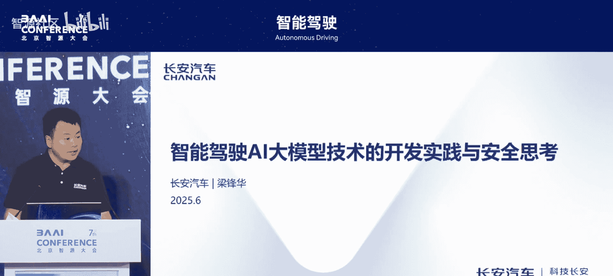
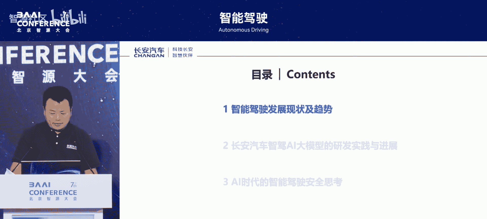
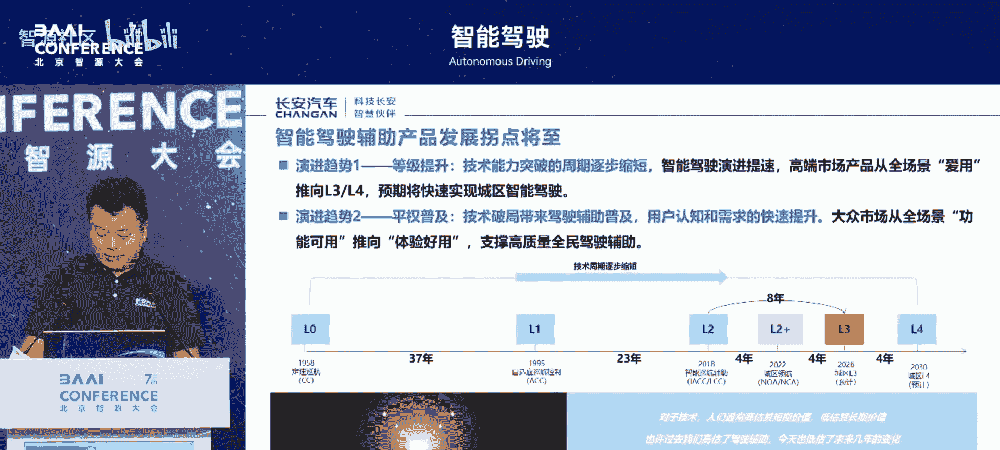
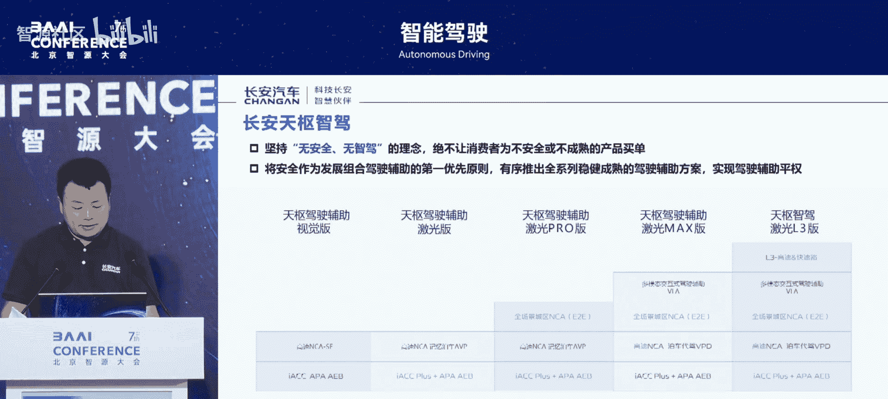
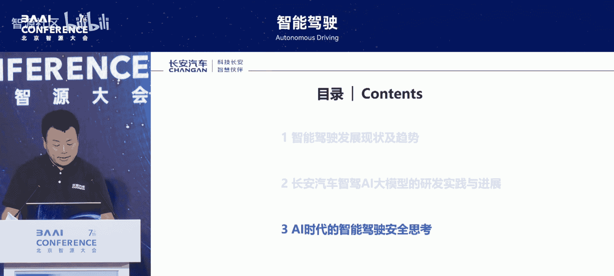

# 智能驾驶-p03-自动驾驶AI大模型技术的产品应用与安全思考：梁锋华

在本节课中，我们将学习长安汽车在智能驾驶领域的最新工作与思考，重点探讨AI大模型技术的产品化应用路径以及伴随而来的安全挑战与应对策略。

## 趋势理解

上一节我们介绍了课程背景，本节中我们来看看当前智能驾驶领域的核心发展趋势。

智能驾驶的搭载率正在飞速提升，目前最新数据已超过60%。用户对智能驾驶的认知度、需求度及购买意愿也在持续提升。从实际监测情况看，用户在使用智能驾驶后，对其依赖度非常高。真正使用智能驾驶后的用户几乎没有回头的。一旦使用智能驾驶，它基本上会成为用户购车的一个必要决策选项。

同时，关于智能驾驶安全能力的标准正在逐步达成行业共识。其安全保障能力需要达到比人类驾驶员更高的水平。当前，做得比较好的L2级驾驶辅助系统，其安全保障能力已比普通驾驶员高一个数量级。预计未来的自动驾驶系统可能会达到高出两个数量级的程度。

智能驾驶发展的技术拐点正以肉眼可见的速度接近。从L0到L1、L2，再到L3、L4，技术迭代的间隔在持续缩短。依据此趋势，2030年被认为是L4级自动驾驶大规模推广的关键时间点。

在普及方面，智能驾驶正从过去仅作为高端豪华配置，快速发展到全民驾驶辅助普及的状态。

## 技术演进路径

上一节我们探讨了市场趋势，本节中我们来看看支撑这些趋势背后的技术演进路径。

智能驾驶技术正从过去的规则模块化，向端到端的数据驱动持续演进。在过去及当前，系统多由众多相对较小的深度学习模块（如感知、规控）与规则模块组合而成。现在，技术正在快速向端到端的、数据驱动的方向转变。

然而，整个技术的发展总体上是叠加式的，而非简单的颠覆式发展。即使端到端技术成为主流，以往模块化、规则化技术的沉淀，仍然是端到端发展的重要基础。

行业现状呈现“冰火两重天”的状态。一方面，智能驾驶对用户的行车安全起到了显著的提升作用。数据显示，当前优秀的驾驶辅助系统，其安全保障能力已比用户自身驾驶高一个数量级。

另一方面，行业中也出现了非常多的问题。究其原因，我们认为有以下几点：
*   系统设计仍有非常大的完善空间，特别是在安全与用户体验的兼顾方面。
*   人机共驾方面，如何实现更可信、更可靠的人机交互是关键。例如，在危急情况下，系统不能简单地将控制权交还给用户，因为用户可能根本来不及反应。
*   更关键的一点是市场存在过度宣传，导致用户对系统能力产生认知偏差，进而引发安全风险。

同时，在政策法规层面，围绕智能网联汽车的政策标准正在快速完善，包括L2/L3准入要求，以及即将作为强制标准的《智能网联汽车组合驾驶辅助安全要求》等，这些都将对行业产生巨大的促进作用。

## 长安汽车实践：战略与架构

上一节我们分析了行业的技术与挑战，本节中我们聚焦长安汽车的具体实践。

长安汽车自2017年开启第三次创业创新计划，并于2018年发布“北斗天枢”智能化战略，加速向智能低碳出行科技公司转型。

在“北斗天枢1.0”阶段，公司取得了17个里程碑式节点，包括牵头制定汽车驾驶自动化分级国家标准，并在智能驾驶技术储备与量产应用方面取得一系列突破，其中多项为行业首发。

今年发布的“北斗天枢2.0”计划，计划未来累计投入2500亿元，构建以“天枢大模型”为核心的“巨擎智能”架构，实现“智慧大脑”的持续进化。公司内部口号是“无AI，不创新；无AI，不长安”。该计划的核心是打造一个能为用户带来更好安全与体验的、更加智慧的类人大脑。

发展路径上，坚持全栈自研与开放合作“两条腿走路”：
*   **苦练内功**：构建全栈自主可控的研发体系。
*   **开放合作**：与华为等在内的智能驾驶伙伴深度合作，将如“乾崑智能”、“鸿蒙系统”等技术应用于阿维塔、深蓝等产品。

同时，公司打造了智能汽车超级数字化平台——SDA架构（天枢架构），对整车架构进行了重新定义，将其分为六层：
1.  **机械层**
2.  **能源层**
3.  **EE架构层**
4.  **操作系统层**
5.  **应用层**
6.  **云端大数据层**

该架构是除特斯拉外唯一的中央环网架构，具有反应速度更快、安全冗余更多、集成度更高等特点。即使骨干网络连接中断，也能保证整车稳定运行。

## 长安汽车实践：大模型与安全理念

上一节我们介绍了公司的整体战略与架构，本节中我们深入探讨其核心的大模型技术与安全理念。

在“天枢大模型”方面，公司引入具备世界知识的多模态大语言模型，旨在实现拟人的交互智能和进化智能。其目标是成为一位可交互、可执行、可进化的“数字司机”，能够“看得懂路、听得懂话”，能够理解和思考，并持续进化，最终实现AI座舱与AI智驾融合的一体化大模型。在硬件层面，最终将走向“舱驾一体”融合，并将各类服务融为一体，形成一个“超级智能体”。

在智能驾驶方面，公司坚持 **“无安全，不智驾”** 的理念，绝不让消费者为不安全或不成熟的产品买单。公司将安全作为发展智能驾驶（包括组合驾驶辅助）的第一优先原则，有序推出一系列稳健成熟的智驾方案，最终实现智驾平权。

当前，公司将智驾产品分为五个阶梯：
1.  天枢智驾辅助（视觉版）
2.  天枢智驾辅助（激光版）
3.  天枢驾驶辅助（激光Pro版）
4.  天枢驾驶辅助（Max版）
5.  天枢驾驶辅助（激光2.0版）

未来，整个智驾产品形态将持续迭代。

## 端到端大模型技术方案

上一节我们明确了安全至上的理念，本节中我们来看看实现未来智驾的具体技术方案——端到端大模型。

我们认为，未来智驾一定是“交互式智驾”。它不仅是安全的需要，也是用户反馈与交互的重要通道。公司的端到端系统与交互模型在信息更新上有“快慢系统”之分，以充分发挥各自优势：
*   **快系统**：主要解决实时性问题。
*   **慢系统**：主要解决复杂场景判断，以及实现驾驶员、车辆与环境之间更充分的交互。

在具体技术方案上，端到端系统总体分为云端和车端两大部分：
*   **云端系统**：主要包括基于大模型的数据生产、大模型本身的训练/部署/评测系统、云端智能体系统以及大模型仿真引擎等。
*   **车端系统**：主要包括车载智驾模型（如感知-规控一体化大模型、多模态交互大模型）的部署、大模型安全对齐引擎以及对应的智驾软件工程包等。

整体可总结为 **“云脑、大脑、小脑”三脑联动** 的体系。

在数据侧，公司已建成全链路数据闭环系统，涵盖数据采集、标注、训练、仿真、测试等环节。目前每日可生产1000万帧训练样本，预计到今年底将拥有“1帧级别”的关键场景数据积累。

大模型的安全基础依赖于高质量、多样化数据的支撑，以解决真实数据不足和场景覆盖不全的瓶颈。获得高质量数据（尤其是高质量的驾驶行为数据）背后涉及大量复杂、细致的工作，包括对驾驶员严格的管理与筛选，以及通过数据引擎对驾驶行为片段进行持续迭代的筛选与优化。

在部署侧，我们认为端到端大模型仍需与传统规则系统互补，形成 **“AI泛化能力 + 规则确定性”** 的双轨安全机制。AI大模型本身具有“黑箱”属性，规则系统是确保技术安全落地的必备环节，由AI提升性能上限，由规则守住安全底线。

在应用侧，公司建立了多支柱协同测试策略与系统性能安全模型，充分利用如重庆8D复杂道路场景等，持续对系统进行考验，力求达到功能与性能测试内容的100%覆盖。这是一个持续挖掘风险场景、持续完善测试覆盖的过程。

## AI大模型安全管理

上一节我们探讨了技术实现，本节中我们来看看如何从管理层面保障AI大模型的安全可控。

公司依据《网络安全法》、《数据安全法》及国家关于大模型的管理规定，结合工程实践，制定了《长安汽车AI大模型安全管理办法》，从管理层面全面落实AI大模型安全主体责任。

该办法构建了网络与数据安全一体化的防护制度和体系，涵盖：
*   数据安全
*   模型算法安全
*   服务与应用安全
*   安全评估
*   安全应急响应
*   安全审计
*   安全考核

该办法旨在保障AI大模型安全可控与业务创新的可持续推进，同时本身也是一个持续提升和迭代的过程。

## 安全思考与行业建议

上一节我们介绍了企业内部的管理机制，本节中我们分享关于AI时代智能驾驶安全，特别是大模型安全的更广泛思考。

新的AI大模型技术在持续提升用户体验的同时，也带来了新的挑战。这个过程有历史经验可借鉴，例如深度学习技术刚应用于汽车感知时，也经历过类似的担忧期，后通过技术迭代与管理体系完善得以可靠落地。AI大模型也将经历一个类似但螺旋式上升的过程。

具体思考与建议包括以下几个方面：

**1. 模型可解释性与问题可追溯性**
需要建立全生命周期的数据监控体系，从事前、事中到事后运营各个环节，对数据进行全生命周期监控，包括上传云端数据的实时监测与评估，力求实现模型全生命周期问题的可解释与可追溯。

**2. 测评数据与场景困境**
以下是解决该问题的关键路径：
*   **企业责任**：开发主体需对结果负责，自身需持续建立和完善场景库与数据库。
*   **行业共建**：非常期望行业能够共建场景库与数据库，特别是针对长尾场景。需要建立常态化的采集与持续的场景重建机制，让行业级场景库的规模不断扩大，持续覆盖行业遇到的各种长尾场景，这对行业快速发展是关键助推。

**3. 构建全面的车用AI风险管控机制**
整车企业面临系统安全、数据合规、伦理责任等多重挑战。为保障技术落地，需要从组织架构、技术研发、数据治理、合规协同等方面建立并不断完善管理机制。

基于以上思考，我们提出以下行业建议：
*   构建国家级的智能驾驶数据中枢平台。
*   重构事故责任认定框架。
*   建设国家级的开放测试场景库。
*   实施全生命周期的穿透式监控。

最终，我们希望与全行业一起，持续加速，让智能驾驶AI大模型及整车AI大模型，成为汽车产业转型升级、高质量发展的关键助推力。

## 课程总结

本节课中，我们一起学习了长安汽车对智能驾驶发展趋势的判断、其“北斗天枢”战略下的技术实践，重点探讨了端到端AI大模型的产品化应用方案，并深入分析了伴随而来的安全挑战。核心要点包括：技术演进是叠加式发展；企业坚持“无安全，不智驾”理念；通过“云脑-大脑-小脑”联动和“AI+规则”双轨机制实现技术落地；并从数据、测试、管理等多维度构建安全体系。最终，行业协同共建与完善治理机制，是推动AI大模型在智能驾驶领域安全、可靠、规模化应用的关键。