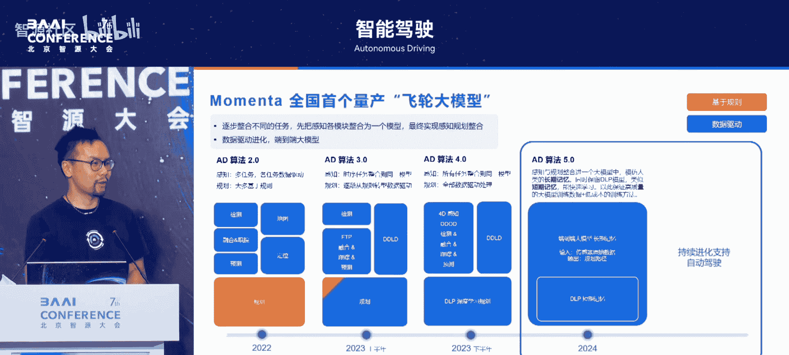
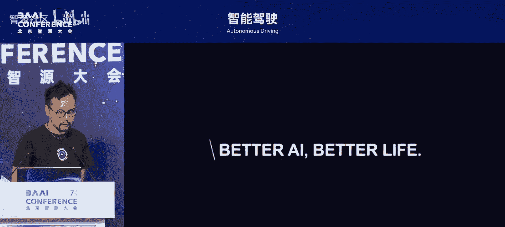
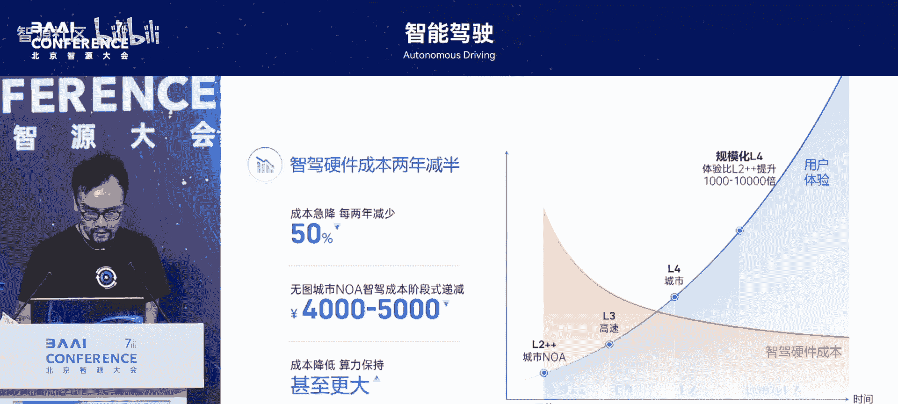

# 智能驾驶-p04-自动驾驶的可规模化之路：饶庆

在本节课中，我们将学习实现规模化L4级自动驾驶的路径、核心挑战以及Momenta公司提出的“数据驱动飞轮”与“量产+Robo”双线战略。我们将探讨如何通过端到端大模型和强化学习等技术，解决长尾问题，最终实现比人类驾驶安全10倍以上的自动驾驶系统。

## 公司简介

我们首先简要介绍演讲者所在公司Momenta的发展情况。

Momenta成立于2016年。公司在2022年首次交付了基于其“飞轮”大模型的第一款车型。从2022年到2025年，公司陆续交付了30多款车型。目前，公司定点交付的车型共有130多款。

从2023年开始，公司的车型也开始在国际市场进行交付，包括欧洲。今年，公司计划在澳洲、新西兰以及全球其他区域进行交付。公司的战略合作伙伴主要是OEM厂商，包括上汽、通用、奔驰、丰田以及比亚迪。

公司的文化是“少承诺，多交付”。在与主机厂合作的过程中，主机厂看到了公司的交付能力，并逐渐转变为公司的投资人及战略合作伙伴。

以上是简单的公司介绍。

## 规模化L4的目标与挑战

上一节我们介绍了公司的背景，本节中我们来看看规模化L4自动驾驶的具体目标与核心挑战。

公司的目标是实现可规模化的L4级自动驾驶。可规模化的L4不是指在特定区域内运营几十或几百辆Robotaxi，而是指能在全区域范围内行驶的、可规模化的L4。

实现可规模化L4的一个具体目标，可以参考美国国家公路交通安全管理局的数据。人类司机平均每行驶100万公里会发生一次交通事故，每行驶1亿公里会发生一次致命交通事故。因此，实现可规模化的L4，需要构建比人类司机更安全的自动驾驶系统。其目标是至少达到人类安全水平的10倍，这是一个必要条件。

如何实现十倍于人类的安全性？公司进行了一个简单的测算。根据前述数据，要达到10倍于人类的安全性，系统需要应对10亿公里驾驶中可能出现的罕见情况。然而，系统可能每行驶100公里才会遇到一次这类罕见案例。因此，总里程需求计算如下：
`1亿公里 * 10倍安全 * 100倍罕见度 = 1000亿公里`
这意味着需要积累1000亿公里的驾驶里程数据，才能解决真实世界中的各种长尾问题。

什么是长尾问题？可以举一个例子。去年公司刚开始研发一段式端到端大模型时，在清明节期间上路测试。清明节期间，路边有祭祀烧纸留下的火堆。这是一个平时罕见的场景，属于长尾场景。当时测试时比较紧张，因为训练数据中可能没有包含火堆场景。但车辆最终成功绕开了火堆。这说明人工智能，或者说一段式端到端大模型，具有很强的泛化能力。

像火堆、卡车拖着树木、旁边车道的车辆突然失控撞入自车车道等场景，都需要被识别出来并进行安全处理。这样才能实现真正意义上的L4级自动驾驶。

## 解决长尾问题的两大洞察

基于上述挑战，公司提出了解决长尾问题的两大核心洞察。

第一个洞察是必须采用数据驱动的方法。基于传统规则驱动的方法无法解决所有问题。如果每出现一个新案例就定义一条新规则，那么面对真实世界中成千上万、甚至数亿个案例，规则系统将无法管理。因此，必须是数据驱动的。

为此，公司打造了“数据驱动飞轮”，包含三个要素：
1.  **数据驱动的算法**：即后续将介绍的端到端大模型。
2.  **海量数据**：从真实世界的量产车中回流的海量数据，使系统能看到各种长尾案例。
3.  **闭环自动化的工具链**：在云端的工具链需要自动化处理海量数据，自动生成训练数据，并不断迭代训练模型以提升性能。

第二个洞察是必须使用量产车辆来解决问题。仅仅依靠几十或几百辆L4级Robotaxi车队，无法满足1000亿公里的驾驶里程需求。只能通过量产车辆的数据回流来解决L4的长尾问题。

目前，公司已在市面上拥有超过30万辆搭载其解决方案的量产车。假设每辆车每年回流1万公里数据，当前估算的数据总量为：
`30万辆车 * 1万公里/年 = 30亿公里/年`
公司预计到2028年，搭载Momenta解决方案的量产车将达到1000万辆。届时，将能帮助实现1000亿公里的驾驶里程目标，从而实现可规模化的L4。

## “飞轮”与“两条腿”产品战略

基于之前的两个洞察，公司打造了“一个飞轮，两条腿”的独特产品战略。

“一个飞轮”即刚才介绍的数据驱动飞轮。“两条腿”分别是：
*   **左腿：Mass Production（量产辅助驾驶）**：这包含了目前市面上已量产的L2级辅助驾驶，后续将提升至L3有条件自动驾驶以及L4高度自动驾驶。
*   **右腿：Scalable Robo（可扩展机器人）**：这里不仅指Robotaxi，还包括RoboTruck和RoboDelivery，对应公司“十年物流效率翻倍”的愿景。

战略的核心在于闭环：从量产辅助驾驶车辆回流数据到云端，不断迭代用于Scalable Robo的L4级算法；再将L4级算法的更新部署到L2级量产辅助驾驶车上。如此形成闭环，不断提升模型的效率和性能，最终实现可规模化的L4。

公司智能辅助驾驶的车型搭载量和交付量正在飞跃式增长。从2022年交付第一款车型开始，经过两年时间，搭载辅助驾驶的车型达到了10万辆。从10万辆到20万辆，仅用了6个月。从20万辆到30万辆，仅用了3个月。

在成功交付的车型数量方面，2022年交付第一款车，到2024年底成功交付了26款车型。到2025年4月，累计定点车型数超过了130个。基于此趋势，公司判断到2028年，搭载Momenta辅助驾驶的车辆将超过1000万辆，这将帮助实现1000亿公里的数据里程目标。

## 算法演进：从规则到端到端

接下来是本次分享的重点：介绍Momenta的算法演进Roadmap。

算法演进图揭示了两个趋势。第一个趋势是基于规则的算法逐渐被基于数据驱动的算法替代。第二个趋势是小模型逐渐融合成大模型。

在2022年交付第一款车型时，使用的是算法2.0。在2.0阶段，公司使用不同的专用小模型来完成不同任务，例如用一个模型做物体检测，另一个模型做融合与跟踪，预测又是另一个小模型。

小模型融合成大模型的好处在于：
*   **降低工程复杂度**：不同模型需要不同团队维护，在训练和数据集管理上较为复杂。融合成一个大模型后，只需一个团队管理一个模型，降低了工程复杂度和代码行数。
*   **提升算法性能**：为后续的端到端融合奠定基础。

在算法3.0阶段，公司首次使用深度学习进行预测（FTP: Fusion, Tracking, Prediction），将融合、跟踪和预测任务融合。

在2023年下半年的算法4.0阶段，公司进一步将基于规则的规划（Planning）替换为基于深度学习的规划（DLP: Deep Learning Planning）。据公司了解，当时特斯拉的FSD V11仍使用基于规则的规划算法。因此，在算法4.0阶段，公司使用了三个较大的模型：
1.  **DDOD (Data Driven Object and Obstacle Detection)**：负责动态物体及通用障碍物检测。
2.  **DDLD (Data Driven Landmark Detection)**：负责对静态地标（如车道线、道路边缘、施工路障等）进行感知。DDLD也用于替代高清地图方案，实现轻地图或无图的L2级辅助驾驶。

用今天的说法，算法4.0已经是“两段式端到端”模型。

到了2024年，公司进一步将两段式端到端模型融合成一个大模型，即算法5.0。具体工作是将DDOD和DDLD中的BEV特征生成部分融合，共享一个BEV骨干网络，然后在BEV特征上连接不同的任务头，并将基于深度学习的规划也接到BEV骨干上，实现了感知与规划的“一段式端到端”。

一段式端到端的好处在于：
1.  **去除人为定义的接口**：在两段式模型中，感知需要明确定义物体类型（如“火堆”）并输出给规划。如果未定义，规划就无法处理。一段式模型则不需要明确定义物体类型。它通过模仿人类司机行为进行训练，学习人类司机在遇到各种障碍（包括未定义类型障碍）时的轨迹，从而获得强大的泛化能力，能够应对通用障碍物和微小物体。
2.  **提升复杂交互能力**：在复杂路况（如无明确车道线的大路口）下，模型能更好地与其他交通参与者进行交互，通过观察其他车流来判断可行驶区域，规划出合理路径，甚至在博弈场景下也能稳妥处理。

算法5.0于2024年9月开始陆续OTA推送给终端用户。

接下来，公司计划加入强化学习，使飞轮大模型进化到R6阶段（R代表Reinforcement Learning）。从自然语言处理领域（如DeepSeek）获得启发，强化学习的加入能显著提升模型的推理能力。

在智能驾驶领域应用强化学习，能让模型学习“思考过程”而不仅仅是结果。这有助于解决一些难以解释的“黑盒”行为。例如，可以收集人类司机的不良驾驶行为（如压实线右转）作为负反馈数据，在强化学习中对模型进行惩罚；同时用好行为进行奖励。通过云端不断迭代，模型有望达到甚至超越人类司机水平。这类似于AlphaGo通过自我对弈超越人类棋手的历程。

## 真实世界效果演示

接下来，我们通过几个视频片段，观察算法5.0在真实世界中的表现。

第一个场景展示了在泥泞小路上的通行能力。道路车道线不清，边缘模糊，路边有小动物，路面有水坑反光。在此复杂环境下，5.0模型能够丝滑应对，在判断对向车道绝对安全时，可以借道通行。

第二个场景是ETC通行。这是一个复杂的工程问题，包括识别ETC车道、在无车道线广场上进行车辆交互、出收费站后快速选择车道以及应对各种形态的抬杆。公司通过纯视觉方案和一段式端到端大模型，成功处理了这些挑战。

第三个场景是“车位到车位”的智能自主驾驶。该功能将城市L2级领航辅助驾驶与停车场记忆泊车功能相结合，扩大了用户的使用范围。车辆可以自主学习停车场地图，并与领航辅助驾驶无缝衔接。

## 市场趋势与“智能驾驶摩尔定律”

本节中，我们来看看公司对中国智能驾驶市场发展趋势的判断。

公司认为，2023年是智能辅助驾驶的拐点，2024年成为引爆点。今年初，行业出现了“全民智能辅助驾驶”的口号，带动了节奏。标配城市领航辅助功能的车型价格已从20万元下探至15万元，未来可能进一步下探。

类比智能手机和电动汽车的发展历程，公司预测智能辅助驾驶的渗透率从2023年到2030年也将有约5倍的增长，到2030年底市占率可能达到80%左右。

背后的逻辑是“智能驾驶的摩尔定律”，分为软件和硬件两方面：
*   **软件体验摩尔定律**：软件体验每两年提升10倍。其技术支撑是一段式端到端大模型，以及未来加入的强化学习。体验提升的直观感受是，从两年前试乘时让乘客“汗流浃背”，到如今5.0模型让乘客感觉像“滴滴专车司机”一样安心，未来目标是达到“国宾级司机”水平。预计到2026年，L3级高速体验；2027年后，L4级城市体验，将比当前L2有10到1000倍的提升。到2030年，可规模化的L4将比L2有1000到1万倍的提升。
*   **硬件成本摩尔定律**：硬件成本每两年减半。这是驱动全民智能辅助驾驶的前提。两三年前，实现城市辅助驾驶的硬件成本约1.5万到2万元。如今，使用一颗Orin X或更低成本芯片（如高通8650）即可实现，成本降至8000到1万元左右。预计到2026年，成本将进一步降至4000到5000元。在算力不减少的前提下，硬件成本的降低将驱动功能标配车型价格下探，让智能辅助驾驶走向全民化。

## 总结

本节课中，我们一起学习了实现规模化L4自动驾驶的宏伟目标与核心挑战。我们探讨了通过“数据驱动飞轮”和“量产+Robo”双线战略积累千亿公里数据的重要性。详细介绍了算法从规则驱动到两段式、再到一段式端到端大模型的演进路径，以及未来强化学习带来的潜力。最后，我们分析了智能驾驶市场的“摩尔定律”趋势，即软件体验快速提升与硬件成本持续下降，将共同推动自动驾驶技术走向普及与卓越。

公司认为，能够实现并超越这一定律的公司将成为卓越的公司。公司希望与行业同仁及监管部门一起，在遵守法规的基础上，共同推动智能驾驶行业进步，为用户带来卓越的产品和体验。