# 智能驾驶-p05-基于风险动态平衡的驾驶行为统一建模：鲁光泉

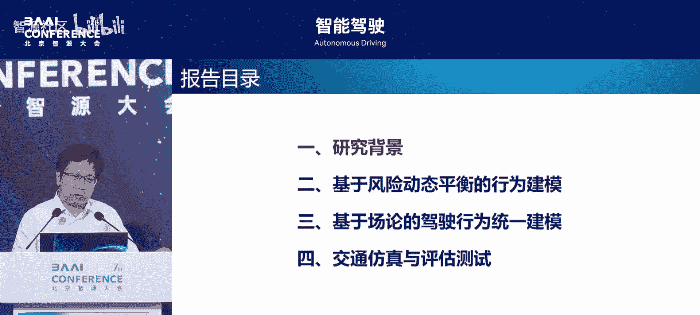

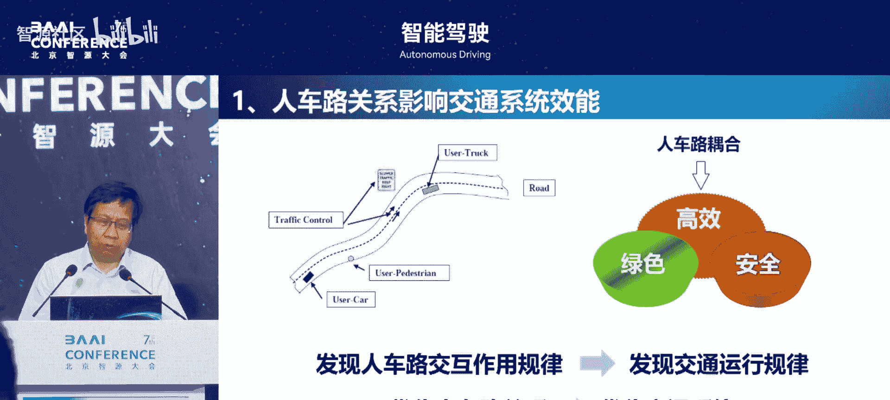

在本节课中，我们将学习鲁光泉教授提出的“基于风险动态平衡的驾驶行为统一建模”方法。该方法旨在解决传统驾驶行为建模中模型适用性、可解释性及场景泛化能力不足的问题，通过引入风险动态平衡理论，构建一个能够跨场景描述驾驶行为的统一模型框架。

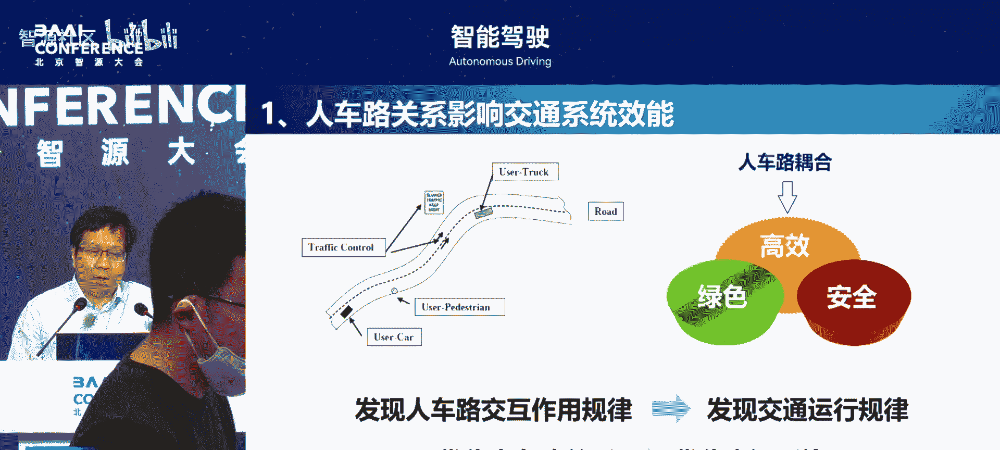

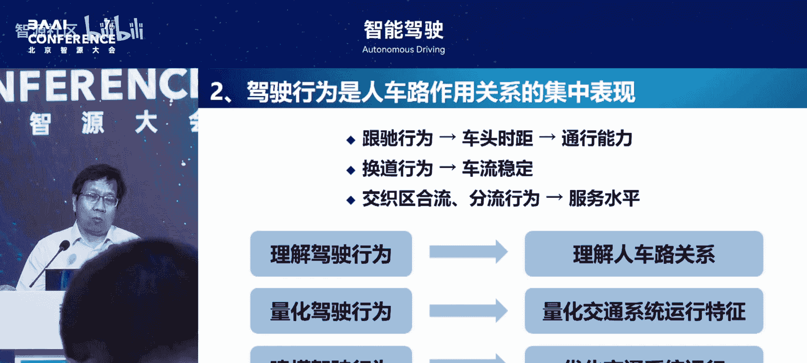

---

## 交通与驾驶行为的基础

上一节我们介绍了课程背景，本节中我们来看看驾驶行为在交通系统中的核心地位。

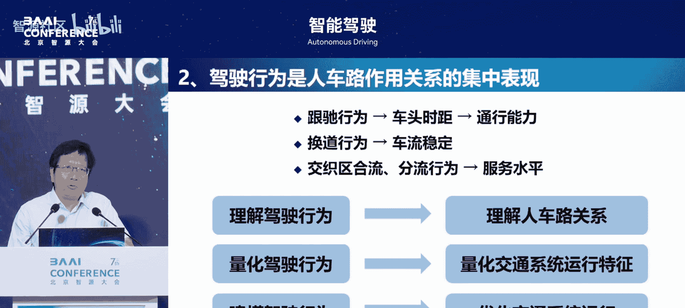

交通系统的运行核心是处理人、车、路三者之间的关系。所有交通研究都围绕两个目标展开：一是发现人车路之间的交互作用规律，从而理解交通运行规律；二是优化人车路之间的关系，以提升交通系统效率。

驾驶行为是人车路交互关系的集中体现。交通中的宏观与微观现象，其底层都是驾驶行为。例如：
*   **跟驰行为**：影响车头时距选择，直接关系到道路通行能力。
*   **换道行为**：影响交通流的稳定性。

因此，从交通角度出发，理解驾驶行为是理解人车路关系的基础，量化驾驶行为是量化交通系统特征的基础，而对驾驶行为进行精确建模则是优化交通系统的基础。


随着智能驾驶的发展，驾驶行为建模也成为一项关键技术。虽然数据驱动的人工智能方法正在发展，但一个优秀的、可解释的驾驶行为模型，有助于解决AI的“黑箱”问题，就像万有引力定律比单纯的数据拟合更能简洁、深刻地预测天体运动一样。

---

## 传统驾驶行为建模的挑战

理解了驾驶行为的重要性后，我们来看看当前建模方法面临的主要问题。

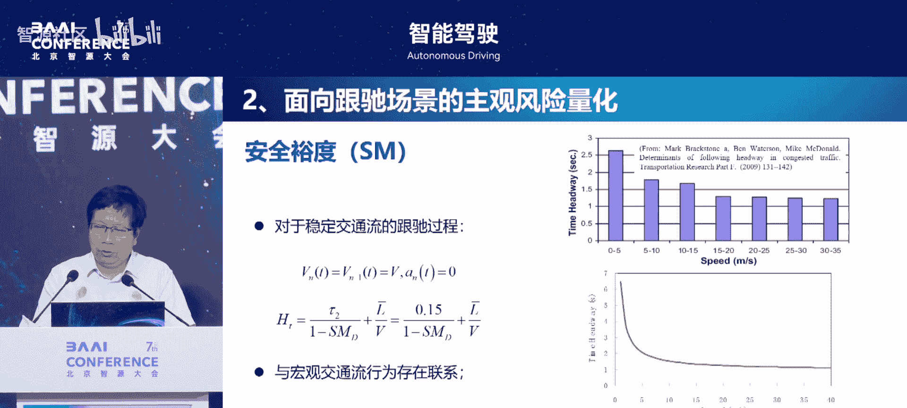

目前，驾驶行为建模主要存在三个挑战：
1.  **模型适用性问题**：不同驾驶行为（如跟驰、换道）通常使用不同的模型。随着驾驶场景不断增多，需要开发的模型也越来越多，缺乏一个通用的模型框架。
2.  **模型可解释性问题**：无论是传统的回归拟合模型，还是新兴的神经网络模型，其模型参数与驾驶行为特征之间往往缺乏清晰的对应关系，导致模型难以解释。
3.  **行为特征解耦困难**：驾驶决策过程中的风险感知、决策逻辑和轨迹规划等特征耦合在一起。如果能够将它们解耦，进行分布式计算，将能有效降低计算复杂度。

---

## 核心理论：风险动态平衡

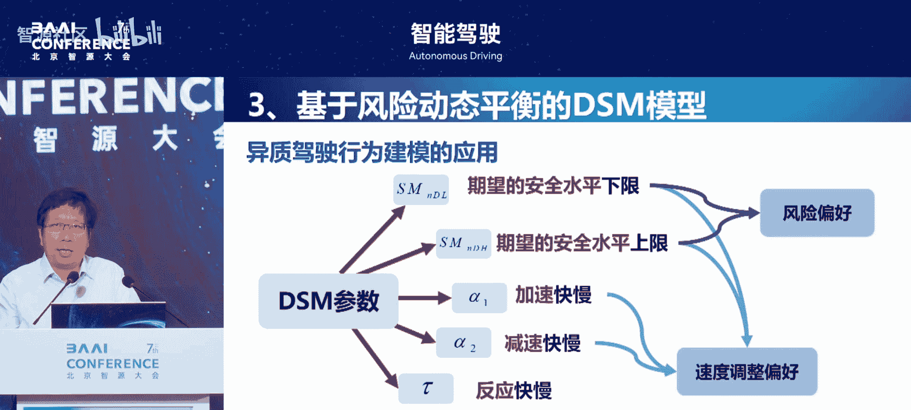

面对上述挑战，我们引入一个核心理论作为解决方案的基础：风险动态平衡理论。

该理论认为，驾驶员在决策时，并非依据客观风险，而是依据一个长期经验积累形成的、相对固定的**主观可接受风险水平**。驾驶员通过不断调整自身行为（如加速、减速），使自身**感知到的风险水平**动态地保持在这个可接受的水平附近。


一个著名的宏观例证是：某些北欧国家将道路通行规则从左行改为右行后，初期事故率显著下降，因为驾驶员感知到的风险升高，行为更谨慎；但约一年后，事故率又恢复到原有水平，因为驾驶员已适应新环境，其可接受风险水平固定，而感知风险已回落。

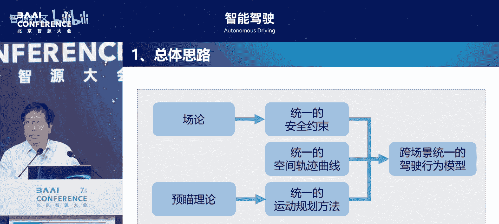

要将此理论用于建模，关键挑战在于：如何用可观测的数据来量化驾驶员**主观感知到的风险水平**？

---

## 从一维跟驰到统一建模框架

上一节我们介绍了风险动态平衡理论，本节中我们来看看如何将其应用于具体的驾驶行为建模。

### 1. 量化风险：安全裕度

研究团队提出了一个名为 **安全裕度** 的指标，用于量化驾驶员在跟驰场景中主观感知的风险水平。

研究发现，不同驾驶员在相同交通环境下跟驰时，其安全裕度水平基本保持恒定。这意味着找到了驾驶员操作决策中的一个“不变量”。基于此，可以建立一个简单的跟驰模型。

### 2. 一维跟驰模型

基于风险补偿（行为调整）思想：如果感知风险高于可接受风险，则行为趋于谨慎（减速）；如果感知风险低于可接受风险，则行为趋于冒险（加速）。

据此构建的刺激-反应模型仅用 **5个参数** 描述跟驰行为：
*   `R_lower`: 可接受风险水平下限
*   `R_upper`: 可接受风险水平上限
*   `α`: 加速敏感系数
*   `β`: 减速敏感系数
*   `τ`: 驾驶员的反应时间

这些参数具有明确的物理意义（对应风险偏好和速度调整偏好），可解释性强，并能从实时驾驶数据中快速标定。这使得模型可以用于个性化自适应巡航控制（ACC），让车辆驾驶风格与驾驶员的期望保持一致。

### 3. 迈向二维：统一建模框架

一维模型难以描述换道、交叉口等复杂二维场景。为此，研究团队提出了一个更普适的统一建模框架，包含三个核心部分：

**A. 统一安全约束：风险场模型**
为了统一描述不同物体（运动车辆、静态障碍物、信号灯）对自车运动的安全约束，引入了 **风险场** 概念。
*   **核心思想**：将风险源与受影响对象分离。风险源（如车辆）占据的时空，对其他对象而言风险为1（绝对禁止进入）。风险影响随距离增加而衰减。
*   **运动物体风险场**：某点风险值取决于与该物体的距离、该物体的速度（速度越快，不稳定性越高，风险场影响范围越大）以及物体形状。
*   **风险叠加**：多个风险源对同一点的影响，取 **最大值** 作为该点的总风险。
*   **参数标定**：巧妙利用 **停车平均车距** 标定距离影响参数，利用 **稳定跟驰数据** 标定速度影响参数。标定结果显示，大多数人开车的期望风险水平约为 **0.345**。

**B. 统一轨迹规划：三阶贝塞尔曲线**
试图用一个统一的数学模型描述左转、右转、直行、换道等不同场景的空间轨迹。
*   **选择三阶贝塞尔曲线的原因**：它是能满足边界条件（如进口道/出口道方向）的最低阶数曲线，且其控制点只与路径几何关系有关，与车辆自身属性无关，泛化能力强。

**C. 统一运动规划：基于预瞄的风险平衡**
将安全约束与轨迹规划结合，进行运动规划。
*   **核心逻辑**：驾驶员会预瞄未来某个时刻的目标位置，并预测到达该位置时的风险水平。通过调整当前速度（加速或减速），使得在到达预瞄点时，感知风险恰好等于其期望的可接受风险水平。
*   **公式化表示（概念）**：
    ```python
    # 伪代码示意
    desired_risk = 0.345  # 驾驶员期望风险水平
    preview_point = get_preview_point(trajectory, preview_time) # 获取预瞄点
    predicted_risk = calculate_risk_field(preview_point) # 计算预瞄点风险
    if predicted_risk > desired_risk:
        decelerate() # 减速，以在更晚时刻以更低风险到达
    elif predicted_risk < desired_risk:
        accelerate() # 加速，以在更早时刻到达，此时风险可能略高
    else:
        maintain_speed() # 保持
    ```

---

## 模型应用与验证

我们构建了统一的建模框架，现在来看看它的实际应用效果和验证。

使用该统一模型，可以在不同场景下进行仿真和验证：
1.  **跟驰与换道**：模型精度与经典的智能驾驶员模型（IDM）等相当，且使用同一套参数。
2.  **交叉口行为**：能仿真出车辆在黄灯期间的“闯黄灯”决策，以及在无信号交叉口的通行、让行甚至“锁死”与“解锁”现象。
3.  **统一风险量化**：该模型能对传统指标（如TTC、车头时距）难以量化的场景（如两车高速并行且距离极近）进行统一的风险值计算。
4.  **场景生成与测试**：可用于分析场景库，通过统计风险值分布来识别“长尾场景”（高风险小概率事件），也可用于生成复杂的测试场景，如车辆绕行故障车。

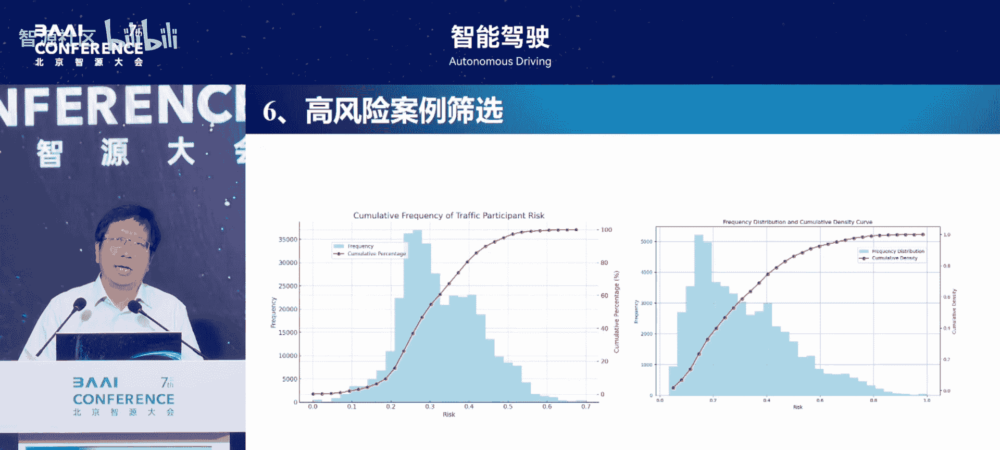

---

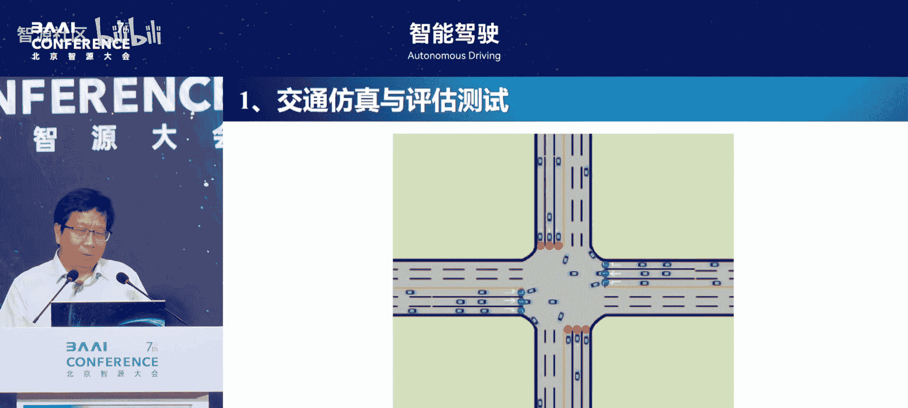

## 总结

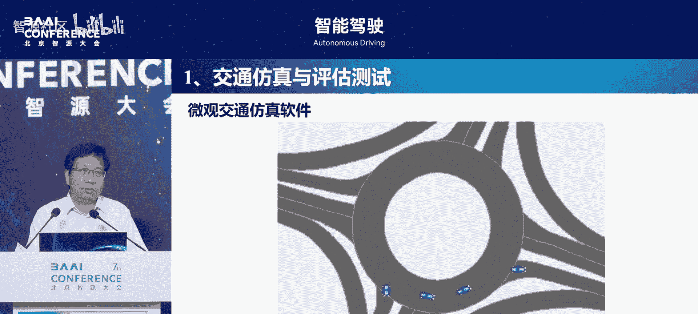

本节课中我们一起学习了基于风险动态平衡理论的驾驶行为统一建模方法。我们从交通系统中驾驶行为的基础作用出发，分析了传统建模方法的局限，引入了风险动态平衡理论作为核心思想。通过定义“安全裕度”量化主观风险，并逐步构建了从一维跟驰模型到涵盖统一安全约束（风险场）、统一轨迹规划（贝塞尔曲线）和统一运动规划（预瞄-风险平衡）的完整二维建模框架。该框架提高了模型的适用性、可解释性和泛化能力，为智能驾驶系统的行为预测、规划与控制提供了一个新颖且有力的理论工具。