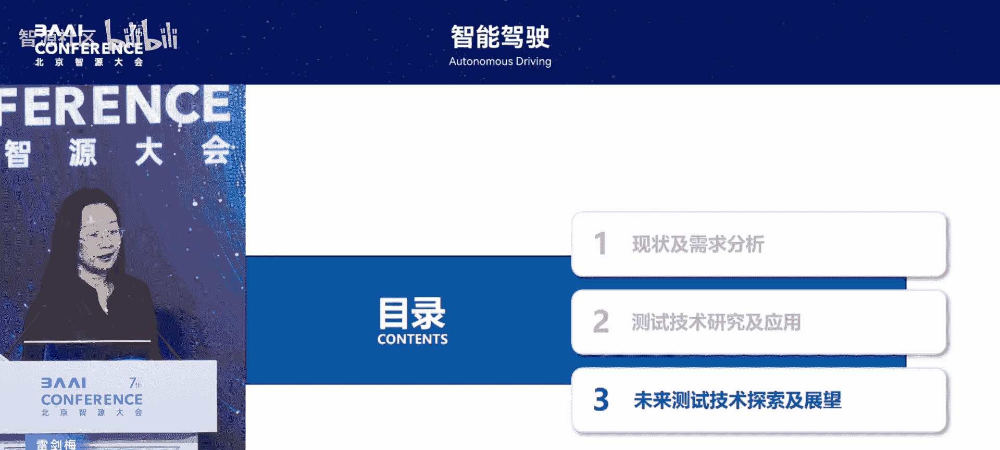

# 智能驾驶-p07-融合感知信息的(预期)功能安全测试技术研究及应用：雷剑梅

在本节课中，我们将学习预期功能安全测试的核心挑战与创新解决方案。课程将重点探讨在没有海量真实数据的情况下，如何构建高效、高保真的测试体系，以应对人工智能上车带来的安全验证难题。

## 概述：测试机构的困境与机遇

汽车产业链很长，汇集了众多专业方向。汽车是一个能将众多先进技术集大成的宝贵产品。

目前，整车厂拥有大量数据资源。然而，作为一家提供测试评价技术服务的第三方机构，我们面临一个尴尬境地：没有产品，因此没有数据。

在没有数据的情况下，仍需对人工智能上车后的安全性进行测试，这是一个巨大的挑战。本报告将探讨在此困境下我们所做的努力，重点讨论预期功能安全的测试技术。

## 预期功能安全的重要性与核心目标

从L3或更高级别自动驾驶开始，系统在运动控制、目标事件探测响应及动态驾驶任务接管方面发挥的作用已远超驾驶员。

在AI技术赋能下，自动驾驶系统开始代替人的眼睛进行感知和认知，代替大脑进行决策规划，代替四肢进行控制执行。当前存在规则驱动和端到端两种技术路线，但规则驱动在很长一段时间内仍是重要的兜底方案。

预期功能安全技术早已出现，但直到ISO 21448标准在2022年发布，其基本理论体系才被认为成型。2024年，清华大学在一篇综述文章中明确指出，随着AI算法在自动驾驶中的应用越来越广泛，预期功能安全已成为实现产业大规模落地必须解决的重要挑战。

其核心目标是从“场景四象限”的角度，尽可能压缩“未知不安全”区间，扩大“已知安全”区间。这关乎安全的底线。

实现这一目标的方法是设计测试场景，在场景分析与测试过程中发现“未知不安全”场景。发现后，它就变成了“已知不安全”场景。随后通过安全机制设计，使车辆系统能够安全应对该场景，从而将其转化为“已知安全”场景。安全机制设计是整车厂关注的重点，而我们的关注点在于前期的场景分析与测试。

## 基于场景的测试方法与挑战

预期功能安全测试的主要技术手段是基于场景的测试。通常遵循“三支柱法”：仿真测试、封闭场地测试和开放道路测试。

*   **仿真测试**：需要仿真场景。
*   **封闭场地与开放道路测试**：需要场景描述与搭建。

场景来源主要有两种途径：一是通过应用场景任务分类，寻找感知局限或决策控制中的潜在问题因素；二是对原始交通场景进行数据处理与统计分析，提取参数空间。利用参数空间定义和前述的问题因素，共同输入系统以形成功能场景库，进而推导出逻辑场景库，最终通过软件工具实现具体场景的实例化。

在预期功能安全测试中，我们重点关注两类关键场景：**典型复杂场景**和**边缘危险场景**。

以下是三种测试方法在应对这两类关键场景时的优缺点比较：

*   **仿真测试**
    *   **优点**：可实现所有场景的全覆盖，效率高、速度快。
    *   **缺点**：难以引入传感器的物理特性和车辆的真实响应。车辆动力学模型误差较大，进行整车级验证存在一定问题。
*   **封闭场地测试**
    *   **优点**：车辆和传感器均在环，具有真实性。
    *   **缺点**：场地空间有限，场景搭建效率低，难以实现非常复杂或危险场景的测试。
*   **开放道路测试**
    *   **优点**：场景非常丰富。
    *   **缺点**：危险场景不能测试，场景不可控，存在未知交通参与者的干扰。

这三种方法各有局限，这启发我们去探索一种新的测试方法：在一个可控环境中，高效实现预期功能安全各类场景的测试。

## 创新方案：基于场景注入的整车级测试

我们探索的是基于场景注入的、融合场景的整车级预期功能安全测试方法。控制器级别的测试已有丰富方法，难点在于解决整车级问题。

我们设计的方法是：**场景用虚拟方式注入，车辆用真实动力学响应反馈**，即“虚景实车”的融合测试。

在该方法中，场景以仿真方式产生，通过车载工控机和场景注入设备，注入到被测车辆原有的传感器输入通道（需断开原传感器）。同时，车辆配备位置、姿态及动力学响应传感器，将这些数据实时反馈给场景仿真系统，从而形成一个可闭环的高效测试系统。

要实现这种测试，需要突破三项关键技术：**场景构建技术**、**场景泛化技术**和**场景注入技术**。

### 场景构建技术

根据产品定义和AI技术特点，分析引发安全问题的关键要素，挖掘并形成触发事件。然后以合理方式融合不同触发事件，构造复杂的多触发事件场景。

最终通过 **`基础场景 + 触发条件叠加`** 的方式，形成预期功能安全的测试复杂场景。

### 场景泛化技术

单一参数场景难以实现测试全覆盖。我们采用**正交试验法**，将引发安全问题的要素分解为相互正交的因子，利用正交试验设计方法设计泛化算法，从而得到一组能覆盖所有要素特性、且用例数量可控的泛化场景集。

### 场景注入技术

核心思路是 **`劫持与替换`**。断开车辆所有与自动驾驶相关的原传感器，转而注入场景数据。例如，摄像头通过GMSL通路注入，点云通过以太网注入（取决于原车通信方式）。

关键挑战在于：
1.  注入数据的速率和通道带宽需符合原传感器要求。
2.  必须保证不同传感器数据链路达到**毫秒级同步精度**，否则会导致感知世界不协调。

我们自主开发了一套场景数据注入系统，可实现毫秒级同步精度。

## 两种“虚景实车”测试实现方式

基于上述技术，可以构建“虚景实车”测试系统，它有两种实现方式。

### 方式一：面向整车级复杂场景测试

此方法用于测试**典型的复杂非危险场景**。
*   **车辆**：在封闭测试场内真实运行。
*   **感知输入**：车辆所有传感器接收的信号均由注入系统提供。
*   **反馈**：车辆真实的动力学响应及位姿数据，实时反馈给场景生成系统。
*   **特点**：构成真实闭环，场景可非常丰富，车辆“看到”的与实际行驶的场景完全不同。**目的**是实现复杂典型场景的高效测试。

### 方式二：面向整车级极限场景测试

此方法用于解决**危险极限场景在场地和道路上不可测**的问题。
*   **核心设备**：无限曲率的道路模拟系统（如中国汽研凯瑞装备公司开发的系统，可实现高速转向和高车速模拟）。
*   **原理**：车辆被承载在路面模拟系统上，通过在有限的真实空间内模拟横向、纵向甚至更多自由度的运动，实现虚拟测试空间的无限拓展。
*   **感知与反馈**：场景仍通过仿真注入，车辆动力学响应真实，但位姿信息需通过模型计算（因车辆未实际移动）。
*   **目的**：实现危险极限场景的测试。

利用这两种方式，可以实现对**典型复杂场景**和**极限危险场景**这两类关键场景的全覆盖。

## 构建高效闭环的开发与测试体系

该系统不仅可用于测试，也可用于开发。可以形成一个循环迭代的安全机制增强与升级流程：

1.  **测试**：将开发完成的系统置于“虚景实车”系统上进行预期功能安全测试。
2.  **发现问题**：识别安全漏洞或不足。
3.  **安全增强**：针对问题设计或修正安全机制。
4.  **快速验证**：在仿真测试系统中快速验证修正效果。
5.  **迭代循环**：如有问题，继续修正并验证。

由此，可以构建一个高效、闭环的预期功能安全开发设计体系。

## AI带来的新挑战与应对探索

AI深度学习技术的应用带来了新的挑战：
1.  **模型对数据依赖性高**：模型使用实际场景数据训练，对数据真实性要求高。测试机构需构建**高质量且可控**的测试场景数据，否则测试结果不可信。
2.  **端到端模型的可解释性下降**：出现问题难以定位原因和责任，除了继续训练缺乏其他修改手段。
3.  **传统场景定义方法失效**：端到端模型的功能边界远大于传统模型，需要扩大测试场景覆盖度。

### 应对高保真与高价值场景的挑战

*   **解决高保真问题**：行业多采用**3D高斯重建 + 神经渲染**技术提升场景真实感。
*   **解决高价值问题**：
    1.  对基础场景进行泛化。
    2.  通过知识建模与图谱构建，定义规则约束，剔除泛化后不合理场景，得到基本合理的场景库。
    3.  从场景库中筛选高价值场景，主要有两种途径：
        *   **边缘场景分析法**：关注关键参数的边界条件，通过变形仿真寻找通过性差的场景。
        *   **聚类分析法**：在常规场景中进行聚类，挑选各类典型场景进行变形仿真，找出通过率低的场景。

### 应对端到端模型测试的探索

针对端到端模型可解释性下降的问题，行业引入视觉语言大模型。作为测试机构，我们探索使用 **`触发条件 + 视觉问答`** 的方式来考察VLM模型的基本性能。

**示例**：
*   **问题1**：“前方的行人在干什么？”（评估感知正确性）
*   **问题2**：“我现在应该采取什么驾驶策略？”（评估场景理解与决策输出的一致性）

这能在一定程度上了解模型的性能水平。我们呼吁整车厂加强与检测机构的合作，通过行业联动机制，让第三方机构能更深入介入产品研发验证过程，共同提升行业安全水平。

## 总结与展望

当前产品发展趋势是AI技术高速发展、模型快速迭代、系统日益智能，且开发周期越来越短。

这对第三方测试机构提出了更高要求：必须革新测试方法，突破没有数据的难点，实现场景的高覆盖、高真实度，并提升测试效率。

因此，我们需要在以下方向持续探索：
1.  **虚景融合的测试技术**
2.  **高价值场景的挖掘技术**
3.  **高真实度场景的生成技术**

最终目标是保障车辆安全，为行业安全做好兜底。虽然目前面临诸多困难，但我们正与行业专家共同探讨解决方案。

本节课中，我们一起学习了预期功能安全测试的背景与挑战，深入探讨了“虚景实车”融合测试的创新方案及其关键技术，并展望了AI时代下面向端到端系统的测试新思路。第三方测试机构致力于在数据匮乏的困境中，构建高效、可靠的测试体系，为智能驾驶的安全落地保驾护航。