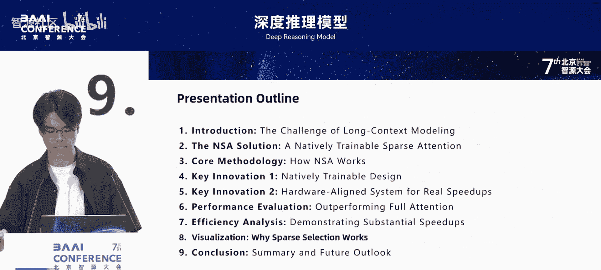
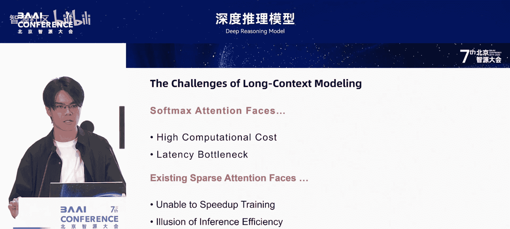
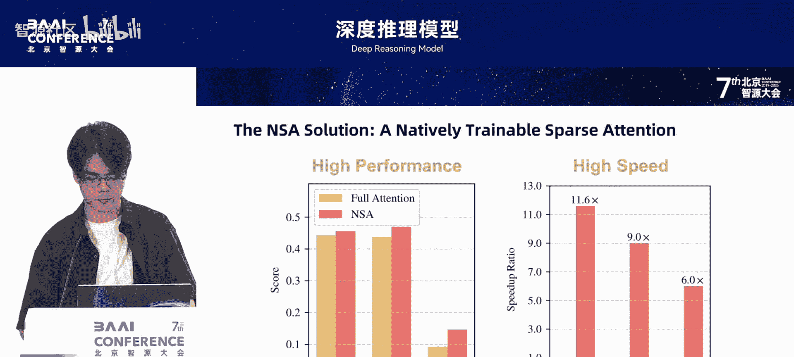
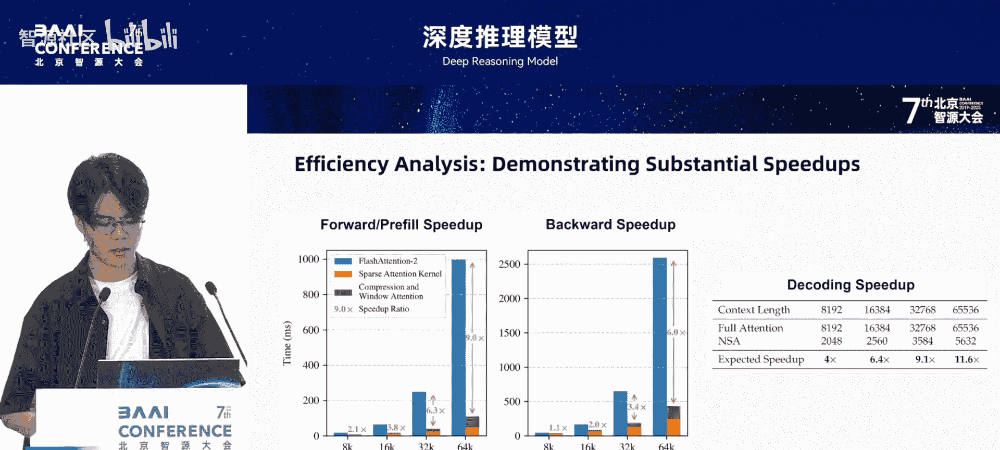
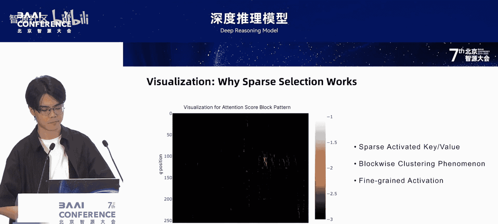
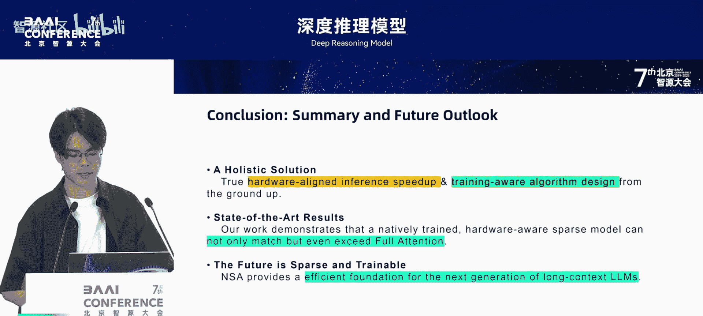

# 深度推理模型-p02-原生稀疏注意力机制：关注硬件的原生可训练稀疏注意力大模型：袁境阳

在本节课中，我们将学习一种名为“原生稀疏注意力”(Native Sparse Attention, NSA) 的创新方法。该方法旨在解决大模型处理长上下文时面临的计算成本高昂和效率低下的问题。我们将探讨NSA如何通过原生可训练的设计和硬件对齐的系统优化，在保持甚至提升模型性能的同时，实现数量级的效率提升。

---

## 当前大模型的核心挑战：成本与效率 ⚠️

上一节我们介绍了课程背景，本节中我们来看看大模型面临的核心挑战。无论是进行长文档的逻辑推理、分析整个代码库，还是实现复杂的智能体系统，模型处理更长上下文信息的能力都至关重要。

然而，传统的注意力机制（即 **Softmax Attention**）的计算成本会随着序列长度的增加而急剧上升，成为性能的主要瓶颈。理论估算表明，在处理64K上下文的文本时，注意力计算占解码总时延的70%到80%以上。对于更长的上下文，注意力计算的占比会更高，使得长文本应用又贵又慢。

为了解决这一问题，学术界提出了许多稀疏注意力的概念。这个想法很好，但它存在一系列问题。

以下是当前稀疏注意力方法面临的两个主要问题：

1.  **训练与推理脱节**：现有方法主要用于推理阶段，很少用于训练阶段。将稀疏性用于训练非常重要，原因有二：
    *   随着OpenAI系列模型和DeepSeek-R1等推理模型的发展，研究更长文本的训练机制变得越来越必要。在强化学习等训练过程中，模型的输出长度越来越长，需要更长的训练支持。
    *   许多现有稀疏方法依赖于在全注意力模型上进行剪枝，这会带来“分布外”特性，即稀疏模型会天然偏离训练时的特性，导致“训推不一致”。这限制了其性能上限，使其无法超越全注意力模型。而原生训练的稀疏模型可以自然学习稀疏特征，没有这种限制。

2.  **推理阶段的效率幻觉**：许多方法虽然宣称大幅减少了传统注意力的计算量，但在实际应用中无法完全发挥理论优势。这是因为它们可能只在单一阶段加速（例如只在解码时加速，但预填充时不加速），导致整体效率不高。此外，一些稀疏框架的设计没有考虑与MQA/GQA等先进推理架构融合，导致只能使用内存不友好的MHA策略进行推理，泛用性不强。

这两个问题正是NSA需要解决的。第一，我们要让理论的稀疏性真正体现在模型训练和推理的性能上。第二，我们需要实现原生训练，以解决强化学习及后训练阶段的长文本处理问题。

---

## NSA的核心贡献：性能与效率的双重突破 🚀

上一节我们分析了现有方法的不足，本节中我们来看看NSA如何实现突破。NSA的核心贡献在于，它在大幅提升效率的同时，保持甚至超越了原有模型的性能。

请看以下对比：
*   **性能对比**：在通用、长文本和推理三大类基准测试上，NSA（红色柱子）的表现均优于全注意力模型（黄色柱子）。这证明我们的稀疏方法不仅没有牺牲性能，反而获得了提升。
*   **效率对比**：在64K序列长度下，NSA相比于全注意力模型，在前向传播、反向传播和解码阶段分别实现了 **11.6倍、9倍和6倍** 的加速。

这两点结合起来回答了关键问题：我们能否在不牺牲性能的前提下，实现数量级的效率提升？NSA的答案是肯定的。

下面，我们将详细展示NSA如何通过“原生可训练”和“硬件对齐”来实现这一目标。

---

## NSA的设计理念：原生可训练与硬件对齐 ⚙️

正如上一节所述，NSA的成功基于两大设计理念。本节中，我们来深入探讨第一个理念：原生可训练的设计。

NSA的核心思想是从根本上重新设计稀疏注意力，使其不仅在算法上高效，更能与现代硬件协同工作，并且能够进行端到端的原生训练。

NSA的架构是一个包含三个并行分支的注意力框架。对于任何一个查询（Query），它会同时从三个不同的维度审视历史信息。

以下是三个分支的具体作用：

1.  **压缩注意力 (Compression Attention)**：
    *   **作用**：将长序列中的令牌（Token）按顺序划分为若干等长的组，然后通过**可学习的压缩器**将每个组压缩成单个令牌。
    *   **好处**：模型能以很低的计算成本快速扫描整个上下文，抓住全局主旨。其公式可以简化为对分组后的序列进行注意力计算：`Attention(Q, Compress(K), Compress(V))`。

2.  **选择注意力 (Selection Attention)**：
    *   **作用**：保留关键细节。它会根据第一个分支算出的注意力得分，挑选出最相关的组，并使用每个组内的原始令牌进行更精细的注意力计算。
    *   **好处**：实现了“好钢用在刀刃上”，只对最重要的部分进行细粒度计算。这个过程可以表示为：`Selected_Blocks = TopK(Compression_Scores); Sparse_Output = SparseAttention(Q, K[Selected_Blocks], V[Selected_Blocks])`。

3.  **滑动窗口注意力 (Sliding Window Attention)**：
    *   **作用**：处理局部上下文。在训练多分支模型时，模型容易过度关注最新信息。设立此分支是为了让压缩和选择分支能更好地学习远距离依赖。
    *   **好处**：不同的分支可以各司其职，学习不同范围的特征。其计算模式为标准的局部注意力。

最终，通过一个门控机制，将三个分支的注意力得分进行加权求和，得到最终输出。

**为什么说NSA的设计是原生可训练的？**
关键在于，虽然从压缩分支到选择分支的“Top-K选择”操作本身不可导，但通过让压缩分支独立贡献一个注意力输出，我们间接实现了稀疏索引的可学习性。压缩分支的梯度会告诉模型：“当我在模糊的压缩视图下发现某个区块需要被注意时，就应该在细粒度视图中将其‘打开’看得更细。” 这使得整个框架能够进行端到端的稳定训练，克服了以往方法（如K-Means聚类）因操作不可导而无法训练的问题。

---

## NSA的系统设计：与硬件深度对齐 💻

上一节我们介绍了NSA可训练的算法设计，本节中我们来看看其另一个核心：与硬件对齐的系统设计。这一点至关重要，因为许多稀疏算法在理论上很美，但实际部署时因内存访问模式随机离散，在GPU上效率极低。

NSA在设计之初就充分考虑了硬件特性：

1.  **块状处理 (Blockwise Processing)**：NSA采用以数据块为单位的处理方式。无论是内存读取还是计算，都以连续的数据块为单位，这能最高效地利用现代GPU的张量核心，最大化硬件吞吐量。

2.  **定制化高效内核 (Customized Kernel)**：为了将上述思想发挥到极致，我们专门为NSA设计了一个高效内核。这个内核有一个关键设计：它以**分组查询注意力（GQA）的组为单位**来加载数据，一次性获取共享的键值（KV）缓存块。
    *   **与Flash Attention的对比**：Flash Attention的查询块形状是 `[序列长度, 头维度]`，即在序列维度切块。而NSA的切分方式是将每个查询组（Query Group）接在一起，查询块的形状变为 `[1, 头维度]`。
    *   **设计原因**：如果仿照Flash Attention的结构，每次加载一个查询块（包含连续多个查询）时，在内循环中需要加载该查询块可能关注的所有KV块，这会导致大量冗余的数据搬运和内存浪费。NSA通过将查询粒度改为1，并确保每个查询组关注的KV相同（这在GQA中可以实现），成功减少了冗余数据搬运，确保了GPU各单元负载均衡，实现了真正的加速。

3.  **框架选择**：在论文中我们使用了Triton实现内核，但后续发现使用CUDA的算子实现可能更快，尤其是在反向传播需要进行原子操作合并时。CUDA能更好地管理共享内存和寄存器，在某些情况下效率更高。

---

## 实验验证：卓越的性能与革命性的效率 📊

在深入各项下游任务指标前，我们先看一个反映模型学习本质的指标：损失曲线。NSA模型和全注意力基线模型在270亿参数规模上预训练的损失变化显示，NSA的训练过程非常稳定，且其损失曲线几乎全程低于全注意力模型。这表明，尽管NSA是稀疏模型，算力使用更少，却能更好地拟合训练数据，达到更低的损失。这有力证明了原生可训练设计的有效性。

接下来，我们看看NSA在各项评测中的详细表现：

以下是NSA在三大类任务上的性能总结：

*   **通用能力评测**：在涵盖知识、推理、代码等9个主流基准测试集上，NSA在7个任务上超越了全注意力模型。这说明稀疏结构有利于过滤噪声，专注于更重要信息。
*   **长文本能力评测**：
    *   在“大海捞针”测试中，NSA能在64K超长文本中实现100%的精准信息检索。
    *   在更全面的LongBench评测集上，NSA的平均分高于全注意力模型，而全注意力模型又明显高于其他稀疏模型（这些模型因仅在推理阶段稀疏而性能受限）。
*   **复杂推理任务**：将模型在数学推理数据上微调后，在极具挑战性的AIME数学竞赛题上测试，NSA版本的得分显著高于全注意力版本。这证明NSA架构能有效支持深度、长链条的逻辑推理。

**性能强大的同时，NSA在效率上的提升是革命性的。**
在A100 GPU服务器上的严格测试显示：

*   **训练/预填充阶段**：在处理64K长度序列时，NSA专门优化的内核，其前向传播速度是Flash Attention-2的 **9倍**，反向传播是 **6倍**。
*   **解码阶段**：解码速度的瓶颈主要在于从显存读取庞大的KV缓存。NSA的稀疏设计极大减少了需要加载的数据量。在64K序列长度上，理论上可达到 **11.6倍** 的解码加速比，在更长序列下，渐进加速比可达 **16倍** 左右。
*   **关键趋势**：随着序列长度的增加，NSA的性能收益越发显著。这意味着未来处理百万甚至更长上下文时，NSA这类稀疏架构可能是不可或缺的。

---

## 设计灵感：块稀疏符合注意力内在规律 🔍

本节中，我们通过一张图来直观解释NSA选择“块稀疏”策略的原因。这张图是对全注意力模型进行可视化分析得到的注意力热力图，颜色越浅代表注意力得分越高。

从图中可以清晰看到，高注意力得分的区域并非随机离散分布，而是呈现出明显的**块状聚集**特征。也就是说，重要的信息往往会成片出现。

这一观察给了我们两大启发：
1.  以较小的块为单位进行稀疏处理，是一条更符合注意力内在规律的道路。
2.  块的粒度应尽可能小，以提升有效令牌的命中率，避免一个块中只有个别令牌有效。

这张图是NSA设计的重要灵感来源，提示我们在设计稀疏方法时应尽可能关注天然存在的信息模式。

---

## 总结与展望 🌟

本节课中，我们一起学习了原生稀疏注意力机制（NSA）。

**总结如下：**
NSA通过深度融合算法创新与硬件感知设计，成功解决了现有稀疏注意力方法面临的两大核心难题：
1.  **原生可训练**：支持稳定高效的端到端训练，性能可媲美甚至超越全注意力模型。
2.  **硬件对齐**：在实际部署中带来显著的、数量级的加速。

实验结果有力证明，一个精心设计的、从头训练的稀疏模型，其能力完全可以超越传统的全注意力模型，并且速度更快。无论是在通用能力、长文本理解还是复杂推理上，NSA都展现了卓越的性能。

我们相信，NSA为下一代长文本模型的发展提供了一个坚实而高效的基础。**将稀疏性作为模型的核心特征，并贯穿其从训练到推理的整个生命周期，是我们高效拓展模型能力边界的关键之一。**

---

## 问答环节精选 ❓

**问：NSA架构与DeepSeek-R1中提出的多头潜在注意力模型（MLA）是冲突的，还是可以结合？**
答：两者可以结合。NSA在论文实验中使用的是GQA模式，主要原因是其算法设计需要将查询组合并加载到内存中，这与MHA模式天然互斥。若想将NSA与MLA直接融合，需要在训练过程中将MLA改为类似推理时的模式（即多个查询头共享一个键值头），这样NSA就可以在MLA上使用了。

**问：您认为像DeepSeek和OpenAI这样的机构，多久之后可以实现一次性输出几十万字文本的能力？**
答：这是一个有趣的预测性问题。模型的发展速度取决于多个领域（如长文本数据、强化学习等）的进步。就个人体验而言，模型进步非常快。对于几十万字输出这个量级，很有可能在今年或明年就能看到OpenAI、Google等机构提出非常强大的模型。国内厂商也必定会跟进长文本模型，因为长文本在代码、对话等多个场景中都至关重要，大家都会在此投入大量精力。