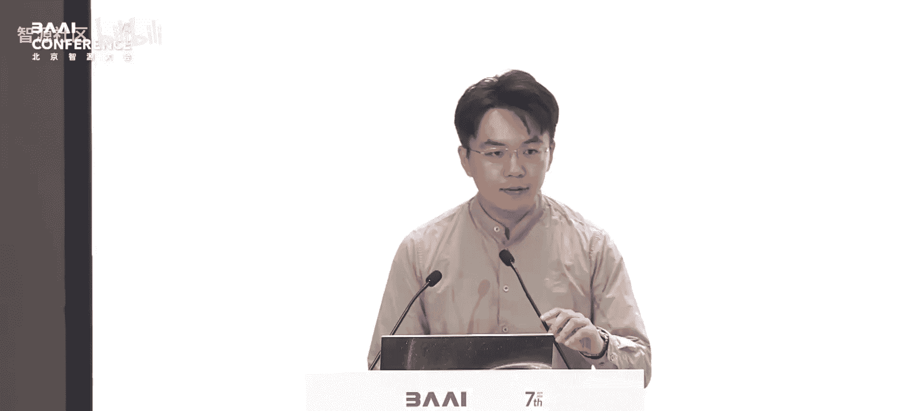
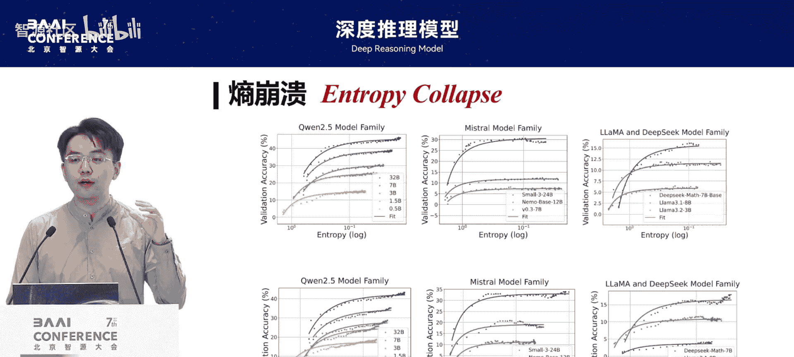
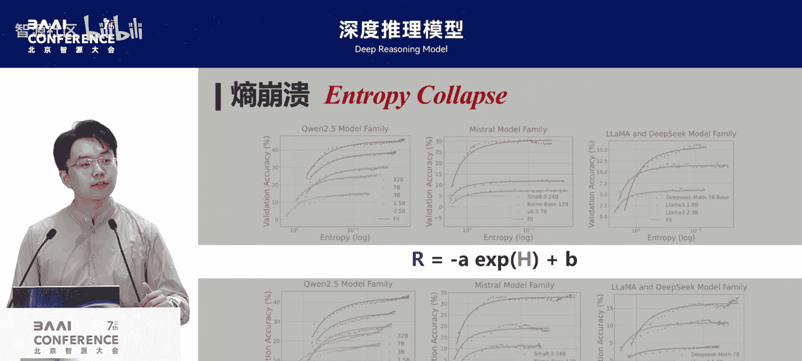
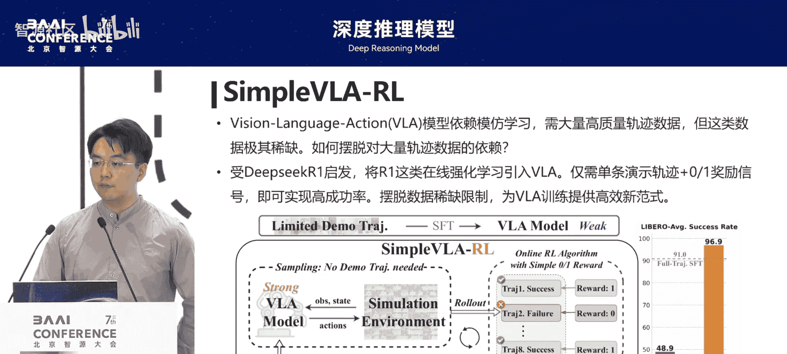
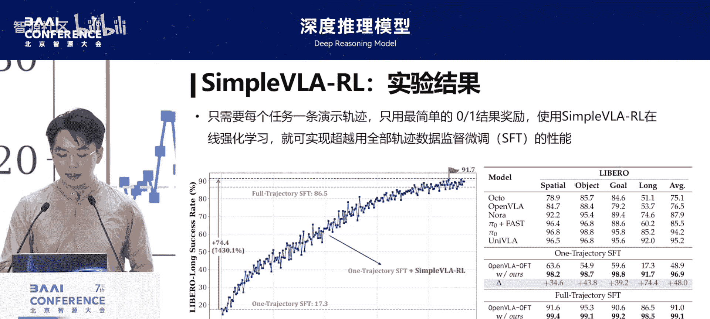

# 深度推理模型-p03-强化学习驱动的推理模型：密集奖励、策略熵和自演化：丁宁

在本节课中，我们将学习如何利用强化学习技术来驱动深度推理模型。我们将探讨三个核心主题：如何从结果奖励中免费获得密集的过程奖励、如何在缺乏明确奖励的情况下让模型自我进化，以及理解强化学习过程中策略熵变化的底层原理。这些方法相互关联，共同指向更高效、更智能的模型训练与推理范式。

---

## 概述：从模仿学习到强化探索 🤖

强化学习是当前最重要的技术之一。监督学习鼓励模型模仿现有数据，而强化学习则鼓励模型进行探索。大模型的强大泛化能力，使其不仅能在数学、代码等结构化任务上学习，也能在写诗、创作文本等开放任务上获得帮助，这凸显了强化学习与大模型结合的重要性。

强化学习的目标是学习一个最优策略，以最大化智能体获得的累计奖励总和。其理论基础坚实，例如贝尔曼方程保证了最优策略的存在性。强化学习采用训推一体的架构，同时涵盖了训练、推理和探索。

---

## 强化学习基础定义 📚

学习强化学习必须使用数学语言进行精确描述，这反而会使概念更清晰、简单。

*   **奖励**：智能体在某个状态下执行某个动作后获得的即时反馈。例如，小明做西红柿炒鸡蛋，炒完西红柿后获得的夸奖就是当前奖励。
*   **回报**：智能体在整个任务过程中获得的所有奖励之和。例如，做完西红柿炒鸡蛋后获得的总夸奖。
*   **状态价值函数**：在某个状态下，智能体期望获得的未来累计奖励之和。例如，炒完西红柿后，小明预计还能获得多少后续夸奖。
*   **动作价值函数**：在某个状态下，执行某个特定动作后期望获得的未来累计奖励之和。例如，炒完西红柿后，决定开始炒鸡蛋这个动作预计能带来多少夸奖。

**核心公式：动作价值函数**
`Q(s, a) = E[ R_t+1 + γ * R_t+2 + ... | S_t = s, A_t = a ]`
其中，`s`代表状态，`a`代表动作，`R`是奖励，`γ`是折扣因子。

一切围绕奖励展开。目前许多大模型主要使用结果奖励，而过程奖励同样重要，因为它能提供更密集的监督信号。

---

## 工作一：获取免费的密集奖励 🎯

上一节我们介绍了奖励的基本概念，本节我们来看看如何高效地获取过程奖励。传统获取密集过程奖励的方法存在扩展性问题：要么依赖昂贵的人工标注，要么需要巨大的计算量进行蒙特卡洛树搜索。

我们提出了 **Implicit RM** 方法，它能从单一的结果奖励中，免费推导出任意粒度的过程奖励。

**核心思想**：在训练时，我们只使用最终的结果奖励（如答案对错）来训练模型。但在模型推理时，我们可以利用一个关键性质来获得每个步骤的奖励。

**具体方法**：当我们使用以下形式定义奖励时：
`奖励 ∝ log( π_θ(a|s) / π_ref(a|s) )`
其中，`π_θ`是当前策略模型，`π_ref`是参考模型。我们可以证明，模型在学习一个`Q`函数（动作价值函数）。将相邻两个步骤的`Q`函数值相减，就能得到中间步骤的过程奖励。

**效果**：这种方法在训练时仅需结果奖励，在推理时却能获得密集的过程奖励，效率和效果都很高。它代表的不是绝对的对错，而是“当前动作是否比其它动作更接近目标”，这种相对好的概念使其更实用。

---

## 工作二：应用密集奖励与模型自进化 🚀

既然我们能免费获得密集奖励，接下来自然要探索如何应用它。我们提出了 **PRM** 方法，它利用 Implicit RM 提供的密集奖励，在大规模数学推理数据集上实现了性能提升。

以下是 PRM 的工作流程：
1.  一个基础模型（如 SFT 模型）分化为两个部分：待训练的**策略模型**和提供密集奖励的 **Implicit RM**。
2.  策略模型生成回答，获得结果奖励。
3.  用结果奖励更新策略模型。
4.  利用更新后的策略模型和 Implicit RM，免费计算出过程奖励。
5.  **同时使用结果奖励和过程奖励**来进一步更新策略模型。

**关键发现**：奖励模型必须与策略模型**在线同步更新**，以防止策略模型“走捷径”利用奖励模型的漏洞。PRM 是一个通用框架，可以嵌入到 PPO 等现有算法中，进一步提升训练效率。

刚才我们探讨了在给定结果奖励时如何获得过程奖励。现在，我们考虑一个更极端的场景：完全没有外部奖励时，如何让模型自我进化？

我们提出了 **TTRL** 方法。其核心是利用模型在推理时多次采样并进行**多数投票**，来生成一个“模糊”的奖励信号。

**具体步骤**：
1.  给定一个输入，让模型采样生成多条（如10条）推理轨迹。
2.  对这些轨迹的答案进行多数投票，将得票最高的答案视为“伪正确答案”。
3.  将每条轨迹的答案与这个“伪正确答案”对比，一致则奖励为1，否则为0。
4.  使用这个生成的奖励信号，用任何强化学习算法（如 PPO, PRM）来更新模型。

**效果与解释**：这种方法在多项基准测试上取得了出人意料的好效果，甚至能泛化到未训练过的数据集。其代码极其简洁。为什么它能工作？我们称之为 **“幸运的负奖励”** 现象：即使模型的所有采样答案都是错的，但只要这些错误答案分散（不一致），那么通过投票选出的“伪正确答案”与真实答案偶然一致的概率就会显著提高，从而产生有效的奖励信号。这蕴含着一个哲学：如果你错得千差万别，反而更容易凸显出正确的道路。

---

## 工作三：理解与控制策略熵 🔬

前两节我们介绍了如何获取奖励和利用奖励进行进化。本节我们将深入探讨强化学习过程中一个核心但常被忽视的概念：策略熵。我们发现，在强化学习训练中，模型的表现（奖励）与策略的不确定性（熵）之间存在一种定量关系。

在不加干预的情况下，模型通常会出现“熵崩溃”现象：熵急剧下降，奖励上升并最终饱和。这仿佛是一个用“不确定性”交换“确定性奖励”的过程。

我们通过大量实验发现了一个普适的定量规律：
`R ≈ -A * H + B`
其中，`R`是奖励，`H`是策略熵，`A`和`B`是常数。

**公式解读**：
*   **`A`** 代表熵转化为奖励的效率，可以理解为模型的“天赋”。
*   **`B`** 代表模型奖励的理论上限（当熵 `H=0` 时）。
*   这个关系不受算法（PPO, GRPO, PRM 等）影响，但受模型大小和数据难度影响。

理解了这个关系后，我们进一步从理论上推导了熵的变化机制。我们发现，连续两步之间的熵变化，正比于模型对数动作概率与优势函数估计的协方差。

**核心洞见**：
*   **高概率且高优势**的动作会显著**降低熵**（模型自信且正确，不确定性减少）。
*   **低概率但高优势**的动作会显著**抬高熵**（模型意外发现好策略，不确定性增加）。

基于此，我们可以主动控制熵。例如，通过剪裁掉那些显著降低熵的“高概率-高优势”token的更新，或者用 KL 散度约束更新的幅度，我们可以有效防止熵过早崩溃，让模型保持探索能力。这种方法简单有效，只需处理极少量的关键 token 即可。

---

## 总结与展望 ✨

本节课我们一起学习了驱动深度推理模型的三种强化学习方法。

1.  **Implicit RM / PRM**：我们学会了如何从单一结果奖励中免费获得密集的过程奖励，并利用它来更高效地训练模型。
2.  **TTRL**：我们探讨了在缺乏外部奖励时，如何通过模型自投票产生奖励信号，实现模型的自我进化，并理解了其背后的“幸运的负奖励”原理。
3.  **熵机制**：我们深入分析了强化学习中奖励与策略熵的定量关系，学会了如何理解和控制熵的变化，从而引导模型更有效地探索和学习。

这些工作表明，强化学习不仅能利用外部奖励，还能挖掘模型内在的进化潜力。通过数学工具深入理解训练动力学（如熵的变化），我们可以设计出更精准、更高效的算法。未来，将强化学习与基础模型结合，在机器人控制、开放世界决策等更复杂领域，具有广阔的应用前景。