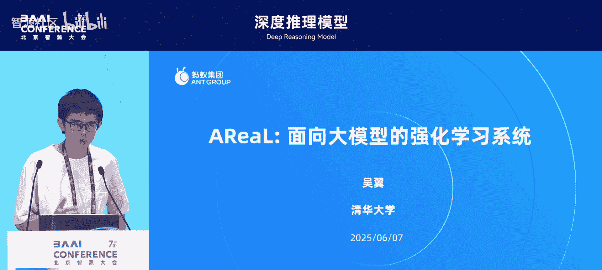
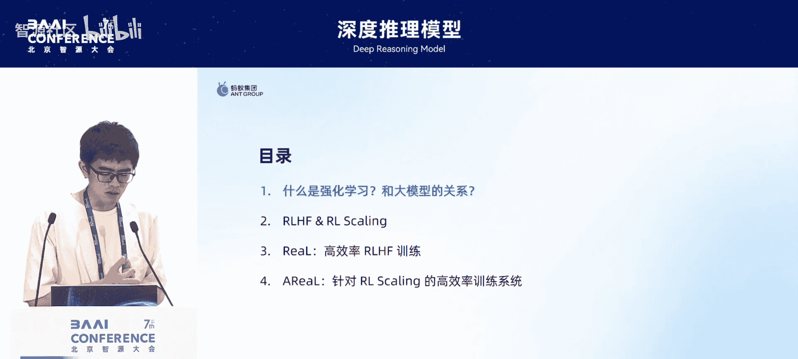
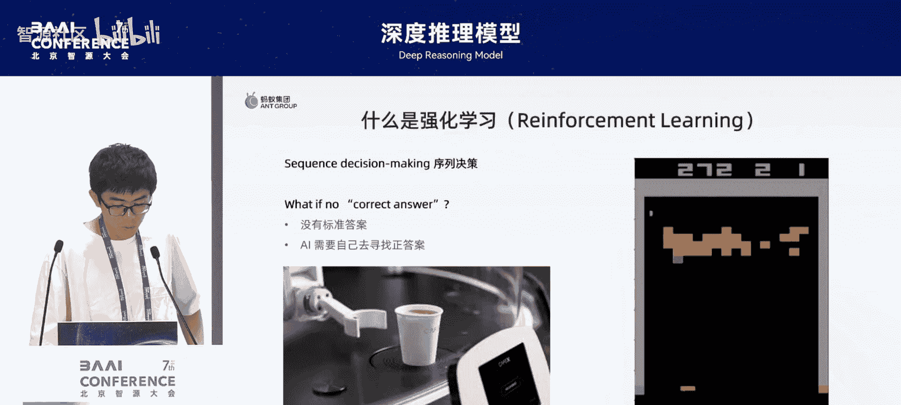
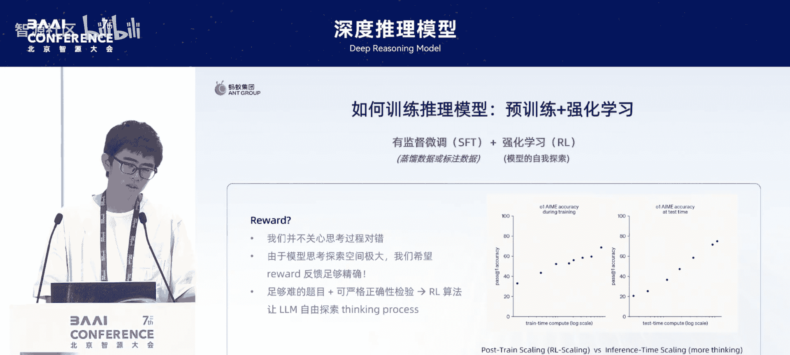
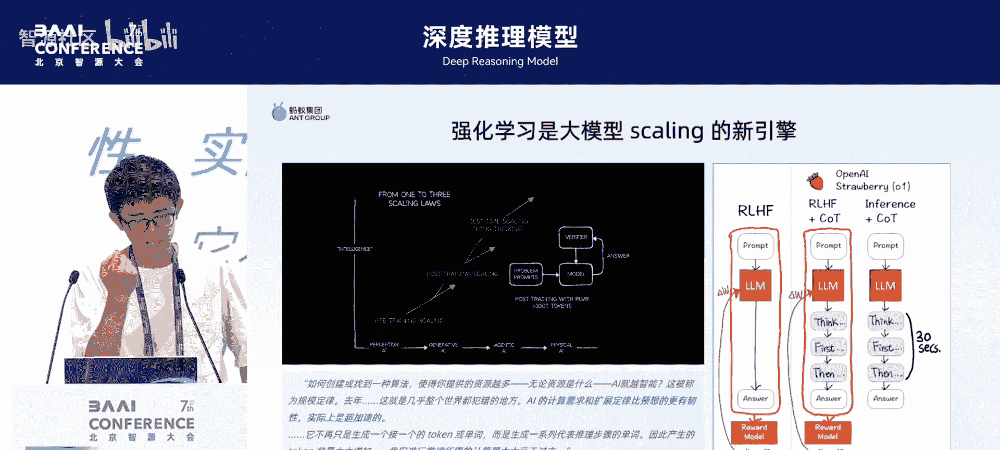
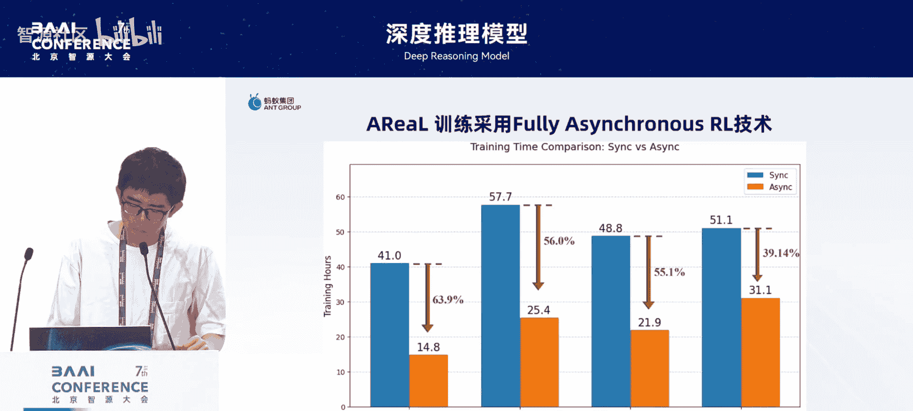
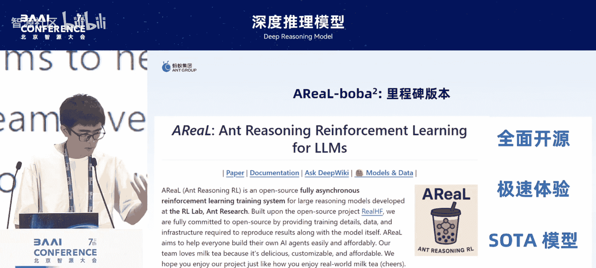
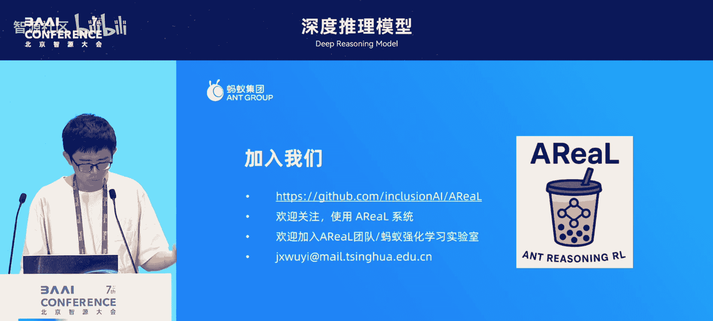

# 深度推理模型-p04-面向大模型的大规模强化学习系统：吴翼

在本节课中，我们将学习强化学习与大模型如何结合，以及为什么需要专门的大规模强化学习系统来支持这种结合。我们将从基本概念入手，逐步深入到系统设计的挑战与解决方案。

## 什么是强化学习？🤖

上一节我们介绍了课程主题，本节中我们来看看强化学习的核心定义。

强化学习从数学上讲，是解决一个序列决策问题。它旨在学习一个模型，使其能在复杂任务（例如打游戏或端咖啡）中找到好的策略。

强化学习的一个特点是，没有绝对意义上正确或错误的策略。例如，用左手或右手拿咖啡都可以，只要喝到就行；打砖块时向左或向右移动也行，只要得分高即可。因此，强化学习解决的是没有标准答案的问题，需要AI通过自我探索来寻找较优策略。

## 强化学习的核心组成部分 ⚙️

了解了强化学习的定义后，我们来看看它的关键组成部分。

强化学习包含几个重要部分。**智能体**与环境进行交互：它执行**动作**，并从环境中获得**观测**。智能体通过自我进化、迭代和探索，不断尝试以最大化其获得的**奖励**，最终学习到一个好的策略。例如，一个玩吃豆人游戏很厉害的智能体就是强化学习的产物。

所有强化学习算法的核心，都是**探索**与**利用**之间的权衡。例如，点外卖时，是尝试一家新餐厅（探索），还是继续点已知最好的餐厅（利用）。算法需要让模型在探索新可能性和利用已知最优策略之间找到平衡。

强化学习有许多知名应用，例如十年前击败李世石的AlphaGo，以及后来在Dota游戏中击败人类冠军团队的OpenAI Five。这些案例让强化学习在游戏领域广为人知。

## 大模型与强化学习的结合点 🔗

上一节我们介绍了强化学习，本节中我们来看看它与大模型是如何产生联系的。

大模型与强化学习的结合主要有两点：**指令遵循**和**推理能力规模化**。首先，我们需要理解大模型是什么。

大模型通常通过**下一个词预测**来训练，其核心是学习海量文本数据中的模式。而强化学习则包含一个“试错”过程，智能体在环境中探索并获得反馈。两者看似不同。

它们的第一个结合点是指令遵循。早期的大模型（如GPT-3）在理解并遵从人类复杂指令方面表现不佳。为了解决这个问题，研究者引入了**基于人类反馈的强化学习**。其范式如下：

1.  **智能体**：即大语言模型。
2.  **环境/任务**：人类给出的指令。
3.  **动作**：模型输出的文字。
4.  **奖励**：由人类标注员判断模型输出是否符合指令。

通过RLHF进行后训练，模型变得更善于遵从指令，这直接推动了像ChatGPT这样的模型成功“出圈”。

然而，RLHF主要让模型变得更“听话”，并未显著提升其核心推理能力。于是，第二个结合点——**推理强化学习**——出现了。其思想是让大模型模仿人类的“思考”过程，即先输出一段内部推理（思考链），再给出最终答案。

在训练推理模型时，我们使用强化学习让模型探索不同的“思考”方式。我们只关心最终答案是否正确，并将此作为**奖励信号**。通过这种方式训练后，模型思考得越久（生成长度越长），其答案正确率往往越高。这表明强化学习可以成为提升大模型智能水平的新引擎。

## 为什么需要大规模强化学习系统？💻

上一节我们了解了大模型与强化学习的结合方式，本节中我们来看看实现这些算法时面临的实际工程挑战。

我们以经典的强化学习算法**近端策略优化**为例。其算法公式可能看起来简洁，但实际执行时涉及多个大型模型组件（如负责生成的Actor模型、计算概率的Reference模型、计算奖励的Reward模型等），每个都需要大量的计算资源和特定的并行优化策略。

一个简单的实现方法是顺序执行所有任务：用所有GPU资源依次进行生成、奖励计算、训练等步骤。这种方法实现简单，GPU闲置时间少，但效率低下，因为它无法为不同计算模式的任务（生成、推理、训练）动态分配合适的并行策略和硬件资源。

理想的做法是，系统能够为不同任务动态分配计算资源与并行策略，让能并行的任务并行执行，有依赖关系的任务顺序执行，从而在降低通信开销和GPU等待时间的同时，获得更高的训练吞吐量。这就是我们构建**RLLaMA**系统的核心思想。通过精细的调度，该系统在RLHF任务上能达到1.4到3倍多的加速。

## 推理强化学习的新挑战：超长且多变的序列 📏

上一节我们介绍了通用强化学习系统的设计思路，本节我们聚焦于推理强化学习特有的挑战。

推理RL的算法流程看似比RLHF更简单，但其挑战在于：**模型输出序列的长度极长且变化巨大**。

*   **长度激增**：RLHF中输出通常为2K-4K词元，而推理RL中常以16K-32K词元起步，是前者的10倍。
*   **动态增长**：随着训练进行，模型输出的平均长度会不断增加，导致显存占用越来越大，容易引发内存溢出（OOM）错误。
*   **方差极大**：同一批次内，简单题目的输出可能只有几百词元，而难题的输出可达数万词元，长度差异悬殊。

这些特点对系统的训练和生成阶段都提出了优化要求。

以下是针对训练阶段的优化方案：
由于批次内序列长度差异大，简单的填充（Padding）会浪费大量GPU计算。我们采用了**贪婪打包**技术，将长短不一的序列尽可能紧凑地打包到更少的批次中，从而减少总批次数，提升训练效率。实验表明，这能带来约20%的训练速度提升。

以下是针对生成阶段的优化方案：
顺序执行（生成→训练→生成…）会导致GPU资源浪费，因为一个批次必须等待其中最长的序列生成完毕才能结束。我们采用了**完全异步的训练架构**：
*   生成节点持续不断地生成数据，不等待。
*   训练节点一旦收集到足够数据就立即开始训练。
*   训练完成后，生成节点同步更新后的模型参数。
这种方式消除了生成阶段的气泡，充分利用了GPU。

但异步训练引入了**陈旧度**问题：一个生成序列可能横跨多次模型更新，用旧版本模型生成的数据会降低训练效果。陈旧度越高，效果通常越差。

为了解决这个问题，我们进行了系统与算法的协同设计：
1.  **系统层面**：引入机制控制生成吞吐，通过参数限制允许的最大陈旧度。
2.  **算法层面**：改进PPO算法，使其更能容忍陈旧数据。

两者结合后，系统在保持模型效果不变的前提下，实现了最高**2.77倍**的加速。

## 总结与展望 🎯

本节课中我们一起学习了强化学习与大模型的结合点，以及构建支撑这种结合的大规模系统所面临的挑战与解决方案。

我们首先回顾了强化学习解决序列决策问题的本质，以及其通过探索与利用来优化策略的核心。接着，我们探讨了大模型如何通过RLHF实现更好的指令遵循，并通过推理RL来提升其核心推理能力。

然后，我们深入到了系统层面，解释了为什么简单的实现方式效率低下，并介绍了通过动态资源调度与并行策略来提升效率的设计思想。最后，我们重点分析了推理RL特有的超长、多变序列带来的挑战，并详细讲解了通过**贪婪打包**、**异步训练架构**以及针对**陈旧度**的协同优化来解决这些挑战，最终实现显著加速的方法。

我们开源的项目**AceBrick**（及其推理RL系统AceBrick-RL）集成了这些优化，致力于提供高效、灵活的大规模强化学习训练解决方案，并持续更新。希望本教程能帮助你理解这个领域的核心概念与工程实践。

---
**核心概念公式/代码表示**：
*   强化学习目标：最大化累积奖励 $\\max\_\\pi \\mathbb{E}\_{\\tau \\sim \\pi} \\left[ \\sum\_{t=0}^{T} \\gamma^t R(s\_t, a\_t) \\right]$
*   PPO算法核心（简化）：$L^{CLIP}(\\theta) = \\mathbb{E}\_t \\left[ \\min( r\_t(\\theta) \\hat{A}\_t, \\text{clip}(r\_t(\\theta), 1-\\epsilon, 1+\\epsilon) \\hat{A}\_t ) \\right]$，其中 $r\_t(\\theta) = \\frac{\\pi\_\\theta(a\_t|s\_t)}{\\pi\_{\\theta\_{old}}(a\_t|s\_t)}$
*   异步训练中的陈旧度：`Staleness = current_model_version - data_generation_model_version`