# 深度推理模型-p05-世界模型与决策推理：俞扬

在本节课中，我们将学习如何将强化学习框架应用于大语言模型，以提升其推理与决策能力。我们将探讨RLHF（基于人类反馈的强化学习）与DPO（直接偏好优化）等关键技术的原理、差异，以及如何通过简化算法和利用AI反馈来克服训练挑战，最终展望强化学习在推动模型通用智能发展中的作用。

## 强化学习与大语言模型的结合 🧩

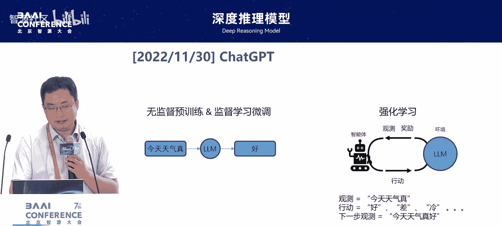

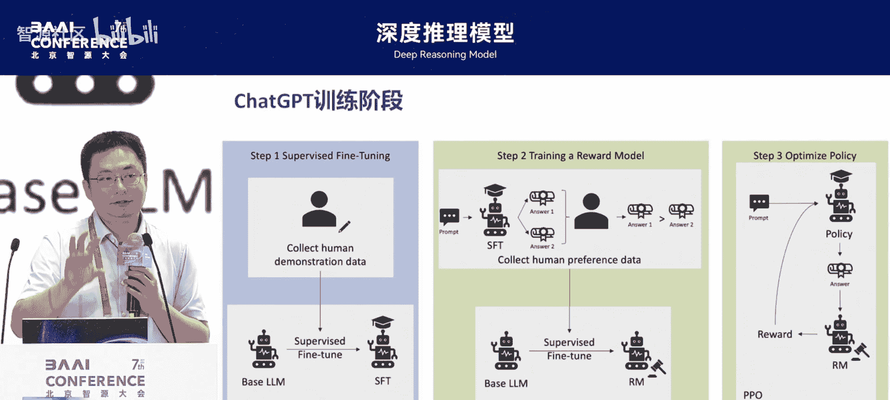

上一节我们介绍了大语言模型的基础。本节中我们来看看如何将强化学习框架与大语言模型相结合。

ChatGPT的出现，如同前面吴老师所讲，用到了强化学习技术。这对于强化学习研究者来说是一个振奋的消息。

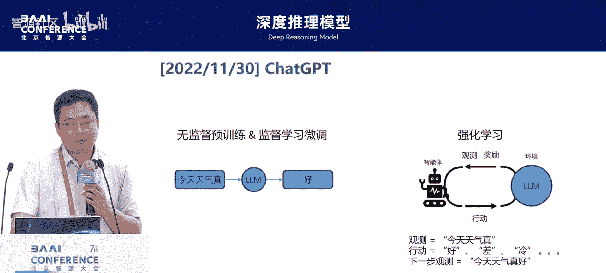

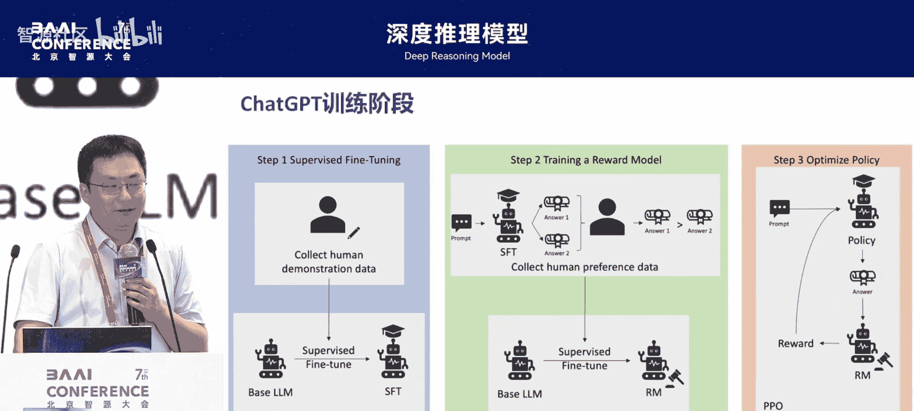

在语言模型中，前两步的监督学习或微调，都是在预测下一个token。当应用强化学习时，情况稍显复杂。强化学习包含几个基本要素。

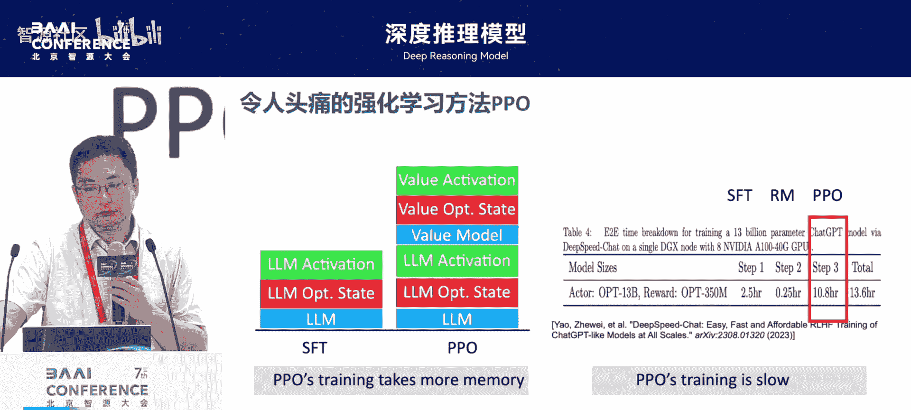

以下是强化学习在语言模型中的映射关系：
*   **观测**：对应生成文本时已有的上文部分。
*   **行动**：直接对应下一个要生成的token。
*   **环境**：将生成的下一个token拼接到当前状态上，形成新的状态。这个状态转移过程非常简单。
*   **奖励**：这是补全强化学习框架的关键因素。前面丁老师已专门讲解过奖励相关的内容。

当强化学习的框架要素完全具备后，我们使用强化学习训练语言模型时，**不需要额外的训练数据**。模型完全依靠奖励信号自行探索和改进。这一点对于提升语言模型的泛化能力非常关键。

## RLHF中的算法选择与挑战 ⚙️

上一节我们了解了强化学习如何应用于语言模型。本节中我们来看看具体算法及其面临的工程挑战。

ChatGPT出现后，由于PPO算法是OpenAI为数不多的自研算法之一，他们在介绍ChatGPT时特别强调了PPO。实际上，许多强化学习方法在许多问题上的表现相差不大，PPO本身并无神话。但OpenAI在2022年11月30日发布ChatGPT后，大约有8个月时间无人能很好复现。其中一个主要问题是强化学习训练非常麻烦。

强化学习除了语言模型本身，还涉及其他组件。例如，其中的Critic或价值模型，其规模与大模型一样大。因此，运行强化学习比运行监督学习占用更多内存。下图右侧是DeepSeek在复现过程中报告的时间，其训练时间特别长。因此，吴老师专门开发了能使其运行更快的框架。

在2023年5月，包括斯坦福团队在内的研究者提出了另一个算法DPO。该算法被认为是一种监督学习算法，其目标与RLHF完全等价，因此可以用来替代强化学习方法。一方面，这对于强化学习研究者似乎是个坏消息；另一方面，这项工作影响力非常强，引用量接近4000，并获得了NeurIPS的杰出论文奖。

为什么他们认为可以用监督学习替代强化学习？通常，我们假设强化学习的奖励模型是黑盒。但在RLHF中，奖励模型是我们根据设定目标从数据中学出来的。将这个目标与强化学习目标结合后，可以变成一个统一目标。然而，如果它与强化学习完全一样，直觉上会感觉有问题。我们后续做了一些分析。

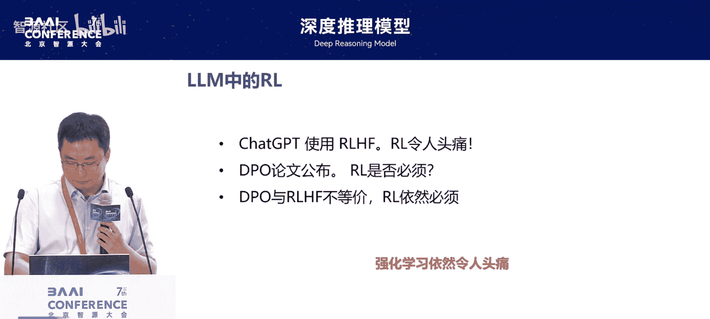

DPO算法是否真的可以替代强化学习？我们发现至少有两个地方不同。虽然其数学目标等价，但实际实现时：
1.  **奖励的表征函数不同**：DPO隐式地表示了奖励模型，而强化学习需要显式地表达奖励模型。这一差别可能带来三分之一的性能误差。
2.  **对数据的依赖不同**：如前所述，在强化学习框架中，一旦所有要素齐备，**不需要有标注的训练数据**，直接用奖励模型即可提升语言模型。而作为监督学习方法，DPO只能在已有标注答案的数据上进行训练。

这两者的差别，在我们设定的简单实验环境中，可导致一半以上的性能误差。我们在2023年底得出这个结果，指出两者并不相同。当时，几乎所有开源模型都使用DPO进行最终的对齐。我们呼吁大家注意两者的差异。今天回过头看，除了性能差异，更重要的是使用强化学习会带来推理模型的进步。如果停留在DPO，实际上不会催生推理模型，因为放弃了强化学习的技术路线。反而是像OpenAI，其首席科学家专门提到这项工作，他们并未重度使用DPO，仍在坚持使用强化学习，这后来导致了推理模型的产生。

所以，我们从2023年开始呼吁，后来更多工作也发现DPO会导致泛化性不佳等性能缺陷。今天我们看到更多工作重新将强化学习用上，使其可以“再次伟大”。然而，当时强化学习难以训练的问题尚未很好解决。可能当时如果有吴老师的框架，已经可以快速训练。但我们看到，要运行OpenAI的PPO算法，实际上需要非常多的算力，仅显存占用量就会大很多。

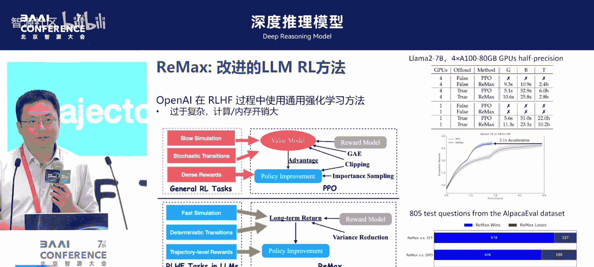

## 简化强化学习训练 🛠️

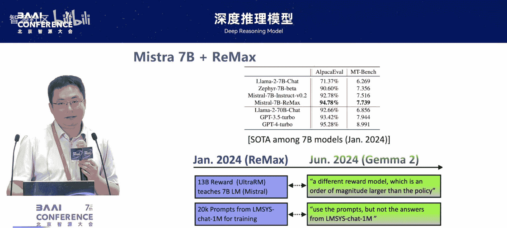

上一节我们讨论了RLHF训练的复杂性。本节中我们来看看如何通过简化算法设计来降低训练门槛。

在2023年年中，我们也在思考，特别是对于高校团队，基本无法复现如此大规模的计算资源。我们想能否简化一些，不做那么复杂。其实是可以的。

我们发现，在语言模型中，状态转移不像通用强化学习那么复杂。所谓的“转移”，就是将预测的下一个动作（token）拼接到当前状态上，形成下一个状态。其中不涉及不完全观测或随机性等因素。在这种更简单的设定下，我们可以取消一些复杂的组件。

例如，我们考虑**取消价值模型**。但取消价值模型是否可行？价值模型在强化学习中，是过去十几年发展起来、使基于策略梯度的方法变得稳定的关键因素。取消后，算法是否稳定？这又需要寻找一个基线来使其稳定。

我们实际上发现，对于语言模型这种简单设定，可以取消价值模型。我们采用了一个启发式的基线：**让大模型自己输出一个生成的句子作为基线**。实验显示，这可以减少一半的内存开销，训练时间也能缩短一半。

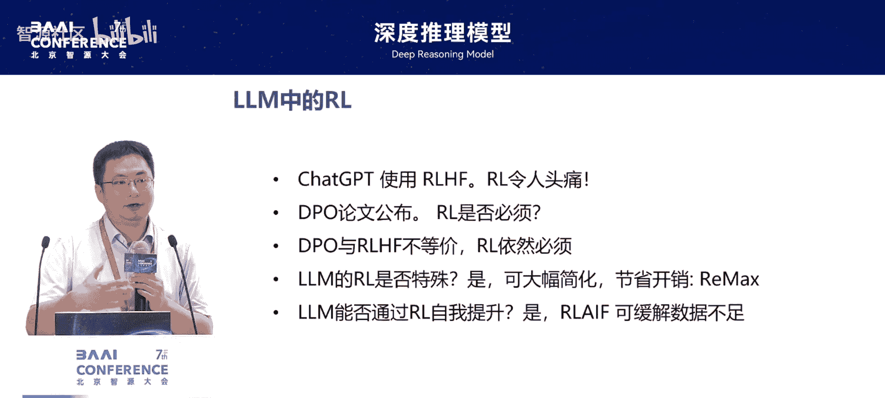

这项工作基于我们一直想证明减少价值模型是可行的想法。在2024年年初，我们基于当时较好的模型进行训练，在榜单上确实得到了比较好的效果。而且，这条路线在2024年年中时，Google的开源模型Gemma也使用了相似的变种，称为“REINFOR”算法。大写的REINFOR是2000年（约25年前）发表的一个非常简单的强化学习算法。

之后，我们看到更多工作去掉了价值模型，使其变得更简单。不同方法其实是在寻找不同的基线。只要基线选择得比较好，对于语言模型来说，都可以使其训练比较稳定。这包括DeepSeek的RPO等算法。这条线上已经开始逐渐产生不同的算法。这些算法的出现，对于今天更多开源语言模型能够使用强化学习进行训练，有很积极的贡献。

## 奖励模型的演进：从人类反馈到AI反馈 🏆

上一节我们探讨了如何简化训练过程。本节中我们来看看强化学习中另一个核心要素——奖励模型的演进。

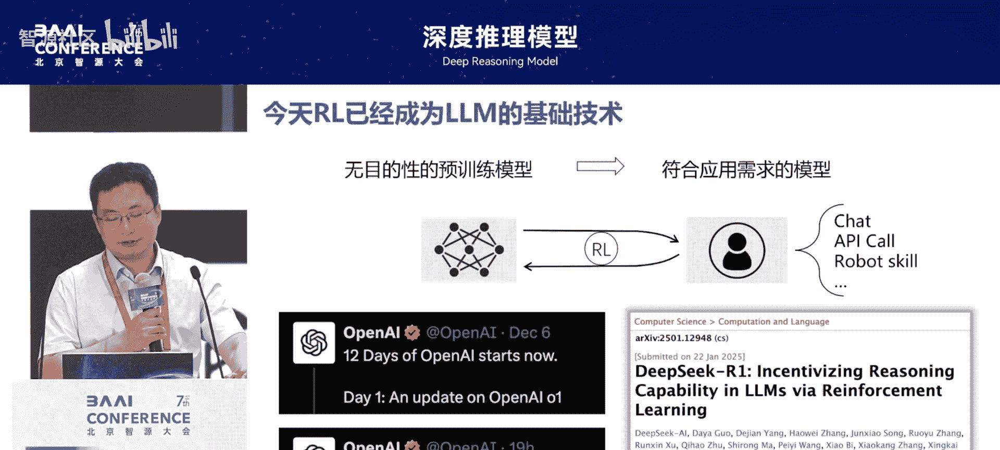

当强化学习可以运行起来后，我们发现还有一个很大的问题。最终，整个过程我们现在可以复现了。从ChatGPT公布时我们还无法复现，到现在可以复现。但更重要的问题是奖励模型本身。

在RLHF中，是通过收集人类数据，然后从数据中学习出奖励模型。这意味着奖励模型仍需要人类数据来提供偏好标注才能设计好。其实在较早的时候，2022年年底，Anthropic已经提出一个设想：能否从语言模型自身获得反馈。这个方向称为RLAIF，即基于AI反馈的强化学习，用语言模型自身的反馈作为奖励信号来训练。

在这方面，我们的工作虽然不是第一个，但至少在Google之前，阐明了为什么可以用AI模型自己的反馈来提升自己。这听起来像是“左脚踩右脚”无限提升的想法。实际上，是因为模型的**评价能力通常比其生成能力更简单、更好**。所以我们可以用其评价能力来改进其生成能力。同时，也阐明了这件事无法持续改进，因为评价能力不能改进评价能力自身，只能改进生成能力。所以我们可以用语言模型作为自己的评价者。

这个方向如果继续发展，更多考虑的是如何将语言模型中用到的奖励函数做得更好。

## 强化学习与推理模型的未来 🔮

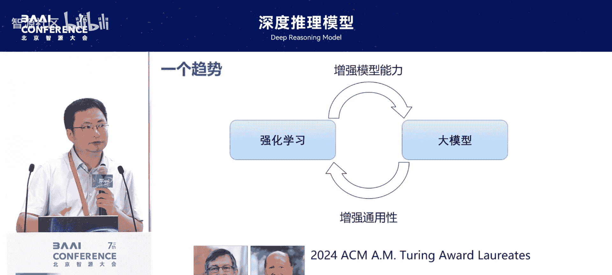

上一节我们介绍了奖励模型的演进。本节中我们来看看强化学习如何推动推理模型的发展，并展望未来。

今天，如同前面吴老师所讲，使用强化学习来增强语言模型的推理能力，已成为提升模型能力的主要途径之一。在去年的OpenAI DevDay前两天，都在讲这件事。O1是他们公布的第一个基于强化学习的推理模型。在2024年，OpenAI为O1的发布做了很多神秘推广，现在我们知道就是用了强化学习来增强其推理能力。第二天公布的“Reasoning”模型，也是用强化学习来增强推理。DeepSeek的模型也使用了强化学习。

今天回顾，如果2023年时完全跟随DPO的脚步，就到达不了今天做推理模型的程度。很多时候，热点不一定往好的方向带，也有可能带入坑里。

未来的发展，除了让系统更快、工程上做得更好，我们高校团队资源有限，更多探索的是一些未来可能的变化。例如，今天的语言模型使用强化学习，面临一个很大问题：**探索能力不充分**。

最近有一些讨论论文，例如质疑强化学习是否改进了基座模型的能力。这背后的问题就是强化学习是否做到了充分探索。对于一个标准的RLHF框架，每个动作是数万甚至数十万token规模的词汇。在这种规模下进行探索非常困难，相当于要枚举所有可能的token。如何改进这种结构，让语言模型变得更适合用强化学习训练？我们也有一个工作，旨在减少其动作空间，从而提高探索效率。这是一个方向。

我们认为更重要的方向（短期内可能难以很好解决）是**更好的奖励模型**。实际上，如果我们有一个完美的奖励模型，就等同于有了一个完美的语言模型，因为语言模型的每一步都可以用这个奖励模型找出最佳生成。所以，构建奖励模型这件事一定不简单。但我们觉得这个方向是未来非常值得探索的：如何在开放环境中，除了数学证明和代码这类“人造问题”（可以人造验证对错），在更广泛的应用场景上，如何能有一个更通用的奖励模型。这是一个更关键的因素。

今天我们看到，一方面强化学习让大模型变得更好；另一方面，大模型也让传统强化学习（如在《星际争霸》、《DOTA》上表现出色的专用模型）变得更通用。这种相互促进的框架能否走向AGI？不知道，也可能不行。但我们认为，强化学习这种从反馈中不断提升系统性能的技术，未来一定是我们智能系统里的一个核心元素。今年图灵奖颁发给了强化学习的两位先驱，我们也认为这个方向未来一定会带来新的、希望更接近我们所追求的人工智能系统。

## 总结 📝

本节课中我们一起学习了强化学习与大语言模型结合的关键知识。我们回顾了RLHF的基本框架，分析了DPO与RLHF在奖励表征和数据依赖上的核心差异。我们探讨了通过简化算法（如取消价值模型）来降低训练门槛的方法，以及奖励模型从依赖人类反馈到利用AI自身反馈的演进。最后，我们展望了强化学习在推动模型推理能力发展、以及未来在构建更通用奖励模型和探索机制方面所面临的挑战与机遇。强化学习作为从反馈中持续学习的核心技术，将在智能系统的进化中扮演重要角色。