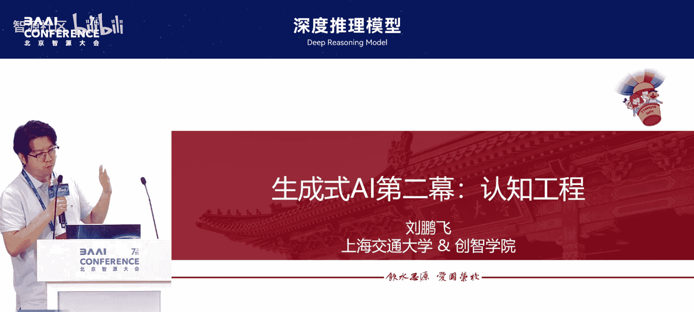
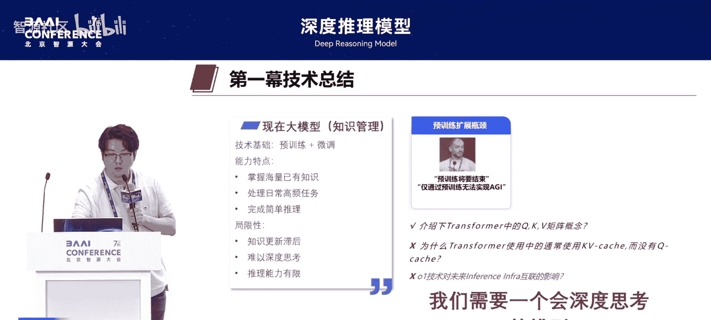
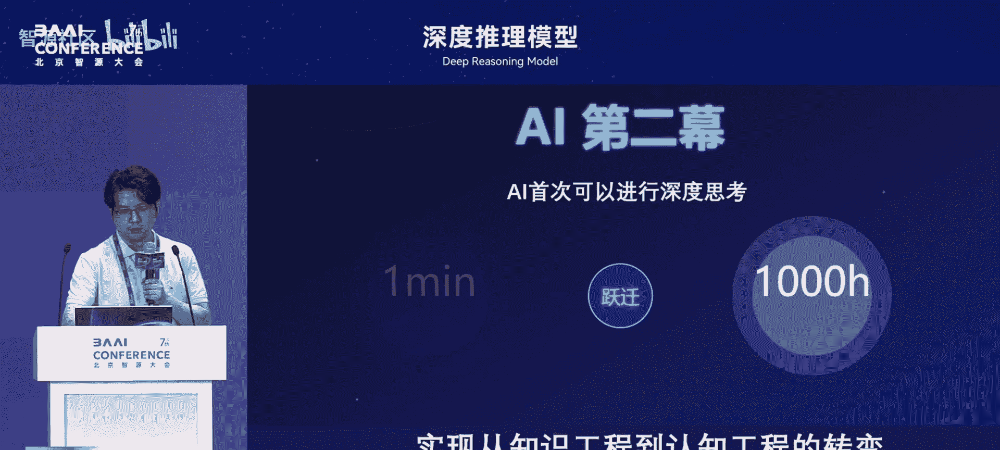
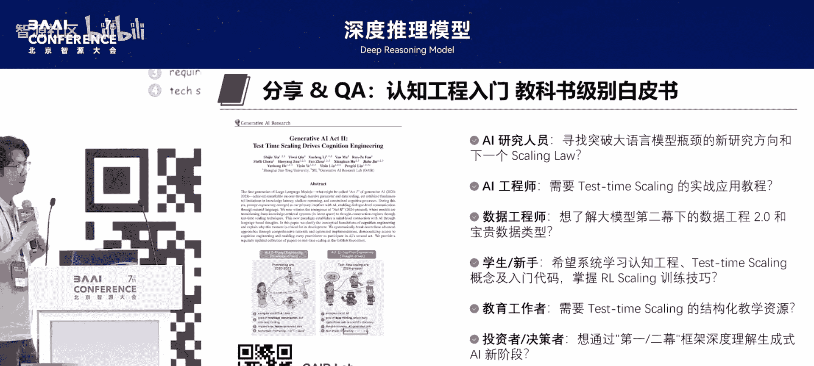

# 深度推理模型-p06-生成式AI第二幕：认知工程：刘鹏飞

在本节课中，我们将学习生成式人工智能发展的新阶段——“第二幕：认知工程”。我们将探讨大模型如何从知识管理工具进化为具备深度思考能力的认知工具，并分析其背后的技术原理、核心特性与未来方向。

---

## 概述：从知识到认知的演进

生成式人工智能的第一幕取得了巨大成功，大模型掌握了海量知识，能够处理高频任务。然而，它在复杂推理、深度思考和长链条任务上存在局限。随着以 **推理时缩放（Inference-Time Scaling）** 和 **测试时缩放（Test-Time Scaling）** 为代表的技术出现，大模型首次能够进行深度思考，标志着生成式AI进入了以“认知工程”为核心的第二幕。

---

## 第一幕的成就与局限

上一节我们概述了AI发展的两个阶段。本节中，我们来看看第一幕技术的具体特点与不足。

第一幕技术以 **预训练（Pretraining）** 和 **微调（Fine-Tuning）** 为基础。其能力特点是模型掌握了海量知识，可以处理日常高频任务并完成简单推理。

以下是第一幕技术的几个关键局限：
*   **知识更新滞后**：模型难以实时更新知识。
*   **难以深度思考**：模型缺乏持续、深入的思考能力。
*   **推理能力有限**：在复杂推理和长链条规划任务上表现不佳。

例如，在复杂的数学推理或让大模型使用电脑（如 `OS World` 基准测试）等任务上，第一幕的模型未能取得良好结果。然而，复杂推理能力对于数学解题、工具调用、智能体乃至科学研究都至关重要。

---

## 第二幕的核心：深度思考与认知工程

认识到第一幕的局限后，我们急需一个会深度思考的模型。本节将介绍生成式AI第二幕的核心内涵。

第二幕的核心是让AI首次能够进行深度思考。这主要得益于 **推理时缩放** 和 **强化学习缩放（RL Scaling）** 等技术的驱动。模型思考的时长可以从一分钟延伸到上千小时，能够解决的单个问题的价值也随之增大。

我们可以通过一个例子对比两代模型。对于问题“苹果为什么会落下”：
*   **第一幕模型**：直接照本宣科，回答“因为重力”或“万有引力定律”。
*   **第二幕模型**：会进行深度思考，可能联想并分析“苹果落下”与“月球绕地球转”是否原理相通，从而在知识层面挖掘得更深。

生成式AI第二幕的本质，是通过延长推理时间和学习人类认知，将大模型从一个**知识管理工具**转变为一个**具备深度思考能力的认知管理工具**。它实现了从数据、信息、知识到智慧与认知的跨越。

如果给认知工程一个定义，那就是：通过 **测试时缩放（Test-Time Scaling）** 范式，系统性地、主动地发展AI的思维能力。它通过抽取人类认知或让AI自主发现认知，使模型能够深度思考。

以下是第一幕与第二幕的对比：

| 维度 | 第一幕 (知识驱动) | 第二幕 (思维驱动) |
| :--- | :--- | :--- |
| **代表系统** | GPT-4 | OpenAI o1 |
| **核心能力** | 知识管理 | 深度思考 |
| **解锁场景** | 高频、通用任务 | 高价值、复杂推理任务 |
| **技术路径** | Pretraining → SFT → RLHF | Pretraining → (可能跳过SFT) → RL |

第二幕为我们思考所有AI问题提供了一个全新的、巨大的认知背景。

---

## 第二幕的三大技术支柱

那么，是什么支撑了大模型的深度思考能力呢？本节我们将剖析其背后的三大技术支柱。

### 1. 知识基础的质变
模型预训练数据中的 **推理数据（Reasoning Data）** 越来越多。例如，代码和数学相关数据的增加，显著提升了模型的逻辑推理能力。这构成了深度思考的知识基础。

### 2. 充足的思考时间
仅有推理数据的基础是不够的。就像解数学题需要草稿纸和时间一样，AI解决越难的问题，就需要越长的思考时间。这是 **推理时缩放** 理念的核心：尊重任务难度，给予模型足够的“思考时间”。

### 3. 认知数据的挖掘
“认知工程”强调对认知数据的挖掘至关重要。这些数据存在于：
*   专家的大脑和解决问题的完整思路中。
*   历史文献、科学发现过程、哲学思辨轨迹中。
*   人机协作共同完成任务的过程中。

**认知数据已成为AI时代最稀缺的战略资源**，它为下一代AI的突破和人类知识传承奠定了基础。

---

## 第二幕的新特性与未来方向

进入第二幕后，AI展现出哪些新特性？未来又将走向何方？本节我们来探讨这些前沿认知。

### 新特性一：极致的数据高效性
在复杂推理任务上，模型展现出“极致的数据高效性”。例如，仅用 **81个样本** 微调，就能在高中数学竞赛（AMC）题目上取得极佳效果。而在过去，可能需要数万样本。这是因为模型已具备强大的知识基础，后续只需对思维策略进行高效整合。

### 新特性二：从解决问题走向真实世界
未来的智能体（Agent）将全面走向真实世界。我们可以从三个维度评估任务：
1.  **任务可验证的复杂度**：决定评估设计的难度。
2.  **推理链长度**：任务本身需要的思考步骤。
3.  **环境复杂度**：任务涉及的工具和交互的复杂性。

当前的研究趋势正从简单的、封闭的任务（如解题）向复杂的、开放的真实世界任务（如科研、使用电脑）迈进。**构建复杂、可扩展的环境可能比设计奖励函数（Reward）更为优先和关键**。

### 新特性三：交互即智能
我们提出“交互即智能”的概念。当解决一个需要数天甚至数月思考的复杂任务（如写论文、做科学发现）时，**人机交互是必需的**。人类在关键节点提供策略性指导（认知杠杆），AI执行具体思考步骤。这种异步、深度的协作模式，是继搜索引擎时代、同步对话时代之后的第三代人机交互范式。

这种人机共创不仅能更好地解决问题，其过程本身就能产生高质量的认知数据，用于反哺AI训练。

---

## 总结与展望

本节课中，我们一起学习了生成式人工智能从“第一幕”到“第二幕”的演进。

*   **第一幕** 以知识为核心，模型是强大的知识管理工具，但在深度推理上存在瓶颈。
*   **第二幕** 以认知为核心，通过 **推理时缩放**、**测试时缩放** 和 **认知数据挖掘**，使模型成为具备深度思考能力的认知工具。
*   第二幕带来了 **极致的数据高效性**、**面向真实世界的演进** 和 **“交互即智能”** 的新范式。

这些认知已被系统性地总结在《认知工程》白皮书中。生成式AI的第二幕已经开启，它要求我们在新的认知背景下，重新思考AI的研究、开发与应用。未来，构建认知数据基础设施、设计复杂任务环境、探索深度人机协作，将是推动AI向更高智能迈进的关键。

---