# 深度推理模型-p08-Pretrain-and-test-time-scaling-of-Ling-models：张志强

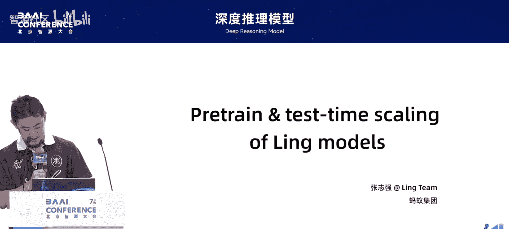

在本节课中，我们将学习如何利用缩放定律来指导大规模语言模型的预训练，以降低训练风险并优化模型架构。课程内容将涵盖从密集模型到混合专家模型的研究，并探讨推理时缩放定律的挑战。

## 🏢 课程概述与广告

我叫张志强。我的报告主要与预训练的缩放定律相关，后面会有一小部分关于推理时缩放的个人想法。

首先介绍一下蚂蚁集团的百灵模型。百灵模型的研发从2023年开始，但从今年3月才完全投入到开源工作中。我们每个月都会发布一些进展，包括通用语言模型、推理模型和多模态基座。

模型命名基于“Linguistics”的前四个字母“Ling”。推理模型将首字母改为“R”，称为“Ring”。模态模型将首字母改为“M”，称为“Ming”。

我们在3月份开源了名为“Ling-Plus”的接近300B的模型。它并非完全使用英伟达最高端芯片训练，证明了在国产算力上训练300B乃至六七百B的庞大MoE模型，可以达到与高端H100/H800芯片几乎完全一致的损失和基准测试效果。这项工作包含了大量调试工作。

我们正在招聘，欢迎大家加入Ling团队。

## 🧭 缩放定律的研究动机与阶段

我的整个报告内容围绕缩放定律展开。

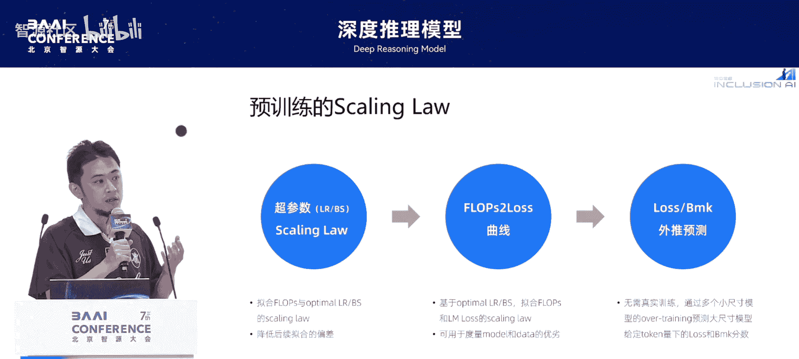

预训练最困难的事情，是外推到特别大的计算量和模型尺寸时，如何对抗不确定性。我们不可能在10^25到10^26次方计算量的模型上进行多次尝试。因此，必须在前期尽可能精准地预测损失和基准测试表现，以降低后续训练的风险。

换句话说，如果能够不训练就预测一个架构的模型在训练大量token后，其损失会收敛到什么位置，这个信号就能帮助我们监控实际训练过程是否正常。这是我们研究缩放定律希望达到的目的，即降低训练风险。

为了实现这个目标，我们分三个阶段进行研究：
1.  探索影响模型训练效果的关键超参数（如批量大小、学习率）的缩放趋势，并准确预估其最优值。
2.  基于最优超参数，训练一批小模型，拟合出计算量到损失之间的曲线，用以度量架构或数据修改的正确性。
3.  实现无需训练，仅用2%到3%的计算量（通过小模型）来预测超大模型在过度训练（如3到10倍）后的损失，从而监控训练任务是否正常。

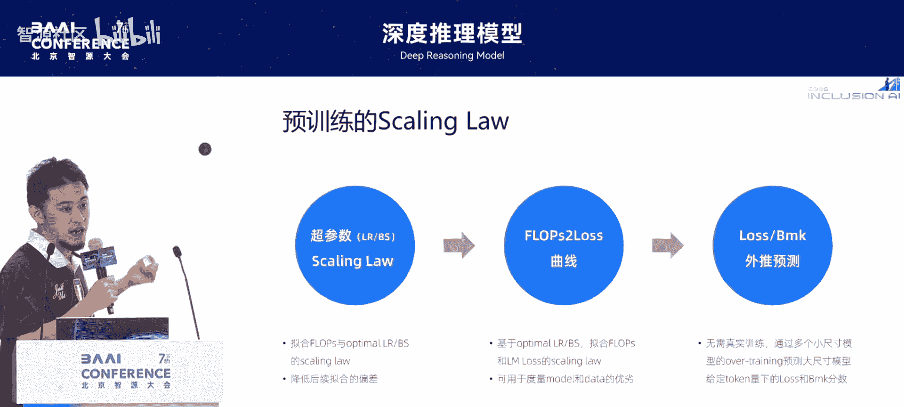

## 📊 第一阶段：密集模型超参数缩放定律

上一节我们介绍了研究缩放定律的三个阶段，本节中我们来看看针对密集模型超参数的具体研究。

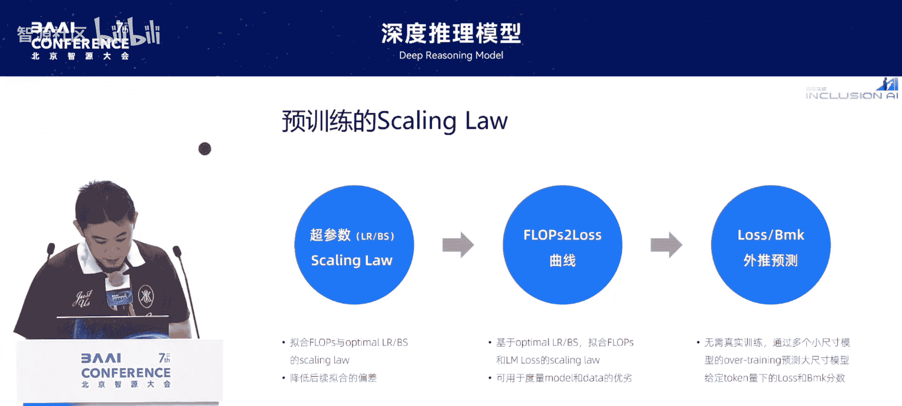

首先，我们参考Meta和Google的早期研究，探讨批量大小和学习率这两个关键超参数。我们使用较多的不同尺寸小模型，按照一定间隔测试不同的批量大小和学习率组合，找到获得最低损失的最优参数区间。

以下是我们的发现：
*   最优的批量大小和学习率与模型计算量之间呈现对数线性关系。
*   公式表示为：`log(optimal_batch_size) ∝ log(FLOPs)` 和 `log(optimal_learning_rate) ∝ -log(FLOPs)`。
*   这意味着，计算量越大（模型越大、数据越多），需要越大的批量大小来推动训练，同时需要越小的学习率来保证稳定。

我们可以精准预测真实训练中需要选择的批量大小和学习率。我们通过更大尺寸的模型验证了预测的准确性，并与业界普遍选用的参数进行了一致性验证。

附带结论：
*   对于标准的Transformer架构，改变模型的“高矮胖瘦”（如层数、隐藏维度）不会影响最优参数的缩放趋势。
*   小幅调整数据配比不会影响，但进行特别大幅度的调整（例如将所有数据集的采样权重调成完全一样）则会影响。
*   实际训练中，我们使用包含热身、稳定和衰减阶段的学习率调度，而非恒定学习率。研究发现，使用1%到3%的梯度累积步数进行热身，对训练稳定性有帮助，且能让模型在初期表现出更好的效果。

## 📈 第二阶段：拟合损失曲线与架构评估

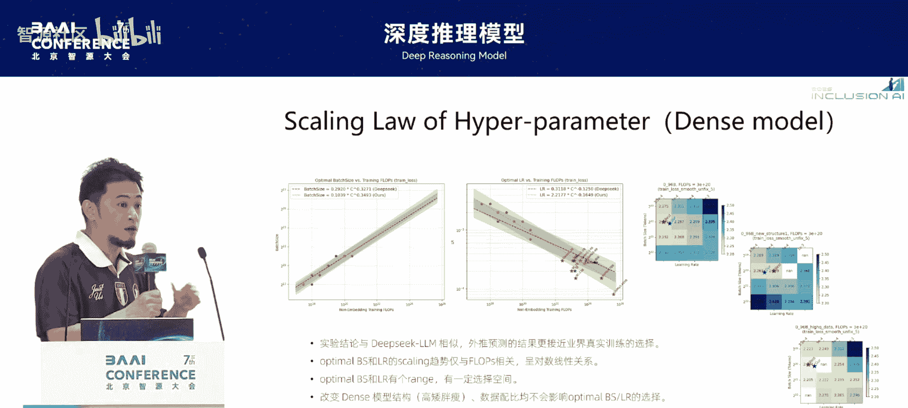

在确定了最优超参数后，我们进入第二阶段：基于这些参数训练一批小模型，拟合计算量到损失的曲线。

我们拟合了模型大小和数据大小之间的最优分配比例。结论与之前的论文类似，但其作用在于可以判断数据质量或模型架构的优劣。

我们发现，对于质量更高、多样性更好的数据，缩放定律会更倾向于将计算量分配给更大的模型，而非更多的数据。反之，我们可以通过这种方式来度量不同数据版本的优劣，因为直接用一个模型训练对比损失是无法判断的。

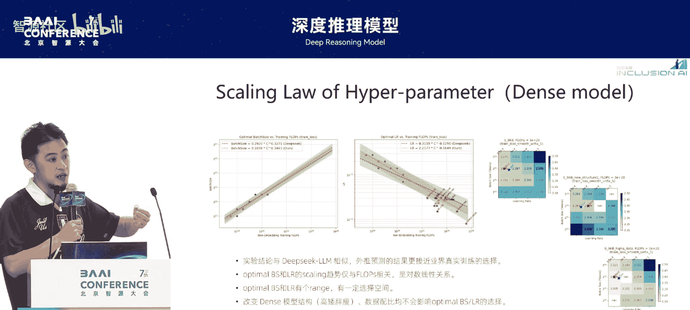

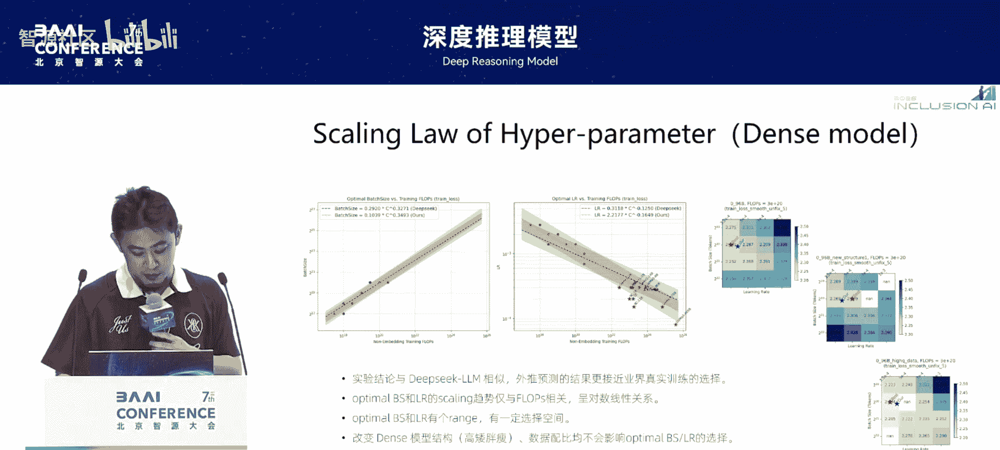

为了更精准地预测损失（我们希望将误差控制在千分之五以内），我们采用了对数反比关系进行拟合。公式可以表示为损失与计算量的某种函数关系，通过这种方式，我们可以对比不同模型架构之间的优劣，并且能够外推到较大的算力区间。

然而，新的问题出现了：我们的拟合是基于最优token分配量进行的。例如，一个20B的密集模型，其最优token量可能是400B。但真实训练中，我们通常会训练10T甚至15T的token，即过度训练。在这种情况下，即使最优token量拟合得很准，过度训练时的损失误差也会逐渐放大。

我们采用了一个启发式策略来解决：既然用最优token量拟合可以达到很低的误差，那么我们是否可以用过度训练（如3倍、10倍）后的小模型来进行外推拟合？我们发现这种方法非常有效。通过这种方式，我们可以将过度训练后的损失预测误差从1.5%缩小到千分之五以内。

这种预测无需实际训练超大模型。我们实际运行了一个20B模型的训练，其预测误差就在千分之五以内。这为预训练阶段提供了有效的监控手段。

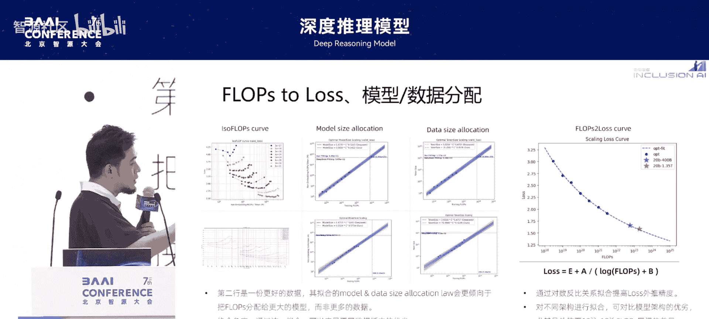

## 🧩 第三阶段：混合专家模型的缩放定律研究

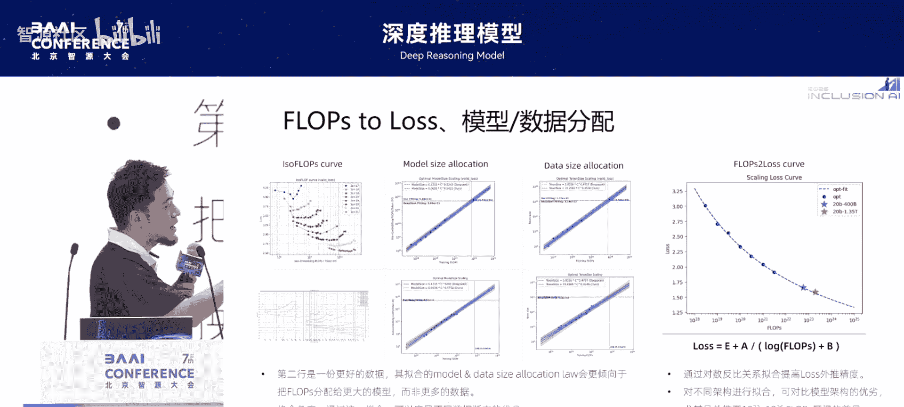

解决了密集模型的缩放定律和精准损失预测问题后，我们尝试将研究扩展到混合专家架构。

对于MoE架构，我们希望探讨三个问题：
1.  如何利用缩放定律指导MoE架构的选择（如专家数、稀疏度）？
2.  如何量化一个MoE模型与多大的密集模型是等价的？
3.  如何判断不同MoE架构设计的优劣？

第一个问题相对简单。为了控制变量，我们首先确定一个MoE架构（如专家数、稀疏度固定），那么它在某种程度上就像一个密集模型。我们进行类似的推导，发现其最优批量大小和学习率与计算量之间的函数形态与密集模型一模一样，都呈现对数线性关系。

我们调整MoE架构的稀疏度（从3%到10%）和使用不同的专家均衡策略，发现最优批量大小基本一致。我们得到结论：**MoE架构的最优批量大小主要与激活的计算量相关，与具体的架构细节、均衡策略和数据关联性不大。**

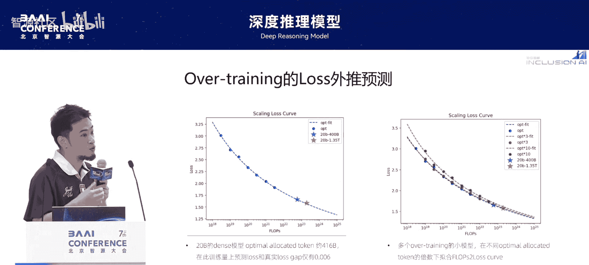

## ⚖️ MoE与密集模型的等效关系与架构设计

上一节我们探讨了MoE模型超参数的缩放趋势，本节我们来看看如何量化MoE与密集模型的等效关系。

我们提出了“杠杆效率”的概念：在达到相同损失的情况下，不同架构的激活计算量之比。如果要比较一个MoE架构和一个密集架构的等效关系，就是将MoE的激活计算量乘以这个杠杆倍数，得到一个等效的密集模型大小。这两个模型在训练过程中的损失曲线基本一致。

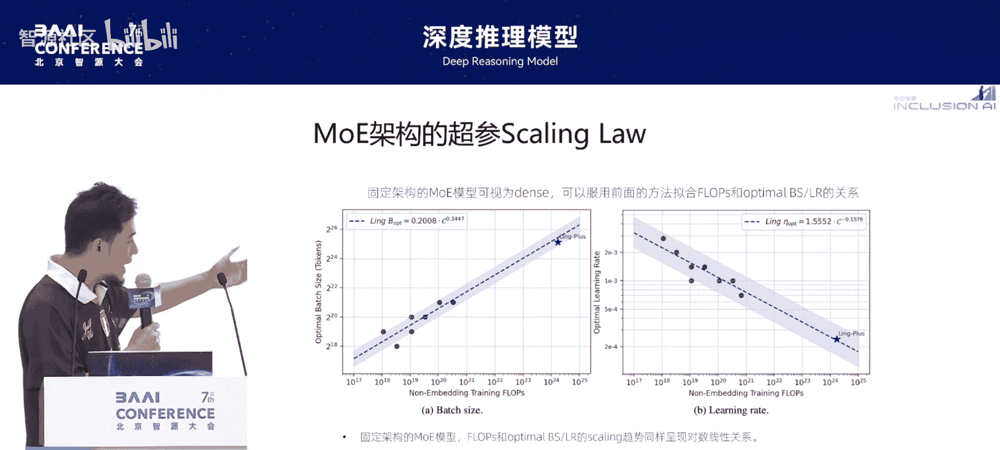

我们分析了自研的MoE模型架构与密集模型架构的缩放曲线对比。发现从总参数量十几B到接近700B的模型，其杠杆效率大约在2.8倍到4倍之间。并且有一个很好的信号：随着计算量增加，MoE的杠杆效率在扩大，这是一个非常健康的模型状态。

然而，真实的训练成本与模型实现的硬件利用率相关。MoE模型的硬件利用率通常是密集模型的50%-60%。因此，实际训练成本上，MoE模型能以密集模型2到3倍的成本，获得与之相当的性能。这解释了为什么现在大家都倾向于训练MoE模型，因为它确实更具性价比。

接下来，我们看看如何利用这些方法进行架构判断和设计。对于MoE模型，有两个重要因素：专家稀疏度和专家数量。

*   **专家稀疏度**：研究发现，对于MoE模型，**越稀疏会带来越好的性能杠杆和更低的损失**，而且这个优势随着稀疏度成倍增长似乎没有止境。这解释了为什么现在大家都训练激活参数量很小但总参数量很大的模型。
*   **专家数量**：研究发现，专家数量的增加并非无止境的优化。在我们的实验中，专家数量在256到384之间可能取得较好的值，增加到512时优势不再明显，反而会因为训练更复杂而不划算。

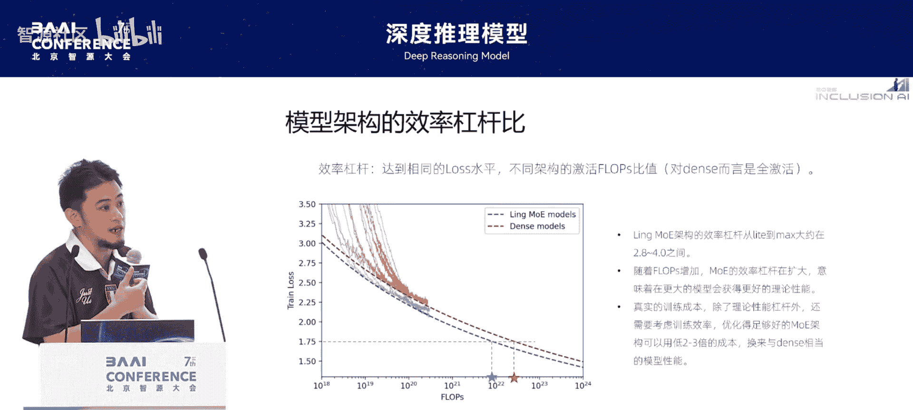

## ✅ 验证与局限性

基于以上结论，我们设计并验证了一个更新的架构（即我们2.0版本训练的架构）。

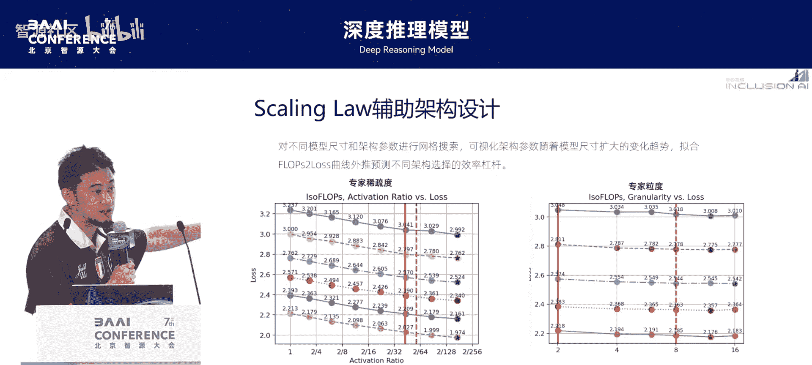

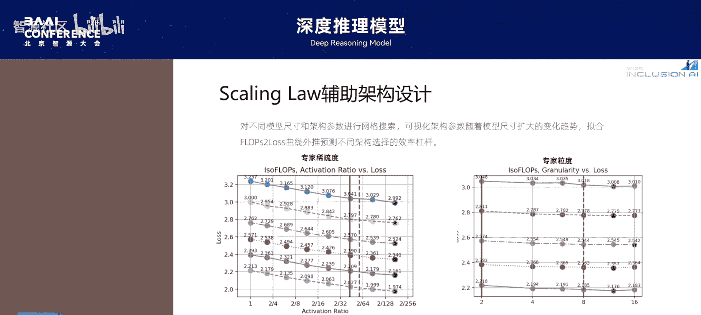

我们训练了一个5.5B的密集模型（约1T token），以及一组从64专家到384专家、固定稀疏度、激活参数量约800M的MoE模型。发现在小规模下，MoE可以获得近10倍的性能杠杆；在更大规模下，杠杆约为7倍。在32B密集模型与4B激活的MoE模型对比中，也观察到类似趋势。

因此，我们有理由相信，将该架构扩展到1T参数的模型时，它可以做到等效于300B到400B的密集模型，而训练成本只有后者的1/4到1/3。

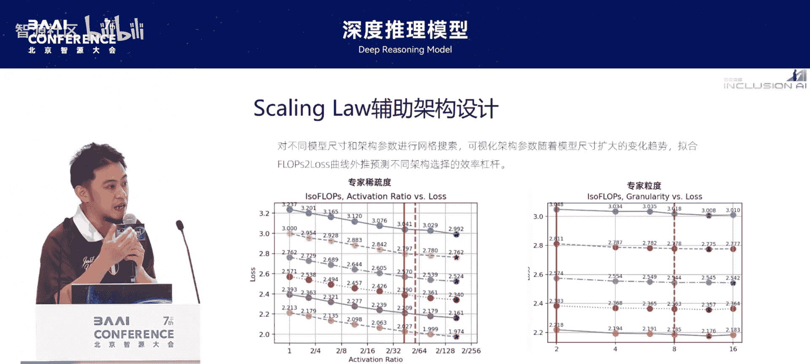

最后，说明一下当前研究的局限性：
1.  **贪心拟合**：目前的拟合通常是控制单一变量进行实验，如果多个变量之间存在耦合，得到的结论可能不是全局最优。
2.  **侧重架构理论性能**：所讲内容主要与模型架构的理论性能有关，但影响最终效果的还有数据。我们还需要探索数据层面的缩放定律。
3.  **工程实现挑战**：将一个理论上具有高杠杆性能的模型转化为真实的超大模型，需要大量的工程和系统优化。设计出特别稀疏、专家数很多的模型，其训练难度很高。

## 🤔 推理时缩放定律的挑战

报告的最后部分，是关于推理时缩放的一些想法。

前面讲的全是预训练的缩放定律。我们是否有可能得到所谓的“推理时缩放定律”？目前，通过思维链指令微调和强化学习训练，我们可以扩展模型在推理时的计算量，从而获得强大且具有一定泛化能力的推理能力。

但所有已知数据显示，当前最先进的推理模型，其RL训练步数很少超过1万步。这个训练步数与预训练动辄上百万兆的步数相比，非常小。很多模型在通过蒸馏CoT进行SFT后，再做RL训练，可能几百步就会迅速崩溃。

因此，我认为我们现在只是观察到了推理时缩放的趋势，但还没有办法得到一个像预训练那样精确的定律，也无法像预训练那样持续训练并获得持续收益。这可能是一个未来需要业界共同探索和克服的问题：**为什么RL不能像预训练那样一直训练，一直提升？** 这其中可能需要解决系统、算法和数据等多方面的问题。

## 🎯 课程总结

本节课中我们一起学习了如何利用缩放定律来系统化地指导大规模语言模型的预训练。

我们首先明确了研究动机：通过预测来降低大模型训练的不确定性和风险。接着，我们分三个阶段展开：
1.  研究了密集模型关键超参数（批量大小、学习率）的缩放趋势，并实现了精准预测。
2.  通过拟合计算量-损失曲线，实现了对不同模型架构和数据质量的评估，并解决了过度训练下的损失预测难题。
3.  将研究扩展到MoE模型，提出了“杠杆效率”概念来量化MoE与密集模型的等效关系，并指导了MoE架构的稀疏度和专家数量设计。

最后，我们探讨了当前研究在“贪心拟合”、侧重理论性能及工程实现方面的局限性，并提出了对“推理时缩放定律”这一未来挑战的思考。