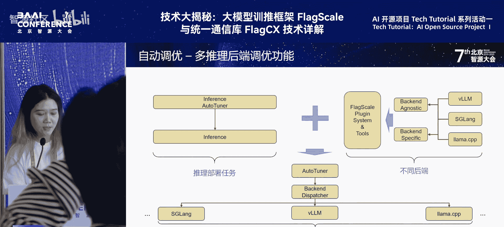

# 特色活动：AI-开源项目-Tech-Tutorial-系列活动-p02-基于-FlagScale-自动调优机制进行多芯片高效推理部署：吕梦思

在本节课中，我们将学习如何利用智源研究院的 FlagScale 框架，通过其自动调优机制，实现跨多种 AI 芯片的高效大模型推理部署。我们将了解当前多芯片部署面临的挑战，以及 FlagScale 如何通过自动化流程简化配置、优化性能，并支持异构芯片的协同工作。

## 多芯片部署的挑战

上一节我们介绍了大模型推理部署的重要性。本节中，我们来看看在实际进行多芯片、多模型部署时会遇到哪些具体挑战。

以下是部署时面临的主要挑战：

1.  **硬件配置复杂**：国产芯片种类繁多，不同芯片对应不同的网络配置、环境变量和特殊设置。
2.  **资源管理与调度困难**：在给定资源（如多张计算卡）的情况下，如何高效管理和调度这些资源，并对接收到的推理请求进行分发，以达到最优的推理效率。
3.  **部署环境门槛高**：模型部署环境通常较为复杂，对于普通用户而言上手难度较大。
4.  **后端性能差异大**：不同的推理后端（如 vLLM、SGLang）在不同芯片上的性能表现差异显著，如何选择最优的后端对用户是挑战。

## FlagRelease：跨芯片自动发版平台

针对上述挑战，智源研究院推出了 **FlagRelease** 平台。这是首个支持跨 AI 芯片的自动发版机制。

该平台能轻松地将英伟达平台上的模型部署配置迁移到其他 AI 芯片上。平台提供了基于多种芯片的大量预置大模型版本。用户可以直接从 ModelScope 或 Hugging Face 拉取这些模型，并通过最底层的 **FlagScale** 框架一键部署最优的服务配置。

接下来，我们将探讨如何获得这个“最优部署配置”。

## 自动调优机制详解

在复杂的硬件和多样的模型下，要找到最优部署配置，我们面临几个核心挑战。

以下是具体的挑战与解决方案：

1.  **模型迭代快，默认配置不通用**：新模型（如 DeepSeek、Qwen）发布频繁，且默认配置通常针对英伟达芯片。在国产芯片上需要调整配置以充分发挥硬件性能。
2.  **推理框架与超参众多**：不同的推理框架有大量可调超参数。FlagScale 通过详细分析不同框架和超参对吞吐量、时延的影响，为特定模型和芯片寻找最优配置方案。
3.  **固定资源下的最优分配**：给定固定数量的计算卡（如8张），如何分配（例如，是每2张卡部署一个实例，还是每张卡部署一个实例）以及选择何种并行方式，才能实现吞吐量最大化。FlagScale 提供了自动探索合适部署实例的功能。

针对这些挑战，解决方案是使用 FlagScale 的自动调优功能。用户只需在目标硬件和模型上调用此功能，系统就会自动生成当前条件下的最优服务部署配置。后续上线部署时，直接使用这组配置即可。

### 多后端自动调优流程

FlagScale 框架本身具备训练自动调优功能，推理部署也配备了相应的自动调优模块。

其核心流程结合了任务自动调优与多后端支持机制。目前，FlagScale 支持的推理框架包括 **vLLM**、**SGLang** 和 **llama.cpp**，它们分别适用于不同的后端和场景。

自动调优的大致流程是：系统根据任务将其分发到对应的框架上，然后在框架内部进行参数选择。

### 具体调优步骤

用户只需输入**模型信息**和**资源数量**，FlagScale 便会自动构建搜索空间。

搜索空间包含两类参数：
*   **资源相关参数**：如张量并行（TP）、流水线并行（PP）大小、实例数量。这些参数在不同后端间是耦合的。
*   **后端特有参数**：例如，vLLM 对 KV Cache 显存的分页大小，SGLang 的调度相关参数等。这些用于优化特定后端的性能。

构建搜索空间后，系统（目前通过网格搜索）生成多组服务配置。对于每一组配置：
1.  使用 FlagScale 的一键部署指令启动服务。
2.  使用用户提供的、符合实际场景的数据（输入/输出长度）构建数据集，测试服务性能。
3.  分析性能结果（如吞吐量、时延）。如果当前配置优于历史最佳，则将其记录为最优配置；否则，停止当前服务，测试下一组配置。

整个流程跑完后，最终输出的就是在当前硬件和模型下的**最优服务配置**。这个流程可以封装为一键脚本工具，在部署前自动完成。

该功能支持多芯片、多后端，无需编写代码，只需在配置文件中进行设置并启用 `auto_tune` 即可。它支持针对不同目标函数（如**时延最低**或**吞吐量最高**）进行调优。

## 自动调优效果验证

我们通过测试数据来验证自动调优的效果。

*   **服务端调优结论**：在5款国产芯片上进行测试。结果显示，最优配置与最差配置之间的吞吐量性能差异最高可达**3倍**。与针对英伟达芯片的默认配置相比，自动调优找到的配置能带来 **2% 到 20%** 的性能提升。
*   **多后端对比结论**：对比 vLLM、SGLang、llama.cpp 在不同优化目标下的表现。例如，在时延敏感的场景下，SGLang 相比 vLLM 可能具有明显优势。
*   **端侧芯片调优结论**：在端侧芯片上的测试表明，超参选择影响巨大。例如，在某款端侧芯片上，最优吞吐量相比最差可提升 **61%**，最优端到端时延可比最差降低 **38%**。在另一款芯片上，提升和降低的幅度甚至更大。

因此，自动调优功能能有效帮助用户降低在特定芯片上的部署成本。

## 异构芯片 Prefill/Decoding 分离部署

最后，我们探讨一种先进的部署优化技术：**异构芯片 Prefill/Decoding 分离部署**。

大模型推理分为两个阶段：
*   **Prefill（预填充）阶段**：处理完整的输入提示词，计算密集。
*   **Decoding（解码）阶段**：逐个生成输出token，内存访问密集。

传统部署将两个阶段放在同一GPU上，会导致资源争抢。分离部署旨在让不同特性的芯片专注于各自擅长的阶段。

FlagScale 专注于**跨芯片异构**的分离部署，例如在**沐曦**和**天数智芯**的芯片上分别部署 Prefill 和 Decoding 阶段。我们使用智源自研的高效通信库 **FlagLink** 进行中间 KV Cache 的传输。

该方案支持：
*   多 Prefill 实例与多 Decoding 实例的灵活组合。
*   利用自动调优功能，根据目标函数自动调整 Prefill 和 Decoding 阶段的实例数量，以达到最优吞吐。
*   支持 Prefill 和 Decoding 节点的自动扩缩容，且不影响其他运行中的实例。

## 总结

本节课中，我们一起学习了基于 FlagScale 实现多芯片高效推理部署的全套方案。我们了解了多芯片部署的复杂性，认识了 FlagRelease 平台和 FlagScale 的自动调优机制如何自动化地寻找最优部署配置，并通过实测数据验证了其显著性能收益。最后，我们还探讨了利用异构芯片进行 Prefill/Decoding 分离部署这一前沿技术，以进一步压榨硬件潜力，实现极致推理效率。通过这套方案，开发者能够以更低门槛、更高性能在各种国产AI芯片上部署大模型。