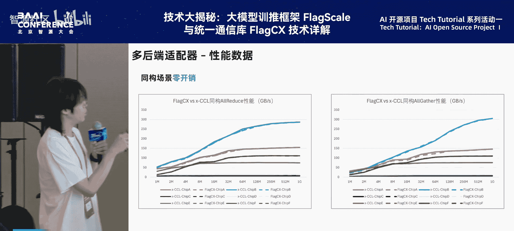

# 特色活动：AI-开源项目-Tech-Tutorial-系列活动-p03-基于-FlagCX-打造多框架-+-多芯片高效跨芯通信能力：常-韬

## 概述

在本节课中，我们将学习智源研究院开发的FlagCX通信库。这是一个旨在解决大模型时代异构计算环境下，不同芯片间高效通信问题的核心组件。我们将了解其设计目标、核心架构、关键功能以及实际性能表现。

---

## FlagCX简介与设计目标

上一节我们概述了课程内容，本节中我们来看看FlagCX是什么以及它要解决什么问题。

FlagCX是一个高性能通信库，其核心目标是构建异构分布式推理的底层通信能力，实现不同芯片跨节点的高效互联。

它的设计目标主要有三个：
1.  实现**同构芯片**的大规模高效稳定通信。
2.  实现**不同芯片**间的跨芯高效通信。
3.  基于统一编程模型，构建自动化的通信算法编译。

目前，FlagCX v0.2版本已经发布，支持6+2种原生通信库，并具备自动拓扑探测功能。

以下是其支持的主要功能列表：
*   **芯片支持**：英伟达(NVIDIA)、天数(Tianshu)、昇腾(Ascend)、海光(Hygon)等。
*   **拓扑支持**：服务器级拓扑探测、最优网卡匹配。
*   **算法支持**：11种异构集合通信算法，适用于多网卡/单网卡复杂场景。
*   **通信操作**：支持 `AllReduce`, `Broadcast`, `Reduce`, `AllGather`, `ReduceScatter`, `Barrier` 等。
*   **框架与平台**：支持PyTorch、PaddlePaddle，并已原生集成至浪潮的元脑平台。

---

## 核心功能一：多后端适配器

了解了FlagCX的整体面貌后，本节我们深入其第一个核心功能：多后端适配器。

多后端适配器的目标是支持**一键编译**，实现多芯高效同构通信。为了实现这个目标，FlagCX主要采用了两类抽象：

1.  **通信库层级API**：负责通信的创建、销毁、通信操作以及组操作。
2.  **设备适配器(Device Adapter)**：属于运行时(Runtime)级别，负责内存分配/释放、拷贝、流管理、事件管理等。

通过这套抽象，FlagCX可以通过一套API，根据编译时选择的标志(flag)，将指令下发到不同的芯片后端，实现高效的同构通信。

以下是同构通信的性能数据展示，以 `AllReduce` 和 `AllGather` 操作为例，在6种不同芯片上测试：
*   **图中实线**：同构的原生通信库（如NCCL）性能。
*   **图中虚线**：通过FlagCX接口实现的性能。

可以看到两条线基本重合，这说明在同构场景下，FlagCX能够实现近乎零开销的通信。

---

## 核心功能二：跨芯通信能力

上一节我们介绍了同构通信，本节中我们来看看FlagCX最重要的功能：跨芯通信。

跨芯通信的目标是支持多种芯片间的高效异构通信。在之前两类抽象的基础上，FlagCX增加了**网络传输(Net Transport)**抽象（如IB或RoCE）。

基于 `Device Adapter` 和 `Unified Net Transport` 这两层抽象，FlagCX实现了一套原创的、基于GDR的高效跨芯点对点(P2P)通信。同时，结合 `CCL Adapter` 的同构集合通信能力，通过原创的 **C2C算法**，最终实现了高效的跨芯集合通信。

这里引入一个核心概念：**Cluster**。一个Cluster可以理解为一个同构的设备组，组内可以使用NCCL等进行原生通信。而跨Cluster的通信，则通过跨芯P2P实现，共同达成高效的跨芯集合通信。

接下来，我们将更细致地了解跨芯C2C算法。

### C2C算法详解

首先，我们给出Cluster的定义：**任意大小的同构设备组**。一个跨芯通信任务可能涉及多个Cluster，每个Cluster可能具备不同的拓扑构型。

例如：
*   两个Cluster，各有8个GPU和8个网卡。
*   两个Cluster，一个为8个GPU+4个网卡，另一个为8个GPU+2个网卡。
*   三个Cluster，分别为8个GPU+8个网卡，16个GPU+1个网卡等。

面对复杂的拓扑，跨芯通信算法的难点在于：**如何在保证算法正确性和可扩展性的同时，最大化通信带宽**。

我们的解法是：
1.  **最大化带宽**：通过自动拓扑探测获取最近的网卡距离，将距离最近的Rank作为跨芯通信的交互Rank。
2.  **保证正确性与可扩展性**：通过C2C算法实现。

C2C算法将跨芯通信分为三个阶段：
*   **Pre阶段**：Cluster内部预处理。
*   **Inter阶段**：跨Cluster交互。
*   **Post阶段**：Cluster内部后处理。

针对不同的通信操作和网卡配置，这三个阶段可以拆解成不同的具体实现。例如，对于 `C2C AllReduce` 操作：
*   在`Rank Local`（多网卡）模式下，可拆解为：同构`ReduceScatter` + 跨芯`AllReduce` + 同构`AllGather`。
*   在其他网卡配置下，可拆解为：同构`Reduce` + 跨芯`AllReduce` + 同构`Broadcast`。

通过这种方式，11种跨芯集合通信算法都可以找到对应的映射实现。

### 跨芯通信性能展示

以下是C2C算法的性能数据：

1.  **多网卡支持**：在Chip A + Chip B上进行测试，手动控制网卡数量。`C2C Reduce`在8网卡、大通信量时性能超过单网卡；在4GB数据量时，可达单网卡性能的2.7倍。`C2C AllGather`在4GB时可达单网卡的2.5倍。这表明多网卡算法设计有效。

2.  **扩展性支持**：在Chip A, B, C, D四种芯片上测试（C和D是同产商的不同款芯片）。通过环境变量 `FLAGCX_CLUSTER_SPLIT_LIST` 可以灵活划分Cluster（如单机一Cluster，或4个Rank一Cluster）。目前已实现4个Cluster的跨芯通信。性能受限于只有单网卡的Chip C和D。

3.  **最佳性能实践**：以 `AllGather` 和 `Reduce` 为例。
    *   **Chip A 两机**：使用C2C算法在大通信量下性能接近原生通信库的100%。
    *   **Chip B 两机**：大通信量下可达原生库的70%。
    *   **Chip A + B 跨芯**：大通信量下可达原生两机通信的90%。
    *   **`AllReduce`**：由于尚未深度优化，目前性能约为原生库的50%。

**注意**：目前C2C算法在大通信量下性能优异，但在小通信量场景下仍需进一步优化。

---

## 核心功能三：代价建模

上一节我们看到了C2C算法的强大性能，本节我们来了解如何为复杂的通信场景选择最优策略。

由于FlagCX允许多Cluster、多种拓扑构型，并引入了多种优化技术，因此面临一个挑战：**如何在众多变量参数中选择最优的跨芯通信策略？**

我们的解法是：构建一个基于C2C算法的**代价建模**系统。

该系统的目标是支持对跨芯通信算法端到端耗时的开销建模。它会将C2C算法的三个阶段（Pre, Inter, Post）拆分开，逐一进行开销统计。

建模使用的参数包括：`Cluster`数目、网卡数、通信量大小等。它采用经典的 **Alpha-Beta** 代价模型构型。

以下是一个简单的代价建模预估示例：
*   在Chip A两机上，针对不同网卡配置的C2C算法，预估与实测的准确率可达80%以上。
*   端到端开销的建模准确率可达90%以上。

目前代价建模仅在Chip A机器上模拟验证，后续将引入更多机器进行真正的跨芯卡预估。

---

## 多框架集成与异构混训实践

了解了核心通信能力后，本节我们看看FlagCX如何与现有生态集成。

目前FlagCX已全面支持PyTorch和PaddlePaddle，通信接口单测覆盖率达100%。

以下是异构混训实践：
*   **在PyTorch上**：基于FlagCX + PyTorch跑通了异构混训（主要在Chip A上）。对比CPU中转方案，在不同机器数量、模型和异构类型下，获得了约4%到10%的性能提升。
*   **在PaddlePaddle上**：已实现跨芯通信。在单机场景下测试，FlagCX性能可平替原生通信库NCCL。
*   **浪潮元脑平台**：已集成FlagCX，并在Chip B和Chip G上进行了测试验证。

---

## 总结与展望

本节课我们一起学习了智源FlagCX通信库的核心内容。

**关键点总结**：
1.  FlagCX通过 `CCL Adapter` 和 `Device Adapter` 提供了多芯支持能力。
2.  在此基础上，通过 `Net Transport` 抽象提供了跨芯P2P支持能力。
3.  最终，通过 **C2C算法** 提供了跨芯集合通信支持能力。

**FlagCX已实现的三大特性**：
*   **高可迁移性**：一键编译支持多种芯片（目前6种，未来16+）。
*   **高扩展性**：可任意扩展到多个Cluster（目前测试4个，未来更多）。
*   **高性能**：最佳实践性能已达原生通信库的90%，并将持续优化。

**未来展望**：
1.  **协同作业**：FlagCX的设计范式与MSCCL、gpcollnet等工作正交，未来可探索协同。
2.  **Cluster粒度**：支持以Rank、单机、甚至超节点为粒度的Cluster划分，专注于不同层级的通信优化。
3.  **自动编译**：基于C2C算法，研发跨芯通信自动编译技术。
4.  **应用扩展**：C2C算法可扩展到任何能被拆解为Cluster内/间执行的通信任务。例如，已基于FlagAttention + FlagCX实现异构PagedAttention，未来将探索更多应用集成。

FlagCX是一个持续发展的开源项目，欢迎社区使用并提供宝贵意见，共同贡献。