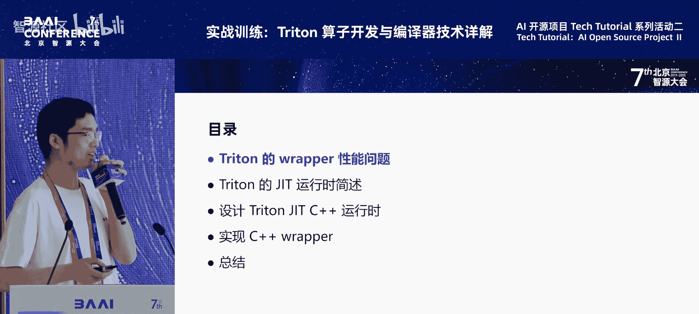
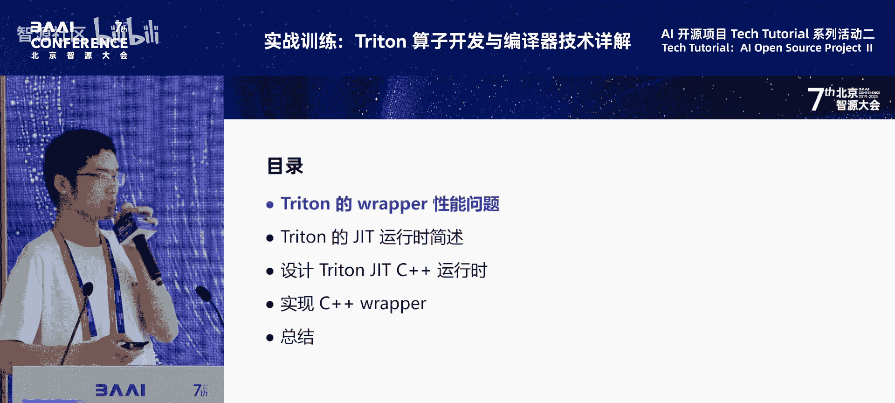
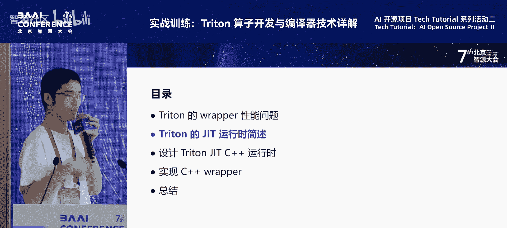
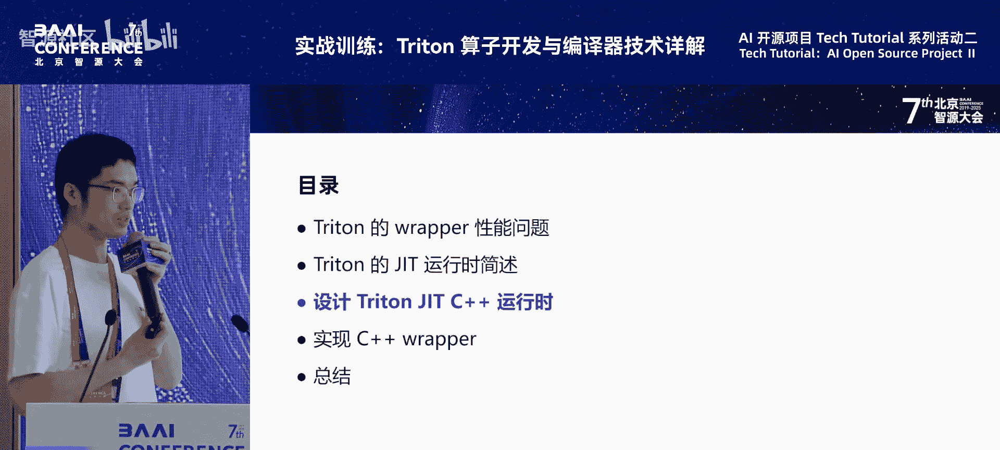
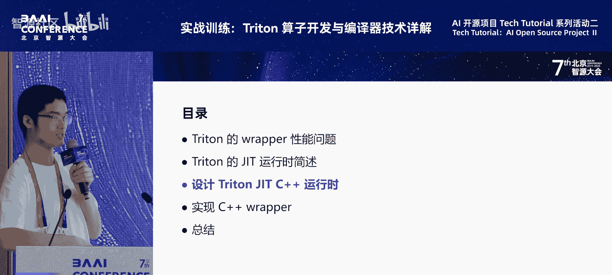
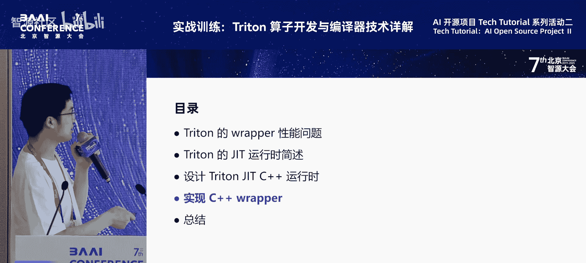

# 特色活动：AI-开源项目-Tech-Tutorial-系列活动-p06-FlagGems-算子运行时优化实战：陈飞宇

## 概述

在本节课中，我们将学习如何优化使用 Triton 语言编写的 GPU 算子在 CPU 端的运行时开销。我们将分析原生 Python 运行时包装器（Wrapper）的性能瓶颈，并探讨如何通过将运行时和包装器迁移到 C++ 来实现显著的性能提升，从而减少 CPU 处理时间，让 GPU 更高效地执行计算。





---

## Triton 算子的运行时开销：Wrapper 问题

首先，我们需要理解 Triton 算子的基本结构和潜在的性能问题。

Triton 是一种基于 Python 的嵌入式领域特定语言（DSL）。开发者使用 `@triton.jit` 装饰器来编写核心计算函数（Kernel）。这个 Kernel 代码会被专门的 Triton 编译器编译，然后在 GPU 上执行。

然而，为了在 Python 中方便地调用这个 Kernel，通常需要编写一个 Python 包装器（Wrapper）。这个包装器负责处理输入检查、输出内存分配、启动参数计算等准备工作。其调用流程可以概括为：

```
Python 程序 -> Python Wrapper -> Triton 运行时（Python） -> 编译/缓存 Kernel -> 启动 GPU Kernel
```

**问题在于**：如果主机（Host）端的 Python 程序执行缓慢，即使 GPU Kernel 本身非常快，整体性能也会被拖慢。包装器和运行时在 Python 层的每一层调用都可能引入不可忽略的开销。

### GPU 执行与 CPU 调度的间隙

理解 GPU 的异步执行机制对分析性能瓶颈至关重要。

*   GPU Kernel 的启动（`launch`）是异步的。CPU 线程发出启动指令后，Kernel 被放入 GPU 的工作队列，CPU 线程就可以立即返回去做其他事情。
*   GPU 会按顺序执行队列中的 Kernel。

这里会出现两种情况：

1.  **Kernel 执行时间长**：如果 Kernel 本身计算量很大，执行时间远长于 CPU 准备和启动下一个 Kernel 的时间（即 Wrapper 执行时间），那么 GPU 可以持续工作，执行间隙很小。
2.  **Kernel 执行时间短**：如果 Kernel 本身很小，执行时间很短，而 CPU 端的 Wrapper 准备时间很长。那么当一个 Kernel 在 GPU 上快速执行完毕后，CPU 可能还在为下一个 Kernel 执行 Wrapper 逻辑，导致 GPU 出现空闲等待。

第二种情况在许多机器学习模型中很常见，因为模型中包含大量小型算子。

### 性能开销实测

以下通过两个简单算子的测试数据，直观展示 Python Wrapper 的开销。

**测试一：Sum 归约算子**
*   **操作**：对一个形状为 `[16, 4096]` 的 FP32 张量沿最后一维进行求和归约。
*   **对比**：使用 PyTorch 原生实现 vs. 使用 Triton 编写并用 Python Wrapper 包装的实现。
*   **结果**：
    *   GPU Kernel 执行时间两者相近。
    *   但两次 Kernel 启动之间的间隔时间（可粗略视为 Wrapper 开销）差异巨大：
        *   PyTorch（C++实现）：约 **17.8 微秒**
        *   Triton（Python Wrapper）：约 **87 微秒**

**测试二：简化版张量加法**
*   **操作**：两个张量相加，省略了类型提升、形状广播和错误检查等所有非核心逻辑，仅分配输出内存并启动 Kernel。
*   **结果**：即使在这种极度简化的最佳情况下，两次 Kernel 启动间隔仍达到 **61 微秒**。这几乎是 Python 层 Wrapper 开销的理论下限。

**在实际模型中的分析**
在 LLaMA3 模型（prompt 长度 10，batch size 1，生成 10 个 token）的推理过程中：
*   总耗时约 480 毫秒。
*   GPU 空闲时间约 179 毫秒，占比很高。
*   GPU Kernel 启动的平均间隔为 27 微秒。
*   模型中大部分 Kernel 的执行时间很短（小于 66 微秒），其数量远超过长 Kernel。这意味着 Wrapper 开销对整体性能的影响是普遍且显著的。



---

## 解决方案：将运行时与包装器迁移至 C++

面对 Python 运行时的高开销，我们有多种思路，例如进行算子融合、使用计算图捕获与重放等图级优化，或进行系统级优化。

然而，作为一个算子库，我们希望提供一种直接的、算子级别的优化方案。核心思路是：**将 Triton Kernel 的包装器（Wrapper）和运行时（Runtime）逻辑用 C++ 重新实现**。

这样做的好处是：
*   **保持开发便利性**：核心计算 Kernel 仍然可以使用接近 Python 语法的 Triton 语言编写和调试。
*   **显著降低开销**：将性能关键的调度逻辑移至 C++ 端，大幅减少 CPU 处理时间。
*   **通用性**：此方案不限于特定框架或库，具有较广的适用性。

---

## Triton 原生 JIT 运行时机制剖析

在动手实现 C++ 运行时之前，我们必须先理解 Triton 原生的即时编译（JIT）运行时是如何工作的。

Triton 的 JIT 过程涉及两个主要部分：**运行时（Runtime）** 和 **编译器（Compiler）**。

```
[Python 程序] -> [Triton 运行时 (Python)] -> [Triton 编译器] -> [GPU Kernel 执行]
```

**运行时的职责**：
1.  **特化（Specialization）**：一个 `@triton.jit` 装饰的函数并非完整的可执行体。它需要结合运行时传入的**参数类型**、**常量参数的值**以及一些**编译时常量**（如指针是否对齐、特定整数值是否为1等）才能确定最终需要编译的 Kernel 形态。这个过程称为“特化”。
2.  **参数分发**：区分哪些参数是传给编译器的常量，哪些是传给 Kernel 的变量，哪些需要用于特化。
3.  **缓存管理**：维护一个缓存（Cache），将已编译的 Kernel（根据特化信息生成）存储起来，避免重复编译。
4.  **启动 Kernel**：收集 Kernel 函数指针、参数地址、启动配置（网格大小、共享内存等），并通过 CUDA Driver API 启动 Kernel。





**编译器的职责**：
1.  接收运行时发来的特化信息。
2.  将 Triton Kernel 代码编译为目标后端（如 PTX）的二进制代码。
3.  自身也维护一个文件系统级别的缓存，避免相同特化信息的重复编译。

**关键概念：参数分发规则**
每个 Triton 函数的参数都有特定的行为，规则如下：
*   `constexpr`：常量参数，仅用于编译期，不传递给 Kernel。
*   非常量参数：
    *   `do_not_specialize`：其值不影响 Kernel 生成，直接传递给 Kernel。
    *   需要特化的参数（如 `int`，指针）：
        *   对于 `int`：检查其值是否为 1，或是否能被 16 整除。这些条件可能影响生成的 Kernel 代码（例如，是否使用向量化指令）。
        *   对于指针：检查其地址是否对齐到 16 字节，这可能影响内存访问指令的选择。

---

## 设计并实现 C++ 运行时

理解了原生机制后，我们开始设计 C++ 运行时。首先明确目标：我们希望提供一个易用的 C++ 接口，同时能复用 Triton 现有的编译器及其缓存机制。

### 目标接口设计

假设我们要实现一个张量加法算子，希望在 C++ 中这样使用：

```cpp
// 1. 定义 Triton 函数实例（指定 Kernel 源码路径和函数名）
auto add_kernel = TritonFunction("path/to/kernels.py", "add");
// 2. 准备参数并执行
add_kernel(stream, grid, block, tensor_a, tensor_b, output_tensor);
```

### 核心架构

我们的 C++ 运行时架构模仿了原生设计，分为两层：

1.  **`TritonFunction` 类**：对应 Python 端的 `triton.jit` 函数。它是通用的，通过 C++ 模板支持任意数量和类型的参数。其核心职责是：
    *   管理一个 **Kernel 缓存**。
    *   根据传入的运行时参数，计算特化 Key。
    *   若缓存未命中，则调用编译器进行 JIT 编译。
    *   执行参数分发逻辑，区分编译期和运行期参数。
    *   获取编译好的 `TritonKernel` 实例并启动。

2.  **`TritonKernel` 类**：对已编译的 GPU Kernel 二进制码的轻量级封装。主要负责调用 CUDA Driver API 来启动 Kernel。

### 关键技术点

*   **复用编译器**：我们通过一个独立的 Python 脚本来调用原生的 Triton 编译器，而不是重写编译逻辑。C++ 运行时通过嵌入 Python 解释器来执行这个脚本。由于编译不频繁，此开销可接受。
*   **通用函数类**：使用 **C++ 可变参数模板** 来实现 `TritonFunction` 类，使其能够接受任意签名。这样就无需为每个不同的 Triton Kernel 创建子类。
*   **参数分发实现**：在 `TritonFunction::operator()` 内部，使用 **C++17 的折叠表达式** 遍历所有参数，并根据预定义的规则（通过另一个 Python 脚本从 Kernel 源码中提取）将它们分别归类到“特化 Key 列表”和“Kernel 调用参数列表”中。
*   **签名提取**：每个 Triton Kernel 的参数分发规则（签名）是静态的。我们通过一个 Python 脚本在运行时分析 Kernel 源码，提取这些规则并传递给 C++ 端。

### 集成到 PyTorch

要将优化后的算子集成到 PyTorch 中，需要：
1.  用 C++ 实现算子的包装器，内部使用我们的 `TritonFunction`。
2.  使用 PyTorch 的 `TORCH_LIBRARY` API 将算子注册到 PyTorch 的调度系统中。
3.  为算子实现元数据函数（如形状推导），以确保能被 PyTorch 的自动微分等功能正确使用。
4.  将 C++ 代码编译为动态库（`.so` 文件），在 Python 中加载即可使用。



---

## 性能验证

我们对比了多种实现方式的运行时开销（两次 Kernel 启动间隔）：

| 测试场景 | 描述 | 间隔时间 (微秒) |
| :--- | :--- | :--- |
| **基线1** | PyTorch 原生算子 (C++测试) | ~14 |
| **基线2** | PyTorch 原生算子 (Python测试) | ~17 |
| **优化前** | Triton Kernel + Python Wrapper (Python测试) | ~61 |
| **优化前+** | 上述算子注册到 PyTorch Dispatcher | ~140 |
| **优化后** | Triton Kernel + C++ Wrapper/Runtime (C++测试) | ~14 |
| **优化后+** | 上述算子注册到 PyTorch Dispatcher | ~24 |

**结论**：
*   使用纯 Python 的 Triton Wrapper 开销很大（61微秒），注册到 PyTorch 后进一步增加（140微秒）。
*   使用我们实现的 **C++ 运行时和包装器后，开销降至与 PyTorch 原生 C++ 算子相当的水平（14微秒）**。
*   即使再将这个 C++ 实现注册到 PyTorch Dispatcher，增加的开销也很小（仅增至24微秒），远低于 Python 方案。

这证明了将 Triton 算子的运行时迁移到 C++ 是优化小算子性能的有效手段。

---

## 总结

本节课我们一起学习了 Triton 算子运行时优化的实战方法。

1.  **问题定位**：我们分析了 Triton 在 Python 端的运行时包装器是导致小算子性能瓶颈的关键，它会在 GPU 执行间隙引入数十微秒的 CPU 开销。
2.  **原理深入**：我们剖析了 Triton 原生 JIT 运行时的机制，包括特化、参数分发和缓存管理，这是实现替代方案的基础。
3.  **方案设计**：我们提出了将运行时和包装器迁移至 C++ 的核心方案，并设计了 `TritonFunction` 和 `TritonKernel` 两个核心类，利用 C++ 模板和 Python 嵌入技术，在保持开发便利性的同时复用原有编译器。
4.  **效果验证**：性能测试表明，该方案能将运行时开销降低到与 PyTorch 原生 C++ 算子同等的水平，显著提升了端到端的执行效率。

这种方法为需要高性能 Triton 算子的场景提供了一条可行的工程化路径。未来，此运行时框架可以进一步扩展以支持更多的后端硬件。