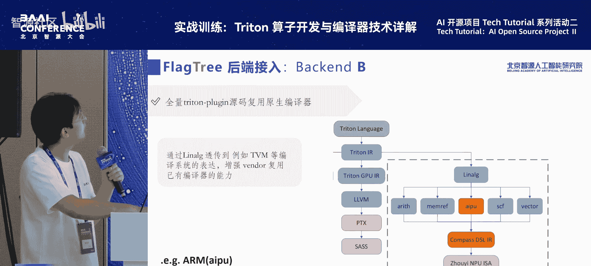
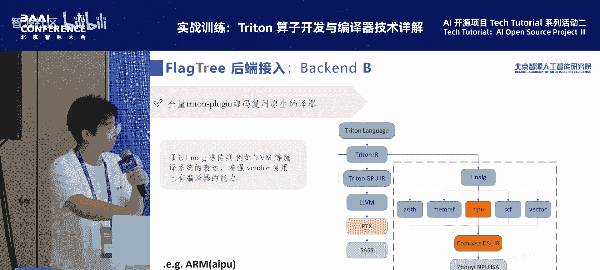
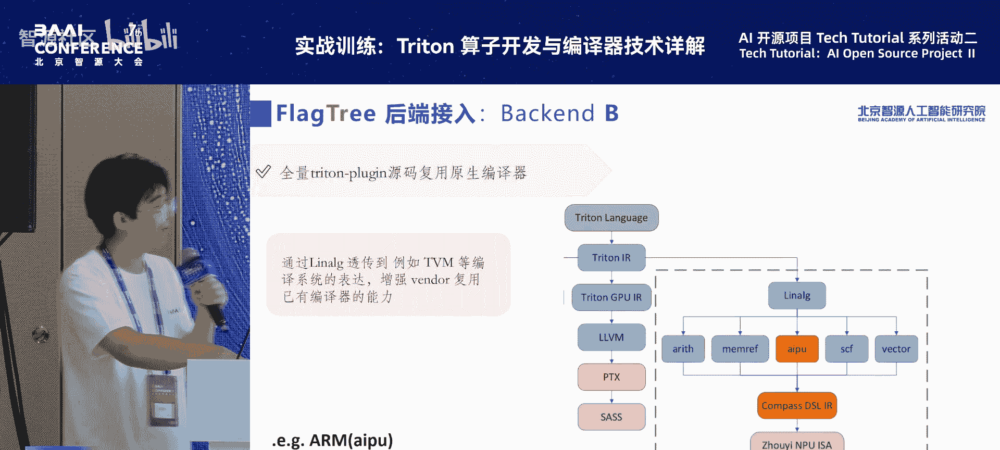

# 特色活动：AI-开源项目-Tech-Tutorial-系列活动-p07-FlagTree-多后端统一编译器设计：郑-杨-杨锐林

在本教程中，我们将学习智源研究院AI编译研发工程师杨锐林分享的FlagTree多后端统一编译器的设计理念。我们将了解FlagTree是什么、AI芯片如何接入、基于Triton-Shared的FIR层优化以及项目的未来愿景。

## 什么是FlagTree？🤔

FlagTree是基于OpenAI Triton项目进一步发展和延伸出的一个编译器项目。其关键在于扩展了两方面的内容。

第一部分是针对Triton原生多后端能力支持不足的局限性，我们以拓展其多后端能力为基座。

第二部分是在各种后端的抽象层面上，我们会统筹各种芯片的通信与特性，做进一步的上层次优化。这一层次的优化会体现在FIR（Flag Intermediate Representation）这一中间层上。

FlagTree的整体规划分为两步走。第一步是实现快速对接，使能各种各样的异构设备，初步释放各种异构设备的算力。第二步是基于各种异构设备的特性，抽象出其通信模式，统筹各种AI芯片的通信与特性，在FIR中间层做进一步的深度优化，以达到进一步压榨算力的目的。

## FlagTree的定位与发展规划 🗺️

FlagTree是FlagO以及智源面向多种AI芯片的系统软件中的关键一环，处于整个FlagO的基座环节。从宏观视角看，FlagO在多种芯片软件栈的构建过程中起到承上启下的作用。向下，它会管理各种各样的AI芯片，使算力得到最大释放。FlagTree则是FlagO内部，对接各种AI芯片的第一道门。

FlagTree的发展规划如下：项目于2024年11月立项，到2025年3月发布了开源的单版本多后端V0.1版本。在智源大会同期，发布了V0.2版本。计划在2025年底正式发布FlagTree V1.0性能提升版本。该版本将全面建成多后端统一基座，最大化利用多后端能力，并在FIR中间层做更多基于AI芯片通信的优化。

下图展示了从FlagTree 1.0版本到Next版本的演进迭代。1.0版本全面使能多后端能力。Next版本则进一步基于硬件抽象的通信扩展，拓展其通信和特性。



针对FlagTree的0.1版本，由于现有不同厂商的Triton兼容模式较为发散，因此0.1版本会兼容现有的适配方案，在其代码库上形成统一。在短期内（即2025年底前），将全面实现单仓库多版本的多后端支持。

基于要解决的问题，FlagTree有三个重要特性：
1.  **兼容主流编译路径**：我们发现，现在不同厂商接入Triton的主流编译路径有两种。第一种是基于Triton GPU Dialect，第二种是基于LLVM Dialect。FlagTree会兼容这两条编译路径。
2.  **接入形式灵活**：在某些厂商接入FlagTree的过程中，可能存在专利或知识产权敏感问题。为解决这类问题，我们允许厂商将敏感代码以二进制文件（例如`.so`动态库）的形式进行脱敏，进而接入FlagTree，并进行端到端的编译。
3.  **架构插件化设计**：FlagTree支持高度差异化的模块，相关芯片平台可自行维护该模块，使之拥有快速验证与跨平台编译的能力。

在FlagTree的Next Version版本上，我们预计提供三个主要特性：
1.  **提供多种接入范式**：新增FLIR仓库，即基于Triton-Shared开发的中间层仓库。该仓库是基于LLVM Dialect的扩展。
2.  **统筹异构编程接口**：通过兼容式的扩展语言层添加指导信息，以提高性能。例如支持DMA以及Shared Memory的硬件感知型优化。
3.  **需求侧导向的技术攻关**：针对从模型侧或算子侧等需求侧传导的重点算子性能开展技术攻关，并推广到其他芯片后端进行借鉴优化。

## AI芯片接入范式 🔌

上一节我们介绍了FlagTree的宏观特性，本节中我们来看看不同的厂商在具体实施上如何接入FlagTree。

在此之前需要说明，因为这是一个Tutorial，不同厂商接入FlagTree后，绝大多数都会进一步接入FlagJams。在工程实践中，这两个环节是分不开的。因此，我也会简单介绍一下FlagJams的多后端接入方式。

在FlagJams这一层，我们在通用标准库及通用算子实现的基础上，增加Load等管理层。这些管理层向下会进一步管理各个厂商异构的包括像FLIR以及Window Specialized的特性。这些进一步的Pass以及一些通用OP会透传到FlagTree这一层。

FlagTree的多后端，实际上是在FLIR这一层做了两条路径的兼容。FlagTree与FlagJams是联动建设关系。

在FlagJams这一层的多后端有如下几个特性：
1.  **兼容不同版本**：能够兼容不同厂商的Triton版本，使异构芯片的部署实现灵活化、敏捷化。
2.  **跨方式一体衔接**：统筹敏捷开发与高效维护。
3.  **定制调优空间**：定制启发式算法以及厂商侧优化的算子实现。

下图展示了从FlagJams到FlagTree的结构化视角。从上到下，FlagJams通过中间管理层（如DS Detector）调用并管理各种不同芯片厂商的后端，包括配置和特化的算子实现。这些特化模块加上通用的OP实现，会进一步调用到FlagTree的最终实现中。



以FlagTree的结构视角来看，需求导向是从FlagJams上层下来的Kernel会透传到FlagTree里，进行进一步的多后端适配。FlagTree的多后端适配主要有两个大的抽象方面：
1.  在通用的IR Module里增加FLIR中间层。这一层会做各种硬件的通用性设计，将通信统一起来。
2.  这些通信会传导到Specialized Part下面，即完全针对特定硬件的异构特性。

这两部分联合起来，就会产生一个多后端的FlagTree版本。


FlagTree的多后端在FLIR这一层主要有三个核心关键点：
1.  **允许注释嵌入**：允许程序员通过注释嵌入的方式提示优化信息，这对程序员友好。在编码时，可以以`# hint`注释的形式透传一些Attribute到编译器，做进一步优化。
2.  **增强性能改进**：这是第一部分的延续，针对进一步到Pass里的描述进行优化。
3.  **保持可预测性**：保持性能和编译的可预测性。

接下来，我们将基于前面宏观的结构化展示，进一步介绍如何进行具体接入的实施。




FlagTree代码核心的多后端设计接入原则分为两个部分：
1.  Triton Plugin源码结合二进制混合接入。
2.  全量Triton Plugin源码标准接入。

第一部分“混合接入”又分为两个子类：
*   **部分Triton Plugin源码完全透传至MLIR系统**：这主要体现在两个部分。一是硬件相关度较高的模块，可以以动态库的形式调用，适用于知识产权或硬件信息敏感的厂商。二是其余模块在Specialized Part下提供部分Plugin代码。典型代表是天数和沐曦。
    
*   **全量Triton Plugin源码复用原生编译器**：这部分的典型代表是Graphcore的IPU后端。通过LLVM透传到例如TVM等编译系统的表达，以增强复用已有编译器的能力。适用于那些在接入前已通过其他编译路径（如TVM）做了大量优化的厂商，可以减少资源和人力的投入。

第二部分“标准接入”是指全量Triton Plugin源码的标准接入。这部分保持与Triton官方相对一致的方式，在`third_party`下提供Compiler Driver以及Specialized MLIR Module等全量Plugin源代码进行接入。典型代表是华为的昇腾。

## 基于Triton-Shared的FIR层优化 ⚙️

上一节我们介绍了AI芯片如何接入FlagTree，本节中我们来看看FlagTree在FIR（Flag Intermediate Representation）中间层所做的优化工作。

这部分优化是通过扩展一个`FlagHint`实现的。`FlagHint`实际上是一个Notation Comment，在Triton前端层体现为注释形式。基于这种形式，我们可以做一些性能指导的扩展。

具体流程如下：在前端（Triton Language层），基于注释进行扩展。开发人员在注释时使用`FlagHint`关键字进行用户提示。接着，它会透传到Triton IR层去扩展相应的Attribute。再下一步，就会扩展到FIR层，基于透传下来的Attribute模式设计各种优化扩展Pass来进行进一步支持。

从设计理念上讲，分为前端、终端和后端三个部分：
*   **前端**：通过扩展Triton IR Parser去解析`FlagHint`到MLIR的Attribute里。
*   **终端**：设计各种各样的优化Pass，以充分利用不同Attribute的优化范式。
*   **后端**：进行有选择性的Vendor Specialized注册。

接下来，我们详细看一下在全单语言层的扩展。我们的语法是以`# hint`等字段提示开发者使用该注解。具体表现形式如下，开发人员可以编写这样的注释以进行进一步的能力指导：

```python
# 示例：使用FlagHint进行优化提示
def kernel():
    # hint: pipeline_stage=2
    # hint: n_way_shared_memory=4
    ...
```

这一部分也给了用户两条可选路径：
1.  **Vendor Specialized Hint**：带有Vendor特性的前缀，例如`n_way_shared_memory`。
2.  **架构无感Hint**：无前缀的Hint，例如`pipeline_stage=2`。

在AST（抽象语法树）层，将上述语言层代码传导到Python Parser解析器后，会进行语法解析和二次正确性验证。正确性验证分为两部分：
1.  如果能验证到其想用的特性Attribute在其他Vendor上也存在，我们会做一个Cross-Vendor的Hint Conversion转化。
2.  如果检测到Hint指导完全错误，我们会Silently Ignore（静默忽略）该提示，以保证能够成功编译。

在Triton IR层，Attribute的插入是以以下形式实现的。它会通过增加一个Hint Attribute到关键的OP（例如Load OP）来进一步扩展Triton IR Dialect。

在中间层（FIR），我们会做一些Pass优化：
1.  添加专用的Pass来解析Hint及其传导。
2.  执行二次性验证。在使用这些硬件信息优化之前，会做二次验证。
3.  如果前两步都没有问题，我们会基于正确的Hint Pass去重写（Rewrite）这些Operation。

## FlagTree的愿景与总结 🌟

最后，我想向大家报告一下FlagTree的愿景与目标。

FlagTree的愿景与目标主要有两点：
1.  **打造更强的编译技术**：通过面向多种AI芯片的统一增强编译器及相关代码工具链仓库，变零散为统一，打造面向多元芯片的AI编译器。同时，聚合各方的研发和创新力量，培育更强的编译技术。
2.  **为用户打造真正统一的编译器**：构建真正统一的代码仓库，使得用户在上层使用时不被各种分散的生态所困扰，为上层用户提供一站式的Triton支持。为上层的算子库、学习框架以及算法开发形成统一的编译器依赖。

我们的项目地址如下，希望有兴趣的伙伴们能够积极贡献代码：
*   GitHub: [https://github.com/FlagOpen/FlagTree](https://github.com/FlagOpen/FlagTree)
*   GitLink: [https://www.gitlink.org.cn/FlagOpen/FlagTree](https://www.gitlink.org.cn/FlagOpen/FlagTree)

---

**本节课中我们一起学习了：**
*   **FlagTree是什么**：一个基于Triton扩展的多后端统一编译器项目，旨在解决原生多后端支持不足的问题，并通过FIR层进行深度优化。
*   **AI芯片接入范式**：介绍了FlagTree与FlagJams的联动，以及源码混合接入、复用原生编译器和标准接入三种具体接入方式。
*   **FIR层优化**：通过引入`FlagHint`注释系统，在前端、终端和后端实现硬件感知的性能指导优化。
*   **项目愿景**：旨在打造更强、更统一的编译技术基座，为多元AI芯片提供一站式支持。

感谢大家的聆听。