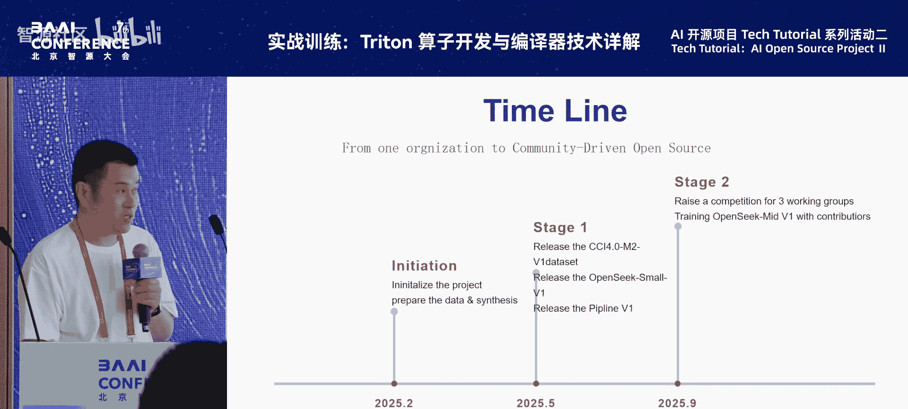
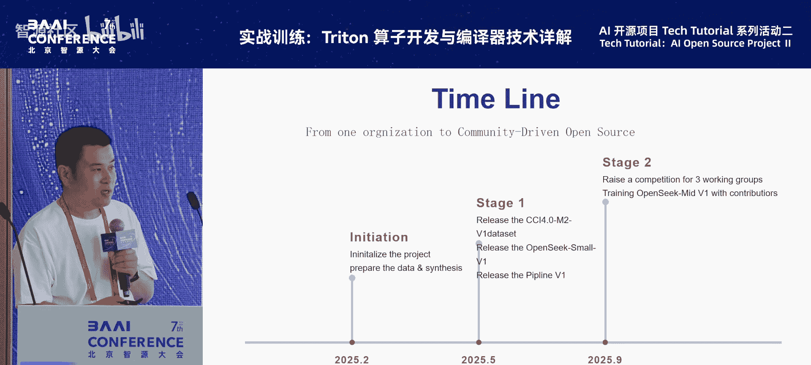
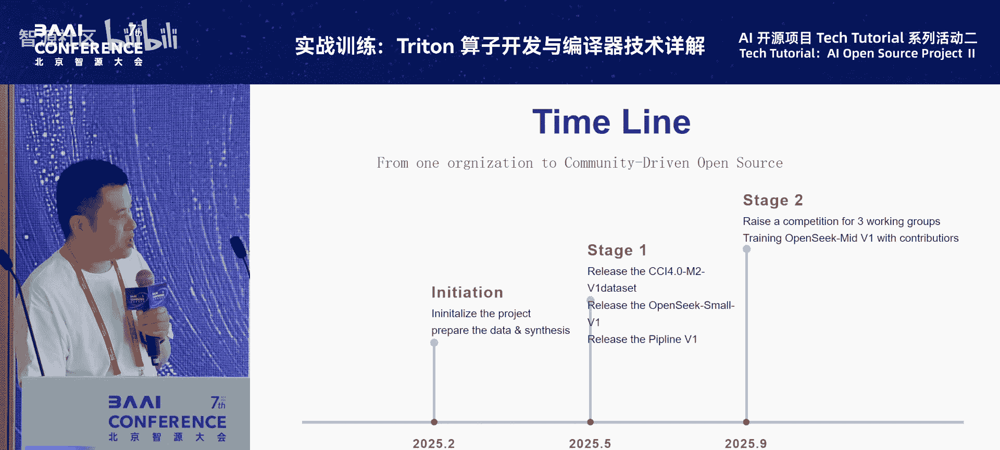
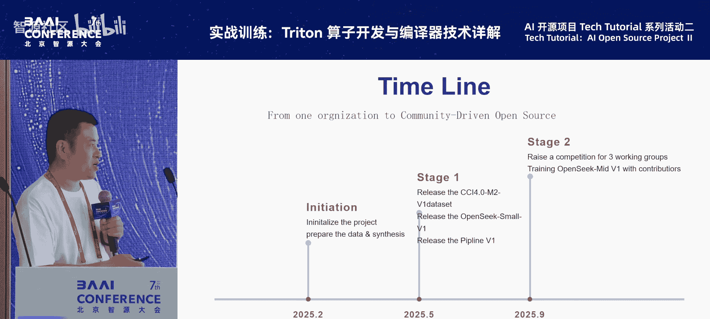
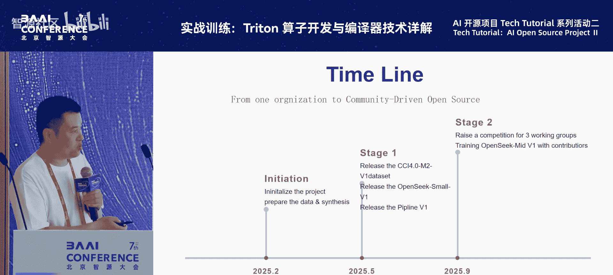

# 特色活动：AI-开源项目-Tech-Tutorial-系列活动-p09-OpenSeek：开源驱动下一代-AI：王良栋

在本节课中，我们将学习智源研究院发布的OpenSeek项目。该项目是一个集算法、数据与系统于一体的开源项目，旨在通过开源协作推动下一代人工智能的发展。我们将重点了解其第一阶段的核心成果：一个高质量的中英双语数据集、一个基于此数据训练的模型，以及一套便于社区协作的实验流程。

## 项目背景与目标

上一节我们介绍了OpenSeek项目的整体定位。本节中，我们来看看项目启动的背景与核心目标。

OpenSeek项目的启动源于对DeepSeek等先进模型成功经验的总结。其成功可归结为三个关键方面的高效性：
1.  **数据高效**：使用相对较小的训练数据量达到更好的效果。
2.  **系统高效**：向开源社区开放了大量架构与算子层面的优化。
3.  **训练策略高效**：在模型训练策略方面做了大量工作。

基于此，OpenSeek项目旨在集合团队自身在语言模型训练、数据集优化及开源工作方面的能力，并联合整个开源社区，共同推进相关工作。项目于年初启动，并已完成第一阶段工作。

第一阶段的主要工作包括以下三个方面：
*   **发布CCR4.0数据集**：一个高质量的中英双语数据集。
*   **发布预训练模型**：基于上述数据集训练的模型。
*   **发布开源协作流程**：一套工具和流程，方便开源贡献者进行实验、提出想法并参与项目共建。

## 核心工作流程与数据构建

上一节我们了解了项目的整体产出，本节中我们将深入其核心工作流程，并重点介绍数据部分的构建。

OpenSeek的工作流程主要围绕三个方向展开：
1.  **众筹数据方向**：构建高质量、多样化的训练数据。
2.  **基础系统方向**：优化训练框架、并行策略等底层系统。
3.  **算法与效果方向**：在优质数据和高效系统上，探索提升模型效果的算法与策略。

其中，数据构建是第一阶段的核心贡献。CCR4.0数据集主要包括两部分：
*   **基础预训练数据**：展示了如何构建、处理、清洗、去重和质量过滤中英双语预训练数据。
*   **思维链数据**：该项目的一大特色，在预训练数据中混合了长链推理数据。

### 基础预训练数据构建流程

以下是构建高质量预训练数据集通常涉及的主要阶段：
1.  **去重**：去除数据源中大量重复的内容。
2.  **质量过滤**：使用分类器过滤低质量数据。分类器的构建有一套逐步迭代的完整流程。
3.  **基础数据合成**：引入一些基础的数据合成方法。
4.  **后处理过滤**：进行例如连贯性等维度的后处理过滤。

OpenSeek团队基于RefinedWeb流程构建英文数据，其特点是采用**多路质量分类器集成**，相比单一过滤器能获得更好的召回率。针对该流程可能过滤掉一些高质量但篇幅较短、导致连贯性差的文档的问题，团队提出了**按领域进行连贯性过滤**的方法。实验表明，经过后处理的数据在模型效果上有所提升。

中文数据的构建仿照了NewCC流程，其核心是训练了**三个不同的质量分类器**（两个基于ChatGLM，一个基于BART）。这些分类器在保持高准确率的同时，能捕捉样本的不同侧面，从而将高质量数据的总体召回率从约40%提升至70%。评测实验显示，随着分类器给出的质量分桶越高，模型在中文评测集上的表现也越好，验证了分类器的有效性。

### 思维链数据构建与验证

思维链数据的引入基于一个观察：尽管预训练语料包含各种领域和类型，但通常缺乏大量显式的、结构化的推理路径数据。在预训练阶段补充此类数据，有助于提升模型的长链推理能力天花板。

构建流程如下：
1.  从外部网页中筛选高质量部分（如数学、代码、百科、学术论文）。
2.  对文档进行章节划分。
3.  借助大语言模型，尝试恢复和补充文档形成的中间推理步骤。例如，对于一篇文章，恢复其写作提纲和段落演进逻辑；对于一个数学题，恢复其解题步骤。

为了验证引入思维链数据的好处，团队进行了多组实验：
*   **能力增长实验**：对比有/无思维链数据训练的模型，在长链推理任务上的能力随训练量增长的情况。结果显示，含有思维链数据的模型能力增长斜率更高。
*   **数学能力实验**：在数学数据上，显示加入思维链的合成方式，比仅加入原始文本或问答对进行SFT，能带来更大幅度的效果提升。
*   **训练稳定性实验**：借鉴相关研究，验证在基础模型上增量训练自研的思维链数据，有助于提升后续SFT和RLHF阶段在长链推理任务上的训练稳定性和最终效果。

## 算法探索与模型效果

上一节我们详细介绍了数据部分的构建与验证。本节中，我们来看看在算法和模型结构方面进行的探索。

在算法层面，OpenSeek团队探索了在DeepSeek-V3架构及自有数据集上的一些实验。

首先是**数据配比实验**。数据集中包含原始网页、抽取的知识、改写的QA以及合成的数据。团队参考相关研究设置了配比策略，例如提升知识类和改写类数据的比例，并对合成的思维链数据进行10倍上采样。实验证明，该策略比不做调整的效果更好。

其次是针对**细粒度专家模型**的关键参数实验。研究发现，以下参数对效果影响较大：
*   所有权重初始化的标准差。
*   路由器选择专家时的计算精度。
*   辅助损失系数的精细调节。

此外，团队也验证了在非MoE的稠密模型中加入**注意力门控机制**，同样有利于训练效果。将所有这些策略打包应用后，模型在平均指标上获得了较大幅度提升。这也部分揭示了DeepSeek-V3效果出色的原因——其在训练策略和结构参数上做了大量细致的探索。

基于优质数据和算法探索，团队训练了一个总参数量1.4B、激活参数量0.4B的小型MoE模型。尽管训练量较小，但其效果已与某些更大规模的模型接近，呈现出较高的训练效率。同时，团队还发布了一个训练了100B token的Small V1模型作为基线，用于后续实验和社区共建。

## 开源协作与参与方式

前面我们介绍了OpenSeek在数据和算法上的工作。本节中，我们来看看项目如何促进开源协作，以及开发者如何参与。

OpenSeek发布开源流程的核心目的是：开放所有代码和训练数据，使社区能够快速复现基线结果，并尝试数据配比、训练策略或模型结构等方面的改进。开发者可以通过效果对比和终端评测，将优秀的方案反馈给项目，实现深度协作。

具体参与方式如下：

团队提供了基于`FlexSeek`工具的实验流程，该工具使得进行算法实验非常便捷，主要修改两个配置：
1.  **实验配置**：修改运行时资源等设置。
2.  **训练配置**：修改数据配比、模型参数等。

以下是快速开始的步骤：
1.  **获取基础环境**：从Docker Hub或阿里云获取项目提供的镜像。
2.  **下载代码与数据**：将`FlexSeek`或`OpenSeek`代码库克隆到本地，并从魔搭社区或智源平台下载开源的100B token训练数据。
3.  **复现基线**：按照指南，可以轻松复现提供的基线模型。

开发者或竞赛参与者可以在此基础上进行多种尝试，例如：
*   **调整数据配比**：修改配置文件中不同数据源的百分比权重。
*   **尝试新算法**：调整模型超参数组合，或自行添加新模块以提升效果。

此外，OpenSeek也与相关算法大赛合作，设立了多个赛道，鼓励社区在数据配比、数据课程学习策略、系统效率与算子优化等方面进行创新。

## 总结与资源

本节课中，我们一起学习了智源OpenSeek开源项目的核心内容。

我们首先了解了项目旨在通过开源协作，整合算法、数据、系统三方优势来驱动AI发展。随后，我们深入探讨了其第一阶段的核心成果：**CCR4.0数据集**的构建细节，特别是其基础数据处理流程和创新的**思维链数据合成与验证**。接着，我们学习了项目在**模型算法与训练策略**上的探索，以及取得的初步模型效果。最后，我们介绍了项目为促进**开源协作**所提供的完整工具链、数据和参与方式。

OpenSeek项目是智源“FlagOpen”开源体系的一部分，其基于底层优秀的开源工具，支撑上层模型的训练与创新。

**项目资源**：
*   项目GitHub主页：`https://github.com/FlagOpen/OpenSeek`
*   可通过该链接获取代码、文档并参与社区贡献。

---
**本节课中我们一起学习了**：OpenSeek项目的目标、其高质量中英双语数据集的构建方法、思维链数据的价值与验证、在模型训练算法上的探索，以及如何利用其开源工具链参与项目共建。