# 特色活动：InnoVibe共创场-p02-大语言模型训练后优化技术研究：帖桂尧

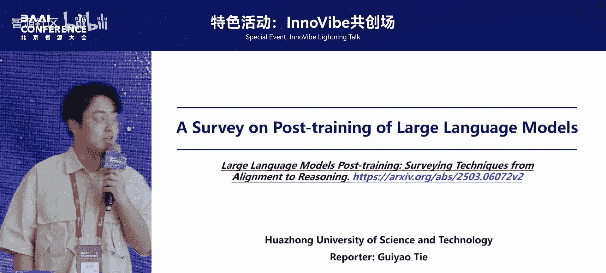

在本节课中，我们将系统性地学习大语言模型训练后优化的核心技术。训练后优化是将通用大语言模型转化为专业化、实用型模型的关键步骤，其应用范围从专业提示工程到日常交互，无所不包。

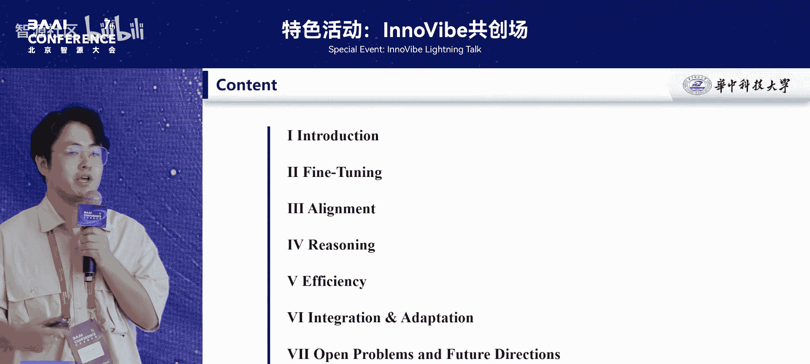

我们将从技术分类和应用领域两个维度，对训练后优化技术进行概览，并梳理其发展脉络。

## 技术分类概览

从技术角度看，训练后优化主要分为五大类：**微调**、**对齐**、**推理增强**、**效率优化**以及**集成与适应**。

## 应用领域概览

从应用领域看，训练后优化覆盖了七种主要类型：**对话**、**逻辑推理**、**代码生成**、**数学计算**、**知识问答**、**创意写作**以及**工具使用**。

训练后优化技术的发展非常迅速。从2018年到2022年，我们见证了BERT、GPT等“预训练+微调”范式模型的崛起。随着RLHF技术的成熟，出现了ChatGPT等具有影响力的模型。从2022年开始，研究重点逐渐转向深度推理，涌现出大量思维链和多模态模型。特别是今年初，Sora等模型的发布也带动了混合专家模型架构的兴起。

上一节我们介绍了训练后优化的整体概况，本节中我们来看看具体的核心技术——**监督微调**。

## 监督微调

监督微调是最常见的训练后优化方法。其流程通常是：首先获取一个预训练的基础大语言模型，然后使用高质量的示例数据集对其进行微调。

以下是监督微调的核心步骤：
1.  **获取预训练模型**：例如，GPT、LLaMA等基础模型。
2.  **准备数据集**：数据集通常由高质量的问答对或“指令-响应”对构成。
3.  **执行微调**：在数据集上对模型进行有监督的训练。

其主要目的是引导通用语言模型向特定领域的专业化模型转化。公式可以简化为：
`微调后模型 = 预训练模型 + Δ参数（通过SFT学习得到）`

接下来，在监督微调之后，我们常常会使用**强化学习微调**来对模型进行更深层次的优化。

## 强化学习微调

强化学习微调通常在监督微调之后进行。其核心思想是：利用强化学习算法，基于SFT模型生成的响应，设计奖励目标来进一步优化模型策略。

以下是其典型流程：
1.  **基于SFT模型生成**：模型针对输入生成多个可能的响应。
2.  **设计奖励函数**：根据响应质量（如相关性、安全性、有用性）计算奖励。
3.  **策略优化**：使用强化学习算法（如PPO）更新模型参数，以最大化期望奖励。

对齐是强化学习微调的一个重要目标，其中最具代表性的工作是**基于人类反馈的强化学习**。

## 对齐

在模型对齐领域，基于人类反馈的强化学习是一项关键工作。人类在其中扮演核心角色，例如对不同模型的输出进行排序以提供偏好反馈。

以下是RLHF的关键步骤：
1.  **收集人类偏好数据**：人类评估员对模型的不同输出进行排序。
2.  **训练奖励模型**：利用人类偏好数据训练一个奖励模型，使其能够预测人类偏好。
3.  **强化学习优化**：使用训练好的奖励模型作为奖励信号，通过强化学习优化语言模型。

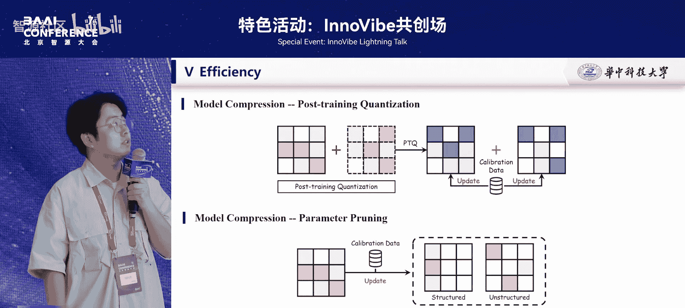

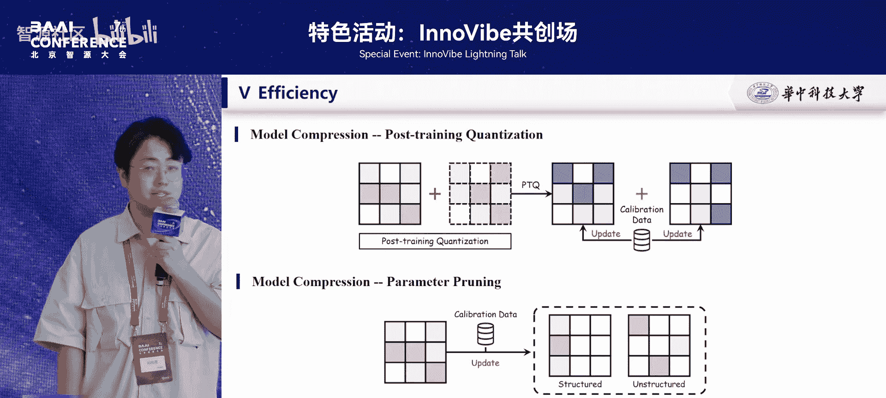

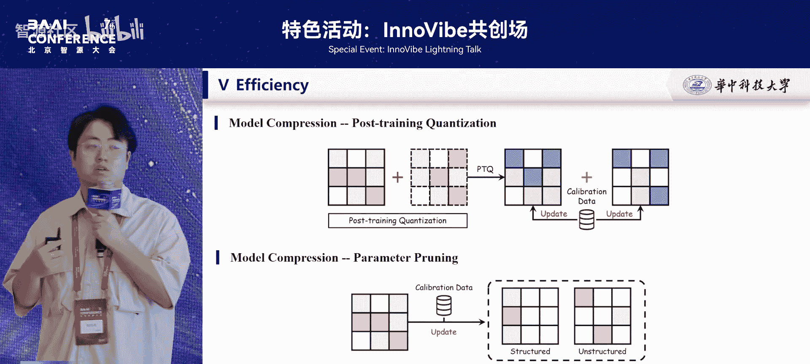

除了RLHF，**直接偏好优化**是一种更简洁的方法。DPO无需显式训练一个额外的奖励模型，它直接使用偏好数据对来优化策略模型。

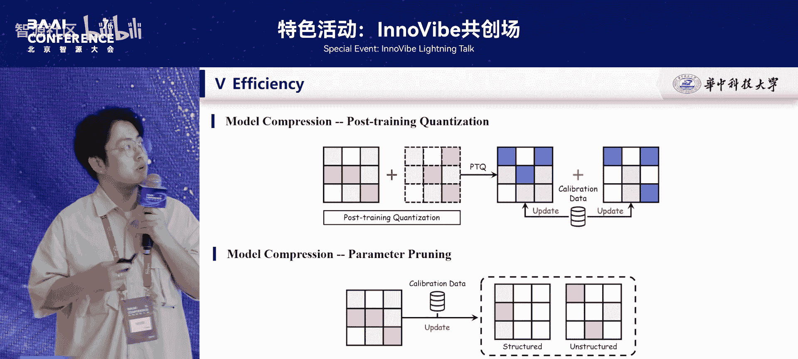

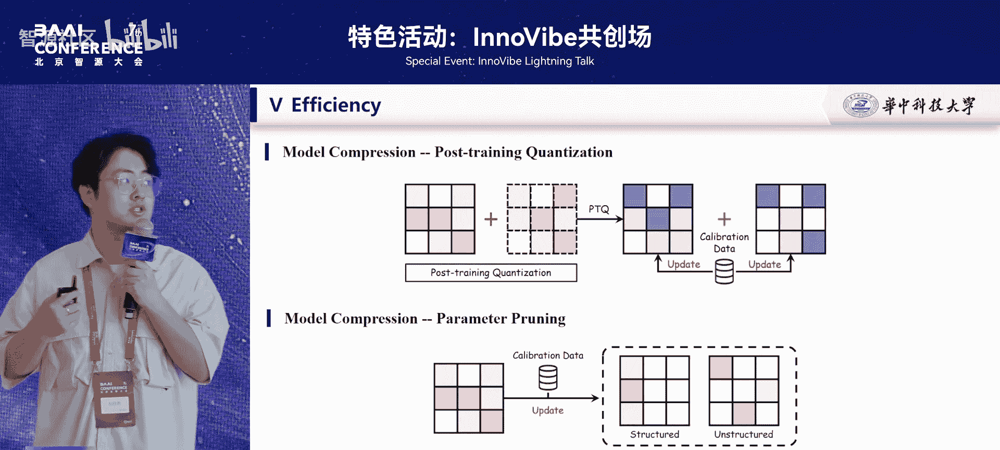

DPO的核心优化目标可以表示为最大化以下目标：
`L_DPO(π_θ; π_ref) = E_{(x, y_w, y_l)} [log σ(β * (log π_θ(y_w|x) - log π_ref(y_w|x)) - β * (log π_θ(y_l|x) - log π_ref(y_l|x)))]`
其中，`π_θ`是待优化的策略模型，`π_ref`是参考模型（通常是SFT模型），`y_w`和`y_l`分别是偏好对中的优选和劣选响应。

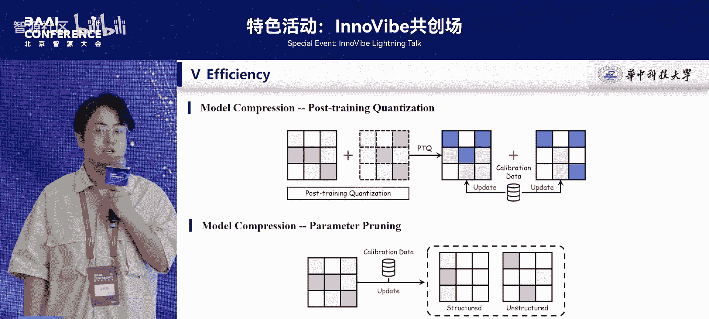

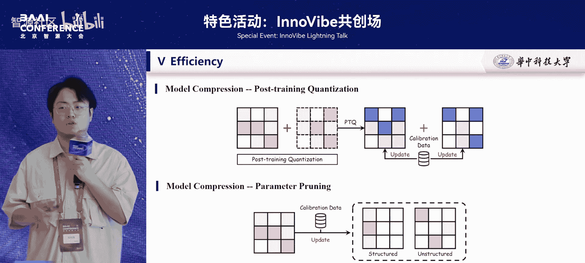

在对齐模型使其符合人类价值观之后，提升模型的**推理能力**成为当前及未来的重要研究方向。

## 推理增强

推理增强旨在提升模型解决复杂问题的能力。我们将其总结为四种主要类型：

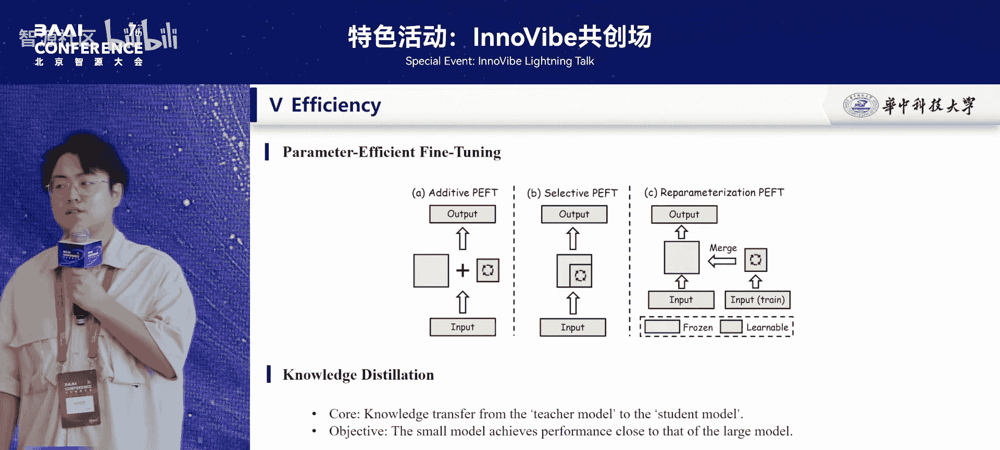

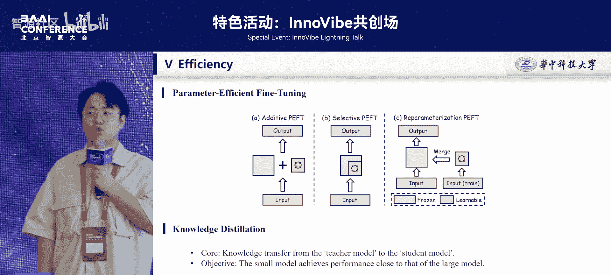

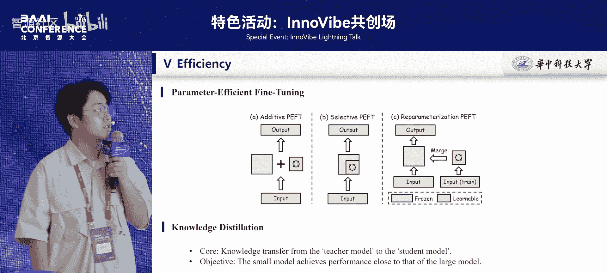

以下是推理增强的四种范式：
1.  **内部自省**：语言模型评估自己的输出，根据自身知识和推理能力进行迭代优化。例如，Chain-of-Thought。
2.  **外部自省**：模型利用外部工具（如搜索引擎、计算器）检索或处理信息，并将反馈融入优化过程。
3.  **内部自省微调**：使用特定数据对模型进行微调，使其获得更强的内部推理能力。
4.  **外部自省微调**：微调模型以更好地利用外部工具进行推理。

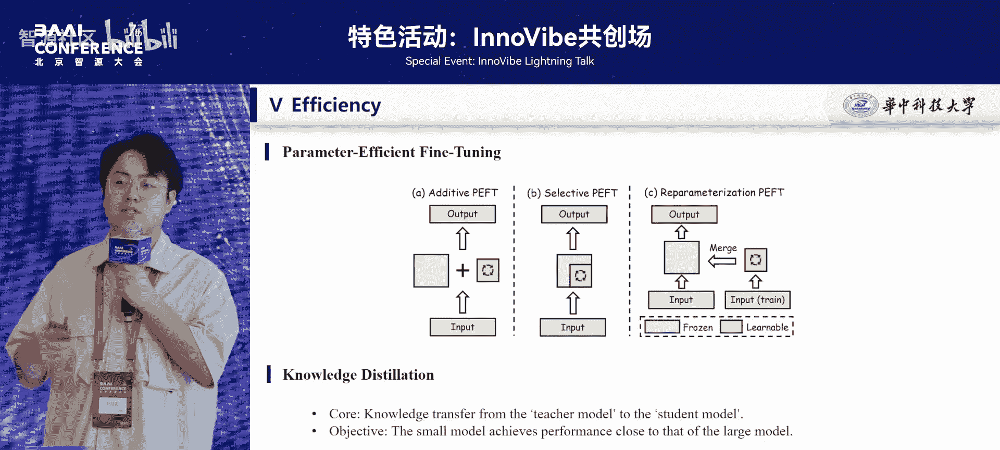

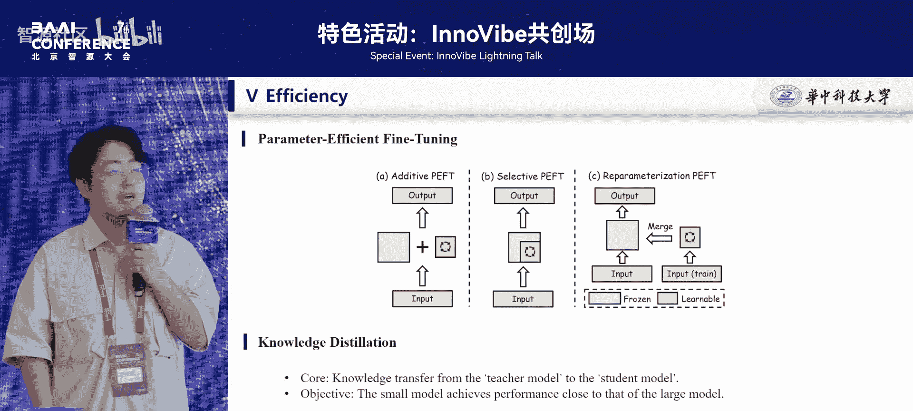

最近，也出现了许多关于自适应思维链和推理增强的新工作。随着模型规模增大，**效率优化**变得至关重要。

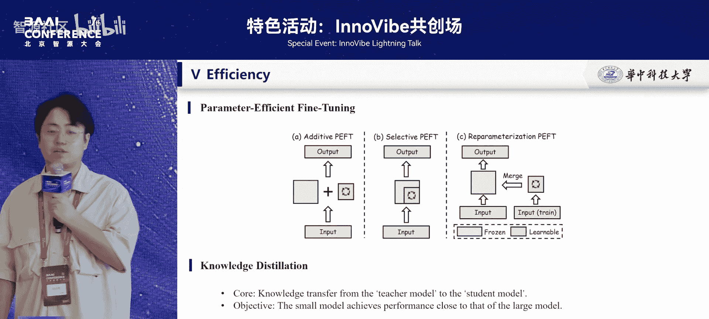

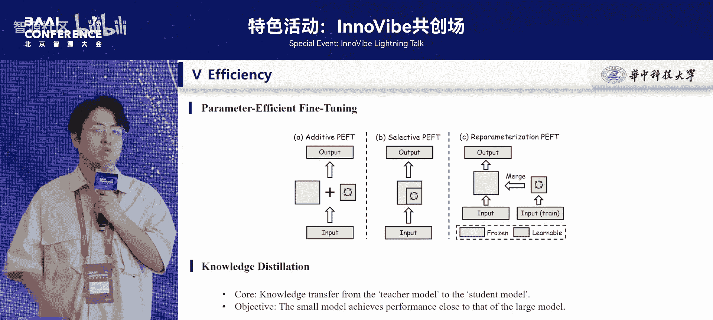

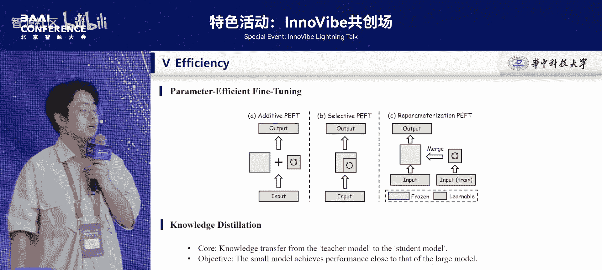

## 效率优化

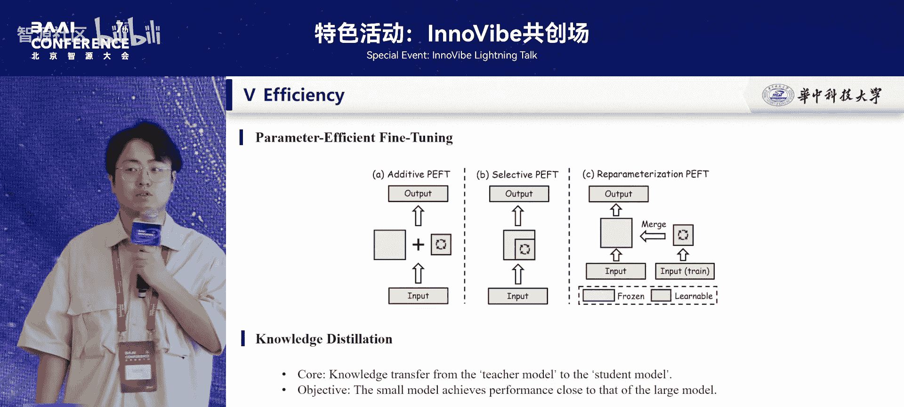

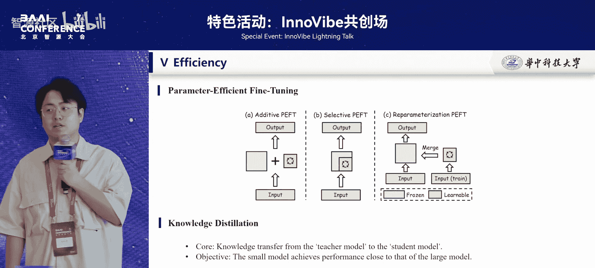

效率优化主要分为三大块：模型压缩、参数高效微调和知识蒸馏。

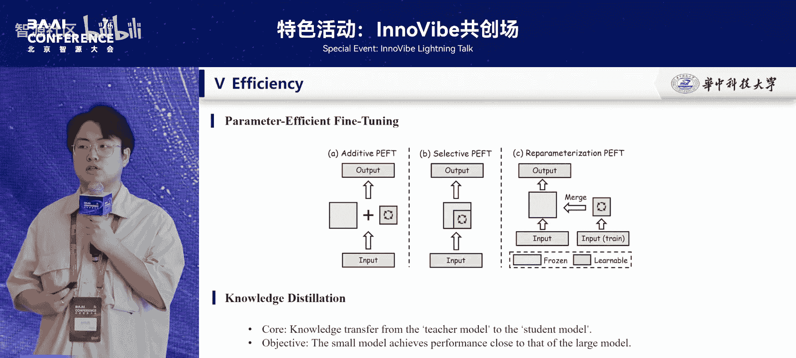

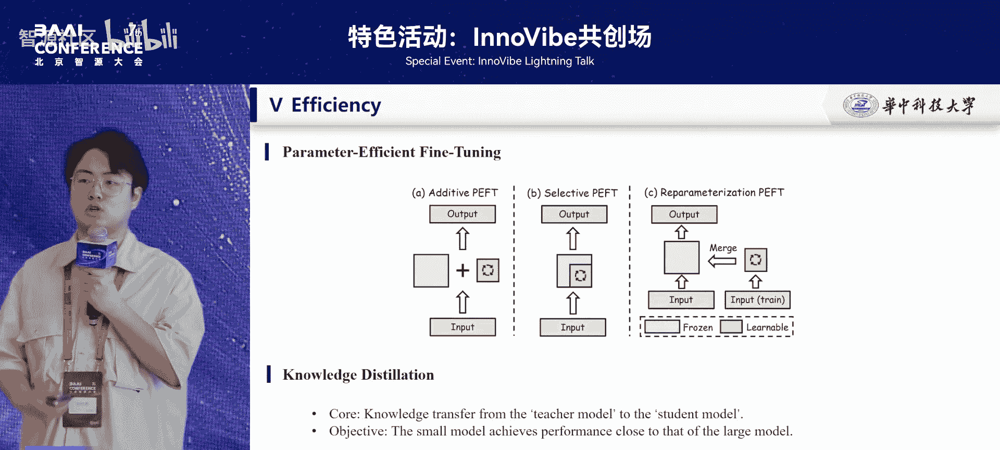

以下是效率优化的主要技术：
1.  **模型压缩**：
    *   **训练后量化**：降低模型权重的数值精度，例如将32位浮点数转换为8位整数，以减少模型存储大小和推理延迟。代码示例（伪代码）：`model_fp32 -> quantize -> model_int8`
    *   **参数剪枝**：识别并移除神经网络中不重要的权重或连接，构建更稀疏的模型。
2.  **参数高效微调**：在微调时只更新一小部分参数，大幅降低计算和存储成本。主要分为三类：
    *   **附加式微调**：在原有模型架构中添加新的、少量的可训练参数（如Adapter模块）。
    *   **选择式微调**：只选择原模型参数的一个子集进行微调。
    *   **重参数化微调**：通过低秩分解等方式重新参数化权重矩阵（如LoRA），在推理时可将更新矩阵与原始权重合并。
3.  **知识蒸馏**：训练一个小的“学生模型”来模仿大的“教师模型”的行为，从而将大模型的能力迁移到小模型上。

在提升了模型效率之后，如何让模型**集成多种能力并适应复杂场景**是另一个重要方向。

## 集成与适应

集成与适应技术旨在扩展模型的能力边界。

以下是该方向的主要技术：
1.  **多模态集成**：使模型能够识别和处理文本、图像、音频等多种来源的信息。通常做法是为每种模态设计编码器，再通过一个融合器对不同模态的表示进行综合推理。
2.  **模型融合**：将多个模型的能力结合起来。主要分为三类：
    *   **权重级融合**：直接合并多个模型的权重。
    *   **输出级融合**：融合多个模型的输出结果。
    *   **模型级融合**：使用路由机制动态选择专家模型处理当前任务，混合专家模型是典型代表。
3.  **检索增强生成**：为了解决大模型可能产生幻觉或使用过时信息的问题，RAG通过从外部知识库中检索相关文档或知识片段，并将其作为上下文提供给模型，从而生成更准确、可靠的回答。

最后，基于以上技术，我们对未来发展方向提出一些探讨。

## 未来展望

我们对训练后优化技术的未来发展方向提出以下几点思考：

以下是几个潜在的重点方向：
1.  **推理增强**：如何构建超越当前自回归架构的下一代模型，以应对更深层次、多步骤的复杂推理任务。
2.  **可扩展性**：如何高效地对下一代超大规模语言模型及多模态模型进行训练后优化。
3.  **安全与可信框架**：如何构建能够适应上下文、确保安全可信的框架，这对于产业落地和部署至关重要。
4.  **创造性智能**：如何让大语言模型产生更深层次的智能，实现媲美人类系统二的思维能力。

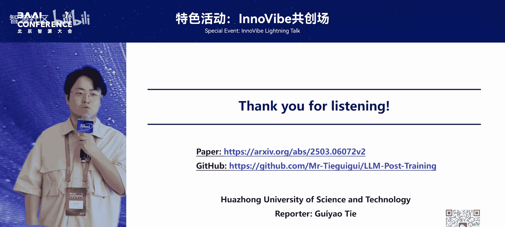

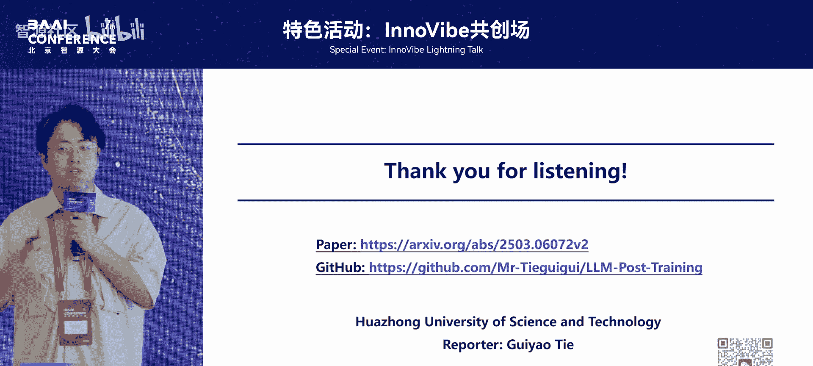

本节课中我们一起学习了**大语言模型训练后优化的核心技术全景**。我们从监督微调、强化学习对齐、推理增强、效率优化以及集成适应五个方面，系统梳理了将通用大模型转化为实用型专业模型的关键技术路径，并对未来发展趋势进行了展望。训练后优化是释放大模型潜力的核心环节，持续推动着人工智能向更高效、更智能、更可靠的方向发展。