# 特色活动：InnoVibe共创场-p04-从马尔可夫推理过程中涌现的原子化推理：滕枫蔚

## 概述
在本节课中，我们将学习一种新的大模型推理优化方法。该方法旨在通过引入马尔可夫过程的思想，将复杂的推理任务分解为一系列原子化的、无记忆依赖的子问题，从而提升推理效率和效果。

## 演讲者介绍
下一位讲者是滕枫蔚。他带来的主题是“从马尔可夫推理过程中涌现的原子化推理”。

大家好，我叫滕枫蔚。我去年刚从人大高瓴毕业，现在在香港那边，并且正在积极寻找后续的机会。我也非常感谢之前的讲者。

## 推理优化的核心：增加计算资源
首先，可以用一个简单的比喻来说明推理优化的核心。好比高考，两个小时完成一场考试与四个小时完成，理论上用四个小时不会比两个小时做得更差。这体现了增加大模型在推理阶段的计算资源投入，其效果至少不会变差的现象。这类似于思维链（Chain-of-Thought, CoT）技术。

## 思维链（CoT）的原理与发展
我们都特别熟悉的CoT，其核心原理是**逐步推理**。早期的大模型是“输入-输出”（IO）式推理，直接给出答案，没有思维过程。CoT作为一个简单的提示（Prompting）策略，为模型提供了一个很好的效果提升手段。

CoT既是一个简单的提示策略，也可以作为许多人设计算法或构建数据时，希望模型增强自身延长思维链能力的基础。这衍生出两大类方法：
1.  **非训练方法**：通过离散的框架和提示策略，引导模型在推理时不断延长思维。
2.  **训练方法**：例如非常流行的思维树（Tree of Thoughts, ToT），通过训练方式让模型在单次问答内主动用各种手段延长推理。

我的工作偏向于非训练方法。

## 研究动机：追求简单与有效
我最初做这篇论文的动机非常简单。我认为人们可能更喜欢简单的东西。这篇论文是我的第一篇一作论文，在推特上发布后获得了意想不到的关注。虽然大家都喜欢简单的东西，但我们面对的许多工作（如基于图的推理、思维图等）正变得越来越复杂，结构从图到超图，甚至出现了生僻词汇。

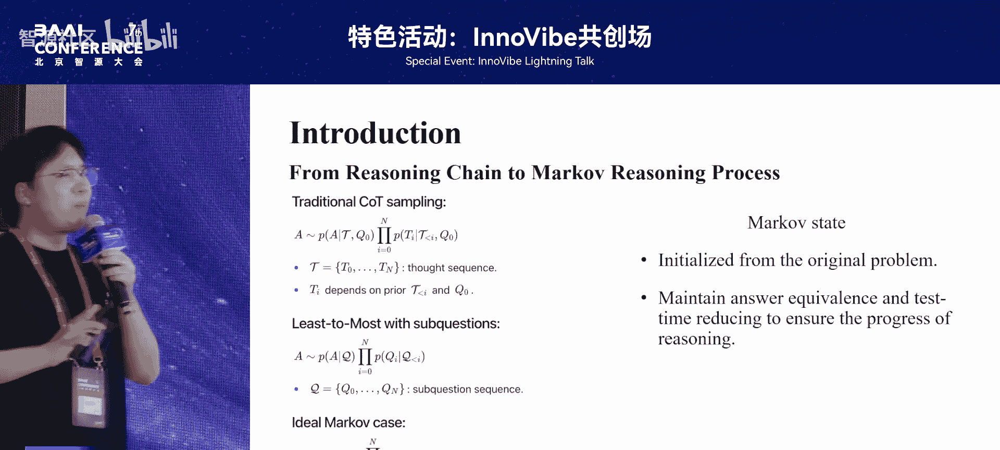

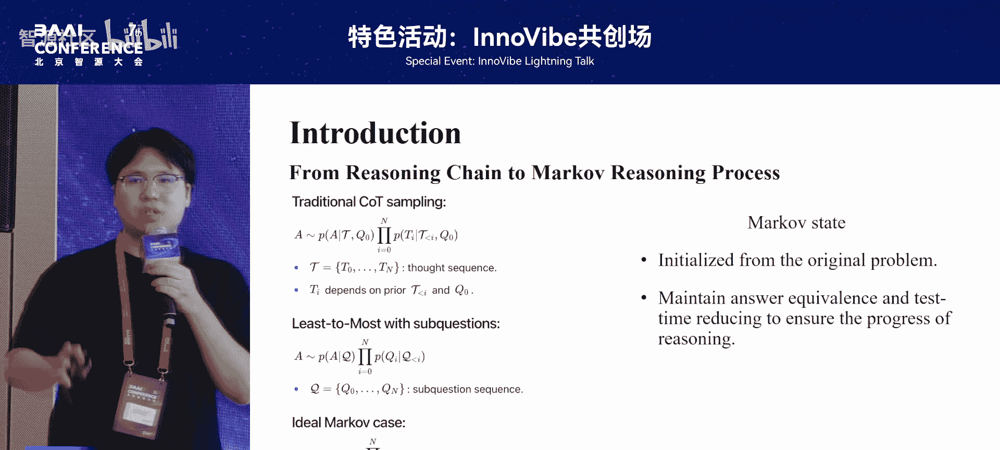

因此，我希望做一个既简单又效果好的方法。我甚至提出，我们曾经以为最简单的CoT可能都没有那么简单。上图展示了我们通常理解的原始CoT，它是一个链图。但这个“链”的定义并不精确。如果我将边的关系从“生成顺序”改为“依赖关系”，即N2的生成需要参考N1的信息，那么曾经简单的CoT也会变得复杂。后续的思维树、思维图等，其基本假设就更加困难。

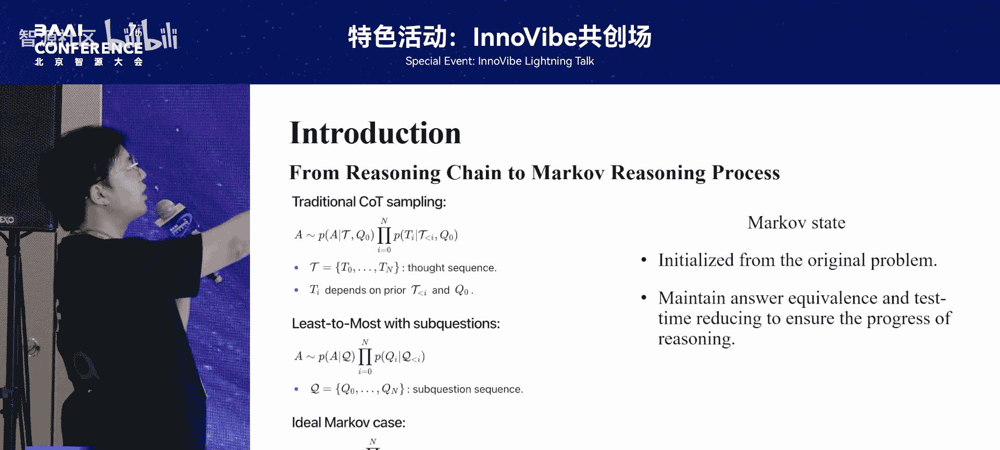

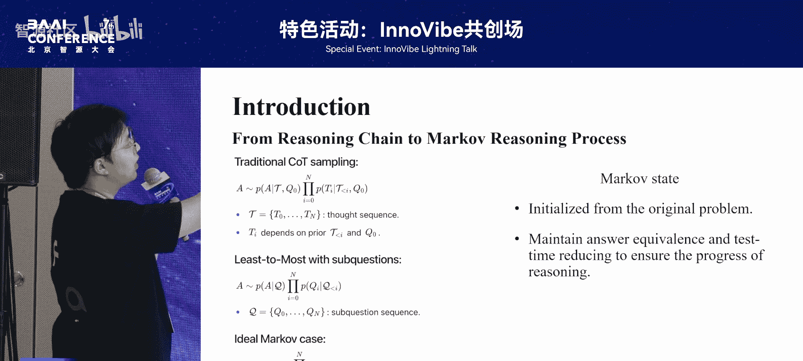

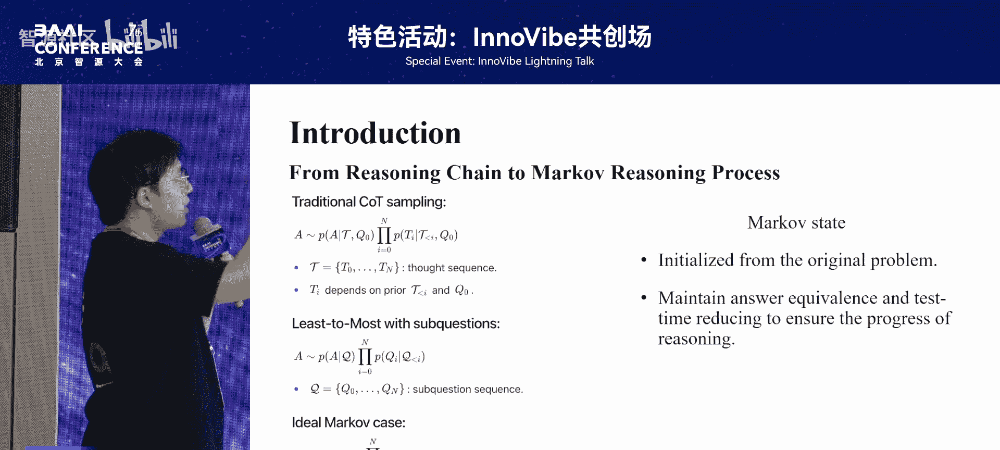

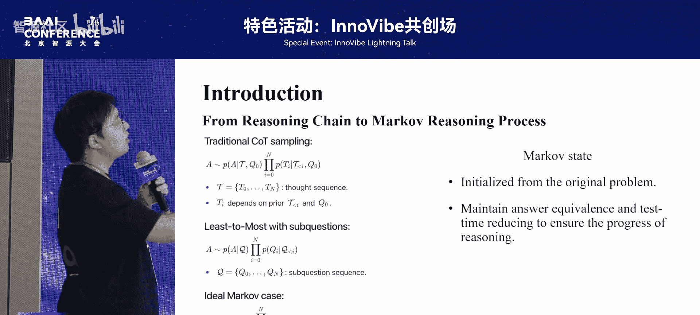

这些复杂的结构在推理过程中，历史信息会积累得越来越多，导致当前推理可能需要处理大量不必要的历史信息。我希望将这样的历史信息结构抽象出来，让推理只关注当前状态需要的信息。

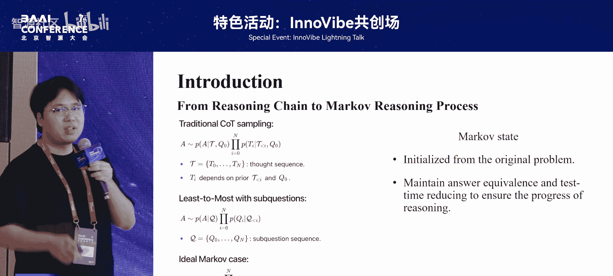

## 引入马尔可夫过程
如果要摆脱历史信息依赖，最典型的工具就是**马尔可夫过程**，因为它具有**无记忆性**。

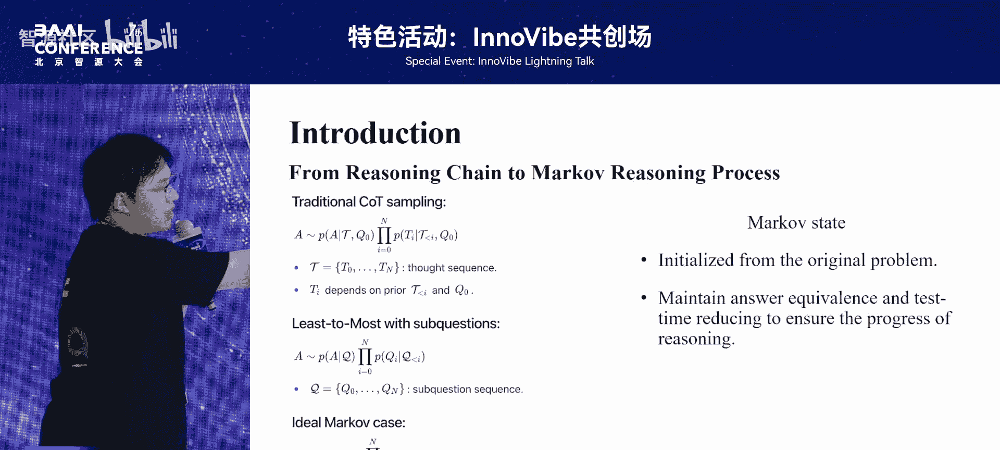

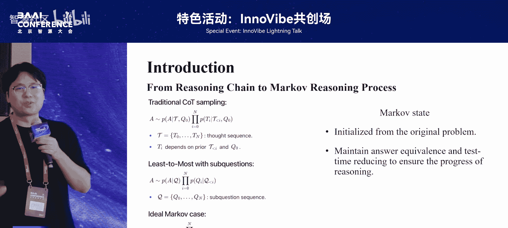

我们可以做一个简单的推导。在思维生成过程中，每一个新元素（无论是思维还是问题）的生成，通常依赖于所有完整的历史信息。在一个理想化的马尔可夫过程中，下一个状态应仅依赖于当前状态。

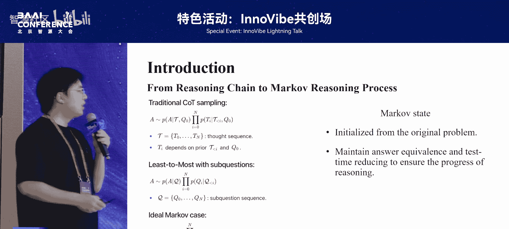

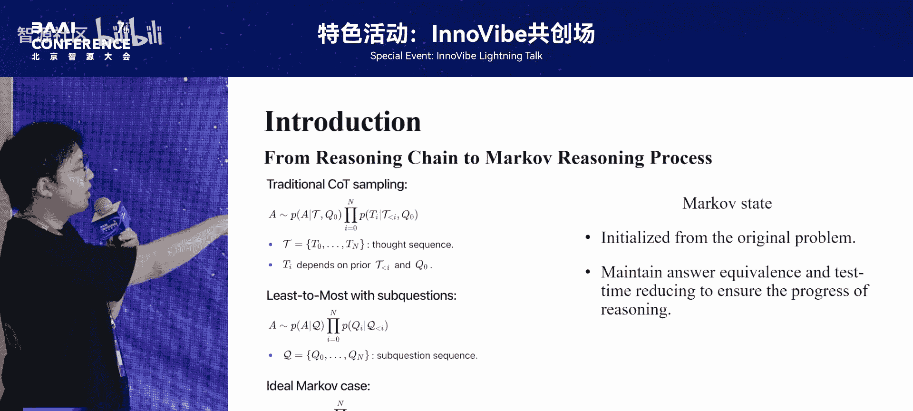

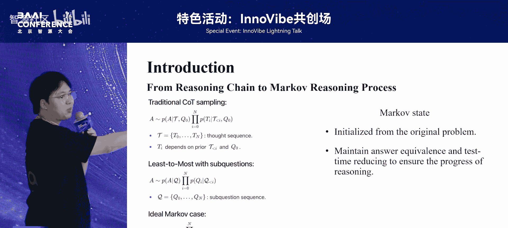

用公式表示，理想情况是：
`P(Q_{i+1} | Q_i, E) = P(Q_{i+1} | Q_i)`
其中，`Q_i` 表示第 `i` 个问题状态，`E` 表示历史信息。这意味着下一个问题 `Q_{i+1}` 的生成只依赖于当前问题 `Q_i`。

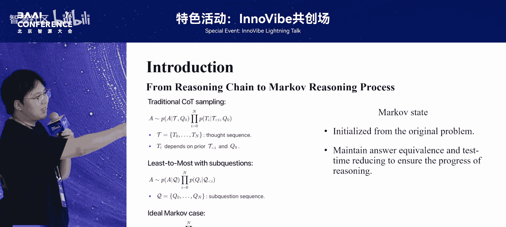

当然，现实中的问题很难完全满足马尔可夫性质。但通过推导可以发现，推理链的最后一个元素应该是“问题”，而链的起始状态由初始问题初始化。因此，整个序列可以被视为一个由问题包装的马尔可夫链。

## 两阶段状态转移与原子化问题
既然完全理想化的马尔可夫公式较难实现，我们可以引入一个中间步骤：**两阶段状态转移**。

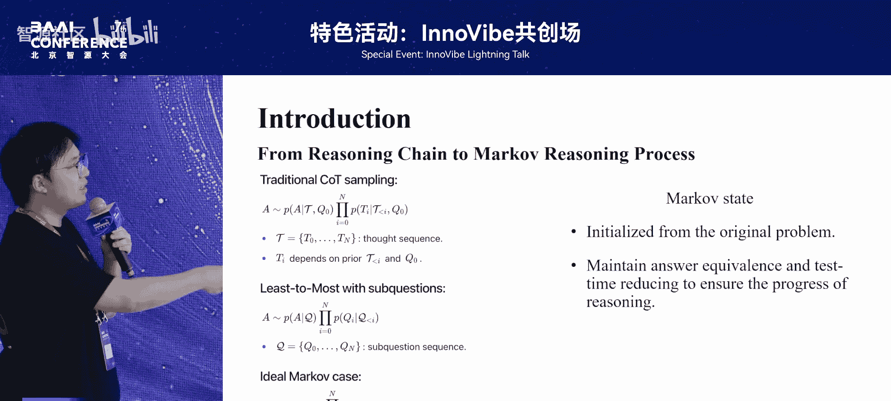

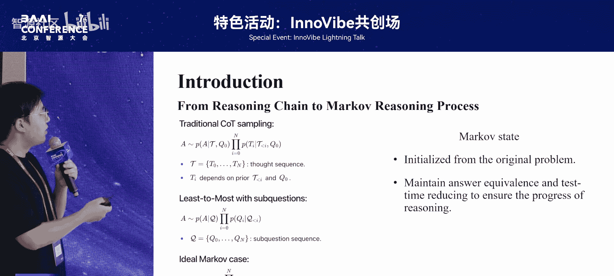

我们不是直接从当前状态生成一个完全无记忆的下一个状态，而是先生成一个中间变量——一个由有向无环图（DAG）构建的推理过程。这个DAG中的元素可以是思维或问题。然后，再从这个DAG生成下一个问题。

关键是如何通过问题之间的转移来构建推理过程。我提出，序列中的每一个“问题”都应该是原问题的一个**简化版本**，求解它就等于在求解原问题的一部分。同时，这个**问题序列应该保证推理复杂度的下降**，即每一步所需推理步骤越来越少。这样，马尔可夫过程才能构建成一个切实进行的推理过程。

以下是基本的过程：
1.  从初始复杂问题开始。
2.  将其拆解为一个DAG（有向无环图）。
3.  通过提示（Prompt）引导，将图中已解决的独立子问题或已排除的错误探索路径“固定”到后续问题的描述中，作为已知信息，从而简化后续问题。
4.  重复此过程，问题变得越来越简单，直到最后一步可能已是一个非常简单的问题。

## 方法优势与扩展
由于马尔可夫链是基础结构，它具有很好的性质：
*   **无记忆性**：执行链中每个任务时，都不需要回顾前文。
*   **易于集成**：可以将生成的多个问题序列（即多个马尔可夫链）的结果轻松集成，因为它们是独立推导的。

更进一步，既然这种基于点的马尔可夫链是对CoT的替代，那么能否让它替代更复杂的结构（如ToT、思维图）中涌现出的思维呢？这是我后续的工作：结合**反思机制**和**搜索机制**来加深马尔可夫链的“深度”。

最终得到一种被称为“涌现的原子化推理”的结构。因为链中问题的复杂度在下降，到最后一步时，其复杂度与你每一步生成的独立子问题的平均复杂度近似。这是一个非常好的性质，因为它意味着**增加计算资源投入（加深搜索）更有可能带来效果提升**。

## 未来工作展望
最后，预告一下我正在开展的工作。最初的部分是关于CoT的，现在很多人认为，CoT带来的性能提升点在于它激发了大模型使用更高阶的推理策略。这里我参考了港大的相关工作，他们分析了模型内部不同推理行为的涌现程度。研究发现，模型能力的增强（伴随CoT延长）会使其更倾向于使用高阶推理方式。但现有的CoT算法本身并没有主动激发模型去做这些事情。

我认为这里存在一个明显的差距。因此，我正在开发一个算法框架。我相信在现有的复杂推理框架中，存在许多未被充分关注的精妙设计。如果这些设计能被模型有效学习，可能会产生超越当前模型的效果。所以，我的目标是：**请你使用我们的算法，按照你对推理的理解，去训练出你自己的“思维专家模型”**。

## 总结
本节课我们一起学习了一种基于马尔可夫过程的大模型推理优化方法。该方法通过将复杂问题分解为一系列原子化、无记忆依赖的简化子问题序列，并确保序列复杂度递减，从而实现了更高效、更可控的推理。我们还探讨了该方法易于集成和扩展的优势，并展望了通过训练让模型自主掌握高阶推理策略的未来方向。

---

## 现场问答
**提问**：您提到工作的出发点是CoT会访问全文长度上下文进行推理，因此做了压缩变成马尔可夫过程。您如何看待像“滑动窗口注意力”（Sliding Window Attention）这类模型架构上的方法？它们也维护了一个近似马尔科夫的状态，不需要访问全部上下文。您如何对比这些模型方法和您的方法？

**回答**：这些模型方法更多偏向于模型架构设计，而我的方法是一种推理框架。需要指出的是，这类“滑动窗口”方法在当下可能有一个不足：它可能无法自主地决定延长上下文。在这个场景下，它更多是向下兼容，难以向上扩展。我的工作与它们在本质上并不冲突，完全可以将这类新颖的注意力机制设计的模型套用在这个框架里。我非常尊重这些在基础模型层面进行改进的研究者。虽然目前业界主流可能还是传统注意力设计，但我认为如果能在底层实现token长度的自由伸缩，其效果的理论上限一定会比现在的模型更好。所以，我认为这与我的工作不冲突，并且非常看好他们的研究。