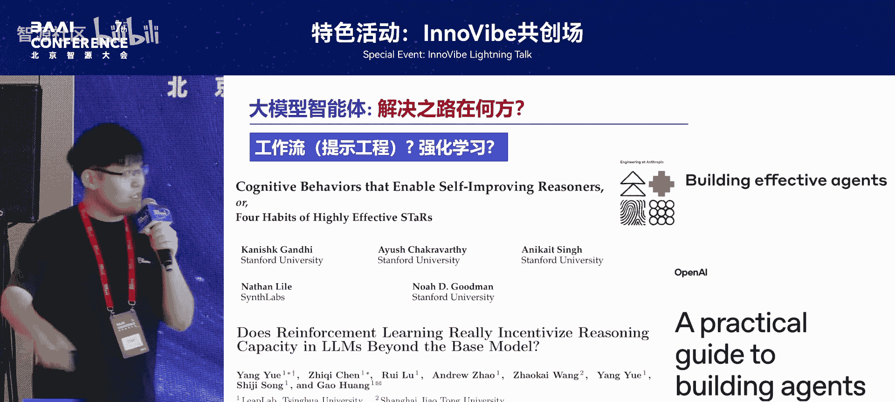
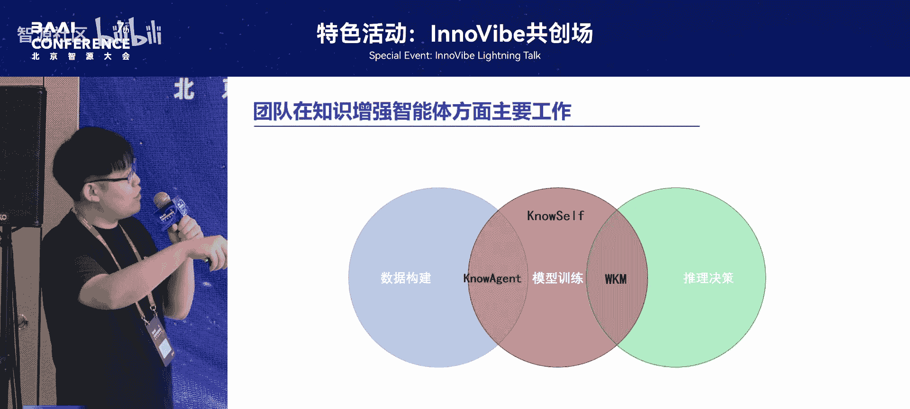
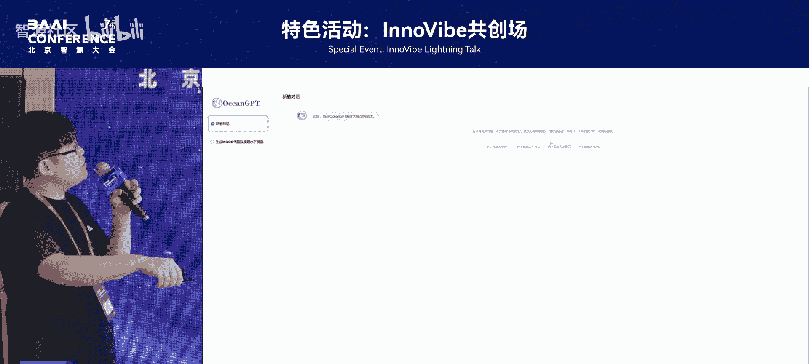
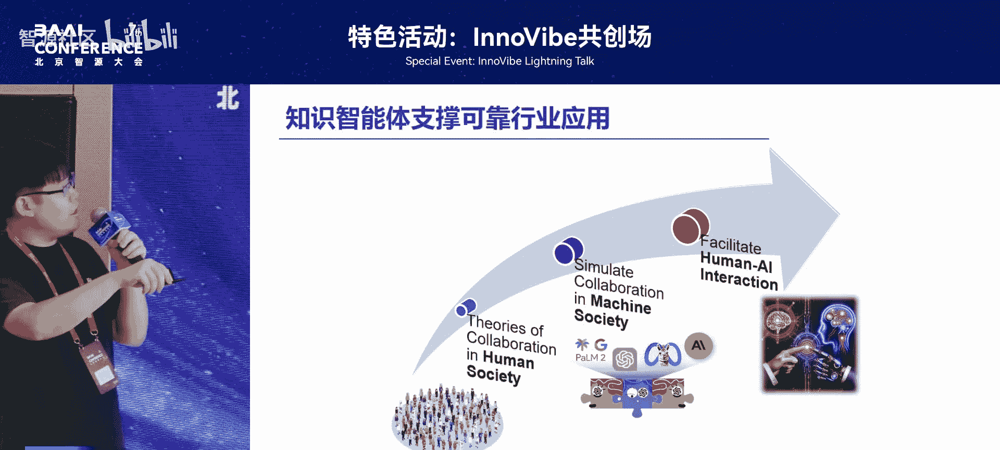
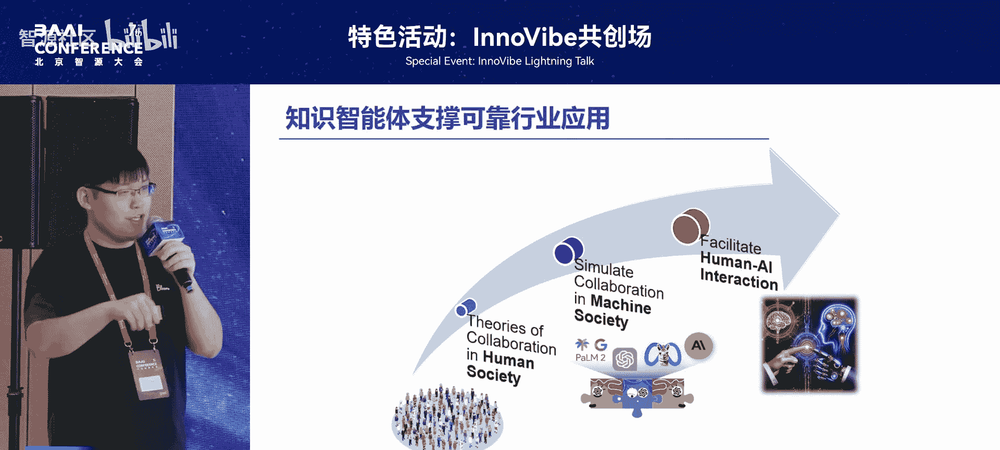

# 特色活动：InnoVibe共创场-p05-知识智能体-问题、方法和应用：乔硕斐

## 概述
在本节课中，我们将学习知识智能体的核心概念、面临的问题以及初步的解决方案。我们将探讨如何将知识引入大模型智能体，以提升其在复杂、动态环境中的决策可靠性与适应性。

---

## 什么是大模型智能体？🤖
上一节我们概述了课程内容，本节中我们来看看大模型智能体的基本定义。

大模型智能体可以通过递归式的目标分析与价值对齐机制，将人类模糊的指令拆解为具体的子任务。一个典型的应用是 OpenAI 的 `different research`。

**核心公式**：`智能体 = 大模型 + 递归任务拆解 + 价值对齐`

然而，大模型智能体的本质依然是大模型。大模型本身存在一些固有问题。

---

## 大模型智能体的核心问题 ⚠️
上一节我们定义了大模型智能体，本节中我们来分析其面临的核心挑战。

大模型通过海量的预训练语料、指令微调和轨迹数据进行训练，使其“认为”自己处于问答或具体任务环境中。但这套训练策略并未让大模型学会与真实的物理世界进行交互。

我们期望的智能体需要具备“手”和“脚”，能够感知外部物理世界、进行推理决策，并具备自主持续学习的能力，以适应不断变化的环境。这暴露了大模型的几个问题：

以下是我们在数据科学领域的探索中发现的具体问题：
*   **缺乏先验知识**：人类专家进行数据分析时，会运用大量先验知识进行特征工程或可视化。但对大模型智能体而言，这些任务变得异常困难。
*   **任务成功率低**：在许多任务上，大模型智能体的成功率非常低。

---

## 现有解决方案及其局限 🔄
上一节我们指出了问题，本节中我们来看看现有的解决方案及其不足。

目前主流的智能体框架（如 `research`）大多基于人为构造的工作流。

以下是工作流方法的优缺点：
*   **优点**：可控性强。可以约束大模型在既定框架内执行任务。
*   **缺点**：灵活性差，泛化能力弱。

随着强化学习（RL）的引入，一些工作试图通过强化学习算法来增强智能体的泛化性。但 RL 本身也存在问题：
*   **仅激发现有能力**：RL 主要激发大模型已有潜力，并未为其注入新的知识或能力。
*   **引入新风险**：可能带来不可靠性和幻觉问题。

---

## 知识智能体的提出与科学问题 ❓
既然现有方案存在局限，未来应如何解决？我们提出了“知识智能体”的概念。

为什么要引入知识？大模型本质上是基于统计的模型，存在固有缺陷：在不确定性预测上存在固有问题，且常常缺乏必要的先验知识。这导致智能体在面对任务时可能盲目试错，这在许多不可回溯的实际场景中是不可行的。可靠性问题目前主要通过流程性知识（如工作流）来缓解。

为此，我们提出了知识智能体的三个核心科学问题：
1.  **可靠协调问题**：在高度不确定的环境中，如何动态整合多种知识，以确保智能体决策的可靠性与协调性？
2.  **动态适应问题**：当环境不断变化时，如何设计智能体，使其能自主地学习、记忆并更新知识框架，以提升动态适应性？
3.  **主动创新问题**：人类学习基于好奇心。如何让智能体基于自身好奇心，主动学习以提升创新能力？

---

## 知识融入智能体的三个阶段 🛠️
上一节我们提出了关键问题，本节中我们来看看将知识融入智能体的具体技术路径。

我们在三个不同阶段探索了知识融合的方法：数据构建阶段、模型训练阶段和推理决策阶段。

以下是我们在三个阶段的部分工作简介：

### 1. 数据构建阶段：Action Graph
这是一个较早的工作。我们发现智能体产生的动作常违背常识。一个简单的思路是构建动作关系图（Action Graph）来约束其动作。

**方法流程**：
1.  将构建的 Action Graph 输入模型，引导其生成符合常识的高质量轨迹数据。
2.  用这些轨迹数据训练模型。
3.  模型能力提升后，再利用 Graph 合成更多高质量轨迹，迭代优化模型。

这是在数据与训练层面进行知识增强的工作。

### 2. 训练与解码阶段：Knowledge Model
Action Graph 需要人类根据先验知识构建，在复杂场景下成本高昂。我们可以让模型在环境中自主探索，总结知识并存入一个“知识模型”（Knowledge Model）。该模型具备一定的泛化能力，能缓解人力成本的限制。

在解码（推理）时，将知识模型的输出与智能体的原始概率分布进行加权融合，从而约束智能体的行为。

**核心思想**：`最终决策概率 = 融合(智能体概率分布， 知识模型输出)`

### 3. 训练阶段：按需调用知识
我们发现，知识并非总是有益。无效或错误的知识反而会成为决策负担。同时，有研究推测 Transformer 更像高级模式匹配器，而非真正学会了推理。

我们希望智能体能像人类一样，根据自身能力边界和需求，主动调用外部知识。盲目调用无用或错误的知识会浪费计算资源并降低决策效能。

我们提出了一个数据驱动的框架：
1.  **训练目标**：让模型学会判断自身能力的三种状态（会、不会、不确定）。
2.  **训练方法**：采用两阶段训练，结合监督微调（SFT）和类似 DPO 的算法，训练模型对自身能力边界的认知。
3.  **推理方法**：在解码时，通过引入特殊 Token，让模型自行判断是否需要调用外部知识，实现高效的知识利用。

后续如 `sR one` 等基于强化学习范式的工作，本质上也致力于让模型学会如何调用外部知识。智能体要实现真正的自主，需要具备对自身能力的认知，即某种程度的“自我意识”。

---

## 技术栈总结与应用探索 🌐
上一节我们介绍了具体方法，本节我们对技术栈进行总结，并展望其应用。

我们对知识智能体的技术栈总结如下：
*   **数据构造**：如 Action Graph，引导生成高质量数据。
*   **训练阶段**：如 Knowledge Model 和按需调用知识框架。未来可将知识作为强化学习奖励信号的一部分。
*   **推理阶段**：知识可以作为输入直接提供给模型，也可以作为记忆（Memory）的一部分辅助决策。

我们也探索了知识增强智能体的具体应用场景：

以下是两个主要的应用方向：
*   **水下具身智能**：水下环境探索程度低，亟需自主智能体。我们探索如何通过大模型的代码生成能力、结合 MCP 等服务，并以知识增强的方式，贯通从人类指令到智能体动作的链条。
*   **数据科学**：我们希望大模型能辅助科研。但在处理数据和机器学习算法时，当前大模型能力较弱。人类已积累了大量论文和竞赛（如 Kaggle）经验，这些可作为知识来源，为模型设计机器学习算法提供参考，从而更好地进行算法设计。

我们希望知识智能体能够支撑可靠、可落地的行业级智能体应用。

---

## 总结
本节课中，我们一起学习了知识智能体的核心概念。我们分析了大模型智能体因缺乏与物理世界交互和先验知识而导致的问题，回顾了现有工作流和强化学习方案的局限。我们提出了通过将知识融入数据构建、模型训练和推理决策三个阶段来增强智能体的思路，并简介了 Action Graph、Knowledge Model 及按需调用知识等具体方法。最后，我们展望了知识智能体在水下具身智能和数据科学等领域的应用前景。实现能可靠认知自身、动态利用知识的智能体，是走向通用人工智能的重要一步。

---
**Q&A 环节摘要**

**问**：如何处理知识间的关系？例如，如何为当前动作筛选知识，是否需要为长远动作规划而检索多步知识？
**答**：知识可以多种形式存在，如图谱或自然文本。我们主要关注利用知识决策**下一步动作**。长远动作规划依赖于之前动作的序列结果，我们主要通过总结成功与失败轨迹中的知识（作为先验概率或结构化知识），来指导智能体的即时决策。