# 特色活动：InnoVibe共创场-p07-AdaWorld--A-Highly-Adaptable-World-Model-for-Decision-Making-高深远

在本节课中，我们将学习高深远博士介绍的“AdaWorld”工作。这是一个高度自适应的世界模型，旨在让AI系统能够像人类一样，仅通过少量交互就快速理解并适应新的决策环境。

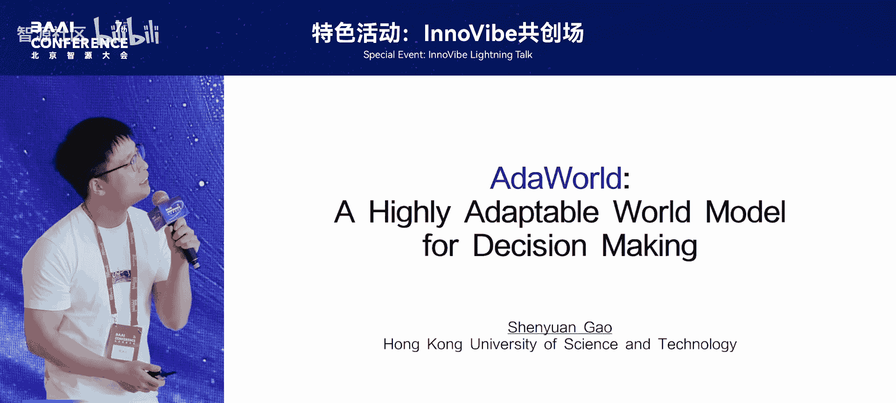

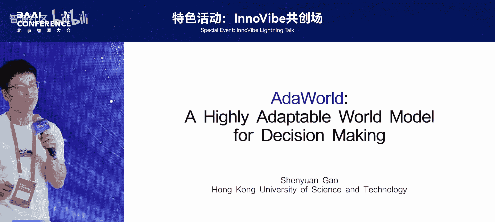

---

## 概述

世界模型是智能体理解环境、预测行动后果的核心。传统世界模型需要海量数据和训练才能获得控制能力，适应新环境效率低下。AdaWorld的核心目标是解决这一问题，通过引入一种通用的潜在动作表示，使模型能够实现人类级别的快速适应能力。

---

## 什么是世界模型？ 🤔

上一节我们概述了课程目标，本节中我们来看看世界模型的具体概念。

世界模型本质上是一个**状态转移方程**。其功能可以概括为：给定当前状态 `s_t` 和智能体执行的动作 `a_t`，模型预测出下一个状态 `s_{t+1}`。

**公式表示：**
`s_{t+1} = WorldModel(s_t, a_t)`

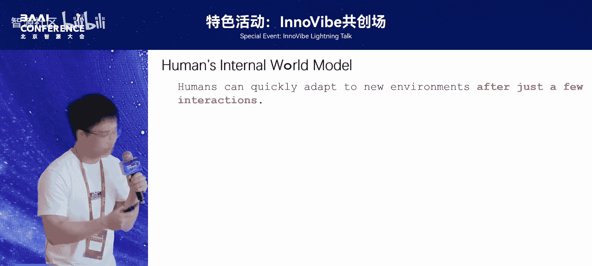

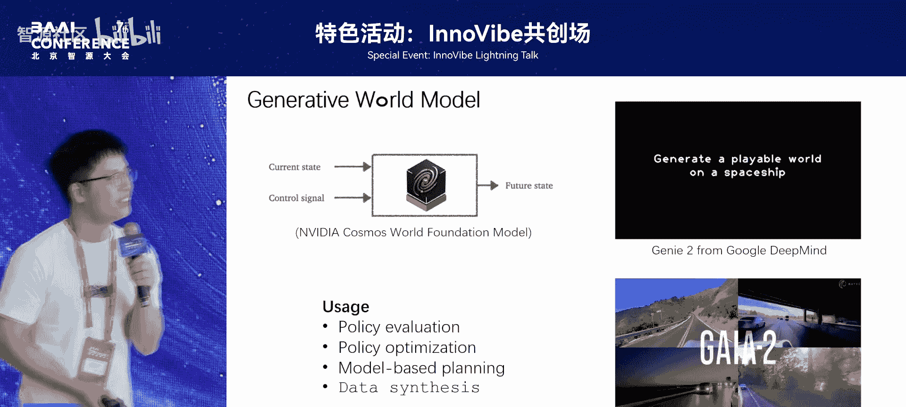

这个简单的功能模拟了智能体与世界交互的过程。拥有了对世界的模拟，我们可以做很多事情：

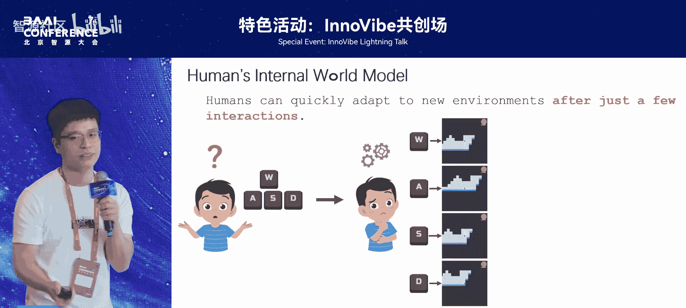

以下是世界模型的几个主要应用：
*   **策略评估与优化**：在模型内部测试智能体策略，无需在现实中高成本测试。利用模型预测的未来状态估计奖励，从而优化策略。
*   **前瞻搜索与规划**：在没有策略或策略较弱时，可以进行“向前看”搜索。通过模拟不同动作的后果，选择结果最好的动作，这被称为基于模型的规划。
*   **数据合成**：利用模型生成新的、未见过的状态数据。

---

## 现有挑战与人类启示 🧠

上一节我们介绍了世界模型的应用，本节中我们来看看当前模型面临的挑战以及人类智能给我们的启示。

尽管当前一些视觉世界模型（如谷歌等公司提出的）视觉效果惊艳，但它们获得控制能力需要**大量的训练数据、训练步数和计算资源**，适应新环境的过程非常低效。

相比之下，人类的世界模型具有强大的快速适应能力。例如，进入一个新游戏，我们只需按几下按钮，观察画面变化，就能快速猜出每个按钮的功能（如上、下、左、右）。人类仅需**极少的交互尝试**就能理解新环境。

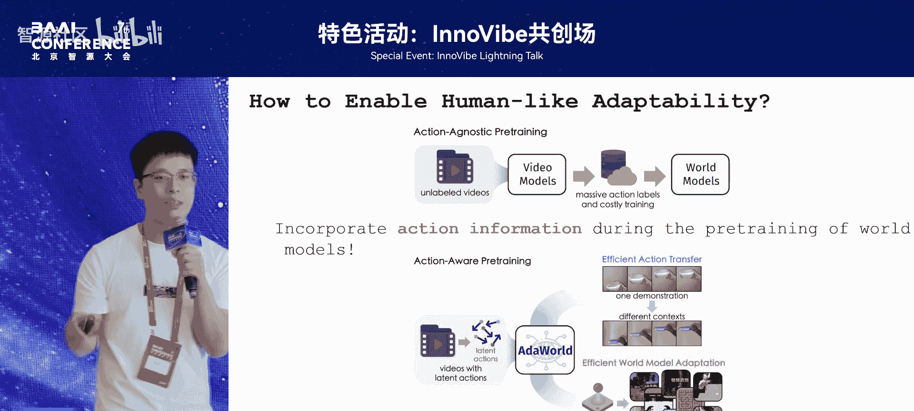

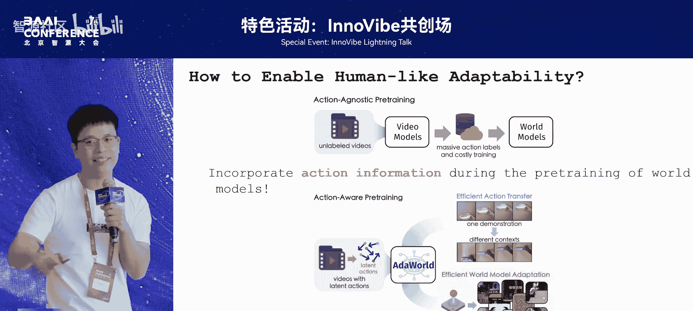

核心问题在于：传统生成模型通常先通过大量无标注视频进行预训练，然后再用大量有标注的控制数据去微调以获得控制能力。这个过程割裂且低效。

---

## AdaWorld 的核心思路：潜在动作 🎯

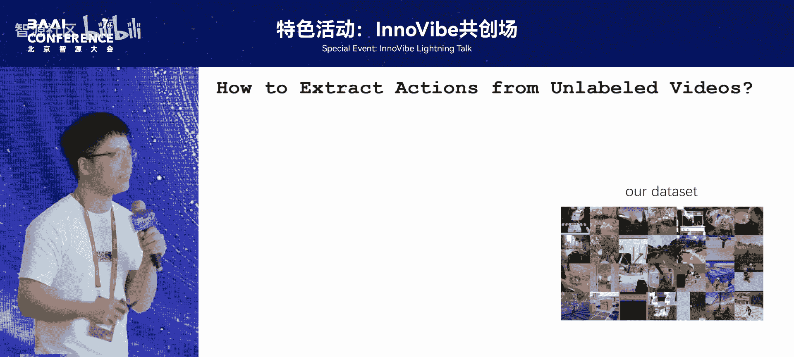

上一节我们分析了问题所在，本节中我们来看看AdaWorld提出的解决方案。

我们的思路是：**在预训练阶段，就将视频中蕴含的动作信息告知模型**。这样，模型在早期就学习了广泛存在的、通用的动作表示。当遇到新场景时，它就能利用这些先验知识进行快速适应。

具体而言，我们从视频中抽取一种**潜在动作**。它不是具体的动作标注（如“前进”），而是一种通用的、与场景无关的动作信息表示。

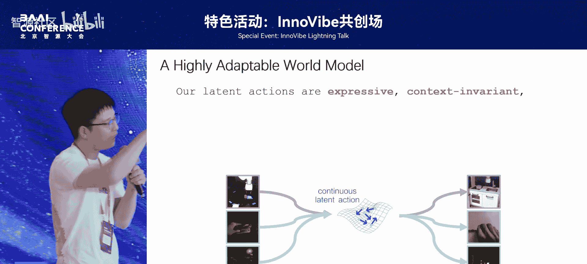

这种方法带来了两个关键优势：

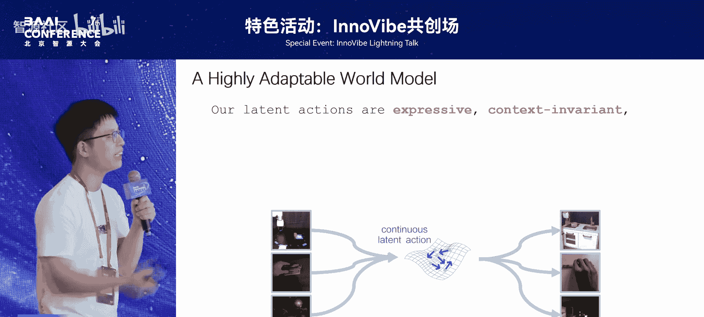

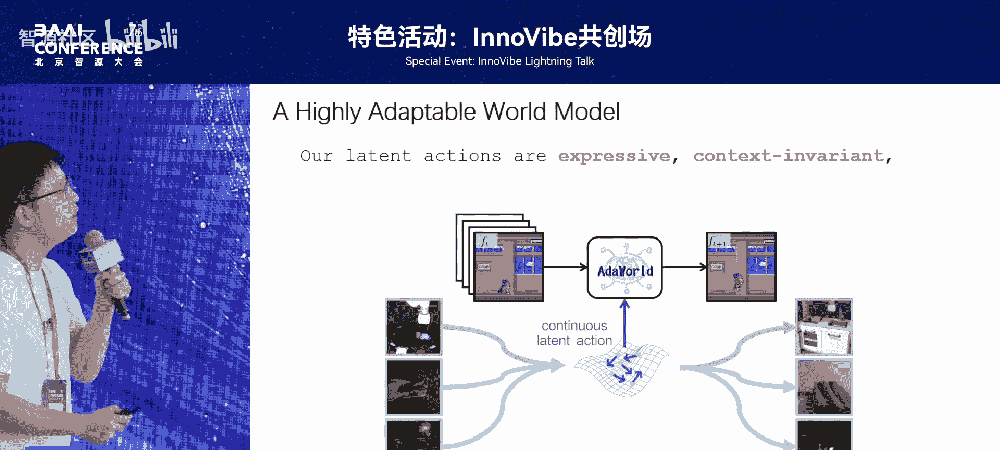

以下是引入潜在动作带来的好处：
*   **快速动作迁移**：可以将在一个场景中学到的动作，迁移到具有不同物体、背景的新场景中执行。例如，让机器人观看人类视频后，能在新位置完成类似动作。
*   **高效模型适应**：仅需极少的交互数据，就能将通用模型微调成适应特定任务的世界模型，进而用于规划等任务。

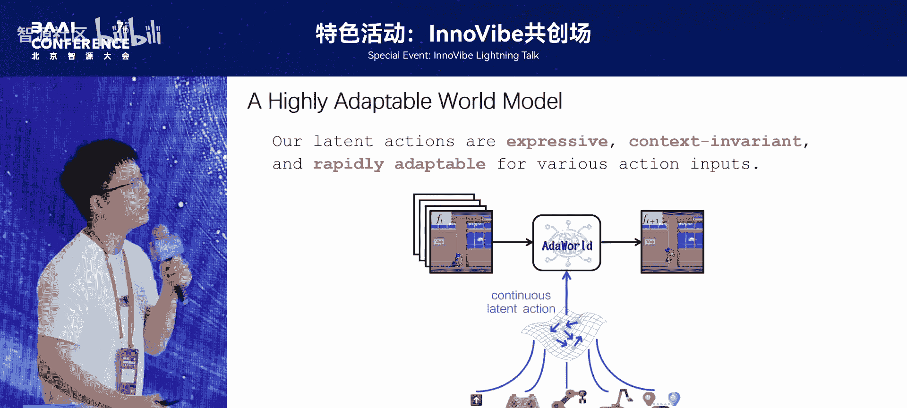

---

## 如何获取潜在动作？ 🔍

上一节我们知道了潜在动作的好处，本节中我们来看看如何从视频数据中自动获取这种表示。

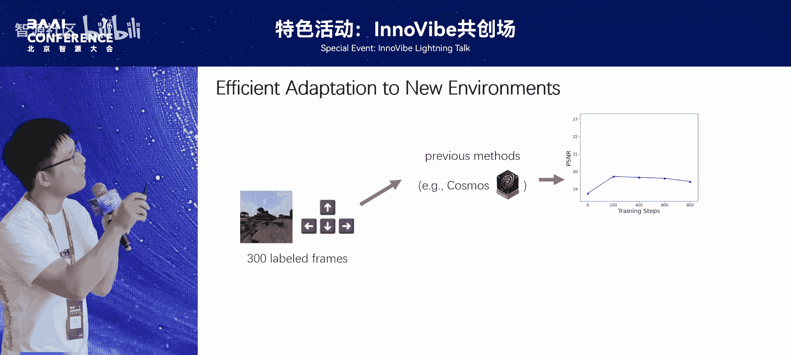

我们采用了一种自监督的方法，训练一个**自编码器**。

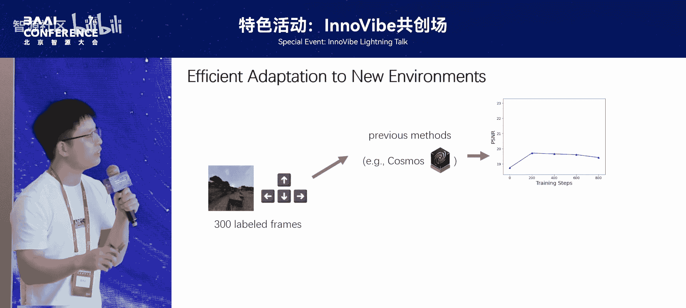

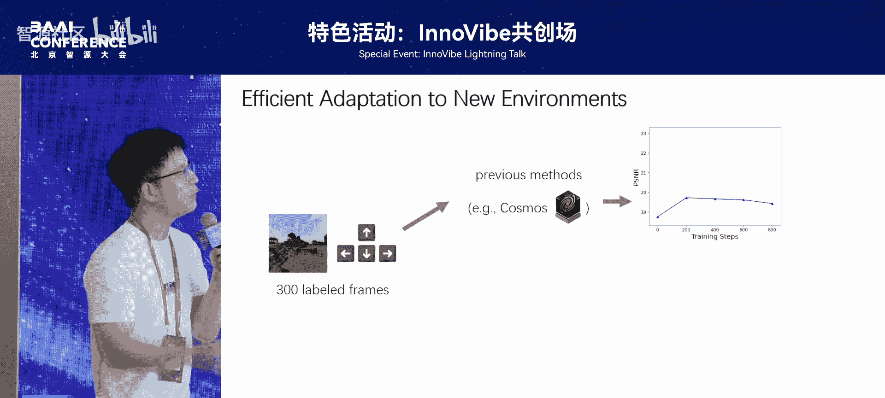

**训练过程简述：**
1.  输入当前帧 `I_t` 和下一帧 `I_{t+1}` 到编码器。
2.  编码器输出一个低维的**潜在向量 `z_t`**，它被设计为尽可能紧致。
3.  解码器接收当前帧 `I_t` 和潜在向量 `z_t`，目标是重建出下一帧 `I_{t+1}`。

**核心思想：** 由于潜在向量 `z_t` 维度很低，为了能准确重建出下一帧，它必须压缩从 `I_t` 到 `I_{t+1}` 之间最关键的、**不可预测的变化信息**。在决策场景中，这通常就是智能体执行的**主观动作**，而背景变化等往往是可预测的。

因此，这个训练过程迫使网络将动作信息编码进潜在向量中。实验表明，这样学到的潜在动作表现力强且与场景无关。例如，从一个视频提取的潜在动作，应用到另一个场景，能产生语义相似的动作效果。

---

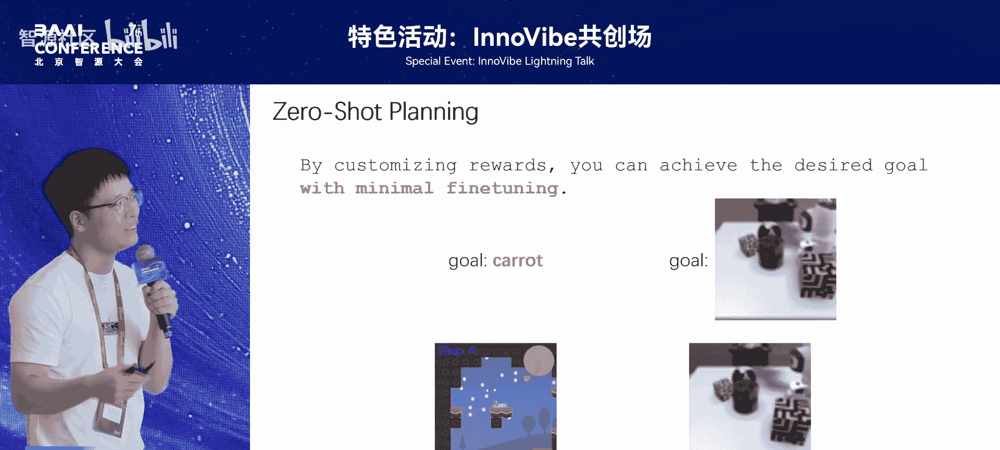

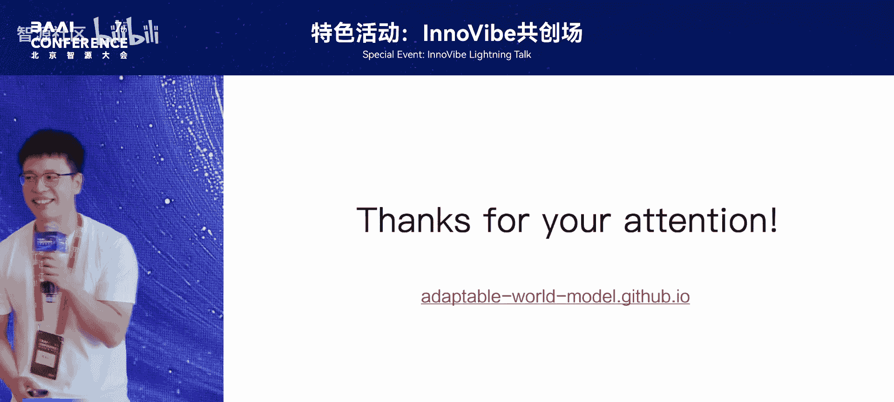

## 实验结果与应用展示 📊

上一节我们讲解了潜在动作的提取方法，本节中我们来看看AdaWorld的实际效果。

我们将学习到的潜在动作融入世界模型的训练。模型因此理解了各种潜在动作会导致的后果，从而易于通过潜在动作进行操控。这使得模型适应新任务变得非常高效。

在多个领域的实验结果证明了其有效性：

以下是部分实验结果：
*   **离散控制（如游戏《我的世界》）**：传统模型适应慢，效果提升有限。AdaWorld仅用300帧数据和200步训练，就能快速获得良好的控制能力，且最终效果和泛化性更好。
*   **连续控制（如机械臂、自动驾驶）**：得益于潜在动作作为通用媒介，对于连续控制信号也能快速适应。

拥有了快速适应且控制精准的世界模型后，可以轻松完成各种任务。例如，在机械臂场景中，自定义一个目标（如“推到指定位置”），利用世界模型进行规划搜索，就能找到达成目标的动作序列。这避免了传统方法需要大量数据从头训练模型的弊端。

---

## 总结

本节课中我们一起学习了AdaWorld，一个高适应性的世界模型。其核心创新在于引入了一种从视频中自监督学习得到的、通用的**潜在动作**表示。这种方法使模型在预训练阶段就掌握了动作概念，从而能够像人类一样，仅通过**极少的交互样本**就快速适应新的决策环境，并在游戏、机器人控制等多个领域展现出高效且精准的控制能力。这为构建更通用、更高效的人工智能系统提供了新的思路。

---
*注：本教程根据高深远博士在2025北京智源大会的演讲内容整理而成，保留了原演讲的每一句核心含义，并进行了结构化与简化阐述。*