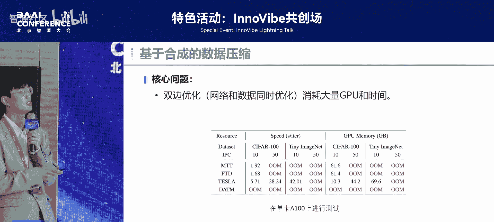
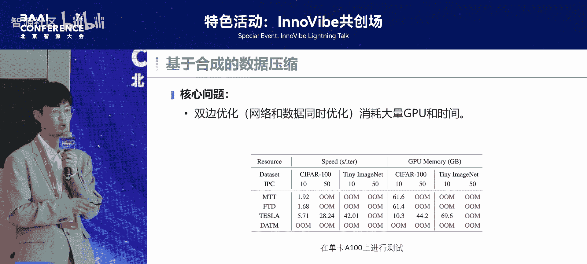
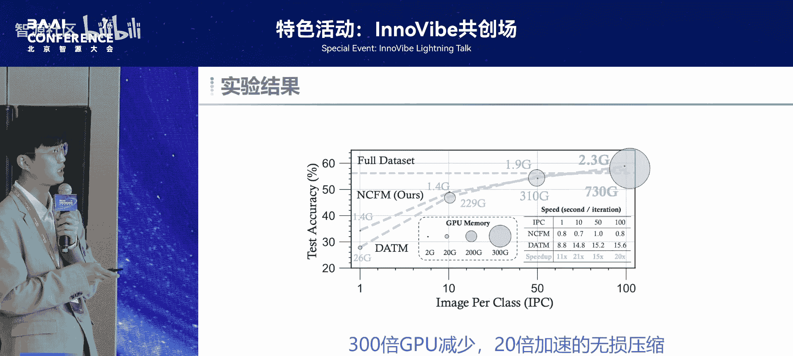
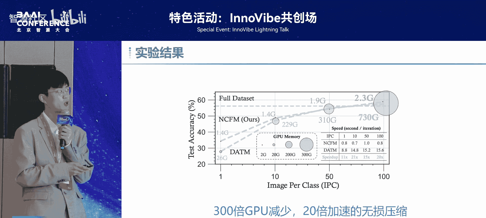
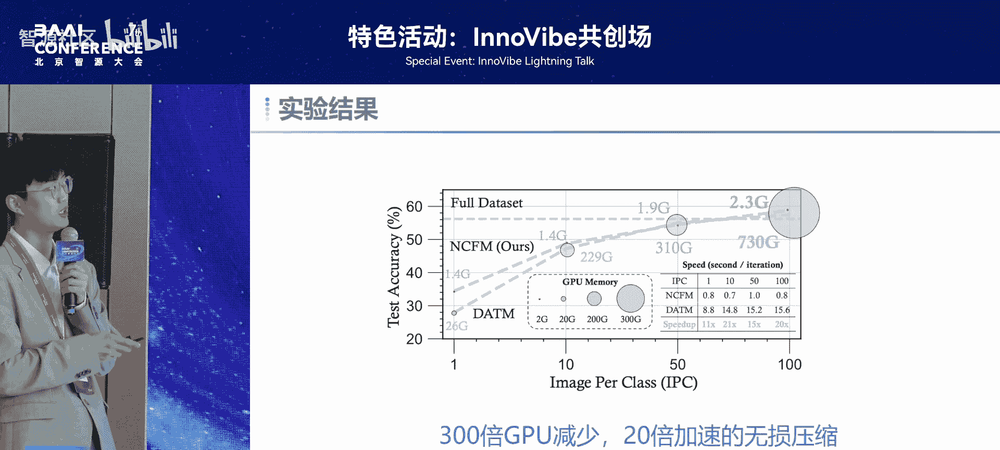
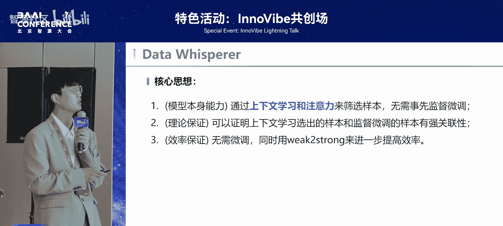
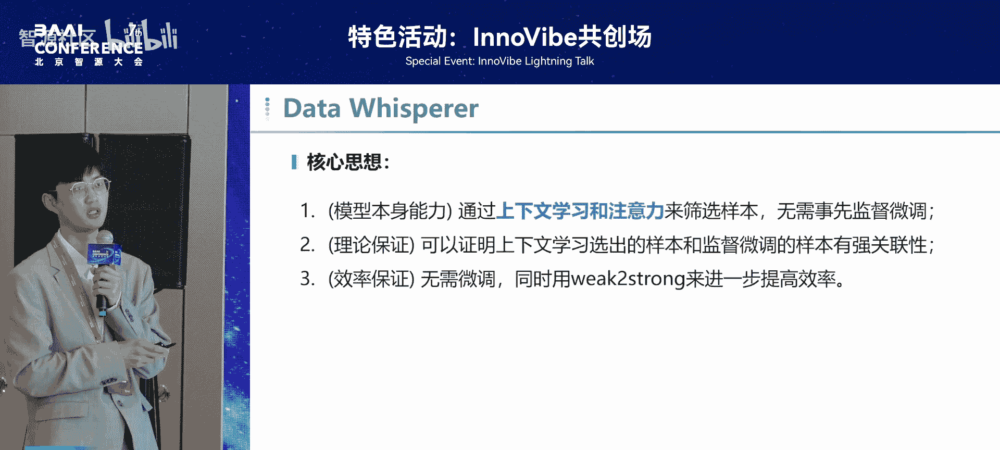
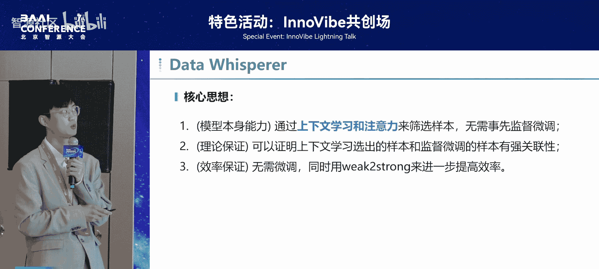

# 特色活动：InnoVibe共创场-p08-面向理论指引的高效数据压缩：王少博

## 概述
在本节课中，我们将学习王少博博士分享的关于高效数据压缩的研究。在大模型时代，数据规模已成为影响计算成本的主要因素。本节课将介绍两种高效数据压缩的范式，并通过两篇具体的研究工作，展示如何在视觉和语言模型领域实现理论指引下的数据压缩，以达到提升效率或性能的目的。

---

## 高效数据压缩的目的
上一节我们概述了数据压缩的重要性，本节中我们来看看高效数据压缩的具体目标。高效数据压缩主要追求两个核心目标。

以下是两个主要目标：
1.  **效率**：通过使用更少的数据达到相似的模型性能，最终实现训练或推理的加速。例如，将原本需要10小时的训练，通过数据压缩缩短至30分钟，同时保持性能基本不变。
2.  **性能**：一方面，通过压缩数据尽可能做到性能无损；另一方面，通过合成更高质量的数据，甚至可能提升模型的最终性能。

---

## 数据压缩的两种范式
明确了目标后，我们来看看实现高效数据压缩的两种主要技术路径。

以下是两种核心范式：
1.  **基于筛选的范式**：直接从原始数据集中选择一部分最具代表性的样本。例如，从5万个样本中筛选出100个核心样本。
2.  **基于合成的范式**：不直接使用原始数据，而是先生成大量合成样本，再从中筛选出高质量的部分。这些合成数据可能与原始数据不同，但旨在提供更优的质量。

---

## 工作一：视觉数据集的高效压缩（基于合成）
上一节我们介绍了数据压缩的两种范式，本节中我们来看看第一篇基于合成范式的工作，它专注于计算机视觉领域。

### 现有方法的挑战
目前主流方法通常采用**双层级优化**过程：一个网络同时在原始数据集和压缩（合成）数据集上更新，并计算两者的某种信息（如梯度、特征）进行匹配。这个过程可以形式化地表示为不断优化网络参数 `θ` 和合成数据集 `D_syn` 的复杂问题。

然而，这种方法存在一个致命问题：**显存开销极大**。即使在较小的数据集上，也容易导致内存溢出（Out of Memory）。

### 我们的改进方案
针对上述挑战，我们提出了两方面的改进。

以下是两个核心改进点：
1.  **简化优化过程**：将复杂的双层级优化简化为**单层级优化**。我们不再在优化过程中更新网络，而是固定一个预训练模型，直接匹配合成数据集与真实数据集的信息。
2.  **理论化的匹配准则**：我们采用**特征函数**作为分布匹配的度量。在数学上，一个概率分布的特征函数与其分布是严格一一对应的。我们的目标是让合成数据集的分布与真实数据集的分布在特征函数空间中对齐。

### 方法流程
我们的方法采用一个 **Min-Max** 框架：
*   **最小化（Minimize）**：最小化合成数据集与真实数据集特征函数之间的距离，促使两者分布对齐。
*   **最大化（Maximize）**：通过一个小型网络学习如何在特征函数空间中采样，以最大化在该采样点上两个分布的距离。这确保了合成的数据能有效覆盖真实数据分布的边界和关键区域。

### 实验结果
该方法在多个实验设置中均表现优异：
*   在性能上超越了之前的方法。
*   在不同图像分辨率、不同网络架构的测试中均表现稳健。
*   实现了显著的效率提升：在某个数据集上，达到了**300倍的GPU内存减少**和**20倍的训练加速**，同时性能甚至超过了使用全部原始数据（Oracle）训练的结果。

---

## 工作二：大语言模型的高效数据压缩（基于筛选）
前面那篇工作我们介绍的是视觉上的基于合成的范式。下面这篇工作，我们将介绍一个应用于大语言模型的、基于筛选范式的高效数据压缩方法。

### 现有方法的局限
当前大语言模型的数据筛选范式通常是：用一个打分网络对原始数据评分，然后进行筛选。然而，这种方法存在两个主要问题：
1.  **需要微调**：打分网络通常需要额外的训练或微调。
2.  **缺乏理论依据**：筛选指标（如相似度、重要性）多是启发式的，缺乏坚实的理论保证。

### 我们的动机与方法
基于以上局限，我们提出了新的解决方案。

以下是三个核心动机：
1.  **无需微调**：直接利用模型自身的能力（**上下文学习**和**注意力机制**）来筛选数据。
2.  **理论保证**：我们可以从理论上证明，通过上下文学习筛选出的样本，与进行监督微调（SFT）所使用的样本之间存在关联性。
3.  **高效可迁移**：该方法允许我们用**小模型来指导大模型**的数据筛选，进一步提升效率。

### 方法流程
我们的筛选流程如下：
1.  **构建演示样本组**：从训练集中采样少量（例如5个）问答对（QA对）作为一个演示组。
2.  **上下文学习评估**：从训练集中另采样几个问题，用上述演示组作为上下文示例，让模型回答。如果模型能基于这组演示给出高质量答案，则认为该演示组是高质量的。
3.  **注意力加权**：直接平均打分会忽略不同演示对答案贡献的差异。因此，我们提取模型在预测答案时对每个演示的**注意力权重**，用此权重对初步打分进行加权，从而得到每个演示样本更精确的重要性分数。
4.  **迭代与筛选**：重复上述过程多次，为训练集中每个样本累积重要性分数，最后选取分数最高的样本组成压缩数据集。

### 实验结果
该方法在多个主流模型上均取得了显著效果：
*   在Llama、Qwen、Mistral等模型上，性能均有提升。
*   在某些情况下，使用仅10%的压缩数据，性能甚至超过了使用全部原始数据。
*   在效率与性能的权衡上优势明显：我们的方法能以更少的训练时间，达到接近甚至优于全数据训练或其他基线方法的性能。
*   **小模型指导大模型**的实验成功：使用小模型筛选出的数据用于训练大模型，效果不会下降，有时反而更好。

---

## 总结
本节课中我们一起学习了面向理论指引的高效数据压缩。我们首先明确了数据压缩在提升效率和性能方面的目标，并介绍了基于筛选和基于合成的两种核心范式。接着，我们通过两篇具体研究工作深入探讨：
1.  在视觉领域，我们提出了基于特征函数分布匹配的合成方法，实现了数百倍的效率提升。
2.  在语言模型领域，我们提出了基于上下文学习和注意力机制的无需微调的筛选方法，实现了效率与性能的兼得，并可用小模型指导大模型。

这两项工作展示了理论指引对于设计高效、可靠数据压缩技术的重要性。